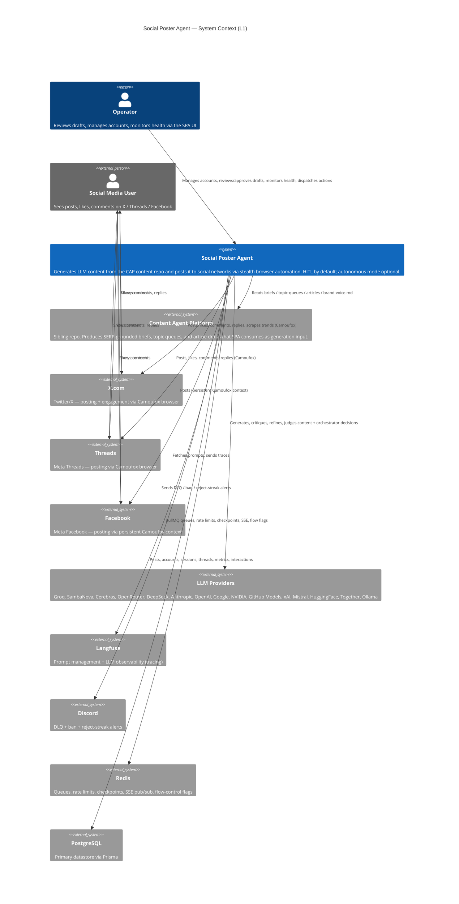
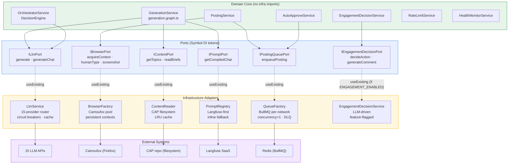
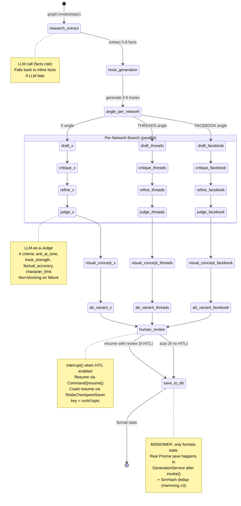
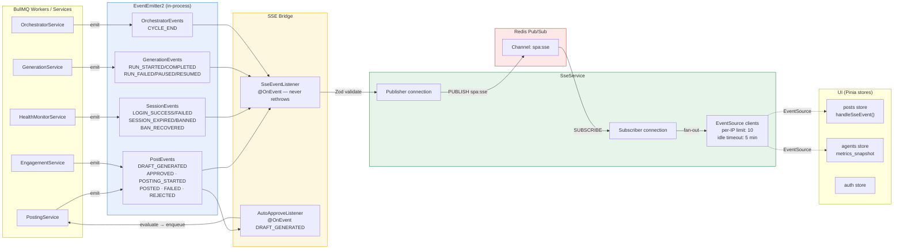
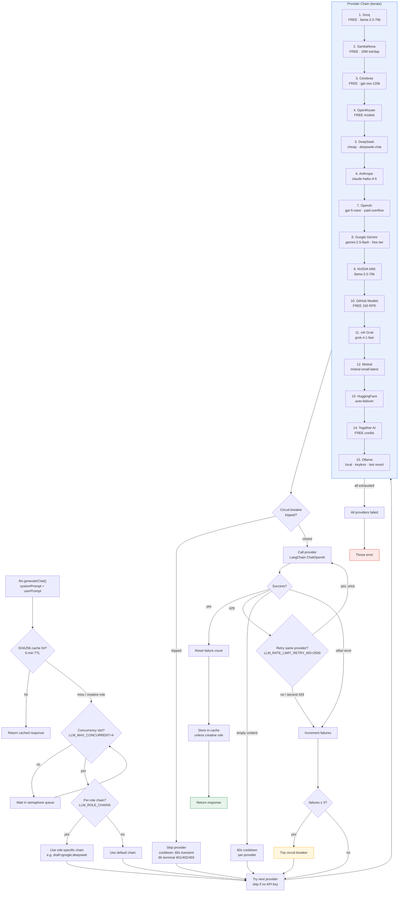
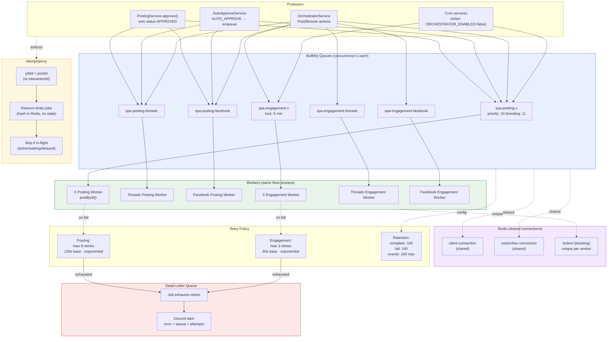

# Social Poster Agent — Architecture Diagrams

> Living documentation. Rendered with [Mermaid](https://mermaid.js.org/) (GitHub-native).
> Diagrams follow the [C4 model](https://c4model.com/) for the L1–L3 structural views,
> and use flowcharts / state machines / ERDs for behavioural and data views.
>
> **Source of truth = code.** If a diagram disagrees with the source, the code wins —
> fix the diagram. See `AGENTS.md` / `CLAUDE.md` for the known doc-lag caveats.

## Table of Contents

1. [System Context (C4 L1)](#1-system-context-c4-l1)
2. [Container Diagram (C4 L2)](#2-container-diagram-c4-l2)
3. [Component Diagram — Backend Modules (C4 L3)](#3-component-diagram--backend-modules-c4-l3)
4. [Hexagonal Ports & Adapters](#4-hexagonal-ports--adapters)
5. [LangGraph Generation State Machine](#5-langgraph-generation-state-machine)
6. [Auto-Approve / LLM-as-a-Judge Flowchart](#6-auto-approve--llm-as-a-judge-flowchart)
7. [Orchestrator Decision Loop](#7-orchestrator-decision-loop)
8. [End-to-End Data Flow](#8-end-to-end-data-flow)
9. [Prisma Entity-Relationship Diagram](#9-prisma-entity-relationship-diagram)
10. [SSE Event Flow](#10-sse-event-flow)
11. [LLM Provider Chain & Circuit Breaker](#11-llm-provider-chain--circuit-breaker)
12. [Browser Pool & Context Lifecycle](#12-browser-pool--context-lifecycle)
13. [BullMQ Queue Topology](#13-bullmq-queue-topology)

---

## 1. System Context (C4 L1)

The system in its environment — who uses it and what it talks to.



**Legend:** Operator interacts only with the SPA UI. SPA pulls content from CAP, calls LLM providers for generation/judging, drives social networks via browser automation, persists to Postgres, uses Redis for queues/limits/SSE, and alerts via Discord + Langfuse.

---

## 2. Container Diagram (C4 L2)

The deployable units inside SPA and the infrastructure they depend on.

```mermaid
C4Container
    title Social Poster Agent — Container Diagram (L2)

    System_Boundary(spa_boundary, "Social Poster Agent") {
        Container(ui, "SPA UI", "Vue 3 + Vite + Pinia", "Dashboard, generation, queue, sessions, analytics, flow control, monitoring. SSE-driven real-time updates.")
        Container(api, "SPA API", "NestJS 11 (hexagonal)", "REST API + SSE endpoint. Generation orchestration, posting dispatch, account/session management, orchestrator loop, autonomy.")
        Container(worker, "BullMQ Workers", "NestJS (same process)", "Posting + engagement workers. Concurrency=1 per queue. Drive Camoufox browser sessions.")
        Container(shared, "@spa/shared", "TypeScript package", "Zod schemas + domain types. Single source-of-truth contract — editing a schema breaks backend + UI at compile time.")
    }

    ContainerDb(postgres, "PostgreSQL", "Postgres 15", "Posts, accounts, sessions, threads, metrics, interactions, comments, browsing sessions")
    ContainerDb(redis, "Redis", "Redis 7", "BullMQ queues, rate limits (Lua), LangGraph checkpoints, SSE pub/sub, flow-control flags, orchestrator action history")

    Container_Ext(cap, "Content Agent Platform", "Sibling repo", "brief-*, topics-*, create-* runs + brand-voice.md")
    Container_Ext(browser, "Camoufox", "Patched Firefox", "Stealth browser automation for X / Threads / Facebook")
    Container_Ext(llm, "LLM Providers", "15 OpenAI-compatible APIs", "Free-first fallback chain with circuit breakers")
    Container_Ext(langfuse, "Langfuse", "SaaS", "Prompt management + LLM tracing")

    Rel(operator, ui, "HTTPS (REST + SSE)")
    Rel(ui, api, "REST /api/v1 + SSE /sse/stream")
    Rel(ui, shared, "Imports schemas (build-time)")
    Rel(api, shared, "Imports schemas (build-time)")
    Rel(api, worker, "Enqueues jobs via IPostingQueuePort (BullMQ)")
    Rel(worker, api, "Same Nest process (DI); workers emit EventEmitter2 events")

    Rel(api, postgres, "Prisma ORM")
    Rel(worker, postgres, "Prisma ORM (status updates, metrics)")
    Rel(api, redis, "ioredis (queues, limits, SSE pub, checkpoints, flags)")
    Rel(worker, redis, "ioredis (queues, limits, SSE pub, checkpoints)")
    Rel(api, cap, "Filesystem reads (../content-agent-platform/runs/*)")
    Rel(worker, browser, "playwright-core + camoufox-js")
    Rel(api, llm, "LangChain ChatOpenAI (generation, judge, orchestrator)")
    Rel(worker, llm, "LangChain ChatOpenAI (engagement decisions)")
    Rel(api, langfuse, "Prompt fetch + OTel spans")
    Rel(worker, langfuse, "OTel spans (browser actions)")

    UpdateRelStyle(operator, ui, $offsetX="0", $offsetY="-30")
    UpdateRelStyle(ui, api, $offsetX="0", $offsetY="-30")
    UpdateRelStyle(api, worker, $offsetX="0", $offsetY="0")
    UpdateRelStyle(api, postgres, $offsetX="-40", $offsetY="0")
    UpdateRelStyle(api, redis, $offsetX="40", $offsetY="0")
```

**Key points:**
- UI and API are separate Vite/Nest processes (ports 3101 / 3100).
- Workers run **in the same Nest process** as the API — they share DI but communicate via BullMQ queues + EventEmitter2.
- `@spa/shared` is a build-time dependency, not a runtime container.
- Camoufox is launched as a child process by the worker; not a separate service.

---

## 3. Component Diagram — Backend Modules (C4 L3)

The internal structure of the NestJS backend, grouped by layer (hexagonal).

```mermaid
C4Component
    title Social Poster Agent — Backend Components (L3)

    Container_Boundary(api, "SPA API / Workers (NestJS)") {

        Component(app_module, "AppModule", "NestJS root", "Conditional module registration via process.env at load time. Global JwtAuthGuard. Env validation in onModuleInit.")

        ComponentBundle(infra, "Infrastructure Layer", "Adapters — implement domain ports") {
            Component(browser_factory, "BrowserFactory", "Camoufox adapter", "Implements IBrowserPort. Pool mgmt, persistent contexts, memory prefs, resource blocking.")
            Component(llm_service, "LlmService", "LLM router", "Implements ILlmPort. 15-provider fallback chain, circuit breakers, 5-min cache, per-role chains, concurrency cap.")
            Component(content_reader, "ContentReader / DbContentReader", "Content adapter", "Implements IContentPort. Reads CAP briefs/topics/articles. LRU cache.")
            Component(prompt_registry, "PromptRegistry", "Prompt facade", "Implements IPromptPort. Langfuse-first with inline fallback. Circuit breaker.")
            Component(queue_factory, "QueueFactory", "BullMQ factory", "Implements IPostingQueuePort. Per-network queues, concurrency=1, DLQ, connection pooling.")
            Component(sse_service, "SseService", "SSE hub", "Redis pub/sub → EventSource clients. Per-IP limits, backpressure, idle timeout.")
            Component(redis_checkpoint, "RedisCheckpointSaver", "LangGraph checkpointer", "Crash-resume for generation graph. thread_id = runId:topic.")
            Component(prisma_module, "PrismaModule", "ORM", "PrismaClient singleton.")
        }

        ComponentBundle(domain_ports, "Domain Ports (Symbol tokens)") {
            Component(i_browser, "IBrowserPort", "Symbol DI token", "createContext, acquireContext, humanType, humanClick, screenshot, ...")
            Component(i_llm, "ILlmPort", "Symbol DI token", "generate, generateChat, getProviderStatus, resetCircuitBreakers")
            Component(i_content, "IContentPort", "Symbol DI token", "getTopics, readBriefs, readArticles, markUsed, healthCheck")
            Component(i_prompt, "IPromptPort", "Symbol DI token", "getCompiledChat, getCompiledText, getCurrentVersion")
            Component(i_posting_queue, "IPostingQueuePort", "Symbol DI token", "enqueuePosting")
            Component(i_engagement, "IEngagementDecisionPort", "Symbol DI token", "decideAction, generateComment, judgeComment (feature-flagged)")
        }

        ComponentBundle(feature_modules, "Feature Modules") {
            Component(generation, "GenerationModule", "LangGraph", "generation.graph.ts: per-topic fan-out to X/Threads/Facebook. research→hook→angle→draft→critique→refine→judge→visual→ab→review→save.")
            Component(posting, "PostingModule", "Strategy", "PostingService dispatches to XPoster / ThreadsPoster / FacebookPoster. Thread support, A/B variants, session recovery.")
            Component(autonomy, "AutonomyModule", "Auto-approve", "AutoApproveService + Listener. LLM-as-a-Judge score → AUTO_APPROVE / HUMAN_REVIEW / REJECT. Enqueues approved posts.")
            Component(orchestrator, "OrchestratorModule", "Decision loop", "OBSERVE→DECIDE(HardRules→LLM→Guardrails)→EXECUTE→SLEEP. 13 action handlers. Feature-flagged.")
            Component(rate_limit, "RateLimitModule", "Sliding window", "Redis Lua atomic check+increment. Daily/weekly/interval limits per network.")
            Component(health_monitor, "HealthMonitorModule", "Ban + DLQ", "F21 ban detection (5 consecutive fails), DLQ alert, reconciliation cron, stuck-posting reaper.")
            Component(engagement, "EngagementModule", "Feature-flagged", "Browsing sessions, likes, comments, follows. IBrowsingSessionPort.")
            Component(replies, "RepliesModule", "Feature-flagged", "Incoming comment monitoring + auto-reply. IRepliesMonitorPort.")
            Component(flow_control, "FlowControlModule", "Redis flags", "flow:pause_* flags. Pause without restart.")
            Component(analytics, "AnalyticsModule", "Metrics", "Post metrics collection, hook performance bank.")
            Component(trending, "TrendingModule", "Scraper", "X trend scraping, astro event calendar.")
            Component(recycling, "RecyclingModule", "Repurpose", "Re-generate from historical posts.")
        }

        ComponentBundle(events, "Event Bus", "EventEmitter2 + SSE bridge") {
            Component(event_listeners, "SseEventListener", "Bridge", "PostEvents → SSE publish. Never rethrows.")
            Component(auto_approve_listener, "AutoApproveListener", "Bridge", "PostEvents.DRAFT_GENERATED → AutoApproveService.evaluate → enqueue.")
        }
    }

    Rel(app_module, generation, "Imports")
    Rel(app_module, posting, "Imports")
    Rel(app_module, autonomy, "Imports")
    Rel(app_module, orchestrator, "Imports (ORCHESTRATOR_ENABLED)")
    Rel(app_module, engagement, "Imports (ENGAGEMENT_ENABLED)")
    Rel(app_module, replies, "Imports (REPLIES_ENABLED + ENGAGEMENT_ENABLED)")

    Rel(generation, i_llm, "Injects")
    Rel(generation, i_content, "Injects")
    Rel(generation, i_prompt, "Injects")
    Rel(generation, redis_checkpoint, "Uses")

    Rel(posting, i_browser, "Injects")
    Rel(posting, i_posting_queue, "Injects (lazy via ModuleRef)")
    Rel(posting, rate_limit, "Calls checkRateLimit / recordPost")

    Rel(autonomy, i_posting_queue, "Enqueues approved posts")
    Rel(auto_approve_listener, autonomy, "Triggers evaluate()")

    Rel(orchestrator, i_llm, "LlmDecisionService")
    Rel(orchestrator, generation, "GeneratePosts action")
    Rel(orchestrator, posting, "Post action")
    Rel(orchestrator, engagement, "Browse action (feature-flagged)")

    Rel(browser_factory, i_browser, "Binds (useExisting)")
    Rel(llm_service, i_llm, "Binds (useExisting)")
    Rel(content_reader, i_content, "Binds (useExisting)")
    Rel(prompt_registry, i_prompt, "Binds (useExisting)")
    Rel(queue_factory, i_posting_queue, "Binds (useExisting)")

    Rel(event_listeners, sse_service, "Publishes to Redis spa:sse")
```

**Reading this diagram:**
- **Infrastructure Layer** (top) = adapters that implement ports. Swap an adapter by changing only the `useExisting` binding in its infra module.
- **Domain Ports** (middle) = Symbol DI tokens. Services inject these, never concrete classes.
- **Feature Modules** (bottom) = business logic. They depend on ports, not adapters.
- **Feature-flagged modules** (Engagement, Replies, Orchestrator) are entirely absent from the DI graph when their flag is off — not merely disabled.

---

## 4. Hexagonal Ports & Adapters

A focused view of the ports-and-adapters pattern, showing which adapter binds to which port and where the feature-flag boundaries are.



**The rule:** Domain code depends only on ports (arrows down). Adapters bind to ports via `useExisting` (dashed). To swap an adapter — e.g., replace Camoufox with a headless Chromium pool — change only the binding in `BrowserModule`. No domain code changes.

---

## 5. LangGraph Generation State Machine

The full generation graph: one topic → parallel per-network branches → judge → save.



**State schema (`GenerationState`):**
- `topic`, `targetNetworks[]`, `brandVoice`, `language` (en/ru/uk/es/it)
- `facts[]`, `hooks[]` (3-5 variants)
- `results: Record<network, NetworkResult>` (reducer merges per-network)
- `posts: GeneratedPost[]`, `error`, `humanReview`
- `model` (LLM model used)

**Per-network config:** X (max 280, punchy), THREADS (150-280, narrative), FACEBOOK (200-400, conversational). Each gets a genuinely different hook, not one text reworded.

---

## 6. Auto-Approve / LLM-as-a-Judge Flowchart

How a generated draft becomes an approved, queued post — with the LLM-as-a-Judge gate.

```mermaid
flowchart TD
    Start([PostEvents.DRAFT_GENERATED]) --> Listener[AutoApproveListener]
    Listener --> Fetch[Fetch post + llmMetadata<br/>qualityScore, judgeScores]
    Fetch --> CheckEnabled{AUTO_APPROVE_ENABLED?}
    CheckEnabled -->|false| EndManual([Status stays DRAFT<br/>Human reviews in UI])
    CheckEnabled -->|true| CheckDryRun{SPA_DRY_RUN?}
    CheckDryRun -->|true| EndDry([Skip — dry run])
    CheckDryRun -->|false| Eval[AutoApproveService.evaluate]

    Eval --> JudgeMode{USE_JUDGE_SCORES?}
    JudgeMode -->|false| QualityGate{qualityScore ≥ MIN_SCORE?<br/>default 7}
    JudgeMode -->|true| JudgeGate{Judge criteria pass?}

    QualityGate -->|score ≥ 7| AutoCheck
    QualityGate|score 4-6| HumanReview
    QualityGate -->|score < 4| Reject

    JudgeGate -->|"anti ≥ 0.7 AND hook ≥ 0.6<br/>AND factual ≥ 0.6 AND char ≥ 0.8"| AutoCheck
    JudgeGate -->|"anti < 0.3 OR factual < 0.3"| Reject
    JudgeGate -->|otherwise| HumanReview

    AutoCheck{AutoCheck pass?<br/>no banned words, etc.}
    AutoCheck -->|pass| AutoApprove
    AutoCheck -->|fail| Reject

    AutoApprove[Set status APPROVED<br/>idempotent: where status=DRAFT]
    AutoApprove --> Enqueue[IPostingQueuePort.enqueuePosting<br/>jobId = postId]
    Enqueue --> EmitApproved[PostEvents.APPROVED]
    EmitApproved --> EndAuto([Posted via BullMQ])

    HumanReview[Set status HUMAN_REVIEW]
    HumanReview --> EndHuman([Operator reviews in UI])

    Reject[Set status REJECTED]
    Reject --> StreakCheck{Reject streak<br/>≥ threshold?}
    StreakCheck -->|yes| DiscordAlert[Discord alert:<br/>consecutive rejects]
    StreakCheck -->|no| EndReject([End])
    DiscordAlert --> EndReject

    EmitRejected[PostEvents.REJECTED]
    Reject --> EmitRejected

    style AutoApprove fill:#e6f4ea,stroke:#188038
    style HumanReview fill:#fef7e0,stroke:#f9ab00
    style Reject fill:#fce8e6,stroke:#d93025
    style JudgeGate fill:#e8f0fe,stroke:#1a73e8
```

**Judge criteria (0.0–1.0 each):**
| Criterion | 1.0 (good) | 0.0 (bad) |
|-----------|-----------|-----------|
| `anti_ai_tone` | Unmistakably human, raw, opinionated | Obviously AI, banned words, sterile |
| `hook_strength` | Specific, provocative, scroll-stopping | Boring, vague, "Did you know" |
| `factual_accuracy` | Matches source facts | Contradicts facts, fabricated stats |
| `character_limit` | Within platform limit | Exceeds limit |

**Calibration notes:** Astrological terms (chart, retrograde, houses) are NOT AI slop. Single banned word ≠ 0.0 (lowers by ~0.2-0.3). No factual claims → factual_accuracy = 0.5 (neutral).

---

## 7. Orchestrator Decision Loop

The autonomous decision engine — observe world state, decide action, execute, sleep, repeat.

```mermaid
flowchart TD
    Start([OrchestratorService.start]) --> Loop[Graph loop<br/>heartbeat every cycle]

    Loop --> Observe[OBSERVE<br/>StateCollectorService<br/>parallel per-network]

    Observe --> WorldState[Build WorldState<br/>accounts, sessions, queues,<br/>rate limits, DLQ depth,<br/>posting window, comments]

    WorldState --> Decide[DECIDE]

    subgraph decide["DECIDE — 3-phase"]
        direction TB
        Hard[HardRulesService<br/>H1-H10 deterministic]
        LLM[LlmDecisionService<br/>LLM soft optimization<br/>or rules-only fallback]
        Guard[GuardrailsService<br/>G1-G9 validate + clamp]

        Hard -->|action or WAIT| LLM
        LLM -->|proposed action| Guard
        Guard -->|clamped action| ActionOut
    end

    ActionOut[Final Action] --> Execute[EXECUTE<br/>ActionExecutorService]

    subgraph handlers["Action Handlers (Strategy)"]
        direction LR
        GenPosts[GeneratePosts]
        Post[Post]
        Browse[Browse]
        Recover[RecoverSession]
        CheckReplies[CheckReplies]
        RefreshTrends[RefreshTrends]
        HealthCheck[HealthCheck]
        Reconcile[Reconcile]
        Triage[TriageQueue]
        ScrapeMetrics[ScrapeMetrics]
        Recycle[RecycleContent]
        AggregateHooks[AggregateHooks]
        GenerateTopics[GenerateTopics]
    end

    Execute --> handlers
    handlers --> ActionResult[ActionResult<br/>never throws]
    ActionResult --> History[OrchestratorHistoryService<br/>Redis sorted set]
    History --> Sleep[SLEEP<br/>configurable interval]
    Sleep --> Loop

    subgraph hardrules["Hard Rules (H1-H10)"]
        H1[H1: Kill switch → WAIT]
        H2[H2: Expired session → RECOVER<br/>5-min cooldown]
        H4[H4: All CBs open → WAIT]
        H5[H5: All daily limits hit → WAIT]
        H6[H6: All weekly limits hit → WAIT]
        H7[H7: DLQ > 10 → HEALTH_CHECK]
        H8[H8: Stuck posting > 5 → RECONCILE]
        H9[H9: Bans on all → WAIT]
        H10[H10: Queue depth > 5 → WAIT]
    end

    subgraph guardrails["Guardrails (G1-G9)"]
        G1[G1: Validate action type]
        G2[G2: Network enabled]
        G3[G3: Rate limit remaining]
        G3b[G3b: Healthiest network]
        G4[G4: Active session required]
        G5[G5: Queue depth < 5]
        G6[G6: Max actions/hour<br/>Redis ZCOUNT]
        G7[G7: Flow control paused]
        G8[G8: POST > BROWSE priority]
        G9[G9: Engagement-first nudge]
    end

    hardrules -.-> Hard
    guardrails -.-> Guard

    style decide fill:#e8f0fe,stroke:#1a73e8
    style handlers fill:#e6f4ea,stroke:#188038
    style hardrules fill:#fce8e6,stroke:#d93025
    style guardrails fill:#fef7e0,stroke:#f9ab00
```



**Loop characteristics:**
- Heartbeat tracked in Redis; `WatchdogCron` (`*/5 * * * *`) restarts if stale.
- When `ORCHESTRATOR_ENABLED=true`, all 11 cron services skip registration — the orchestrator owns scheduling.
- `LLM_FULL_LOOP_ENABLED` forces LLM usage with a separate budget (`LLM_FULL_LOOP_MAX_DECISIONS_PER_HOUR`, default 60).
- Action rate tracked via Redis sorted set `spa:orchestrator:action-history` (O(log N) ZCOUNT).

---

## 8. End-to-End Data Flow

The full lifecycle of a piece of content — from CAP brief to posted social media content.

```mermaid
flowchart LR
    subgraph input["Input"]
        CAP["CAP repo<br/>brief-*/topics-*/create-*"]
        Brand["brand-voice.md"]
    end

    subgraph generation["Generation (LangGraph)"]
        CR["ContentReader<br/>IContentPort"]
        GS["GenerationService<br/>graph.invoke()"]
        Graph["Generation Graph<br/>per-topic fan-out"]
        Check["RedisCheckpointSaver<br/>crash-resume"]
    end

    subgraph judging["Judging"]
        Judge["LLM-as-a-Judge<br/>4 criteria"]
        SimHash["SimHash dedup<br/>Hamming ≤3 vs 200 posts"]
    end

    subgraph approval["Approval Gate"]
        Draft["Post status: DRAFT"]
        AutoApprove{"AUTO_APPROVE<br/>enabled?"}
        Human["Human review<br/>UI approve/reject"]
        AutoEval["AutoApproveService<br/>evaluate()"]
    end

    subgraph posting["Posting"]
        Queue["BullMQ queue<br/>spa-posting-{network}"]
        Worker["PostingService<br/>postById()"]
        RateLimit["RateLimitService<br/>checkRateLimit()"]
        Browser["BrowserFactory<br/>acquireContext()"]
        Poster["X/Threads/Facebook<br/>Poster"]
    end

    subgraph output["Output"]
        Platform["Social Network<br/>X / Threads / Facebook"]
        DB["PostgreSQL<br/>Post.status=POSTED"]
        Metrics["PostMetrics<br/>likes, comments, shares"]
    end

    subgraph observability["Observability"]
        SSE["SSE → UI<br/>real-time status"]
        LangfuseT["Langfuse traces"]
        Discord["Discord alerts<br/>DLQ / ban / streak"]
    end

    CAP --> CR
    Brand --> GS
    CR --> GS
    GS --> Graph
    Graph -.->|checkpoint| Check
    Graph --> Judge
    Judge --> SimHash
    SimHash -->|unique| Draft
    SimHash -->|duplicate| Skip([Skip — near-dup])

    Draft --> AutoApprove
    AutoApprove -->|false| Human
    AutoApprove -->|true| AutoEval
    AutoEval -->|AUTO_APPROVE| Queue
    AutoEval -->|HUMAN_REVIEW| Human
    AutoEval -->|REJECT| Reject([Status: REJECTED])
    Human -->|approve| Queue
    Human -->|reject| Reject

    Queue --> Worker
    Worker --> RateLimit
    RateLimit -->|allowed| Browser
    RateLimit -->|denied| Delay([BullMQ delayed retry])
    Browser --> Poster
    Poster --> Platform
    Poster --> DB
    Platform --> Metrics

    Draft -.->|PostEvents.DRAFT_GENERATED| SSE
    Queue -.->|PostEvents.APPROVED| SSE
    Worker -.->|PostEvents.POSTING_STARTED| SSE
    Poster -.->|PostEvents.POSTED| SSE
    Poster -.->|PostEvents.FAILED| SSE

    GS -.-> LangfuseT
    Judge -.-> LangfuseT

    Queue -.->|DLQ exhausted| Discord
    Poster -.->|ban detected| Discord
    AutoEval -.->|reject streak| Discord

    style generation fill:#e8f0fe,stroke:#1a73e8
    style judging fill:#f3e8fd,stroke:#a142f4
    style approval fill:#fef7e0,stroke:#f9ab00
    style posting fill:#e6f4ea,stroke:#188038
    style observability fill:#fce8e6,stroke:#d93025
```



**Happy path:** CAP brief → ContentReader → GenerationService → LangGraph (research → hook → draft → critique → refine → judge) → SimHash dedup → DRAFT → AutoApprove (or human) → BullMQ queue → PostingService → RateLimit check → BrowserFactory → Poster → Platform → POSTED.

---

## 9. Prisma Entity-Relationship Diagram

The full data model. 16 models, 9 enums.

```mermaid
erDiagram
    AccountGroup ||--o{ SocialAccount : "has"
    SocialAccount ||--o{ Session : "has"
    SocialAccount ||--o{ Post : "owns"
    SocialAccount ||--o{ PostThread : "owns"
    SocialAccount ||--o{ Interaction : "performs"
    SocialAccount ||--o{ BrowsingSession : "runs"
    GenerationRun ||--o{ Post : "produces"
    PostThread ||--o{ Post : "contains"
    Post ||--o{ PostMetrics : "tracked by"
    Post ||--o{ IncomingComment : "receives"
    Post ||--o{ PostVariant : "A/B tests"
    Post ||--o{ ThreadProgress : "tracks replies"
    BrowsingSession ||--o{ Interaction : "contains"
    IncomingComment ||--o{ IncomingComment : "parent of (nested)"

    AccountGroup {
        string id PK
        string name
        string proxyUrl
        string timezone
        string fingerprintProfile
    }

    SocialAccount {
        string id PK
        enum SocialNetwork network
        string handle
        string displayName
        int priority
        string groupId FK
        string fingerprintSeed
        string proxyUrl
        string credentialsRef
        boolean active
        boolean warmupEnabled
        datetime warmupStartedAt
        int warmupDaysTotal
    }

    Session {
        string id PK
        string accountId FK
        json storageState
        enum SessionStatus status
        datetime lastHealthCheck
    }

    GenerationRun {
        string id PK
        enum GenerationTrigger triggeredBy
        json sourceTopics
        enum GenerationRunStatus status
        datetime startedAt
        datetime completedAt
        string errorMessage
    }

    Topic {
        string id PK
        string topic UK
        json keywords
        json facts
        string category
        string sourceType
        string status
        datetime usedAt
    }

    ContentSource {
        string id PK
        string sourceType
        string name
        boolean enabled
        int priority
        json config
        datetime lastRunAt
        string lastError
    }

    Post {
        string id PK
        string generationRunId FK
        string accountId FK
        string threadId FK
        int threadPosition
        enum SocialNetwork network
        string language
        text content
        json sourceRef
        string sourcePath
        enum PostStatus status
        string postUrl
        string errorMessage
        int retryCount
        json llmMetadata
        string simhash
        datetime createdAt
        datetime approvedAt
        datetime postedAt
    }

    PostVariant {
        string id PK
        string postId FK
        enum SocialNetwork network
        string label
        text content
        json judgeScores
        boolean selected
        datetime postedAt
        int likes
        int comments
        int shares
        int impressions
    }

    PostMetrics {
        string id PK
        string postId FK
        enum SocialNetwork network
        int likes
        int comments
        int shares
        int impressions
        datetime collectedAt
    }

    PostThread {
        string id PK
        string accountId FK
        enum PostStatus status
        json posts
        datetime createdAt
        datetime postedAt
    }

    ThreadProgress {
        string id PK
        string postId FK
        string replyPostId
        int position
        string status
        string postUrl
        datetime attemptedAt
        datetime completedAt
        string error
    }

    Interaction {
        string id PK
        string accountId FK
        string browsingSessionId FK
        enum InteractionType type
        enum InteractionStatus status
        string targetUrl
        string targetHandle
        text content
        string errorMessage
        string screenshotPath
    }

    IncomingComment {
        string id PK
        string postId FK
        enum SocialNetwork network
        string commentId
        string author
        text text
        string authorProfileUrl
        string commentUrl
        string parentId FK
        string conversationId
        int depth
        boolean isQuestion
        float questionConfidence
        string questionType
        string replyUrl
        enum CommentStatus status
        text replyText
        datetime replyPostedAt
        boolean needsHumanReview
        string humanReviewReason
    }

    BrowsingSession {
        string id PK
        string accountId FK
        enum BrowsingSessionStatus status
        datetime startedAt
        datetime endedAt
        int durationSec
        int postsViewed
        int interactionsCount
        string feedUrl
        string errorMessage
    }

    Admin {
        string id PK
        string username UK
        string passwordHash
    }
```

**Enums:** `SocialNetwork` (X, THREADS, FACEBOOK), `PostStatus` (DRAFT, APPROVED, POSTING, POSTED, FAILED, REJECTED), `SessionStatus` (ACTIVE, EXPIRED, ERROR, WARMUP, BANNED), `GenerationRunStatus` (RUNNING, COMPLETED, FAILED, PAUSED), `GenerationTrigger` (CRON, MANUAL, AUTONOMOUS), `InteractionType` (LIKE, COMMENT, FOLLOW, UNFOLLOW, REPLY, REPOST, QUOTE, SCROLL_VIEW), `InteractionStatus` (PENDING, IN_PROGRESS, COMPLETED, FAILED, SKIPPED), `BrowsingSessionStatus` (ACTIVE, COMPLETED, FAILED, ABORTED), `CommentStatus` (NEW, REPLIED, SKIPPED, HUMAN_REVIEW, REPLIED_MANUAL).

---

## 10. SSE Event Flow

How real-time updates propagate from workers to the UI.



**Key design points:**
- Two separate Redis connections: subscriber cannot publish, so a publisher connection is also needed.
- `SseEventListener` never rethrows — the event bus must continue even if SSE publish fails.
- SSE is one-way; all UI actions (approve/pause) go over REST.
- Events validated with Zod (`SSEventSchema`); validation errors logged, never thrown.
- Backpressure: if `res.write()` returns false, wait for 'drain' (5s timeout removes stalled clients).

---

## 11. LLM Provider Chain & Circuit Breaker

The 15-provider fallback chain with per-provider circuit breakers.



**Key behaviors:**
- **Free-first ordering:** Groq → SambaNova → Cerebras → OpenRouter → DeepSeek → ... → Ollama (local, last resort).
- **Per-provider circuit breaker:** 3 failures → trip. Cooldown 60s (transient) or 6h (auth/billing 401/402/403 — `terminal` flag).
- **429 handling:** One retry on the same provider after 2500ms. 429 is a reason to wait, not switch.
- **Empty content cooldown:** 60s skip per-provider to prevent cascade (Groq 429 → OpenRouter empty → Cerebras empty → timeout).
- **Concurrency cap:** `LLM_MAX_CONCURRENT=4` semaphore prevents 429 cascades on free-tier providers.
- **Creative roles bypass cache:** 'draft', 'hook' roles always call the LLM fresh.
- **Reasoning models** (`gpt-5|o1|o3|o4-mini`): temperature omitted (HTTP 400 otherwise), 60s timeout.
- **AsyncLocalStorage:** Langfuse callbacks propagated through the graph via ALS — no need to thread through every node.

---

## 12. Browser Pool & Context Lifecycle

How Camoufox browser contexts are acquired, pooled, and evicted.

```mermaid
flowchart TD
    Request["acquireContext()<br/>network, accountId"] --> PoolCheck{Pool has idle<br/>context?}

    PoolCheck -->|yes| Reuse[Reuse idle context]
    PoolCheck -->|no| AtCap{At pool capacity?<br/>BROWSER_POOL_SIZE=1}

    AtCap -->|yes| WaitPool[Wait for release]
    WaitPool --> PoolCheck
    AtCap -->|no| LaunchCheck{Browser running?}

    LaunchCheck -->|no| Launch[launchBrowser()<br/>Camoufox + memory prefs<br/>in-flight promise dedup]
    LaunchCheck -->|yes, lifetime ok| CreateCtx[createContext()<br/>+ storageState + fingerprint]
    LaunchCheck -->|yes, lifetime expired| Restart[Restart browser<br/>when no sessions in use<br/>BROWSER_MAX_LIFETIME_MS=15min]
    Restart --> CreateCtx

    Launch --> CreateCtx

    CreateCtx --> Use[Context in use<br/>posting / engagement / scrape]
    Reuse --> Use

    Use --> Release["releaseContext()<br/>mark idle, set releasedAt"]

    Release --> IdlePool[Context in idle pool<br/>TTL: 3 min]

    subgraph sweep["Idle Sweep (periodic)"]
        direction TB
        CheckIdle[Check idle contexts]
        Evict[Evict if past TTL<br/>3 min idle]
        Orphan[Reap orphaned in-use<br/>grace: max(3×TTL, 25 min)]
        CheckIdle --> Evict
        CheckIdle --> Orphan
    end

    IdlePool -.->|periodic| sweep

    subgraph persistent["Facebook: Persistent Context (separate path)"]
        direction TB
        FBKey["Key: facebook:accountId<br/>on-disk user_data_dir"]
        FBPersist["Single persistent context<br/>never pooled, never closed<br/>idle TTL: 15 min"]
        FBAvoid["Avoids 'suspicious login'<br/>challenges"]
        FBKey --> FBPersist
        FBPersist --> FBAvoid
    end

    subgraph memprefs["Memory Prefs (CAMOUFOX_MEMORY_PREFS=true)"]
        direction LR
        Pref1["sessionhistory<br/>max_total_viewers=0"]
        Pref2["cache.memory<br/>capacity=65536 (64MB)"]
        Pref3["js gc<br/>high_water_mark=256"]
        Pref4["image decode<br/>8192 bytes/chunk"]
        Pref5["telemetry<br/>disabled"]
    end

    Launch -.->|applies| memprefs

    subgraph blocking["Resource Blocking (per-page)"]
        direction LR
        BlockMedia["Block media + fonts<br/>always"]
        BlockImages["Block images<br/>if blockImages=true<br/>AND CAMOUFOX_BLOCK_IMAGES_READONLY"]
        Note["NOT called on posting path<br/>(needs full render)"]
        BlockMedia --> Note
        BlockImages --> Note
    end

    Use -.->|read-only contexts| blocking

    style persistent fill:#fef7e0,stroke:#f9ab00
    style memprefs fill:#e8f0fe,stroke:#1a73e8
    style blocking fill:#f3e8fd,stroke:#a142f4
    style sweep fill:#fce8e6,stroke:#d93025
```

**Two context strategies:**
1. **X / Threads — Pooled contexts:** Fresh contexts per acquire, pooled for reuse (default pool size 1), idle TTL 3 min, fingerprint + storageState injected.
2. **Facebook — Persistent context:** Single on-disk `user_data_dir` per account, never pooled/closed, idle TTL 15 min. Avoids "suspicious login" challenges.

**Memory optimization:** Firefox `about:config` prefs applied at launch (session history, cache caps, JS GC, image decode chunk). Reduces RSS from ~500MB to ~340MB per process. Browser lifetime restart (15 min) addresses native memory fragmentation.

**Orphan reaping:** If `releaseContext()` is never called (crashed worker), the sweep reaps in-use contexts after `max(3 × idle TTL, 25 min)` grace period.

---

## 13. BullMQ Queue Topology

The queue architecture — per-network isolation, retry policies, DLQ alerting.



**Key design points:**
- **Per-network isolation:** One queue per network × action. A ban on X doesn't block Threads posting.
- **Concurrency=1:** Serialize posts to look human. Engagement queues use a 5-min distributed lock for 15+ min browsing sessions.
- **Connection pooling (Sprint L):** Shared `client` + `subscriber` connections across all queues; only `bclient` (blocking) is unique per worker. Reduces connections from ~27 to ~15.
- **Idempotency:** `jobId = postId` deduplicates. Limbo jobs (hash in Redis but no state) are removed before fresh enqueue. In-flight jobs are skipped.
- **Priority:** Default 10; trending posts get priority 1 (lower number = higher priority).
- **DLQ alerting:** Discord notification when a job exhausts retries — includes error, queue, attempts.
- **Stale job removal:** Handles "limbo" jobs caused by exhausted retries with `removeOnFail` that block future enqueues for the same `jobId`.

---

## Maintenance Notes

- **When to update:** Any change to module structure, port bindings, graph nodes, queue topology, or the Prisma schema should trigger a review of the relevant diagram(s).
- **Source of truth:** The code. These diagrams are a navigation aid, not a spec. If they disagree with `packages/backend/src/`, fix the diagram.
- **Rendering:** GitHub renders Mermaid natively in `.md` files. For local preview, use [mermaid.live](https://mermaid.live) or a VS Code Mermaid extension.
- **C4 conventions:** L1 = System Context (who uses it), L2 = Container (deployable units), L3 = Component (internal modules). We stop at L3 — L4 (code/class) diagrams go stale instantly and are not maintained.
