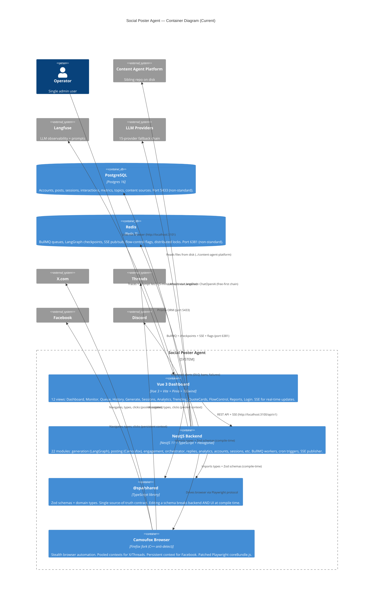

# C4 Container Diagram — Current State

> **Level 2:** Containers. Shows the internal structure of SPA — packages, processes, data stores.
> **As-is:** What exists today (3 platforms, no syndication).

## Container details

### Vue 3 Dashboard (`@spa/ui`)
- **Port:** 3101
- **Stack:** Vue 3 + Vite + Pinia + Tailwind CSS
- **12 views:** Dashboard, Monitor, Queue, History, Generate, Sessions, Analytics, Trending, QuoteCards, FlowControl, Reports, Login
- **Real-time:** SSE (EventSource) for live updates — posting progress, queue status
- **Auth:** JWT cookie (`spa_token`), `AUTH_ENABLED` flag (default off = VPN-only)

### NestJS Backend (`@spa/backend`)
- **Port:** 3100 (`/api/v1`, Swagger at `/docs`)
- **Stack:** NestJS 11 + TypeScript, hexagonal architecture (ports & adapters)
- **22 modules:** generation, posting, engagement, orchestrator, replies, analytics, accounts, sessions, content-source, content-enhancements, quote-cards, recycling, trending, flow-control, autonomy, health-monitor, auth, posts, queue, SSE, health, warmup
- **4 LangGraph graphs:** GenerationGraph, EngagementGraph, OrchestratorGraph, DialogueGraph
- **8 cron services:** 7 dynamic + 1 permanent watchdog (all skip when ORCHESTRATOR_ENABLED=true)
- **Feature flags:** ENGAGEMENT_ENABLED, REPLIES_ENABLED, CAPTCHA_SOLVER_ENABLED, PROXY_ROTATION_ENABLED, QUOTE_CARDS_ENABLED, ORCHESTRATOR_ENABLED, AUTO_APPROVE_ENABLED, AUTH_ENABLED

### @spa/shared
- **Type:** TypeScript library (workspace package)
- **Role:** Zod schemas + domain types — single source-of-truth contract
- **Key:** Editing a schema breaks backend AND UI at compile time

### Camoufox Browser
- **Type:** Firefox fork patched at C++ level (anti-detect)
- **Why not Chromium:** Kills CDP detection vector. Chromium detectable via WebDriver, CDP.
- **Two context modes:**
  - **Pooled** (X, Threads): fresh context per post, `BROWSER_POOL_SIZE=3`, storageState saved between posts
  - **Persistent** (Facebook): single context, `user_data_dir` on disk, never pooled/closed — dodges "suspicious login" challenges
- **Memory:** `firefox_user_prefs` for memory optimization (~340-500 MB → less). Gated by `CAMOUFOX_MEMORY_PREFS=true`.
- **Patch:** `patch-playwright.js` fixes Camoufox Juggler protocol `Page.uncaughtError` missing `location` field.

### PostgreSQL
- **Port:** 5433 (non-standard, avoids collisions)
- **15 models:** AccountGroup, SocialAccount, Session, GenerationRun, Topic, ContentSource, PostThread, ThreadProgress, Post, PostVariant, PostMetrics, Interaction, IncomingComment, BrowsingSession, Admin

### Redis
- **Port:** 6381 (non-standard)
- **Multiple uses:**
  - BullMQ job queues (one per network×action: `spa-posting-x`, `spa-engagement-threads`, etc.)
  - LangGraph checkpoints (`RedisCheckpointSaver` — crash-resume)
  - SSE pub/sub (channel `spa:sse` — two separate connections: publish + subscribe)
  - Flow-control flags (`flow:pause_*` — pause without restart)
  - Distributed locks (multi-instance deployments)
