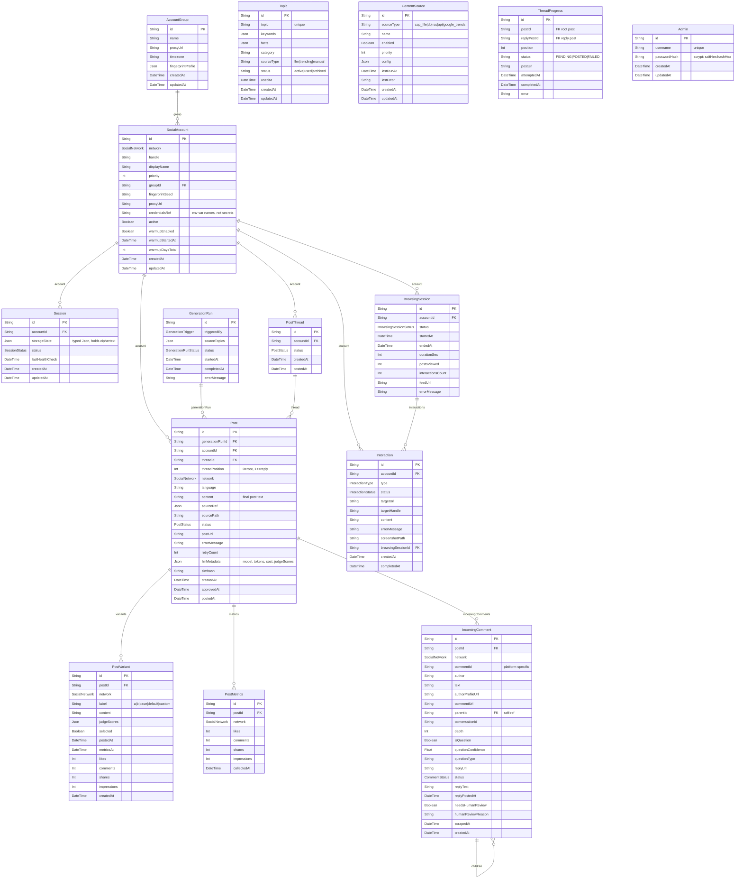

# Prisma ER Diagram — Current State

> **Data model:** 15 Prisma models, their fields, and relationships.
> **As-is:** PostgreSQL on port 5433. SocialNetwork enum (X/THREADS/FACEBOOK), PostStatus lifecycle, PostThread for thread chains.

## Key details

### 15 models
- **AccountGroup** — proxy/fingerprint grouping for accounts.
- **SocialAccount** — one per (network, handle), unique. `credentialsRef` stores **env var names** (comma-separated), never the password itself.
- **Session** — Playwright `storageState` per account. `storageState` is typed `Json` with a stale "cookies, localStorage" comment but actually holds **ciphertext** (AES-256-GCM, `v1:` prefix) when `SESSION_ENCRYPTION_KEY` is set.
- **GenerationRun** — one per generation batch (cron/manual/autonomous). `sourceTopics` is a JSON array.
- **Topic** — LLM-generated topics (replaces CAP repo dependency for topic sourcing). `status: active|used|archived`.
- **ContentSource** — configurable input adapters for `IContentPort` (`cap_file`, `db`, `rss`, `api`, `google_trends`).
- **PostThread** — groups a root post + its replies for thread chains. `status` mirrors `PostStatus`.
- **ThreadProgress** — per-reply tracking for resumable threads (P0-H2). `@@unique([postId, replyPostId])` for dedup.
- **Post** — the central entity. `threadPosition=0` is root, `1+` are replies. `simhash` for fast near-duplicate dedup. `llmMetadata` holds model/tokens/cost/judgeScores.
- **PostVariant** — A/B testing variants with real-world outcome metrics.
- **PostMetrics** — F6 engagement metrics scraping (likes, comments, shares, impressions).
- **Interaction** — engagement actions (LIKE, COMMENT, FOLLOW, REPLY, etc.). Links to `BrowsingSession`.
- **IncomingComment** — Sprint Q / F4: comments on our posts, tracked for automated reply monitoring. Self-referential `parentId` for nested replies; `conversationId` groups a thread.
- **BrowsingSession** — engagement scroll sessions (feed browsing for like/comment).
- **Admin** — single admin account for UI JWT auth. Bootstrapped from `ADMIN_USERNAME`/`ADMIN_PASSWORD` env vars. Password hashed with `crypto.scrypt` (`saltHex:hashHex`).

### Enums
- **`SocialNetwork`** — `X`, `THREADS`, `FACEBOOK` (the 3 platforms today; no syndication yet).
- **`PostStatus`** — `DRAFT` → `APPROVED` → `POSTING` → `POSTED` (or `FAILED` / `REJECTED`).
- **`SessionStatus`** — `ACTIVE`, `EXPIRED`, `ERROR`, `WARMUP` (F20 new-account ramp), `BANNED` (F21 health monitor).
- **`GenerationRunStatus`** — `RUNNING`, `COMPLETED`, `FAILED`, `PAUSED`.
- **`GenerationTrigger`** — `CRON`, `MANUAL`, `AUTONOMOUS`.
- **`InteractionType`** — `LIKE`, `COMMENT`, `FOLLOW`, `UNFOLLOW`, `REPLY`, `REPOST`, `QUOTE`, `SCROLL_VIEW`.
- **`InteractionStatus`** — `PENDING`, `IN_PROGRESS`, `COMPLETED`, `FAILED`, `SKIPPED`.
- **`BrowsingSessionStatus`** — `ACTIVE`, `COMPLETED`, `FAILED`, `ABORTED`.
- **`CommentStatus`** — `NEW`, `REPLIED`, `SKIPPED`, `HUMAN_REVIEW`, `REPLIED_MANUAL`.

### Key relationships
- `SocialAccount ||--o{ Post` — one account, many posts.
- `SocialAccount ||--o{ Session` — one account, many sessions (login storageState).
- `GenerationRun ||--o{ Post` — one run produces 3 posts (X, THREADS, FACEBOOK) per topic.
- `Post ||--o{ PostVariant` — A/B variants per post.
- `Post ||--o{ PostMetrics` — time-series metrics snapshots.
- `Post ||--o{ IncomingComment` — tracked comments for reply monitoring.
- `PostThread ||--o{ Post` — thread chain (root + replies).
- `IncomingComment ||--o{ IncomingComment` — self-referential nested replies (`parentId`).

### Non-obvious
- **`credentialsRef` stores env var name, not secret** — the actual password/token lives in env vars, read at runtime. `RedactInterceptor` strips `credentialsRef` from logs.
- **`storageState` typed `Json` but holds ciphertext** — when `SESSION_ENCRYPTION_KEY` is set, values carry a `v1:` prefix and are AES-256-GCM encrypted. Absent/malformed key = plaintext passthrough in dev but **hard boot failure in production**.
- **`PostThread` for thread chains** — a root post (`threadPosition=0`) plus reply posts (`threadPosition=1+`) share a `threadId`. `ThreadProgress` tracks per-reply posting status for crash-resume.
- **`Topic` replaces CAP repo dependency** for topic sourcing — `TopicGenerationService` cron generates topics, `DbContentReader` consumes them. CAP repo on disk is still a content source via `ContentSource` (`sourceType: cap_file`).
