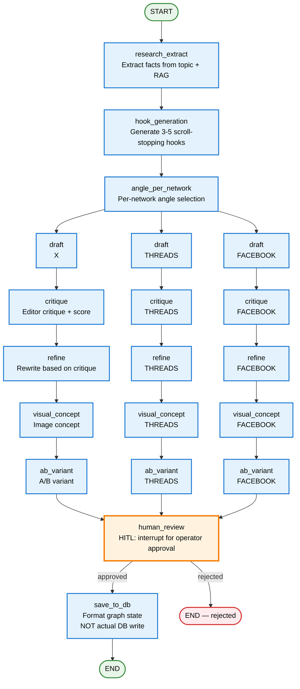

# Generation Graph Flow — Current State

> **LangGraph state machine:** How SPA generates social posts today.
> **As-is:** Per-topic fan-out to X, THREADS, FACEBOOK. HITL at the end.

## Key details

### Graph structure
- **File:** `packages/backend/src/modules/generation/generation.graph.ts`
- **Trigger:** `GenerationService.generate()` — called by cron or manual trigger
- **Per topic:** One graph invocation produces **3 Post rows** (one per network: X, THREADS, FACEBOOK)
- **Parallel branches:** Each network runs independently. Per-network error isolation: failed network short-circuits, others proceed.

### Nodes (10 total)

| Node | Purpose | LLM? |
|------|---------|------|
| `research_extract` | Extract facts from topic + RAG (CAP content) | Yes — `research-extract` prompt |
| `hook_generation` | Generate 3-5 scroll-stopping hooks per topic | Yes — `hook-generation` prompt |
| `angle_per_network` | Select different angle per network (not one text reworded) | Yes |
| `draft` | Full post draft per network | Yes — `draft-post` prompt |
| `critique` | Editor critique with quality score | Yes — `critique-post` prompt |
| `refine` | Rewrite based on critique | Yes — `refine-post` prompt |
| `visual_concept` | Image concept generation | Yes |
| `ab_variant` | A/B testing variant | Yes |
| `human_review` | HITL — `interrupt()` for operator approval | No — LangGraph interrupt |
| `save_to_db` | **Misnomer** — only formats graph state. Real Prisma persistence happens AFTER `graph.invoke()` returns, in `GenerationService` | No |

### LLM-as-a-Judge
- **Judge node** (`makeJudgeNode`) runs AFTER refine, BEFORE visual_concept
- Evaluates 4 criteria (0.0-1.0 each):
  - `anti_ai_tone` — does it sound human?
  - `hook_strength` — does the first line stop scrolling?
  - `factual_accuracy` — are the astrology facts correct?
  - `character_limit` — does it fit the platform's limit?
- **Non-blocking:** If judge LLM call fails, post proceeds with `judgeScores: undefined`
- Scores stored in `Post.llmMetadata.judgeScores`

### HITL (Human-in-the-Loop)
- `human_review` node calls LangGraph `interrupt()`
- Graph pauses, operator reviews in Vue dashboard
- Resume via `GenerationService.resumeWithReview()` with `new Command({ resume: {...} })`
- When `AUTO_APPROVE_ENABLED=true` + judge score ≥ threshold → auto-approve (skips interrupt)

### Crash-resume
- `RedisCheckpointSaver` keys on `thread_id = ${runId}:${topic.topic}`
- Re-invoking with same `thread_id` resumes from checkpoint
- Graph is lazy-compiled once via `GenerationService.getGraph()`

### SimHash dedup
- After `graph.invoke()` returns, `GenerationService` checks SimHash near-duplicate
- Skip if Hamming distance ≤3 vs last ~200 posts / 30 days
- Prevents re-posting near-identical content

### Langfuse tracing
- One `CallbackHandler` per topic with `sessionId=runId`
- Tags: `['generation', language, ...networks]`
- `promptNames` in traceMetadata — filter traces by which prompts were used
- ALS (AsyncLocalStorage) propagates callbacks through graph nodes without threading them through every function signature
