# NestJS Module Dependency Graph — Current State

> **Module graph:** 22+ NestJS modules and their import relationships.
> **As-is:** AppModule root → infrastructure + domain + feature-flagged modules. Conditional imports at module-load time.

```mermaid
flowchart TD
    AppModule["AppModule (root)<br/>validateEnv() in onModuleInit<br/>APP_GUARD: JwtAuthGuard"]

    subgraph Infra["Infrastructure modules"]
        direction TB
        PrismaModule["PrismaModule<br/>@Global"]
        RedisModule["RedisModule<br/>@Global (SHARED_REDIS)"]
        BrowserModule["BrowserModule<br/>binds IBrowserPort"]
        LlmModule["LlmModule<br/>binds ILlmPort"]
        LangfuseModule["LangfuseModule<br/>@Global (no-op when disabled)"]
        PromptRegistryModule["PromptRegistryModule<br/>@Global (binds IPromptPort)"]
        CheckpointModule["CheckpointModule<br/>RedisCheckpointSaver"]
        SseModule["SseModule<br/>Redis pub/sub (2 connections)"]
        CryptoModule["CryptoModule<br/>AES-256-GCM"]
        NotificationsModule["NotificationsModule<br/>Discord webhooks"]
        ContentModule["ContentModule<br/>binds IContentPort"]
        QueueInfraModule["QueueModule (infra)<br/>BullMQ factory"]
    end

    subgraph Domain["Domain modules"]
        direction TB
        GenerationModule["GenerationModule<br/>LangGraph generation"]
        PostingModule["PostingModule<br/>Camoufox posting"]
        PostsModule["PostsModule<br/>CRUD + approve"]
        SessionsModule["SessionsModule<br/>login + storageState"]
        AccountsModule["AccountsModule<br/>SocialAccount CRUD"]
        ContentSourceModule["ContentSourceModule<br/>content sources"]
        ContentEnhancementsModule["ContentEnhancementsModule"]
        TrendingModule["TrendingModule<br/>F22 trending scrape"]
        AnalyticsModule["AnalyticsModule<br/>read-only dashboard"]
        RecyclingModule["RecyclingModule<br/>F13 manual trigger"]
        RateLimitModule["RateLimitModule"]
        QueueModule["QueueModule (domain)<br/>enqueuePosting"]
        SseApiModule["SseApiModule<br/>EventSource endpoint"]
        HealthModule["HealthModule<br/>liveness controller"]
        HealthMonitorModule["HealthMonitorModule<br/>F21 ban detection + DLQ"]
        AuthModule["AuthModule<br/>JWT cookie (AUTH_ENABLED)"]
    end

    subgraph Feature["Feature-flagged modules (conditional imports)"]
        direction TB
        EngagementModule["EngagementModule<br/>ENGAGEMENT_ENABLED"]
        QuoteCardModule["QuoteCardModule<br/>QUOTE_CARDS_ENABLED"]
        RepliesModule["RepliesModule<br/>REPLIES_ENABLED (+ ENGAGEMENT)"]
        CaptchaModule["CaptchaModule<br/>CAPTCHA_SOLVER_ENABLED"]
        OrchestratorModule["OrchestratorModule<br/>ORCHESTRATOR_ENABLED"]
        AutonomyModule["AutonomyModule<br/>AUTO_APPROVE_ENABLED"]
        FlowControlModule["FlowControlModule<br/>Redis pause flags"]
    end

    %% AppModule → all
    AppModule --> PrismaModule
    AppModule --> RedisModule
    AppModule --> BrowserModule
    AppModule --> LlmModule
    AppModule --> LangfuseModule
    AppModule --> PromptRegistryModule
    AppModule --> CryptoModule
    AppModule --> NotificationsModule
    AppModule --> ContentModule
    AppModule --> QueueInfraModule
    AppModule --> HealthModule
    AppModule --> AccountsModule
    AppModule --> ContentSourceModule
    AppModule --> GenerationModule
    AppModule --> PostsModule
    AppModule --> PostingModule
    AppModule --> SessionsModule
    AppModule --> QueueModule
    AppModule --> RateLimitModule
    AppModule --> SseApiModule
    AppModule --> HealthMonitorModule
    AppModule --> TrendingModule
    AppModule --> AnalyticsModule
    AppModule --> RecyclingModule
    AppModule --> AuthModule
    AppModule --> FlowControlModule
    AppModule --> AutonomyModule
    AppModule -.->|if ENGAGEMENT_ENABLED| EngagementModule
    AppModule -.->|if QUOTE_CARDS_ENABLED| QuoteCardModule
    AppModule -.->|if REPLIES_ENABLED| RepliesModule
    AppModule -.->|if CAPTCHA_SOLVER_ENABLED| CaptchaModule
    AppModule -.->|if ORCHESTRATOR_ENABLED| OrchestratorModule

    %% Key domain → infra / domain imports
    GenerationModule --> LlmModule
    GenerationModule --> CheckpointModule
    GenerationModule --> ContentSourceModule
    GenerationModule --> AccountsModule
    GenerationModule --> PostsModule
    GenerationModule --> TrendingModule
    GenerationModule --> ContentEnhancementsModule
    PostingModule --> BrowserModule
    PostingModule --> SessionsModule
    PostingModule --> AccountsModule
    PostsModule --> QueueModule
    QueueModule --> QueueInfraModule
    SessionsModule --> BrowserModule
    SessionsModule --> CryptoModule
    EngagementModule --> BrowserModule
    EngagementModule --> AccountsModule
    OrchestratorModule --> GenerationModule
    OrchestratorModule --> PostingModule
    OrchestratorModule --> EngagementModule
    RepliesModule --> EngagementModule
    HealthMonitorModule --> NotificationsModule
    AnalyticsModule --> PostsModule

    classDef root fill:#ffebee,stroke:#c62828,stroke-width:3px,color:#000
    classDef infra fill:#e3f2fd,stroke:#1565c0,stroke-width:2px,color:#000
    classDef domain fill:#e8f5e9,stroke:#2e7d32,stroke-width:2px,color:#000
    classDef feature fill:#fff3e0,stroke:#e65100,stroke-width:2px,color:#000

    class AppModule root
    class PrismaModule,RedisModule,BrowserModule,LlmModule,LangfuseModule,PromptRegistryModule,CheckpointModule,SseModule,CryptoModule,NotificationsModule,ContentModule,QueueInfraModule infra
    class GenerationModule,PostingModule,PostsModule,SessionsModule,AccountsModule,ContentSourceModule,ContentEnhancementsModule,TrendingModule,AnalyticsModule,RecyclingModule,RateLimitModule,QueueModule,SseApiModule,HealthModule,HealthMonitorModule,AuthModule domain
    class EngagementModule,QuoteCardModule,RepliesModule,CaptchaModule,OrchestratorModule,AutonomyModule,FlowControlModule feature
```

## Key details

### Module count
- **22+ modules** in `app.module.ts` `imports` (plus `ConfigModule`, `ScheduleModule`, `SentryModule`, `AppClsModule`, `LoggingModule`, `FiltersModule`, `MultiInstanceModule`, `EmailModule`, `EventsEdaModule`).
- **Infrastructure (12):** PrismaModule, RedisModule, BrowserModule, LlmModule, LangfuseModule, PromptRegistryModule, CheckpointModule, SseModule, CryptoModule, NotificationsModule, ContentModule, QueueModule (infra).
- **Domain (16):** GenerationModule, PostingModule, PostsModule, SessionsModule, AccountsModule, ContentSourceModule, ContentEnhancementsModule, TrendingModule, AnalyticsModule, RecyclingModule, RateLimitModule, QueueModule (domain), SseApiModule, HealthModule, HealthMonitorModule, AuthModule.
- **Feature-flagged (7):** EngagementModule, QuoteCardModule, RepliesModule, CaptchaModule, OrchestratorModule, AutonomyModule, FlowControlModule.

### Feature-flag pattern
- `app.module.ts` reads `process.env` **directly at module-load time** (not `ConfigService` — it isn't available until after DI bootstrap) and conditionally adds modules to `imports`.
- When a flag is off, the module is **entirely absent** — services unresolvable, routes 404, not merely disabled. Toggling requires a restart.
- `RepliesModule.withEngagement(EngagementModule)` is composed only when **both** `REPLIES_ENABLED` and `ENGAGEMENT_ENABLED` are on.
- Flags: `ENGAGEMENT_ENABLED`, `CAPTCHA_SOLVER_ENABLED`, `QUOTE_CARDS_ENABLED`, `REPLIES_ENABLED`, `ORCHESTRATOR_ENABLED` (all default `false`).

### `@Global` modules
- `PrismaModule`, `RedisModule` (exports `SHARED_REDIS` token), `LangfuseModule` (no-op when `LANGFUSE_PUBLIC_KEY` absent), `PromptRegistryModule` — imported once in `AppModule`, available everywhere without re-import.

### Circular dependency: PostsModule ↔ QueueModule
- `PostsModule` imports `QueueModule` (to enqueue on approve); `QueueModule` worker needs `PostsService` to re-check status.
- Broken via **`ModuleRef` lazy resolution** — `PostsService.approve()` resolves `QueueService` lazily inside the method, not in the constructor. Deliberate, not a smell.

### Env validation
- `validateEnv()` runs in `AppModule.onModuleInit()` (manual, not `ConfigModule.validationSchema`) — Joi defaults would overwrite `process.env` and break tests that set env after import.
