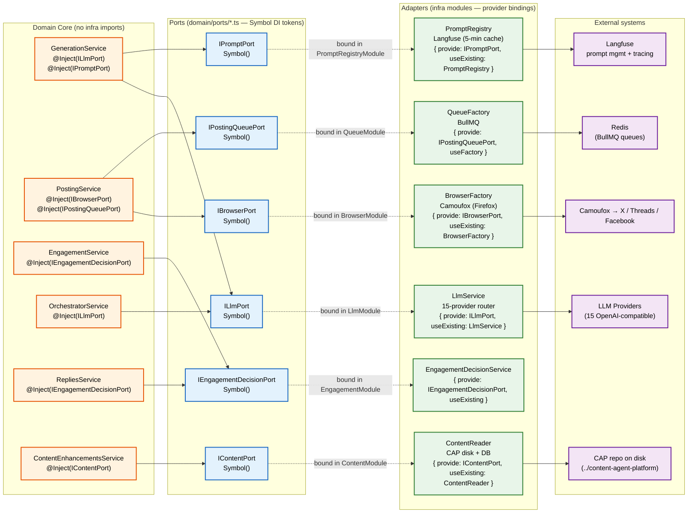

# Hexagonal Ports & Adapters — Current State

> **Architecture:** How SPA's domain core stays infra-free via Symbol-token DI ports.
> **As-is:** 6 ports declared as `Symbol()` in `domain/ports/*.ts`, bound to adapters in infra modules.

## Key details

### 6 ports as `Symbol()` DI tokens
- **`ILlmPort`** (`domain/ports/llm.port.ts`) — LLM generation. Bound to `LlmService` (15-provider router) in `LlmModule`.
- **`IBrowserPort`** (`domain/ports/browser.port.ts`) — browser automation. Bound to `BrowserFactory` (Camoufox) in `BrowserModule`.
- **`IContentPort`** (`domain/ports/content.port.ts`) — content source. Bound to `ContentReader` (CAP disk + DB) in `ContentModule`.
- **`IEngagementDecisionPort`** (`domain/ports/engagement-decision.port.ts`) — engagement decisions. Bound to `EngagementDecisionService` in `EngagementModule` (feature-flagged).
- **`IPostingQueuePort`** (`domain/ports/posting-queue.port.ts`) — posting queue. Bound via `useFactory` to `QueueFactory` (BullMQ) in `QueueModule`.
- **`IPromptPort`** (`domain/ports/prompt.port.ts`) — prompt registry. Bound to `PromptRegistry` (Langfuse) in `PromptRegistryModule` (`@Global`).

### Hexagonal pattern
- Domain services `@Inject(SYMBOL)` — never the concrete class. Unit tests inject a mock `ILlmPort` / `IBrowserPort` etc.
- **To swap an adapter, change only the provider binding** in the infra module (e.g. `{ provide: ILlmPort, useExisting: MockLlmService }`).
- **Domain never imports infra** — `src/domain/` contains only port interfaces and re-exports of shared types. No `import` from `infrastructure/` or `modules/` appears in `domain/`.
- Ports live in `domain/ports/*.ts`; the barrel `domain/ports/index.ts` re-exports all 6.
- Bindings live in infra modules (`LlmModule`, `BrowserModule`, `ContentModule`, `PromptRegistryModule`, `QueueModule`, `EngagementModule`).
- Feature-flagged ports (`IEngagementDecisionPort`, `IBrowsingSessionPort`, `IRepliesMonitorPort`) are bound via `useExisting` only when their feature flag is on — otherwise the token is unresolvable and dependent services must be absent too.
