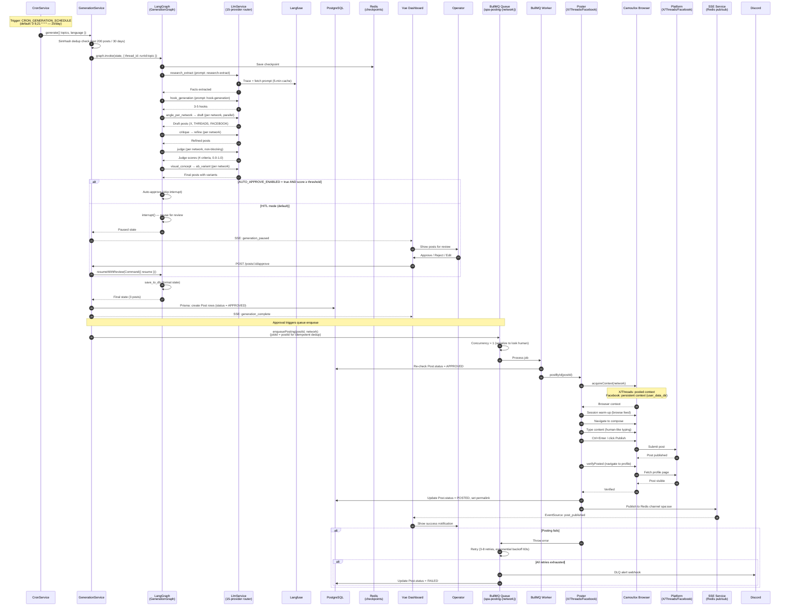

# Posting Sequence — Current State

> **End-to-end flow:** From cron trigger to published post on X/Threads/Facebook.
> **As-is:** Cron → generation → HITL → approve → BullMQ → Camoufox → platform → verify → SSE.

## Key details

### Trigger layer
- **CronService** (`modules/generation/cron.service.ts`) — dynamic registration via `SchedulerRegistry.addCronJob()` in `onModuleInit()`
- Schedule: `CRON_GENERATION_SCHEDULE` (default `0 9,21 * * *` — 2x/day)
- Skips when `ORCHESTRATOR_ENABLED=true` (orchestrator replaces crons) or `SPA_DRY_RUN=true`
- **OrchestratorGraph** (when enabled) replaces all crons with OBSERVE → DECIDE → EXECUTE loop

### Generation
- **GenerationService** wraps `graph.invoke()` with Langfuse callbacks via ALS
- SimHash dedup BEFORE generation — skip near-duplicate topics
- Per-topic: one graph invocation → 3 Post rows (X, THREADS, FACEBOOK)
- Crash-resume via `RedisCheckpointSaver` (key: `runId:topic`)

### HITL (Human-in-the-Loop)
- **Default mode:** `AUTO_APPROVE_ENABLED=false` → `human_review` node calls `interrupt()`
- Operator reviews in Vue dashboard, approves/rejects/edits
- Resume via `GenerationService.resumeWithReview()` with `new Command({ resume: {...} })`
- **Auto-approve mode:** `AUTO_APPROVE_ENABLED=true` + judge score ≥ `AUTO_APPROVE_MIN_SCORE` (default 7) → skip interrupt

### Queue + Worker
- **BullMQ** — one queue per network×action: `spa-posting-x`, `spa-posting-threads`, `spa-posting-facebook`
- `concurrency=1` — serialize to look human (B9 mitigation)
- `jobId = postId` — idempotent dedup (same post won't be queued twice)
- Worker re-checks `Post.status = APPROVED` before posting (race condition guard)
- Retry: 3 retries (posting: 8), exponential backoff (60s base)
- DLQ → Discord webhook alert

### Browser posting
- **X/Threads:** pooled context (`BROWSER_POOL_SIZE=3`), fresh context per post, storageState saved
- **Facebook:** persistent context (`user_data_dir` on disk, never pooled/closed)
- Session warm-up: browse feed before posting (anti-detect)
- Human-like typing: `humanType()`, `humanClick()`, `randomDelay()`
- Multi-fallback text entry: execCommand → fill → clipboard paste → keyboard.type
- Selector chain: `data-testid → role → label → CSS → text` (with drift detector)

### Verification
- `verifyPosted()` — navigate to profile, check post is visible
- Resource blocking: `blockImages=true` on verify (only needs text + URL pattern)
- Sets `Post.status = POSTED`, saves permalink

### SSE (real-time UI updates)
- Worker PUBLISHes to Redis channel `spa:sse`
- `SseService` SUBSCRIBEs (separate connection — subscriber can't publish)
- Fans out to `EventSource` clients in Vue dashboard
- Events: `generation_paused`, `generation_complete`, `post_published`, `post_failed`

### What's missing (future state)
- **No `POST_VERIFIED` event** — currently only `POSTED`. Future: verify → `VERIFIED` → emit event → IndexNow + social promo
- **No canonical URL** — posts don't link back to a blog. Future: POSSE canonical URL management
- **No article generation** — only short social posts. Future: article graph (research → outline → draft → judge → refine)
- **No syndication** — only X/Threads/Facebook. Future: 11 platforms via Camoufox + LLM-in-the-loop
