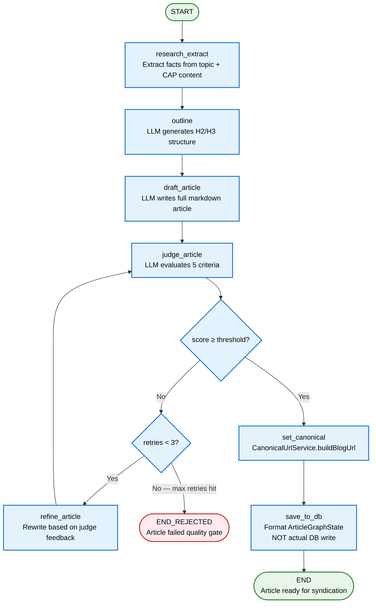

# Article Graph Flow — Future State

> **LangGraph state machine:** How SPA generates long-form articles for blog syndication.
> **To-be:** research → outline → draft → judge (5 criteria) → refine loop → canonical URL → save. Crash-resume via Redis checkpoints.

## Key details

### Graph structure
- **File:** `packages/backend/src/modules/generation/article-graph.ts`
- **Trigger:** `ArticleGenerationCron` → `GenerationService.generateArticle()` — called by article cron or manual trigger
- **Per topic:** One graph invocation produces **one Article row** (full markdown, ready for blog + syndication)
- **State type:** `ArticleGraphState` (in `@spa/shared`) — fields: `topic`, `researchFacts`, `outline`, `draft`, `judgeScores`, `retries`, `canonicalUrl`, `article`

### Nodes (7 total)

| Node | Purpose | LLM? |
|------|---------|------|
| `research_extract` | Extract facts from topic + CAP content (briefs, articles, brand-voice.md) | Yes — `article-research-extract` prompt |
| `outline` | Generate H2/H3 structure for the article | Yes — `article-outline` prompt |
| `draft_article` | Write full markdown article following the outline | Yes — `article-draft` prompt |
| `judge_article` | Evaluate article on 5 criteria (0.0-1.0 each) | Yes — `article-judge` prompt |
| `refine_article` | Rewrite article based on judge feedback | Yes — `article-refine` prompt |
| `set_canonical` | Build canonical blog URL via `CanonicalUrlService.buildBlogUrl()` | No — deterministic |
| `save_to_db` | Format `ArticleGraphState` for persistence. Real Prisma write happens AFTER `graph.invoke()` returns, in `GenerationService` | No |

### LLM-as-a-Judge (5 criteria)
- **Judge node** (`judge_article`) evaluates the article on 5 criteria (0.0-1.0 each):
  - `anti_ai_tone` — does it sound human, not like ChatGPT?
  - `hook_strength` — does the opening paragraph pull the reader in?
  - `factual_accuracy` — are the astrology/facts correct?
  - `structure_quality` — is the H2/H3 structure logical and scannable?
  - `seo_optimization` — are keywords, headings, and meta-friendly formatting present?
- **Non-blocking:** If judge LLM call fails, article proceeds with `judgeScores: undefined`
- Scores stored in `Article.judgeScores` (JSON)

### Refine loop
- If `score < threshold` AND `retries < 3` → `refine_article` → back to `judge_article`
- If `retries ≥ 3` AND `score < threshold` → `END_REJECTED` (article failed quality gate, not published)
- If `score ≥ threshold` → `set_canonical` → `save_to_db` → `END`
- Threshold: `ARTICLE_JUDGE_MIN_SCORE` (per-platform configurable, default 7.0)

### Canonical URL
- `set_canonical` node calls `CanonicalUrlService.buildBlogUrl(article)` → `my-zodiac-ai.com/blog/{slug}`
- Slug derived from article title (slugified)
- Canonical URL stored in `ArticleGraphState.canonicalUrl` → persisted to `Article.canonicalUrl`
- Syndicated versions (Dev.to, Hashnode, etc.) include `rel=canonical` pointing to this URL

### Crash-resume
- `RedisCheckpointSaver` keys on `thread_id = article:${runId}:${topic.topic}`
- Re-invoking with same `thread_id` resumes from checkpoint
- Graph is lazy-compiled once via `GenerationService.getArticleGraph()`

### Langfuse tracing
- One `CallbackHandler` per article with `sessionId=runId`
- Tags: `['article', language, ...syndicationTargets]`
- `promptNames` in traceMetadata — filter traces by which prompts were used
- ALS (AsyncLocalStorage) propagates callbacks through graph nodes
- **5 Langfuse prompts:** `article-research-extract`, `article-outline`, `article-draft`, `article-judge`, `article-refine` (all chat type, editable in UI)
