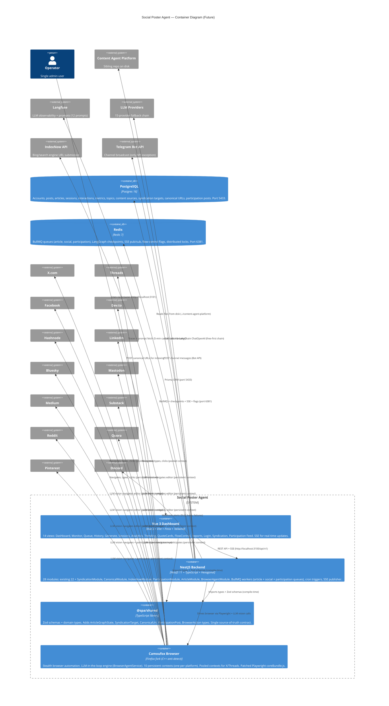

# C4 Container Diagram — Future State

> **Level 2:** Containers. Shows the internal structure of SPA — packages, processes, data stores.
> **To-be:** Full syndication — 14 platforms, article generation, LLM-in-the-loop browser agent, canonical URLs, IndexNow, participation mode.

## Container details

### Vue 3 Dashboard (`@spa/ui`)
- **Port:** 3101
- **Stack:** Vue 3 + Vite + Pinia + Tailwind CSS
- **14 views:** Dashboard, Monitor, Queue, History, Generate, Sessions, Analytics, Trending, QuoteCards, FlowControl, Reports, Login, **Syndication** (article status per platform), **Participation Feed** (Reddit/Quora/Pinterest engagement)
- **Real-time:** SSE (EventSource) for live updates — article generation, posting progress, participation, queue status
- **New:** Syndication view shows article → platform publish status matrix. Participation feed shows answered questions, pinned content, engagement metrics.

### NestJS Backend (`@spa/backend`)
- **Port:** 3100 (`/api/v1`, Swagger at `/docs`)
- **Stack:** NestJS 11 + TypeScript, hexagonal architecture (ports & adapters)
- **28 modules:** existing 22 + **SyndicationModule**, **CanonicalModule**, **IndexNowModule**, **ParticipationModule**, **ArticleModule**, **BrowserAgentModule**
- **6 LangGraph graphs:** GenerationGraph, EngagementGraph, OrchestratorGraph, DialogueGraph, **ArticleGraph**, **SocialGraph**
- **New services:**
  - **BrowserAgentService** — LLM vision engine. Takes screenshots, sends to vision-capable LLM, receives actions (click, type, scroll, wait). General-purpose — no per-platform selectors. Replaces hardcoded poster logic for all new platforms.
  - **CanonicalUrlService** — builds canonical blog URLs (`my-zodiac-ai.com/blog/{slug}`), verifies they're live after article publish, tracks in DB, injects `rel=canonical` into syndicated articles.
  - **IndexNowService** — submits canonical URLs to IndexNow API (`POST https://api.indexnow.org/indexnow`). Batched. Fires after `POST_VERIFIED` + canonical verified.
  - **TelegramBotAdapter** — posts to Telegram channel via Bot API (`POST https://api.telegram.org/bot{token}/sendMessage`). Only platform NOT using Camoufox.
  - **ParticipationService** — finds relevant questions on Reddit/Quora, drafts answers via LLM, judges quality, posts via BrowserAgentService. Pinterest: pins + engages with relevant boards.
  - **ArticleGenerationCron** — triggers article generation on schedule (`CRON_ARTICLE_SCHEDULE`, default daily). Distinct from social post cron.
- **Feature flags:** existing + `SYNDICATION_ENABLED`, `PARTICIPATION_ENABLED`, `INDEXNOW_ENABLED`, `ARTICLE_ENABLED`

### @spa/shared
- **Type:** TypeScript library (workspace package)
- **Role:** Zod schemas + domain types — single source-of-truth contract
- **New types:** `ArticleGraphState`, `SyndicationTarget`, `CanonicalUrl`, `ParticipationPost`, `BrowserAction`, `BrowserObservation`
- **Key:** Editing a schema breaks backend AND UI at compile time

### Camoufox Browser
- **Type:** Firefox fork patched at C++ level (anti-detect)
- **LLM-in-the-loop engine:** `BrowserAgentService` sends screenshots to vision LLM, receives structured actions. No hardcoded selectors for new platforms — the LLM sees the page and decides what to click/type. Existing X/Threads/Facebook posters keep their optimized selectors (migrated to LLM in Phase 5).
- **10 persistent contexts:** one `user_data_dir` per platform (Facebook, Dev.to, Hashnode, LinkedIn, Bluesky, Mastodon, Medium, Substack, Reddit, Quora, Pinterest). Never pooled/closed — dodges "suspicious login" challenges.
- **Pooled contexts:** X, Threads only (`BROWSER_POOL_SIZE=3`).
- **Patch:** `patch-playwright.js` fixes Camoufox Juggler protocol `Page.uncaughtError` missing `location` field.

### PostgreSQL
- **Port:** 5433 (non-standard)
- **New models:** `Article`, `SyndicationTarget`, `CanonicalUrl`, `ParticipationPost`, `ParticipationThread`
- **Article fields:** title, slug, content (markdown), canonicalUrl, judgeScores, status, publishedAt, syndicationTargets
- **SyndicationTarget fields:** articleId, platform, platformUrl, status, publishedAt, canonicalVerified

### Redis
- **Port:** 6381 (non-standard)
- **New queues:**
  - `spa-article` — article generation jobs
  - `spa-syndication-{platform}` — one per syndication platform (devto, hashnode, linkedin, medium, substack)
  - `spa-participation-{platform}` — one per participation platform (reddit, quora, pinterest)
  - `spa-telegram` — Telegram channel posts
- **Existing queues:** `spa-posting-x`, `spa-posting-threads`, `spa-posting-facebook` (social posts)
