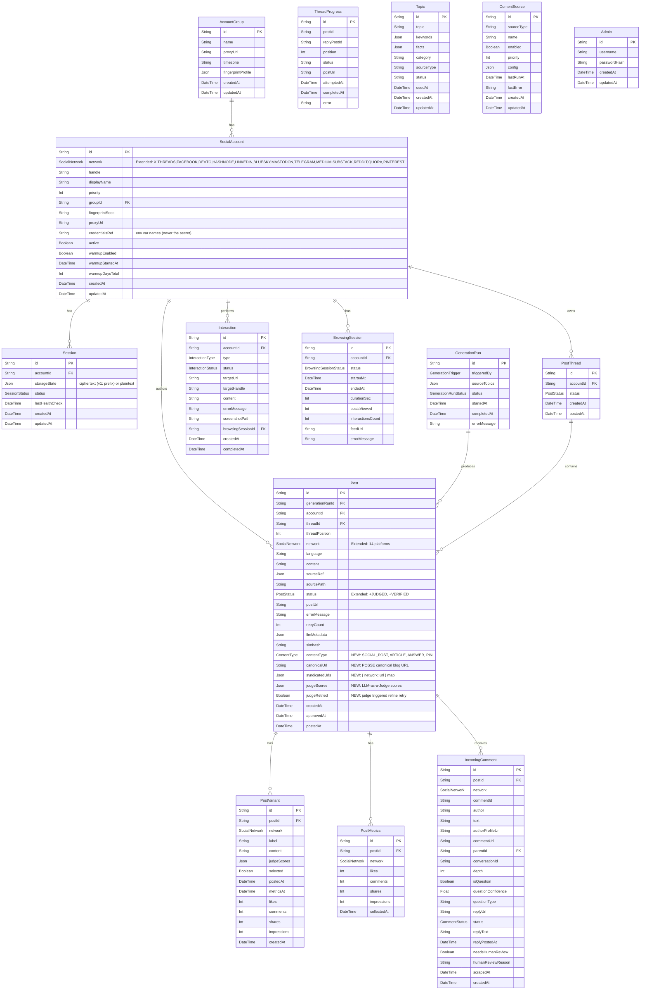

# ER Diagram — Future State (Extended)

> **Prisma ER diagram:** Extended with syndication fields and new enum values.
> **To-be:** All existing models PLUS new fields for canonical URLs, syndication tracking, judge scores, and content types.

## Key details

### New enum values

**SocialNetwork** (was 3, now 14):
| Value | Phase | Method |
|-------|-------|--------|
| X, THREADS, FACEBOOK | Existing | Camoufox (pooled/persistent) |
| DEVTO, HASHNODE, LINKEDIN | Phase 1 | Camoufox persistent + LLM-in-the-loop |
| BLUESKY, MASTODON | Phase 2 | Camoufox persistent + LLM-in-the-loop |
| TELEGRAM | Phase 2 | Bot API (only API exception) |
| MEDIUM, SUBSTACK | Phase 3 | Camoufox persistent + LLM-in-the-loop |
| REDDIT, QUORA | Phase 4 | Camoufox persistent + LLM-in-the-loop (participation) |
| PINTEREST | Phase 4 | Camoufox persistent + LLM-in-the-loop |

**PostStatus** (was 6, now 8):
| Value | Meaning |
|-------|---------|
| DRAFT, APPROVED, POSTING, POSTED, FAILED, REJECTED | Existing |
| JUDGED | NEW — LLM-as-a-Judge evaluated, awaiting auto-approve decision |
| VERIFIED | NEW — Published AND verified on platform (POST_VERIFIED event emitted) |

**ContentType** (NEW enum):
| Value | Used for |
|-------|----------|
| SOCIAL_POST | Short social posts (X, Threads, Facebook, LinkedIn, Bluesky, Mastodon, Telegram) |
| ARTICLE | Long-form articles (Dev.to, Hashnode, Medium, Substack) |
| ANSWER | Participation answers (Reddit, Quora) |
| PIN | Pinterest pins |

### New Post fields
| Field | Type | Purpose |
|-------|------|---------|
| `contentType` | ContentType | Distinguishes social posts from articles from answers (default: SOCIAL_POST) |
| `canonicalUrl` | String? | POSSE canonical URL — blog URL that articles point back to |
| `syndicatedUrls` | Json? | `{ [network: string]: string }` — platform URLs after syndication |
| `judgeScores` | Json? | LLM-as-a-Judge scores `{ anti_ai_tone, hook_strength, factual_accuracy, ... }` |
| `judgeRetried` | Boolean | True if judge triggered a refine retry (max 3) |

### Per-platform auto-approve thresholds
- `AUTO_APPROVE_MIN_SCORE` (default 7) — global fallback
- `AUTO_APPROVE_MIN_SCORE_DEVTO=7`, `AUTO_APPROVE_MIN_SCORE_HASHNODE=7`, `AUTO_APPROVE_MIN_SCORE_LINKEDIN=7`
- `AUTO_APPROVE_MIN_SCORE_REDDIT=9` — strictest (Reddit bans for self-promo)
- Stored as env vars, looked up by `AutoApproveService` per platform

### Existing fields (unchanged)
- `credentialsRef` — stores env var *name* (e.g. `DEVTO_EMAIL,DEVTO_PASSWORD`), never the secret itself
- `storageState` — typed `Json` but holds ciphertext (v1: prefix) when `SESSION_ENCRYPTION_KEY` set
- `sourceRef` — JSON with `{ type, path, topic, ... }` for content provenance tracking
- `simhash` — precomputed SimHash for near-duplicate detection (Hamming ≤3 = skip)
