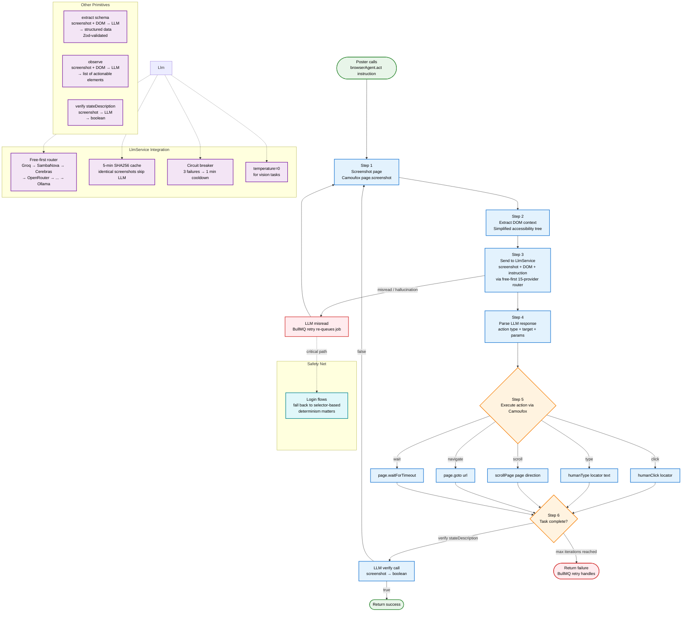

# LLM-in-the-Loop Browser Interaction — Future State

> **Flow diagram:** How the LLM vision-based browser engine works (browser-use / Stagehand pattern).
> **To-be:** No hardcoded CSS selectors — LLM resolves elements at runtime via screenshots + DOM context.

## Key details

### Pattern: browser-use / Stagehand / Skyvern
- **browser-use** (107K stars, Python) — `observe → think → act` loop. Screenshot → LLM decides next action.
- **Stagehand** (TypeScript) — 4 primitives: `act("click submit")`, `extract`, `observe`, `agent`. "Instructions survive page redesigns."
- **Skyvern** (Python) — `page.click(prompt="Click login button")` instead of `page.click("#btn")`. "Resistant to website layout changes."
- **AgentQL** — AI query language, natural language selectors, self-healing.

### IBrowserPort methods (P0-02 stubs, P1-00 real impl)
- **`act(instruction: string)`** — "Click the Publish button", "Find the canonical URL field and type X"
- **`extract(schema: ZodSchema)`** — extract structured data from page via LLM vision (Zod-validated)
- **`observe()`** — return list of actionable elements on page (LLM-resolved, not CSS-parsed)
- **`verify(stateDescription: string)`** — "Is the article published? yes/no" → boolean

### Trade-offs vs selector-based
| Parameter | Selector-based | LLM-in-the-loop |
|-----------|---------------|-----------------|
| Maintenance | High (drift) | **Zero** |
| Speed | 5-10 sec/post | 30-90 sec/post (LLM thinking) |
| Cost | $0 | ~$0 (free-first router + cache) |
| Reliability | 95% (when selectors work) | 85-90% (LLM can misread) |
| Determinism | Yes | No (LLM stochastic) |

### Mitigations
- **Speed:** BullMQ queue, concurrency=1, no real-time requirement. 30-90 sec is fine.
- **Cost:** Free-first router (Groq → SambaNova → Cerebras → ... → Ollama). 5-min SHA256 cache. Circuit breaker per provider.
- **Reliability:** Retry on LLM misread (BullMQ retry). Fallback to selector-based for critical paths (login flow).
- **Determinism:** temperature=0 for vision tasks where possible.

### Phase 5 migration (#48)
- Existing X/Threads/Facebook posters keep selector chain for now (it works, don't break it)
- Migrate to LLM-in-the-loop in Phase 5 as a separate task
- Order: Facebook (persistent context, simplest) → Threads → X (most complex)
- Keep selector chain as fallback safety net for login flows (determinism matters)
