# Module Dependency Graph — Future State

> **NestJS module graph:** Extended with syndication modules.
> **To-be:** All existing modules PLUS new syndication, canonical, indexnow, participation, and browser-agent modules.

```mermaid
flowchart TD
    subgraph Root
        AppModule[AppModule<br/>root — reads process.env<br/>conditionally registers modules]
    end

    subgraph Infrastructure
        PrismaModule[PrismaModule]
        RedisModule[RedisModule]
        BrowserModule[BrowserModule<br/>Camoufox factory]
        LlmModule[LlmModule<br/>15-provider router]
        LangfuseModule[LangfuseModule<br/>Global, no-op when disabled]
        PromptRegistryModule[PromptRegistryModule<br/>Global]
        CheckpointModule[CheckpointModule<br/>Redis checkpoint saver]
        SseModule[SseModule<br/>Redis pub/sub]
        CryptoModule[CryptoModule]
        NotificationsModule[NotificationsModule]
        ContentModule[ContentModule<br/>CAP disk reader]
        QueueInfraModule[QueueModule<br/>BullMQ factory]
    end

    subgraph Domain Existing
        GenerationModule[GenerationModule<br/>LangGraph social graph]
        PostingModule[PostingModule<br/>X/Threads/Facebook posters]
        PostsModule[PostsModule<br/>CRUD + approve]
        SessionsModule[SessionsModule]
        AccountsModule[AccountsModule]
        ContentSourceModule[ContentSourceModule]
        ContentEnhancementsModule[ContentEnhancementsModule]
        TrendingModule[TrendingModule]
        AnalyticsModule[AnalyticsModule]
        RecyclingModule[RecyclingModule]
        RateLimitModule[RateLimitModule]
        QueueDomainModule[QueueModule<br/>domain — enqueue logic]
        SseApiModule[SseApiModule]
        HealthModule[HealthModule]
        HealthMonitorModule[HealthMonitorModule]
        AuthModule[AuthModule]
    end

    subgraph Syndication New
        SyndicationModule[SyndicationModule<br/>feature-flag: SYNDICATION_ENABLED<br/>wraps canonical + indexnow + article cron]
        CanonicalModule[CanonicalModule<br/>CanonicalUrlService]
        IndexNowModule[IndexNowModule<br/>IndexNowService<br/>listens POST_VERIFIED]
        ArticleCron[ArticleGenerationCron<br/>dynamic registration<br/>CRON_ARTICLE_GENERATION_SCHEDULE]
        BrowserAgentService[BrowserAgentService<br/>LLM-in-the-loop engine<br/>extends IBrowserPort]
        TelegramAdapter[TelegramBotAdapter<br/>Bot API — only API exception]
    end

    subgraph Participation New
        ParticipationModule[ParticipationModule<br/>feature-flag: SYNDICATION_ENABLED<br/>Reddit + Quora + Pinterest]
    end

    subgraph Feature Flagged
        EngagementModule[EngagementModule<br/>ENGAGEMENT_ENABLED]
        QuoteCardModule[QuoteCardModule<br/>QUOTE_CARDS_ENABLED]
        RepliesModule[RepliesModule<br/>REPLIES_ENABLED]
        CaptchaModule[CaptchaModule<br/>CAPTCHA_SOLVER_ENABLED]
        OrchestratorModule[OrchestratorModule<br/>ORCHESTRATOR_ENABLED]
        AutonomyModule[AutonomyModule<br/>AUTO_APPROVE_ENABLED]
        FlowControlModule[FlowControlModule]
    end

    %% AppModule imports
    AppModule --> PrismaModule & RedisModule & BrowserModule & LlmModule & LangfuseModule & PromptRegistryModule
    AppModule --> GenerationModule & PostingModule & PostsModule & SessionsModule & AccountsModule
    AppModule --> ContentSourceModule & TrendingModule & AnalyticsModule & RecyclingModule
    AppModule --> RateLimitModule & SseApiModule & HealthModule & HealthMonitorModule & AuthModule
    AppModule -.->|SYNDICATION_ENABLED| SyndicationModule
    AppModule -.->|SYNDICATION_ENABLED| ParticipationModule
    AppModule -.->|ENGAGEMENT_ENABLED| EngagementModule
    AppModule -.->|REPLIES_ENABLED| RepliesModule
    AppModule -.->|ORCHESTRATOR_ENABLED| OrchestratorModule

    %% Syndication internal deps
    SyndicationModule --> CanonicalModule
    SyndicationModule --> IndexNowModule
    SyndicationModule --> ArticleCron
    SyndicationModule --> GenerationModule

    %% BrowserAgentService deps
    BrowserAgentService --> LlmModule
    BrowserAgentService --> BrowserModule

    %% GenerationModule deps (existing + article graph)
    GenerationModule --> LlmModule & CheckpointModule & SseModule
    GenerationModule --> ContentSourceModule & AccountsModule & PostsModule
    GenerationModule --> TrendingModule & ContentEnhancementsModule

    %% PostingModule deps
    PostingModule --> BrowserModule & PostsModule & AccountsModule
    PostingModule --> RateLimitModule & QueueDomainModule
    PostingModule -.-> BrowserAgentService

    %% ParticipationModule deps
    ParticipationModule --> BrowserModule & LlmModule & GenerationModule
    ParticipationModule --> PostsModule & RateLimitModule

    %% IndexNow listens to events
    IndexNowModule -.->|listens POST_VERIFIED| EventsBus[EventEmitter2<br/>domain event bus]

    %% Telegram adapter
    TelegramAdapter --> QueueDomainModule

    classDef newModule fill:#e8f5e9,stroke:#388e3c,stroke-width:3px,color:#000
    classDef existing fill:#e3f2fd,stroke:#1976d2,stroke-width:2px,color:#000
    classDef infra fill:#f3e5f5,stroke:#7b1fa2,stroke-width:2px,color:#000
    classDef flagged fill:#fff3e0,stroke:#f57c00,stroke-width:2px,color:#000

    class SyndicationModule,CanonicalModule,IndexNowModule,ArticleCron,BrowserAgentService,TelegramAdapter,ParticipationModule newModule
    class GenerationModule,PostingModule,PostsModule,SessionsModule,AccountsModule,ContentSourceModule,ContentEnhancementsModule,TrendingModule,AnalyticsModule,RecyclingModule,RateLimitModule,QueueDomainModule,SseApiModule,HealthModule,HealthMonitorModule,AuthModule existing
    class PrismaModule,RedisModule,BrowserModule,LlmModule,LangfuseModule,PromptRegistryModule,CheckpointModule,SseModule,CryptoModule,NotificationsModule,ContentModule,QueueInfraModule infra
    class EngagementModule,QuoteCardModule,RepliesModule,CaptchaModule,OrchestratorModule,AutonomyModule,FlowControlModule flagged
```

## Key details

### New modules (syndication)
- **SyndicationModule** — feature-flagged by `SYNDICATION_ENABLED` (default false). Wraps CanonicalModule + IndexNowModule + ArticleGenerationCron. When disabled, none of these are registered.
- **CanonicalModule** — `CanonicalUrlService`: buildBlogUrl, setCanonical, verifyCanonical
- **IndexNowModule** — `IndexNowService`: submits URLs to IndexNow API. Listens for `POST_VERIFIED` domain event.
- **ArticleGenerationCron** — dynamic registration via `SchedulerRegistry.addCronJob()`. Schedule: `CRON_ARTICLE_GENERATION_SCHEDULE` (default weekly Monday 9am). Skips when `SYNDICATION_ENABLED=false`.
- **BrowserAgentService** — LLM-in-the-loop engine. Extends `IBrowserPort` with `act()`, `extract()`, `observe()`, `verify()`. Depends on LlmModule (for vision calls) + BrowserModule (for Camoufox).
- **TelegramBotAdapter** — only API-based adapter. Uses Telegram Bot API (`TELEGRAM_BOT_TOKEN` + `TELEGRAM_CHANNEL_ID`).

### New BullMQ queues (Phase 1-4)
- `spa-posting-devto`, `spa-posting-hashnode`, `spa-posting-linkedin` (Phase 1)
- `spa-posting-bluesky`, `spa-posting-mastodon`, `spa-posting-telegram` (Phase 2)
- `spa-posting-medium`, `spa-posting-substack` (Phase 3)
- `spa-posting-reddit`, `spa-posting-quora`, `spa-posting-pinterest` (Phase 4)
- All concurrency=1, jobId=postId for idempotent dedup, DLQ → Discord

### Feature-flag pattern
- `SYNDICATION_ENABLED` gates SyndicationModule + ParticipationModule (same pattern as ENGAGEMENT_ENABLED, ORCHESTRATOR_ENABLED)
- When off: modules entirely absent — services unresolvable, routes 404, no cron registration
- Toggling requires a restart (env read at module-load time, not ConfigService)

### POST_VERIFIED event chain
- Worker publishes post → verifies on platform → emits `POST_VERIFIED` domain event
- `IndexNowService` listens → submits blog URL + syndicated URLs to IndexNow
- Social promo trigger listens → triggers social generation graph with article as content source
