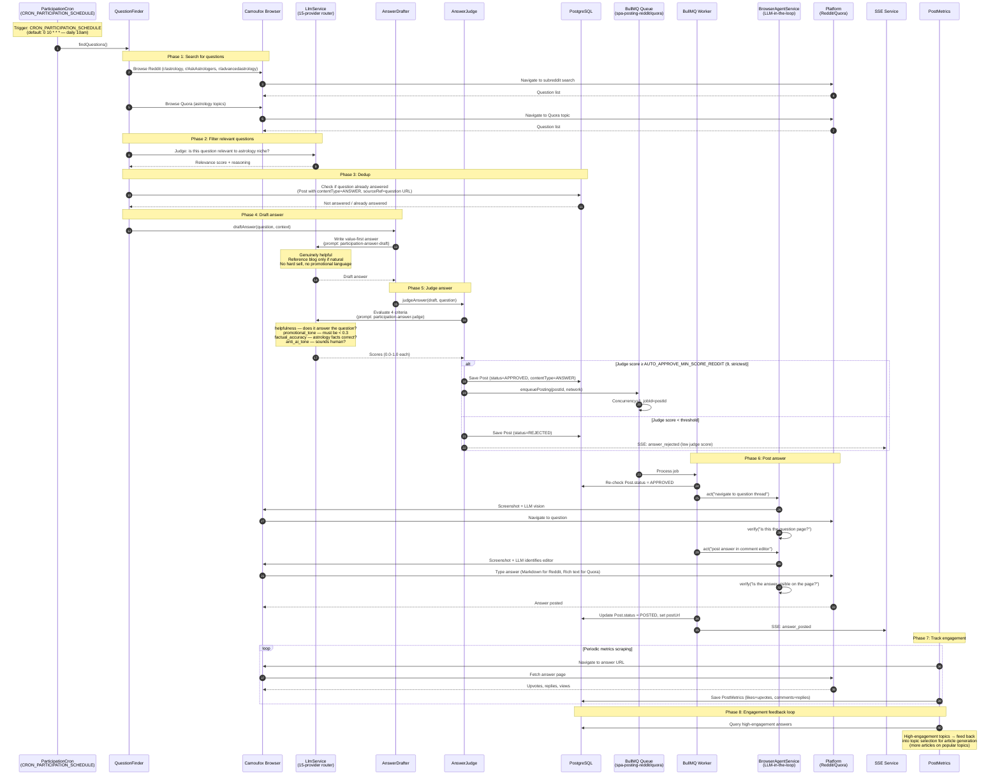

# Participation Flow — Reddit/Quora/Pinterest

> **Sequence diagram:** Agent participation mode — finding questions, drafting answers, judging, posting.
> **To-be:** Different workflow from article syndication. Value-first answers, no hard sell.

## Key details

### Participation vs syndication
- **Syndication** — push our articles to platforms (Dev.to, Hashnode, Medium, etc.)
- **Participation** — answer questions on forums (Reddit, Quora), create pins (Pinterest)
- Different workflow: question finding → answer drafting → strict judging → posting
- Same infrastructure: Camoufox, LlmService, BullMQ, SSE

### Value-first answers (critical for Reddit)
- **Genuinely helpful** — answer the question, provide value
- **Reference blog only if natural** — don't force links
- **No hard sell** — no promotional language, no "check out my blog"
- **Reddit is strictest** — `AUTO_APPROVE_MIN_SCORE_REDDIT=9` (vs 7 for other platforms)
- `promotional_tone` must be < 0.3 — anything higher is rejected

### Judge criteria (4 dimensions, 0.0-1.0)
| Criterion | What it checks | Threshold |
|-----------|---------------|-----------|
| `helpfulness` | Does it actually answer the question? | ≥ 0.7 |
| `promotional_tone` | Is it overly promotional? | < 0.3 (lower is better) |
| `factual_accuracy` | Are astrology facts correct? | ≥ 0.6 |
| `anti_ai_tone` | Does it sound human? | ≥ 0.7 |

### Question sources
- **Reddit:** r/astrology, r/AskAstrologers, r/advancedastrology (via Camoufox browse — Reddit API is paid)
- **Quora:** astrology topics (via Camoufox browse — Quora has no API for answers)
- **Pinterest:** not participation — pin creation from article covers (Phase 4 P4-07)

### Dedup
- Don't answer the same question twice
- `Post` with `contentType=ANSWER` + `sourceRef` pointing to question URL
- Query: `WHERE contentType = 'ANSWER' AND sourceRef.path = questionUrl`

### Engagement feedback loop
- Track which answers get high engagement (upvotes, replies)
- High-engagement topics → feed back into topic selection for article generation
- More articles on topics that generated engagement = content-market fit
- Stored in `PostMetrics` (existing model, reusing likes=upvotes, comments=replies)
