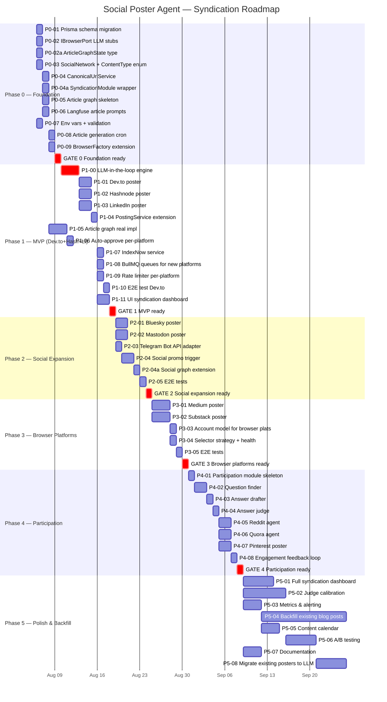

# Phase Roadmap — Syndication Feature

> **Gantt diagram:** Phase 0-5 timeline with gates and dependencies.
> **To-be:** The full syndication feature rollout plan.



## Key details

### Critical path
```
#4 (IBrowserPort stubs) → #47 (LLM engine) → ALL new platform posters
```
The LLM-in-the-loop browser engine (#47 / P1-00) is the single biggest blocker — every new platform poster depends on it. Phase 0 stubs the interface; Phase 1 implements the real engine.

### Gates (checkpoints)
- **GATE 0** — Foundation ready: Prisma migration applied, IBrowserPort extended, article graph compiles, env vars validated, `SYNDICATION_ENABLED=false` → no errors
- **GATE 1** — MVP ready: Article → judge → auto-approve → publish to Dev.to with canonical URL (verified live), IndexNow submission verified, no bans in 48h
- **GATE 2** — Social expansion ready: Bluesky, Mastodon, Telegram publishing, social promo trigger fires on article publish
- **GATE 3** — Browser platforms ready: Medium + Substack articles published with canonical URL, session persistence works
- **GATE 4** — Participation ready: Reddit/Quora answers posted, judge `promotional_tone` working, engagement tracking works

### Phase durations (estimated)
| Phase | Duration | Platforms added |
|-------|----------|-----------------|
| Phase 0 | 3-5 days | None (foundation) |
| Phase 1 | 1-2 weeks | Dev.to, Hashnode, LinkedIn |
| Phase 2 | 3-5 days | Bluesky, Mastodon, Telegram |
| Phase 3 | 1-2 weeks | Medium, Substack |
| Phase 4 | 1-2 weeks | Reddit, Quora, Pinterest |
| Phase 5 | Ongoing | (polish, backfill, migration) |

### Dependencies
- **#47 (LLM engine)** blocks ALL new platform posters (#11-13, #22-23, #26-27, #34-36)
- **#48 (migrate existing posters)** blocked by #47 + GATE 1
- **#50 (POST_VERIFIED event)** blocks IndexNow (#17) and social promo (#25)
- **#53 (ArticleGraphState)** blocks article graph skeleton (#7)
- **#6 (CanonicalUrlService)** blocks SyndicationModule (#51)
