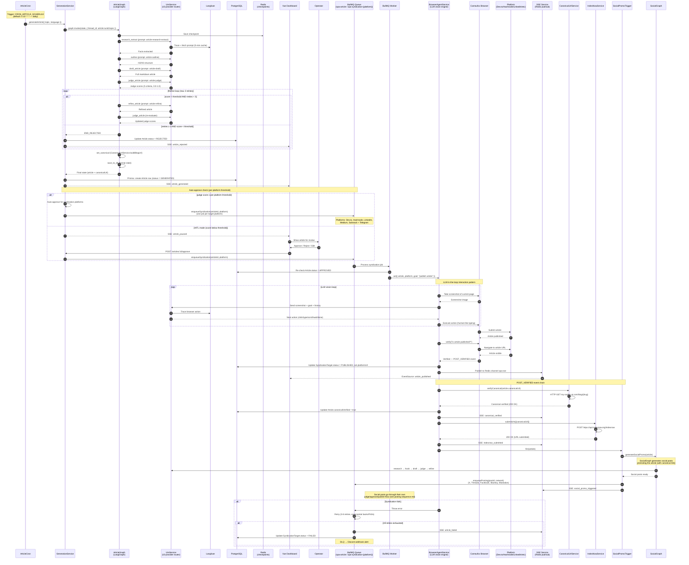

# Syndication Sequence — Future State

> **End-to-end flow:** From article cron trigger to published article + social promo posts across 14 platforms.
> **To-be:** Article cron → generation → judge/refine → auto-approve → BullMQ → BrowserAgentService (LLM vision) → Camoufox → publish → verify → canonical → IndexNow → social promo trigger → social posts → their own judge/approve/publish flow.

## Key details

### Article generation
- **ArticleCron** (`modules/generation/article-cron.service.ts`) — triggers on `CRON_ARTICLE_SCHEDULE` (default daily)
- **GenerationService.generateArticle()** wraps `articleGraph.invoke()` with Langfuse callbacks via ALS
- Article graph: research → outline → draft → judge (5 criteria) → refine loop (max 3) → set_canonical → save_to_db
- Crash-resume via `RedisCheckpointSaver` (key: `article:runId:topic`)

### LLM-in-the-loop interaction pattern
- **BrowserAgentService.act()** is the core loop: screenshot → LLM vision → action → execute → repeat
- The LLM receives: current screenshot, goal ("publish this article on Dev.to"), action history
- The LLM returns: structured action (click selector, type text, scroll, wait, done)
- No hardcoded selectors — the LLM sees the page and adapts. This is why new platforms don't need selector maintenance.
- Human-like typing: `humanType()`, `humanClick()`, `randomDelay()` still applied to LLM-decided actions
- Langfuse traces every browser action (screenshot + LLM response) for debugging

### Auto-approve (per-platform thresholds)
- Each syndication platform has its own judge score threshold (`ARTICLE_JUDGE_MIN_SCORE_{PLATFORM}`)
- If article judge score ≥ threshold for a platform → auto-enqueue to that platform's BullMQ queue
- If below threshold → HITL: operator reviews in Vue dashboard, approves per-platform
- This allows partial syndication: article might auto-approve for Dev.to but need manual approval for LinkedIn

### POST_VERIFIED event chain
- After BrowserAgentService verifies the article is published → emits `POST_VERIFIED` event
- Chain: `POST_VERIFIED` → `CanonicalUrlService.verifyCanonical()` → `IndexNowService.submitUrls()` → `SocialPromoTrigger.fire()`
- Each step is idempotent — re-running won't double-submit or double-trigger

### Canonical URL verification
- `CanonicalUrlService.verifyCanonical(url)` — HTTP GET to `my-zodiac-ai.com/blog/{slug}`
- Confirms the canonical home of the article is live before notifying search engines
- Syndicated articles (Dev.to, Hashnode, etc.) include `<link rel="canonical" href="my-zodiac-ai.com/blog/{slug}">`

### IndexNow submission
- `IndexNowService.submitUrls([canonicalUrl])` — POST to `https://api.indexnow.org/indexnow`
- Notifies Bing + other participating search engines that the URL is new/updated
- Accelerates indexing — no waiting for organic crawl
- Batched: if multiple articles published in same window, URLs batched into one request

### Social promo trigger (article → social posts)
- `SocialPromoTrigger.fire(article)` → `SocialGraph.generateSocialPromo(article)`
- SocialGraph generates social posts (X, Threads, Facebook, Bluesky, Mastodon) promoting the article
- Each social post includes the canonical URL as a link
- Social posts go through their own judge/approve/publish flow (same as existing GenerationGraph)
- This creates the POSSE chain: article (canonical) → syndicated copies → social promo posts linking back

### SSE events
- `article_generated` — article graph completed, Article row created
- `article_published` — article published on a syndication platform
- `canonical_verified` — canonical URL confirmed live
- `indexnow_submitted` — URL submitted to IndexNow
- `social_promo_triggered` — social promo posts enqueued
- `article_rejected` — article failed quality gate (max retries, score below threshold)
- `article_failed` — syndication failed after all retries

### Error handling
- BullMQ retry: 3 retries (syndication: 8), exponential backoff (60s base)
- DLQ → Discord webhook alert
- Per-platform error isolation: Dev.to failure doesn't block Hashnode publish
- BrowserAgentService LLM failures: fallback to retry, then DLQ
