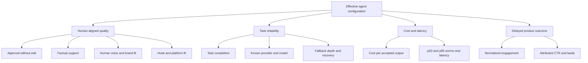

# Product goals and success metrics

> **Document maturity:** `DESIGN READY`; canonical feature status is `EVAL-001`.
> **Decision:** balanced quality/reliability optimization with explicit cost and
> latency constraints.

## Problem statement

SPA can report that code paths execute, but cannot currently prove that one prompt,
model or provider configuration produces a better agent. A free-first fallback chain
also makes a nominal model label insufficient: one run can contain failed attempts,
fallbacks, cached responses and several actual models.

The evaluation product must let an operator answer:

- Is the generated content publishable without correction?
- Did the orchestrator select the right safe action?
- Did the complete task finish reliably?
- Which actual provider/model handled each role and attempt?
- What did an accepted output cost, and how long did it take?
- Is a new configuration better than the current production baseline?
- Is the judge aligned with humans strongly enough to be trusted?

## Users and jobs-to-be-done

| User | Job |
|---|---|
| Operator/editor | Review drafts quickly, explain approval/rejection, detect quality drift. |
| Product owner | Choose a model/prompt/harness configuration using comparable evidence. |
| Engineer | Reproduce a failure from trace → case → config → code SHA. |
| AI agent | Navigate requirements, dependencies, tests and evidence without inventing completion. |
| On-call operator | Distinguish provider churn, graph failure, browser failure and content failure. |

## Scope

### V1

- X and Threads short-form generation in `en`, `ru`, `uk`, `es`, `it`.
- Generation graph as an end-to-end content task.
- Orchestrator decision path with deterministic world-state fixtures.
- LLM provider/model attempts, fallback behavior, tokens, cost and latency.
- Human review outcomes and judge calibration.
- Offline Langfuse dataset experiments and sampled online evaluation.
- Separate browser reliability/replay specification.

### Non-goals

- Automatic production model switching in V1.
- Fine-tuning before a prompt/harness baseline exists.
- Replacing LangGraph with Deep Agents.
- Treating engagement metrics as immediate proof of text quality.
- Running browser posting inside ordinary content benchmark jobs.
- Benchmarking every provider in the router simultaneously.

## KPI tree

## Metric definitions

| Metric | Definition | Decision use |
|---|---|---|
| `approval-without-edit-rate` | approved drafts with unchanged normalized content / reviewed drafts | Primary human-aligned quality signal. |
| `approval-rate` | approved / reviewed | Useful, but must be segmented by reviewer/network/language. |
| `operator-edit-rate` | approved with material edit / reviewed | Diagnoses near-miss quality. |
| `operator-reject-rate` | rejected / reviewed | Failure signal; reason codes identify cause. |
| `normalized-edit-distance` | Levenshtein distance / max original/final length | Measures correction magnitude, not only binary approval. |
| `task-completion-rate` | successful final task outputs / started cases | Primary reliability gate. |
| `valid-output-rate` | outputs passing schema and platform validation / completed outputs | Structured-output reliability. |
| `fallback-depth` | zero-based index of the successful provider attempt | Router degradation signal. |
| `attempt-error-rate` | failed provider attempts / all attempts | Provider health, never end-to-end success. |
| `cost-per-accepted-output` | all candidate call costs / human-accepted outputs | Primary economic metric. |
| `latency-to-draft` | task start → reviewable draft | Product responsiveness. |
| `judge-human-kappa` | Cohen's kappa between normalized judge and human labels | Judge trust gate. |
| `telemetry-coverage` | records with mandatory attribution/usage / eligible records | Evidence completeness gate. |

## Leading versus lagging signals

Leading signals can gate a release:

- deterministic safety and schema checks;
- task completion;
- human rubric scores;
- calibrated judge results;
- cost/latency and telemetry coverage.

Lagging signals inform later optimization but do not independently promote a model:

- impressions;
- likes/comments/shares;
- platform-normalized engagement rate;
- CTR, leads and revenue.

These outcomes are confounded by account size, topic, posting time, network ranking,
creative, link presence and exploration policy. They require stratification and an
observation window before comparison.

## Success criteria for the initiative

The evaluation initiative is ready for production use when:

1. the 120-case V1 dataset is versioned and reproducible;
2. every run has immutable candidate, dataset and source-code identity;
3. mandatory deterministic gates execute on every item;
4. provider/model/usage attribution coverage is at least 95%;
5. human feedback is durable and synchronizes to Langfuse without blocking review;
6. the judge has held-out `kappa >= 0.60` before it can gate promotion;
7. PR smoke and trusted full experiment lanes produce auditable reports;
8. the current production configuration is frozen as a comparison baseline;
9. a promotion record can explain why a candidate was promoted, held or rejected.
