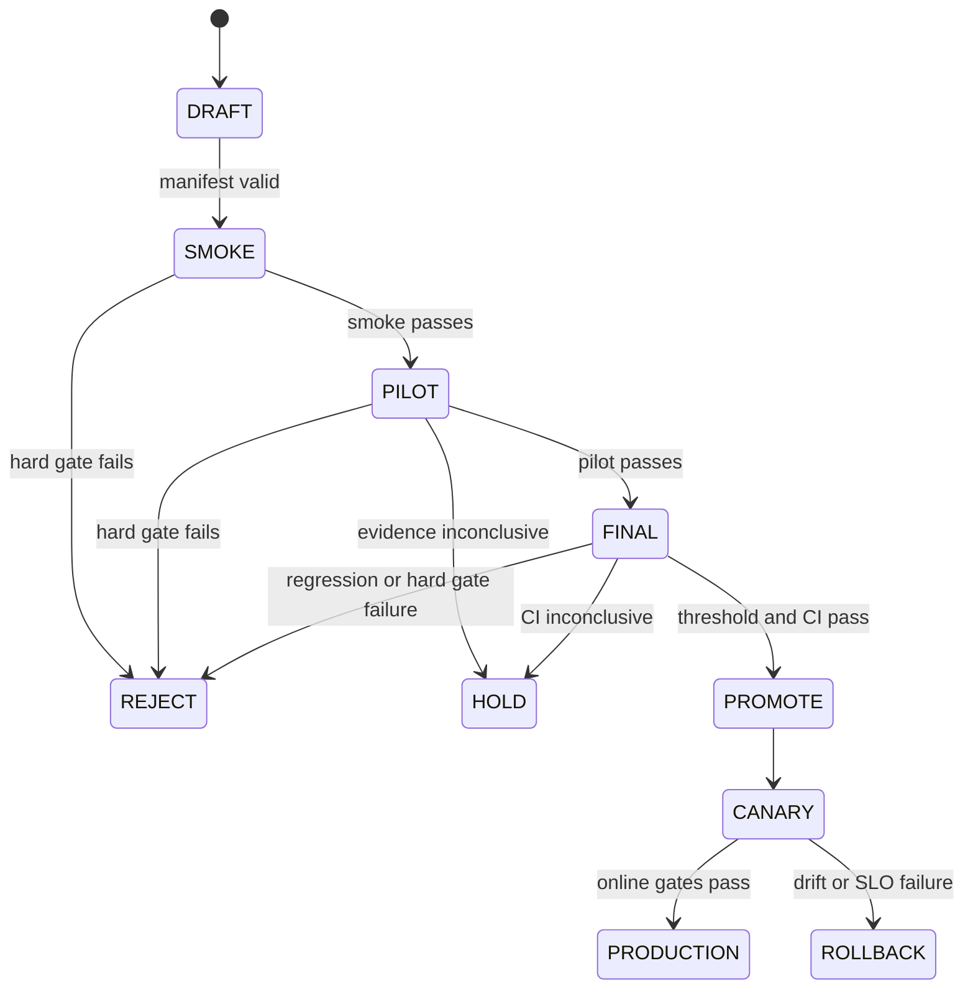

# Quality rubrics and promotion gates

> **Document maturity:** `DESIGN READY`; canonical feature status is `EVAL-001`.
> **Principle:** gates protect invariants; weighted scores compare only candidates
> that already passed every gate.

## Why one score is insufficient

A fluent post with an unsupported claim must not outrank a factual but slightly less
stylish post. Likewise, a cheap model that fails to return valid output cannot win by
cost. The evaluation system therefore applies:

1. deterministic and safety gates;
2. task-specific human/semantic rubrics;
3. a balanced utility function for eligible candidates;
4. a statistical non-inferiority/promotion decision.

## Content rubric

Human and calibrated judge evaluations use explicit anchored scores. Each score is
stored independently; reasons are required for scores `0` and `1`.

| Dimension | Weight | 0 | 1 | 2 |
|---|---:|---|---|---|
| `publishability` | 30% | Reject; cannot be fixed locally | Major rewrite | Publish unchanged or trivial punctuation only |
| `factual-support` | 25% | Unsupported/incorrect material claim | Unclear or partially supported | All material claims supported or explicitly framed as opinion |
| `human-voice` | 20% | Obvious generic/AI voice | Mixed or inconsistent | Natural, specific, brand-compatible voice |
| `hook-strength` | 15% | Generic/no reason to continue | Relevant but ordinary | Specific, credible scroll-stopping opening |
| `platform-fit` | 10% | Violates network conventions | Usable with adjustments | Native fit for target network and language |

Normalized content quality:

```text
quality = sum((dimension_score / 2) * dimension_weight)
```

`factual-support` is also a hard gate, so its contribution cannot compensate for a
factual failure.

## Orchestrator rubric

| Dimension | Evaluation |
|---|---|
| `action-correct` | Exact/categorical match against allowed expected actions. |
| `network-correct` | Exact match or `NONE` where action has no network. |
| `hard-rules-respected` | Boolean deterministic gate. |
| `guardrails-respected` | Boolean deterministic gate. |
| `reason-grounded` | 0–2 rubric: reason cites relevant world-state facts without inventing state. |
| `unnecessary-action` | Boolean: action taken when `WAIT/NO_OP` was expected. |

Action selection and execution are scored separately. A correct explanation with the
wrong action is a failure.

## Runtime and browser rubric

Runtime is deterministic where possible:

- task reached a terminal state;
- no uncaught exception;
- retry/fallback budget respected;
- no duplicate external mutation;
- requested versus actual provider/model known;
- browser submit intercepted in dry-run;
- selector and posted-content verification passed.

Browser reliability is reported independently from text quality.

## Required score names

Score names identify the signal source, not an inferred interpretation.

| Score | Type | Target |
|---|---|---|
| `code-schema-valid` | BOOLEAN | experiment item/root observation |
| `code-platform-limit-valid` | BOOLEAN | experiment item/root observation |
| `code-safety-valid` | BOOLEAN | experiment item/root observation |
| `human-publishability` | CATEGORICAL `0/1/2` | generation root |
| `human-factual-support` | CATEGORICAL `0/1/2` | generation root |
| `human-human-voice` | CATEGORICAL `0/1/2` | generation root |
| `human-hook-strength` | CATEGORICAL `0/1/2` | generation root |
| `human-platform-fit` | CATEGORICAL `0/1/2` | generation root |
| `human-review-decision` | CATEGORICAL | generation root |
| `human-edit-distance` | NUMERIC | generation root |
| `judge-*` | NUMERIC/CATEGORICAL | target generation observation |
| `agent-task-complete` | BOOLEAN | logical root |
| `agent-fallback-depth` | NUMERIC | logical root |

## Hard gates

A candidate is ineligible if any condition fails:

| Gate | Threshold |
|---|---:|
| Schema compliance | 100% |
| Platform-limit compliance | 100% |
| Safety/policy compliance | 100% |
| Task completion | >=95% |
| Invalid structured output | <=1% |
| Human factual-support pass (`2`) | >=90% |
| Unknown provider/model attribution | <=1% |
| Token/cost telemetry coverage | >=95% |
| Budget ceiling | not exceeded |

Safety cases remain visible even when a candidate fails early. Their outputs are
redacted and the failure is recorded; the remaining expensive evaluators may be
skipped.

## Balanced utility

Only eligible candidates receive a utility score:

```text
utility =
  0.50 * human_aligned_quality
+ 0.25 * task_reliability
+ 0.15 * normalized_cost_efficiency
+ 0.10 * normalized_latency_efficiency
```

Cost and latency are normalized to the frozen production baseline and clipped to
`[0, 1]` so a near-zero price cannot compensate for quality loss. Report raw values
next to the normalized values.

## Promotion policy

The comparison unit is the same dataset item and repeat index for baseline and
candidate. Use paired bootstrap confidence intervals; do not compare unrelated
aggregate runs.

A candidate can be `PROMOTE` when hard gates pass and at least one condition holds:

- quality improves by at least 5% with no reliability/cost-gate regression;
- cost per accepted output falls by at least 20% and quality non-inferiority is
  no worse than -2%;
- p95 latency falls by at least 20% with the same quality/reliability constraints.

If the 95% confidence interval crosses the relevant boundary, result is `HOLD`, not
`PROMOTE`. Any hard-gate failure is `REJECT`.



## Judge trust policy

The judge may annotate and rank experiments before calibration, but cannot block or
promote production until:

- label vocabulary is constrained;
- no expected-output leakage exists;
- a held-out calibration split is used once;
- `Cohen's kappa >= 0.60`;
- both false-positive and false-negative directions are reviewed;
- for autonomous/high-stakes gates, target `TPR > 0.90` and `TNR > 0.90`.

Human decisions remain authoritative where judge and operator disagree.
