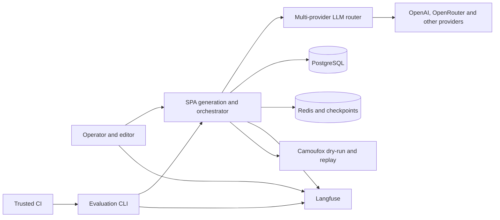
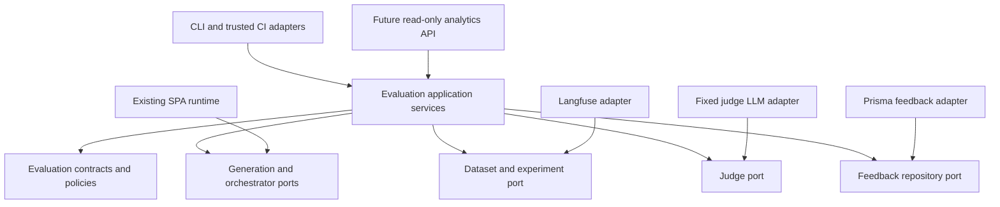
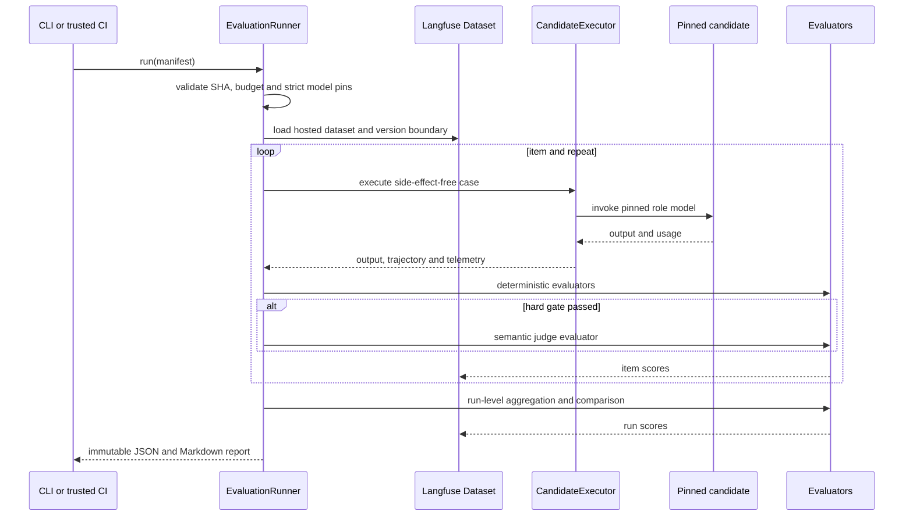
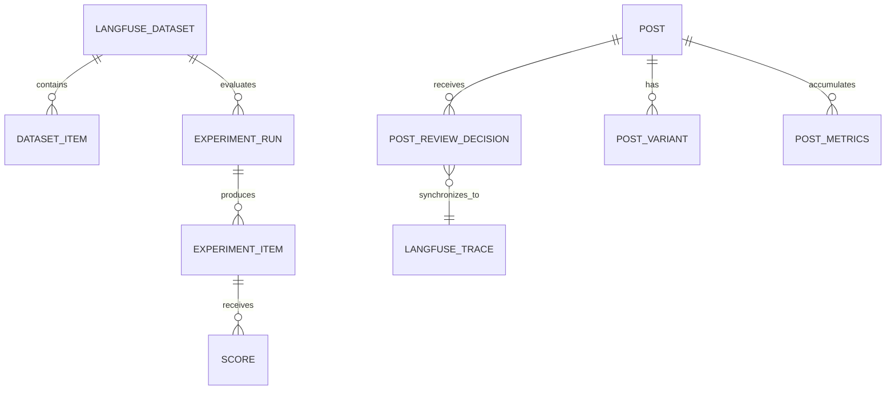

# Evaluation system design

> **Document maturity:** `DESIGN READY`; canonical feature status is `EVAL-001`.
> **Architecture style:** existing NestJS hexagonal boundaries plus a CLI/CI-first
> experiment harness. No Deep Agents migration.

## Context



## Boundary decisions

- Production behavior remains in existing Generation, Orchestrator, LLM, Posts,
  Analytics and Browser modules.
- Evaluation orchestration is a separate application service; graph nodes must not
  depend on Langfuse dataset types.
- Domain evaluators depend on small internal contracts, not `LangfuseClient`.
- The Langfuse adapter owns datasets, experiments and score ingestion.
- PostgreSQL owns durable human-review truth and sync state.
- Browser replay owns selector/action reliability; it does not score prose quality.
- V1 is CLI/CI-first. A production mutation endpoint for running experiments is out
  of scope.

## Proposed components

| Component | Responsibility |
|---|---|
| `EvaluationRunner` | Validate manifest, load cases, execute bounded repeats, aggregate results. |
| `CandidateExecutor` | Run generation/orchestrator in side-effect-free eval mode. |
| `DeterministicEvaluatorSet` | Schema, platform, safety, exact action and telemetry checks. |
| `SemanticJudgeAdapter` | Fixed judge model, structured rubric output and error isolation. |
| `StatisticalComparator` | Paired metrics, confidence intervals, non-inferiority and promotion result. |
| `LangfuseEvaluationAdapter` | Hosted datasets, experiment runs, item/run scores and flush. |
| `ReviewFeedbackService` | Persist human decisions/reasons and compute edit distance. |
| `FeedbackSyncWorker` | Idempotently sync unsent feedback as Langfuse scores. |
| `EvaluationReportWriter` | JSON/Markdown terminal artifact bound to manifest and SHA. |

## Dependency direction



Infrastructure implements inward-facing ports. Domain policy must not import NestJS,
Prisma, Langfuse or provider SDK types.

## Proposed contracts

The following are documentation-level contracts, not current exports:

```ts
type EvaluationTask = "generation" | "orchestrator" | "runtime" | "browser";
type EvaluationSplit = "train" | "dev" | "test";

interface EvaluationCase {
  id: string;
  schemaVersion: "1";
  task: EvaluationTask;
  split: EvaluationSplit;
  input: unknown;
  expectedOutput?: unknown;
  metadata: {
    datasetVersion: string;
    network?: string;
    language?: string;
    archetype: string;
    riskTags: string[];
  };
}

interface CandidateManifest {
  schemaVersion: "1";
  candidateId: string;
  sourceSha: string;
  datasetName: string;
  datasetVersion: string;
  promptLabels: Record<string, string>;
  roles: Record<string, {
    provider: string;
    model: string;
    snapshot?: string;
    reasoningEffort?: string;
    temperature?: number;
  }>;
  fallbackPolicy: "strict" | "recorded";
  repeats: number;
  maxConcurrency: number;
  costBudgetUsd: number;
}

interface EvaluatorResult {
  name: string;
  type: "BOOLEAN" | "NUMERIC" | "CATEGORICAL";
  value: boolean | number | string;
  passed?: boolean;
  reason?: string;
  evaluatorVersion: string;
}

interface PromotionDecision {
  status: "PROMOTE" | "HOLD" | "REJECT";
  baselineRunId: string;
  candidateRunId: string;
  hardGateFailures: string[];
  confidenceIntervals: Record<string, { low: number; high: number }>;
  rationale: string;
}
```

## Offline experiment sequence



## Side-effect isolation

`eval` mode must enforce these rules in code, not only in prompts:

- no queue enqueue;
- no browser submit;
- no production Post/Session/Interaction mutation;
- no live engagement action;
- no auto-approve event listener;
- checkpoints and caches use an experiment namespace;
- all external providers remain bounded by manifest concurrency and cost;
- browser cases use dry-run interception or recorded replay.

Attempting a prohibited mutation fails the case with `eval-side-effect-blocked`.

## Provider and fallback semantics

Production uses free-first fallback, while a fair benchmark requires identity stability.

- `strict`: only the pinned provider/model/snapshot is allowed; unavailable or failed
  calls fail the item.
- `recorded`: fallback is allowed only for a production-control run; every attempt and
  actual model is recorded.
- Never label a mixed fallback run as a single-model benchmark.
- Cache keys and reports include candidate digest; cross-candidate cache reuse is
  forbidden.

## Failure handling

| Failure | Behavior |
|---|---|
| Invalid manifest | Fail before any paid call. |
| Dataset/version mismatch | Fail closed; do not silently use latest. |
| One item fails | Record failure and continue within error budget. |
| Cost budget reached | Stop scheduling new items; flush completed evidence; result `HOLD/BLOCKED`. |
| Judge unavailable | Preserve deterministic results; semantic score missing; no promotion. |
| Langfuse ingestion unavailable | Keep local artifact, flush/retry, mark external evidence `BLOCKED`. |
| Human ground truth missing | Do not calculate a final human-aligned promotion decision. |

## Data ownership



Langfuse is the experiment/evaluation system of record. PostgreSQL remains the
product-state and human-review system of record. Cross-system correlation uses stable
IDs; one system never becomes a hidden substitute for the other.
