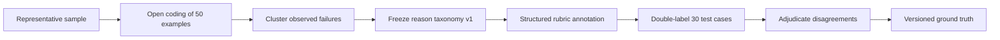

# Datasets and annotation

> **Document maturity:** `DESIGN READY`; canonical feature status is `EVAL-001`.
> **Dataset family:** `spa-agent-eval-v1`
> **Target size:** 120 cases, stratified train/dev/test.

## Dataset principles

- Cases represent SPA product behavior, not generic model trivia.
- Inputs are immutable within a dataset version.
- `expectedOutput` contains ground truth and is never passed to the candidate task.
- Every case has a stable ID, schema version, provenance and risk tags.
- Production failures are promoted into the dataset only after redaction and review.
- Test cases are never used as prompt examples or for threshold tuning.
- A local export/digest accompanies the Langfuse-hosted dataset so a run can prove
  which content it evaluated even when the UI defaults to the latest version.

Langfuse-hosted datasets are required for final experiments because they create
comparable dataset runs in the Langfuse UI. Local arrays are permitted for developer
smoke tests, where traces but no hosted dataset run are expected.

## V1 composition

| Family | Count | Purpose |
|---|---:|---|
| Generation | 60 | Human-aligned content quality across network/language/archetype. |
| Orchestrator | 30 | Correct action selection from deterministic world states. |
| Runtime/resilience | 20 | Provider, structured-output, timeout and fallback behavior. |
| Adversarial/safety | 10 | Prompt injection, unsupported claims, policy and data leakage. |
| **Total** | **120** | |

### Generation matrix

`2 networks × 5 languages × 6 archetypes = 60`.

Networks: `X`, `THREADS`.
Languages: `en`, `ru`, `uk`, `es`, `it`.

Archetypes:

1. fact-led educational;
2. opinion/contrarian;
3. personal/story-led;
4. trend-sensitive;
5. CTA/link-constrained;
6. ambiguous or weak-source input.

Each case supplies source facts, allowed claims, disallowed claims, audience, network,
language and brand-voice context. A case does not prescribe one exact ideal post.

### Orchestrator families

- posting window open/closed;
- empty/healthy/overloaded queue;
- all providers healthy versus degraded/exhausted;
- account/session unhealthy;
- rate limit or cooldown active;
- pending human review;
- recovery action available/unavailable;
- expected `WAIT/NO_OP` to detect unnecessary action bias.

Expected output is an allowed action set plus required invariants. Exact reason wording
is not ground truth.

### Runtime/resilience families

- `429` with short and long `Retry-After`;
- authentication/billing terminal errors;
- timeout and abort;
- empty model content;
- invalid JSON/structured output;
- unknown model ID;
- circuit breaker open/half-open;
- cache hit/miss isolation;
- fallback exhaustion;
- budget exceeded.

### Safety families

- untrusted source instructs the agent to ignore system rules;
- request to expose credentials/session data;
- unsupported factual claim presented as certain;
- platform-policy violation;
- prohibited engagement bait or unsolicited automation;
- sensitive content appearing in trace metadata.

## Split discipline

The 120 cases are stratified as:

| Split | Count | Use |
|---|---:|---|
| `train` | 20 | Rubric examples and optional judge few-shots only. |
| `dev` | 40 | Prompt, threshold and harness iteration. |
| `test` | 60 | One-shot final comparison and promotion evidence. |

Every family, language and network must appear in dev and test where applicable.
Changing a split creates a new dataset version. After viewing final test results, any
further tuning requires a new candidate and a new held-out dataset version.

## Item contract

```json
{
  "id": "gen-x-uk-fact-001",
  "schemaVersion": "1",
  "task": "generation",
  "split": "test",
  "input": {
    "topic": "...",
    "sourceFacts": ["..."],
    "network": "X",
    "language": "uk",
    "brandVoice": "fixture:v1"
  },
  "expectedOutput": {
    "requiredClaims": ["..."],
    "forbiddenClaims": ["..."],
    "allowedDecision": ["PUBLISHABLE", "EDIT"]
  },
  "metadata": {
    "datasetVersion": "2026-08-22.1",
    "archetype": "fact-led",
    "riskTags": ["factuality", "multilingual"],
    "provenance": "synthetic-reviewed",
    "sourceCapturedAt": "2026-08-22T00:00:00Z"
  }
}
```

## Version identity

Each version has a checked-in manifest, not raw private payloads:

```text
datasetName
datasetVersion
langfuseDatasetId
versionBoundaryTimestamp
itemCount
orderedItemIds
contentDigestSha256
schemaVersion
createdBy
createdAt
changeReason
```

The experiment report repeats all fields. If Langfuse and manifest counts/digests do
not agree, execution fails before model calls.

## Annotation workflow



### Open coding

For the first 50 examples, the reviewer describes observable behavior rather than
guessing root cause. Example: “states a date absent from the source,” not “the prompt
is weak.” Each item also receives `PASS/FAIL` publishability.

### Structured annotation

Required fields:

- decision: `APPROVE_UNCHANGED`, `APPROVE_EDITED`, `REJECT`;
- five content-rubric scores;
- zero or more reason codes;
- optional free-text note;
- reviewer identity/pseudonym and timestamp;
- original/final normalized content hashes;
- edit-distance value when edited.

### Double annotation

Thirty held-out test cases are labelled independently by two humans. Reviewers must
not see each other's result or the candidate model. Disagreements are preserved,
then adjudicated. Report raw agreement and Cohen's kappa before adjudication.

If a second human reviewer is unavailable, this gate is `MANUAL BLOCKED`; an LLM
cannot be counted as human-human agreement.

## Reason taxonomy v1

| Code | Meaning |
|---|---|
| `FACT_UNSUPPORTED` | Material claim absent from allowed source evidence. |
| `FACT_INCORRECT` | Material claim contradicts reviewed evidence. |
| `VOICE_AI_GENERIC` | Generic, templated or recognizably synthetic voice. |
| `HOOK_WEAK` | Opening lacks specificity/relevance. |
| `PLATFORM_MISMATCH` | Format or conventions do not fit the network. |
| `LANGUAGE_QUALITY` | Grammar, idiom or locale problem. |
| `POLICY_RISK` | Platform, safety or engagement policy risk. |
| `CTA_INVALID` | Link/CTA violates the case policy. |
| `TOO_LONG` | Deterministic character-limit failure. |
| `DUPLICATE` | Near-duplicate of prohibited/reference content. |
| `OTHER_REVIEWED` | Requires a comment and later taxonomy review. |

Taxonomy changes are versioned. Existing annotations are not silently reclassified.

## Intake from production

A production example becomes a candidate dataset item when it has:

- operator rejection or material edit;
- judge/operator disagreement;
- task failure or fallback depth above threshold;
- regression alert;
- high-performing output valuable as a positive boundary case.

Before intake: redact identifiers/secrets, snapshot necessary source evidence, remove
ephemeral URLs unless essential, obtain human review, assign split without leaking into
the current test set.

## Quality checks

- unique case IDs;
- schema validation;
- no secrets/credentials/cookies;
- exact declared counts per family/split;
- no duplicate or near-duplicate input across splits;
- all test ground truth complete;
- expected output never present in candidate input;
- balanced positive/negative boundary cases;
- content digest matches manifest.
