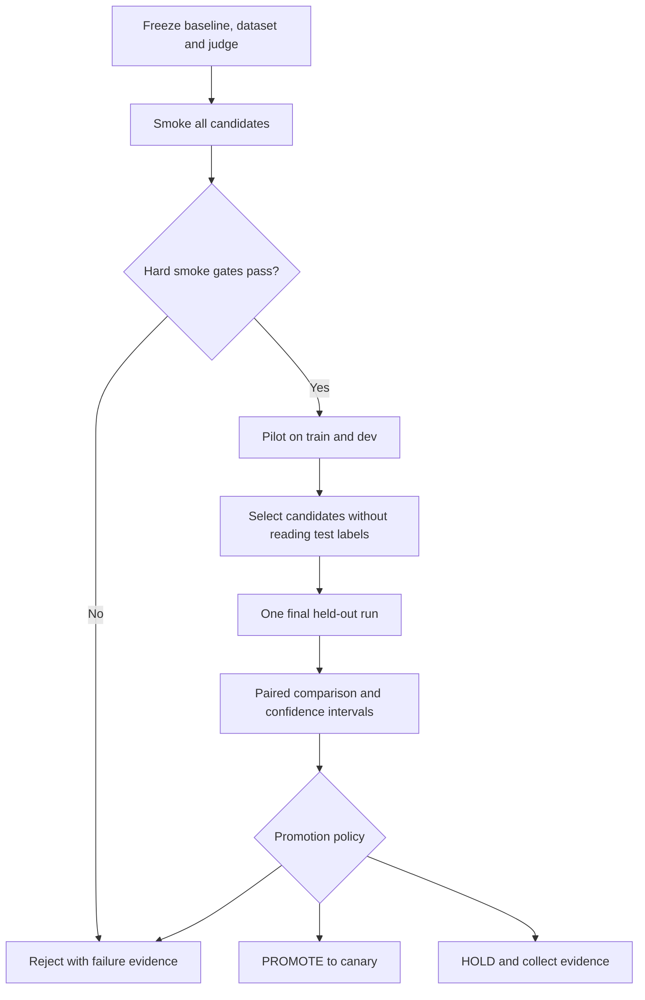

# Model benchmarking

> **Document maturity:** `DESIGN READY`; canonical feature status is `EVAL-001`.
> **Goal:** compare immutable agent configurations, not marketing model names or
> dynamic routers.

## Unit of comparison

A candidate is the complete `CandidateManifest`:

- Git SHA;
- prompt labels/versions;
- role → provider/model/snapshot mapping;
- reasoning effort and supported sampling parameters;
- strict/recorded fallback policy;
- dataset version and digest;
- cache namespace;
- repeat count, concurrency and cost budget.

Changing any field creates a different candidate ID and digest.

## Initial matrix

| Candidate | Purpose | Fallback |
|---|---|---|
| `production-control` | Current role chains and provider router; measures real fallback behavior. | `recorded` |
| `openai-5.4-mini` | Quality-oriented pinned baseline using `gpt-5.4-mini-2026-03-17`. | `strict` |
| `openai-5.4-nano` | Cost/latency pinned baseline using `gpt-5.4-nano-2026-03-17`. | `strict` |
| `openai-hybrid` | mini for hook/draft/refine; nano for facts/critique/internal judge/utility. | `strict` |
| `openrouter-free-a` | First exact free model ID selected and locked by preflight. | `strict` |
| `openrouter-free-b` | Second exact free model ID selected and locked by preflight. | `strict` |

The external semantic evaluator uses one separately pinned judge configuration for all
candidates. The candidate's internal post-quality judge remains part of the candidate
pipeline and must not be confused with the experiment evaluator.

OpenAI prices and availability are re-verified before each matrix; at the baseline date
the official pages list GPT-5.4 mini at $0.75/M input and $4.50/M output tokens, and
GPT-5.4 nano at $0.20/M input and $1.25/M output tokens.

## OpenRouter preflight

Free availability is mutable and rate-limited. Never benchmark `openrouter/free` or a
floating alias as if it were one model.

Before a matrix:

1. fetch the current OpenRouter model catalog;
2. filter exact `:free` IDs by required context/output/structured-output capabilities;
3. exclude models with failed smoke, ambiguous identity or insufficient quota;
4. select the two highest-ranked eligible IDs by the documented selection rule;
5. write exact IDs, provider routing constraints and catalog timestamp into the
   manifest;
6. do not replace them mid-run; unavailability fails the affected run.

Selection ranking: successful structured-output smoke, then completion reliability,
then latency. Popularity is not a quality criterion.

## Execution stages and budgets

| Stage | Cases | Repeats | Candidate budget | Purpose |
|---|---:|---:|---:|---|
| Smoke | 20 | 1 | $2 | Validate manifest, identity, schema and connectivity. |
| Pilot | 60 | 2 | $10 | Detect large regressions on train/dev cases. |
| Final | 120 | 3 | $25 | Full reproducibility run; promotion metrics use held-out test split. |

Default maximum matrix budget is $125 per approved final comparison window. The
runner stops scheduling new calls before a candidate exceeds its budget. Increasing a
budget is a recorded operator decision, never an automatic fallback.

Concurrency defaults to `1` for free providers and `3` for paid providers, further
bounded by provider limits and the existing global LLM concurrency cap.

## Reproducibility controls

- use exact model snapshots when providers expose them;
- omit unsupported temperature for reasoning models;
- record reasoning effort explicitly;
- namespace/disable response cache per candidate; never reuse outputs across models;
- keep source inputs and expected output unchanged across paired candidates;
- use deterministic evaluator versions and a recorded bootstrap seed;
- record actual tokens/cost from provider metadata, with estimates clearly marked;
- flush Langfuse OTel before process exit;
- store terminal JSON and Markdown result artifacts.

## Statistical method

For each case/repeat pair, compute candidate minus baseline. Report:

- counts and missing-data denominators;
- mean/median and p50/p95 cost/latency;
- pass rates with Wilson confidence intervals;
- paired mean/median deltas;
- paired bootstrap 95% confidence interval using 10,000 resamples and a manifest seed;
- per-network, language, archetype and risk-tag slices;
- variance across repeats.

Never call a single-digit difference on fewer than 50 paired held-out cases a product
win. Report it as directional evidence only.

## Comparison sequence



## Required report

```text
experiment name/run URL
source SHA
dataset name/version/digest
candidate ID/digest
role/model/prompt mapping
case and repeat counts
missing/invalid counts
hard gate table
quality/reliability/cost/latency metrics
paired confidence intervals
slice regressions
budget actual versus ceiling
PROMOTE/HOLD/REJECT with rationale
manual/external blockers
```

## Interpretation rules

- A provider attempt error is not an end-to-end failure if the production-control
  fallback completes, but it still worsens reliability/cost/latency.
- Zero reported cost is not automatically free; first verify usage and pricing
  attribution.
- Engagement metrics are not used in the immediate offline promotion decision.
- A model cannot judge itself into promotion.
- Missing scores are missing evidence, not zero and not pass.
- A model alias without a snapshot is explicitly marked drift-prone.

## References

- [GPT-5.4 mini](https://developers.openai.com/api/docs/models/gpt-5.4-mini)
- [GPT-5.4 nano](https://developers.openai.com/api/docs/models/gpt-5.4-nano)
- [OpenRouter free variant](https://openrouter.ai/docs/guides/routing/model-variants/free)
- [OpenRouter FAQ](https://openrouter.ai/docs/faq)
