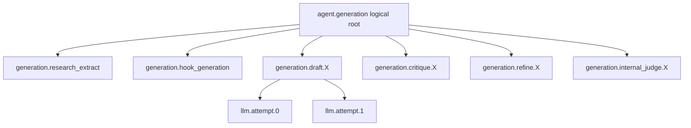

# Langfuse observability contract

> **Document maturity:** `DESIGN READY` with a `CURRENT` baseline; canonical feature status is `EVAL-001`.
> **Implementation baseline:** `@langfuse/* 5.10.1`; re-check the current registry
> and documentation before implementation.

## Current state and gaps

`CURRENT`:

- an isolated Langfuse OTel tracer provider coexists with Sentry;
- `CallbackHandler` traces LangChain/LangGraph calls;
- generation uses `sessionId=runId` and trace metadata;
- orchestrator decisions have a handler and tags;
- Prompt Management and fallback prompts are active;
- provider token/cost data is partially captured.

Read-only live audit on 2026-08-22:

| Signal | Result |
|---|---:|
| Datasets | 0 |
| Score configs | 0 |
| Scores | 1 (`output`, not a product metric) |
| Observation sample | 1,000 |
| Generation observations | 355 |
| Error-level generation attempts | 337 |
| Tagged/session-linked observations | 14 |
| Prompt-linked observations | 0 |
| Generation observations with unknown model | 109 |

This sample proves substantial provider-attempt churn and incomplete attribution. It
does not prove the end-to-end agent fails at the same rate.

## Trace model

Overall input/output belongs on the logical root observation. Child generations carry
their own message/output data. Scores target the smallest meaningful evaluated object.



Required root names:

- `agent.generation`;
- `agent.orchestrator-decision`;
- `agent.browser-run`;
- `eval.experiment-item` for experiment wrappers when needed.

Graph-node observations use stable names `generation.<node>.<network>` or
`orchestrator.<node>`. Provider calls use `llm.<role>.<attempt>`.

## Attribute propagation

Trace attributes used by observation-level evaluator filters must be propagated before
child observations are created. Use the current JS/TS `propagateAttributes()` API
inside the existing isolated tracer context; do not rely only on root metadata.

Required propagated fields:

| Field | Example |
|---|---|
| `feature` tag | `generation`, `orchestrator`, `browser`, `evaluation` |
| `environment` | `test`, `staging`, `production` |
| `execution_mode` | `runtime`, `eval`, `dry-run`, `replay` |
| `run_id` / `sessionId` | generation or experiment run ID |
| `source_sha` | full Git SHA |
| `dataset_name/version` | `spa-agent-eval-v1`, version boundary |
| `case_id`, `repeat_index` | stable paired comparison identity |
| `candidate_id`, `candidate_digest` | immutable manifest identity |
| `network`, `language`, `archetype` | product slice |

## LLM-attempt metadata

Every `model.invoke` attempt receives explicit LangChain run metadata from the router:

```text
llm_role
provider_requested
provider_actual
model_requested
model_actual
model_snapshot_or_alias
fallback_policy
attempt_index
cache_hit
rate_limit_retry
reasoning_effort
temperature_sent
max_output_tokens
prompt_name
prompt_version
prompt_label
prompt_is_fallback
```

On completion capture:

```text
outcome
normalized_error_category
input_tokens
output_tokens
reasoning_tokens
cached_input_tokens
total_tokens
cost_usd
cost_source = provider | price_table | unknown
latency_ms
time_to_first_token_ms when available
```

`ls_provider=openai` from the generic `ChatOpenAI` adapter is not sufficient provider
identity. SPA's router must supply the actual provider explicitly.

## Prompt-to-trace linking

The current `promptNames` metadata is useful for filtering but does not create native
prompt linkage. Future implementation must preserve the fetched Langfuse prompt object
until the exact generation that uses it and link it with the current supported JS/TS
mechanism (`langfusePrompt` metadata on a LangChain prompt runnable or explicit prompt
on a Langfuse generation observation). Do not attach one prompt object indiscriminately
to a multi-prompt graph.

Fallback prompts remain identifiable with `prompt_is_fallback=true` and a content
digest; they must not masquerade as a fetched Langfuse version.

## Input/output policy

Root input contains only the minimum reproducible summary:

- topic/source reference or eval case ID;
- network/language;
- selected non-sensitive source facts;
- candidate/config identity.

Root output contains:

- terminal status;
- generated post IDs or redacted eval output;
- final actual models and usage totals;
- hard-gate summary.

Never capture:

- API keys, cookies, session storage or credentials;
- proxy URLs with authentication;
- social login data;
- full environment/config objects;
- private source content not needed for evaluation;
- unredacted personal data from replies or profiles.

## Scores and targets

- Deterministic end-to-end scores attach to the logical root/experiment item.
- Semantic content scores attach to the network-specific final-output observation.
- Human feedback attaches to the root trace that generated the reviewed post.
- Provider health is metadata/metrics, not a quality score.
- Run aggregates attach to the dataset run.
- Use stable idempotency IDs for API-created scores.

Create score configs before annotation queues. Langfuse queues cannot be retrofitted
with additional configs; a taxonomy/config change creates a new queue/version.

## Dashboards

### Quality and promotion

- human rubric distributions;
- approval unchanged/edited/rejected;
- baseline versus candidate and confidence interval;
- per-network/language/archetype regressions.

### Provider reliability

- success by provider/model/role;
- attempt error category;
- fallback depth;
- unknown attribution;
- circuit-breaker/rate-limit events.

### Cost and latency

- tokens/cost per call, task and accepted output;
- p50/p95 by role/model;
- cache hit ratio;
- zero/unknown cost coverage.

### Judge calibration

- judge versus human confusion matrix;
- kappa, TPR/TNR;
- disagreement categories;
- evaluator prompt/model version.

### Data quality

- score coverage;
- prompt linkage coverage;
- model/usage coverage;
- dataset/manifest mismatch count.

## Sampling

- Offline experiments: 100% evaluation.
- Deterministic online checks: 100% where cheap.
- Semantic online judge: start at 5% per eligible final-output observation.
- Always include operator rejection, material edit, hard failure and unknown-model
  cases regardless of random sample.
- Adjust semantic sampling only through a recorded budget decision.

## Verification

Instrumentation is accepted only when a synthetic trace proves:

- one logical root with meaningful input/output;
- child graph/generation hierarchy;
- propagated tags/session/candidate fields;
- actual provider/model on every attempt;
- prompt version link on the intended generation;
- real or explicitly estimated usage/cost;
- redaction canary secrets absent;
- force-flush/shutdown delivers all observations.

## References

- [Langfuse SDK overview](https://langfuse.com/docs/observability/sdk/overview)
- [Langfuse prompt trace linking](https://langfuse.com/docs/prompt-management/features/link-to-traces)
- [Langfuse Experiments](https://langfuse.com/docs/evaluation/experiments/experiments-via-sdk)
- [Langfuse scores](https://langfuse.com/docs/evaluation/scores/overview)
- [Langfuse Scores via SDK](https://langfuse.com/docs/evaluation/evaluation-methods/scores-via-sdk)
