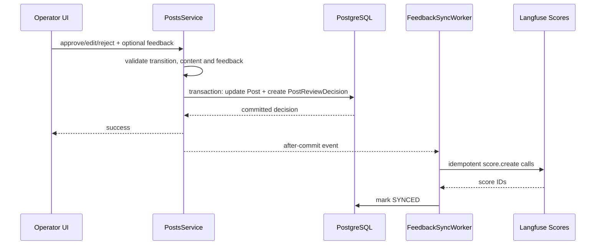

# Human feedback and judge calibration

> **Document maturity:** `DESIGN READY`; canonical feature status is `EVAL-001`.
> **Truth boundary:** PostgreSQL owns review decisions; Langfuse owns evaluation
> scores and experiment analytics.

## Current gap

SPA currently records final `Post.status`, optional edited content and judge scores.
It does not durably preserve:

- why an operator approved, edited or rejected;
- the original content once an edited approval overwrites it;
- rubric scores and reviewer identity;
- edit magnitude;
- the Langfuse trace that produced the reviewed post;
- synchronization state for human scores.

Consequently, current status is a noisy proxy for quality and the existing judge
calibration script cannot produce reliable ground truth.

## Review UX v1

Keep review fast. The operator always chooses one primary action:

- `APPROVE_UNCHANGED`;
- `APPROVE_EDITED`;
- `REJECT`.

Reason entry rules:

- unchanged approval: reason/rubric optional;
- edited approval: at least one reason code required when normalized edit distance
  is `>=0.05`;
- rejection: at least one reason code required;
- free-text note optional, maximum 500 characters;
- detailed five-dimension rubric is required only for sampled calibration items.

This produces useful labels without turning every ordinary review into a survey.

## Proposed persistence

Documentation-level Prisma shape:

```prisma
model PostReviewDecision {
  id                    String   @id @default(uuid())
  postId                String
  post                  Post     @relation(fields: [postId], references: [id], onDelete: Cascade)
  version               Int      @default(1)
  actorId               String?  // authenticated subject; avoid username as identity
  decision              String   // APPROVE_UNCHANGED | APPROVE_EDITED | REJECT
  reasonCodes           Json     // ReviewReasonCode[]
  rubric                Json?    // sampled ContentQualityRubric
  comment               String?
  originalContentHash   String
  finalContentHash      String?
  normalizedEditDistance Float?
  generationRunId       String?
  langfuseTraceId       String?
  langfuseObservationId String?
  syncStatus            String   @default("PENDING")
  syncAttempts          Int      @default(0)
  lastSyncError         String?
  langfuseSyncedAt      DateTime?
  createdAt             DateTime @default(now())

  @@unique([postId, version])
  @@index([decision, createdAt])
  @@index([syncStatus, createdAt])
  @@index([langfuseTraceId])
}
```

`Post` receives the inverse `reviewDecisions` relation. Migration is additive; no
historical status is fabricated into a decision row. Historical rows can be imported
only as `legacy-status-inferred` and excluded from calibrated ground truth.

## Shared contract

```ts
type ReviewReasonCode =
  | "FACT_UNSUPPORTED"
  | "FACT_INCORRECT"
  | "VOICE_AI_GENERIC"
  | "HOOK_WEAK"
  | "PLATFORM_MISMATCH"
  | "LANGUAGE_QUALITY"
  | "POLICY_RISK"
  | "CTA_INVALID"
  | "TOO_LONG"
  | "DUPLICATE"
  | "OTHER_REVIEWED";

interface PostReviewFeedback {
  reasonCodes?: ReviewReasonCode[];
  rubric?: {
    publishability: 0 | 1 | 2;
    factualSupport: 0 | 1 | 2;
    humanVoice: 0 | 1 | 2;
    hookStrength: 0 | 1 | 2;
    platformFit: 0 | 1 | 2;
  };
  comment?: string;
}
```

Extend the existing approve payload additively with `feedback`; change reject from an
empty body to optional `feedback`. Existing clients sending no body remain valid except
that the UI must provide a reason for new rejections after the enforcement flag is
enabled.

## Write and synchronization flow



Langfuse failure never rolls back a valid review. The worker retries with bounded
backoff. A reconciliation job scans `PENDING/FAILED` rows. Idempotency key format:

```text
spa-review:{decisionId}:{scoreName}
```

Keep score name and timestamp stable on retry to prevent duplicates.

## Human score mapping

| Product field | Langfuse score |
|---|---|
| decision | `human-review-decision` CATEGORICAL |
| normalized edit distance | `human-edit-distance` NUMERIC |
| publishability | `human-publishability` CATEGORICAL |
| factual support | `human-factual-support` CATEGORICAL |
| human voice | `human-human-voice` CATEGORICAL |
| hook strength | `human-hook-strength` CATEGORICAL |
| platform fit | `human-platform-fit` CATEGORICAL |

Reason codes are metadata/comment context, not separate booleans, unless later volume
justifies dedicated categorical evaluators.

## Judge calibration protocol

The current post judge emits continuous 0–1 dimensions. Calibration converts each
dimension to an explicit pass/fail label using thresholds tuned only on dev.

1. Freeze judge prompt version, judge model snapshot and label vocabulary.
2. Select 30 double-annotated held-out cases with both positive and negative labels.
3. Use dev cases to tune thresholds/few-shots.
4. Run the frozen judge once on held-out test cases.
5. Exclude invalid labels; report their count rather than treating them as negative.
6. Compute TP/FP/FN/TN, accuracy, precision, recall, F1, TPR, TNR and Cohen's kappa.
7. Perform qualitative error analysis on every disagreement.
8. Decide `TRUST`, `ANNOTATE_ONLY` or `REJECT_JUDGE`.

Ground truth mapping per dimension:

- human score `2` → positive/pass;
- human score `0` → negative/fail;
- human score `1` → ambiguous, excluded from binary threshold fitting but retained in
  ordinal analysis.

## Trust gates

| Use | Minimum evidence |
|---|---|
| Display/diagnostic annotation | Structured output parses; version recorded. |
| Experiment ranking assistance | `kappa >=0.40`, disagreement report visible. |
| Promotion gate | held-out `kappa >=0.60`, no severe direction bias. |
| Autonomous reject/approve | `kappa >=0.60`, `TPR >0.90`, `TNR >0.90`, safety review and canary. |

Missing or failed judge output routes to human review. It never becomes an implicit
pass.

## Calibration report

```text
dataset/run URL
judge prompt name/version/label
judge model/snapshot
thresholds fitted on dev
valid/invalid held-out rows
human-human agreement and kappa
judge-human confusion matrix
accuracy/precision/recall/F1/TPR/TNR
per-network/language slices
top disagreement taxonomy
TRUST/ANNOTATE_ONLY/REJECT_JUDGE
```

## Existing script disposition

`scripts/calibrate-judge.ts` is `CURRENT BROKEN` under Prisma 7 because it constructs
`PrismaClient` without `PrismaPg`. It also compares aggregate status distributions
rather than a versioned Langfuse calibration experiment. `EVAL-501` replaces it with
the hosted-dataset experiment workflow; the old script is repaired only if retained as
a diagnostic DB report.

## Privacy

- Store content hashes, not duplicate full content, in `PostReviewDecision`.
- Free-text comments pass the standard redaction layer before Langfuse ingestion.
- `actorId` is internal and is not propagated as public user identity.
- Never expose `LANGFUSE_SECRET_KEY` to the browser. V1 sync runs server-side through
  `@langfuse/client`.

## References

- [Langfuse scores via SDK](https://langfuse.com/docs/evaluation/evaluation-methods/scores-via-sdk)
- [Langfuse LLM-as-a-Judge](https://langfuse.com/docs/evaluation/evaluation-methods/llm-as-a-judge)
- [Langfuse error analysis](https://langfuse.com/guides/cookbook/error-analysis-llm-applications)
