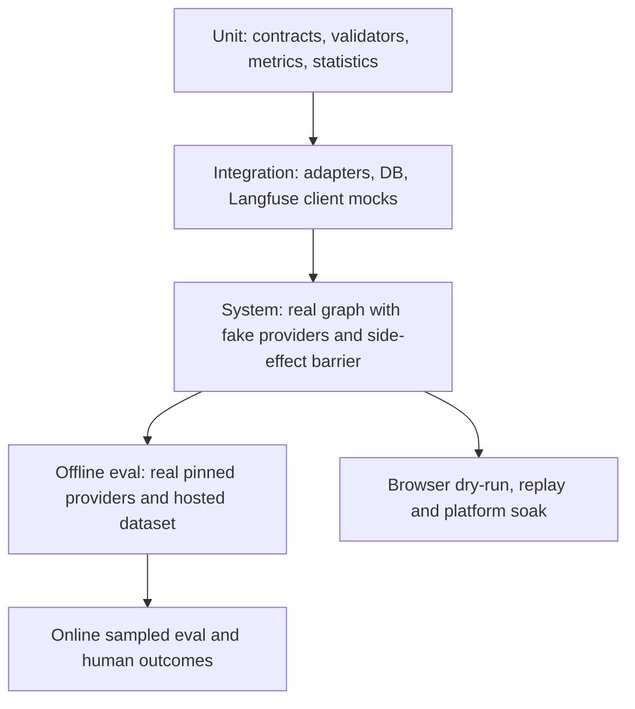

# Test strategy and CI gates

> **Document maturity:** `DESIGN READY`; canonical feature status is `EVAL-001`.
> **Rule:** deterministic software tests and stochastic product evaluations are
> different evidence lanes.

## Test pyramid

## Evidence lanes

| Lane | External I/O | Purpose | Can block ordinary PR? |
|---|---|---|---|
| Unit | none | Pure policy, schema, statistics, redaction and digest logic. | Yes |
| Integration | mocked/isolated | Adapter contracts and feedback persistence/sync behavior. | Yes |
| System | fake LLM/browser | End-to-end evaluation mode and side-effect isolation. | Yes |
| PR eval smoke | trusted provider only | 20-case regression smoke for relevant internal PRs. | Trusted PRs only |
| Nightly experiment | real providers/Langfuse | 120-case comparative evidence. | No merge block initially; alerts owner |
| Promotion run | real providers + human evidence | One-shot held-out decision. | Required for model/prompt promotion |
| Browser dry-run/replay | Camoufox/replay | Selector and action reliability. | Separate release gate |
| Platform soak | real account/platform | External behavior and ban-risk evidence. | Manual/external gate |

## Required unit tests

- dataset item/manifest schema validation;
- canonical manifest digest is order-stable;
- expected output never reaches candidate input;
- hard-gate calculation and missing-value behavior;
- balanced utility normalization/clipping;
- paired bootstrap deterministic seed and CI boundaries;
- Wilson interval zero/one denominators;
- promotion `PROMOTE/HOLD/REJECT` table tests;
- edit-distance normalization, Unicode and empty content;
- feedback reason/rubric validation;
- score idempotency-key stability;
- error-category normalization without secret leakage;
- provider/model attribution and fallback-depth calculation;
- dataset duplicate/split-contamination detection.

## Integration and system scenarios

1. approve unchanged writes `Post` and one review decision atomically;
2. edited approval captures pre-update hash and correct edit distance;
3. rejection requires a reason after enforcement flag;
4. Langfuse outage does not roll back the review;
5. feedback retry does not duplicate scores;
6. reconciliation syncs stale pending rows;
7. strict candidate cannot use the production fallback chain;
8. recorded production control captures every failed/successful attempt;
9. eval mode blocks queue, posting, engagement and production checkpoints;
10. one failed dataset item does not abort unrelated items;
11. cost budget stops scheduling and preserves completed evidence;
12. shutdown flushes Langfuse observations;
13. trace propagation reaches child generation observations;
14. prompt linkage points to the exact prompt used by each generation;
15. redaction canary strings are absent from traces and score comments.

## CI topology

### Existing CI

Keep current lint/build/full mocked backend suite unchanged as the baseline job.

### Proposed jobs

| Job | Trigger | Secrets | Gate |
|---|---|---|---|
| `evaluation-static` | every PR/push | none | Required |
| `evaluation-smoke` | internal PR when eval/prompt/LLM files change; manual | Langfuse + candidate provider | Required only after stabilization |
| `evaluation-nightly` | trusted default branch schedule | Langfuse + all matrix providers | Informational, then gated by policy |
| `evaluation-promotion` | `workflow_dispatch` with frozen manifest | Langfuse + selected providers | Produces promotion artifact |

Fork PRs never receive provider/Langfuse secrets. They run deterministic checks only.

The Langfuse experiment action may be used for trusted jobs. Pin:

- action commit SHA, not floating branch;
- `@langfuse/client` version compatible with the repo;
- dataset version boundary;
- experiment script path;
- candidate manifest artifact.

Enable `should_fail_on_regression` only after two stable baseline windows; until then,
collect reports without creating flaky merge gates.

## Path-based triggers

Run smoke evaluation when a trusted change touches:

- generation/orchestrator graphs;
- LLM router or provider configuration;
- prompt registry/fallback prompts;
- judge/evaluator code;
- evaluation schemas/manifests;
- shared content/network contracts.

Documentation-only changes run docs validation but no paid experiment.

## Regression contract

CI fails when:

- script/manifest/dataset validation fails;
- a hard gate regresses below threshold;
- telemetry coverage drops below threshold;
- a configured `RegressionError` is raised by the promotion comparator;
- Langfuse ingestion fails in a job whose purpose is external evidence.

CI does not fail solely because a semantic mean changes within the inconclusive
confidence interval; report `HOLD`.

## Flake and nondeterminism policy

- Do not retry a failed quality item until it passes and hide the first result.
- Repeats are declared in the manifest and all outcomes are retained.
- Provider transport retries are attempt telemetry, not statistical repeats.
- A rerun creates a new experiment run with `rerun_of`; it never overwrites evidence.
- Infrastructure failure is `BLOCKED_EXTERNAL`, not a candidate quality failure,
  unless provider reliability is the measured property.

## Browser lane

Browser tests remain separate:

- fixture/selector unit tests;
- recorded DOM/replay tests;
- `pnpm dry-run` with final submit intercepted;
- explicit real-platform validation and soak.

No green mocked/browser-replay suite may be reported as proof that X or Threads live
posting works at the current SHA.

## Result artifact

Every external eval job retains:

- `result.json` machine contract;
- `report.md` human summary;
- candidate manifest and digest;
- dataset manifest/digest;
- GitHub job URL and Git SHA;
- Langfuse dataset run URL;
- failure/missing-evidence list;
- exact terminal exit status.

## Documentation validation

The documentation slice itself must pass:

- relative-link resolution;
- duplicate task/requirement ID checks;
- Mermaid parse/render where tooling is available;
- no secrets/private content scan;
- `git diff --check`;
- source-path existence checks for `CURRENT` claims.

## Reference

- [Langfuse Experiments in CI/CD](https://langfuse.com/docs/evaluation/experiments/experiments-ci-cd)
