# Online monitoring and alerting

> **Document maturity:** `DESIGN READY`; canonical feature status is `EVAL-001`.
> **Principle:** alert on user/task symptoms and evidence loss, then use traces to
> localize the cause.

## Signal ownership

| System | Owns |
|---|---|
| Langfuse | LLM/graph observations, model/prompt identity, scores, experiment analytics. |
| PostgreSQL | Posts, review decisions, variants, publishing and engagement outcomes. |
| Sentry | Exceptions, crashes, stack traces and release correlation. |
| Redis/BullMQ | Queue health, budgets, checkpoints and transient orchestration state. |
| Discord | Human-facing notification channel, not a system of record. |

## Core SLIs and initial SLOs

Initial thresholds are rollout gates, not promises to external customers. Rebaseline
after four weeks of trustworthy telemetry.

| SLI | Initial objective | Window |
|---|---:|---|
| End-to-end generation task completion | >=95% | rolling 24h, `n>=20` |
| Orchestrator valid decision output | >=99% | rolling 24h, `n>=50` |
| Unknown actual provider/model | <=1% | rolling 24h |
| Token/cost telemetry coverage | >=95% | rolling 24h |
| Prompt-link coverage on managed-prompt calls | >=95% | rolling 24h |
| Fallback depth p95 | <=2 | rolling 1h, `n>=20` |
| Human factual-support pass | >=90% | rolling 30 reviewed posts |
| Approval without material edit | baseline -2pp or better | rolling 30 reviewed posts |
| Feedback score sync age | p95 <15m | rolling 1h |
| Experiment score coverage | >=95% | per run |

Quality windows use minimum sample counts; small samples are displayed but do not page.

## Dashboards

### Agent health

- started/completed/failed tasks;
- graph terminal states;
- orchestrator actions and unnecessary action rate;
- browser posting kept separate.

### LLM fleet

- attempts and success by provider/model/role;
- rate-limit, auth/billing, timeout, empty-output and model-not-found errors;
- fallback depth, circuit state and actual-model coverage;
- role-chain distribution and production-control drift.

### Quality

- review decision and edit-distance trends;
- human rubric by language/network/archetype;
- internal judge score distribution;
- judge-human disagreement;
- prompt/model versions overlaid on quality changes.

### Economics/performance

- input/output/reasoning/cached tokens;
- cost per attempt, task and accepted output;
- p50/p95 latency and time-to-first-token;
- cache-hit rate and cost-source coverage;
- budget consumption.

### Evidence coverage

- trace/tag/session/prompt/model/usage coverage;
- score sync backlog;
- dataset and manifest mismatches;
- online evaluator sample coverage.

## Alert catalog

| ID | Severity | Condition | Route | First action |
|---|---|---|---|---|
| `EVAL-A01` | Critical | all-provider final failures >=3/15m | Sentry + Discord | Pause generation, inspect provider errors. |
| `EVAL-A02` | Critical | safety/platform hard-gate production failure | Sentry + Discord | Disable auto-approve, preserve trace. |
| `EVAL-A03` | Warn | task completion <95%, `n>=20` | Discord | Segment by role/provider/error. |
| `EVAL-A04` | Warn | fallback-depth p95 >2 for 30m | Discord | Inspect 429/model-not-found/auth errors. |
| `EVAL-A05` | Warn | unknown model attribution >1% | Discord | Treat comparisons as blocked; repair metadata. |
| `EVAL-A06` | Warn | usage/cost coverage <95% | Discord | Disable cost-based promotion. |
| `EVAL-A07` | Warn | cost per accepted output >2x 7d baseline | Discord | Check fallback/cache/model change. |
| `EVAL-A08` | Warn | p95 generation latency >1.5x 7d baseline | Discord | Inspect slow role/provider spans. |
| `EVAL-A09` | Warn | feedback sync p95 age >=15m or failed >=10 | Sentry | Run reconciliation, check Langfuse. |
| `EVAL-A10` | Warn | human quality below baseline by >5pp, `n>=30` | Discord | Freeze promotion, open error analysis. |
| `EVAL-A11` | Info | judge-human kappa <0.60 on calibration | Dashboard | Set judge to annotation-only. |
| `EVAL-A12` | Critical | experiment hard-gate regression | CI + Discord | Reject candidate, attach report. |

Alerts deduplicate by ID + environment + provider/network where relevant and apply a
30-minute notification cooldown. Critical state changes bypass cooldown once.

## Online evaluation policy

- Deterministic checks run on every eligible final output.
- Semantic judge starts at 5% random sampling.
- Force-include rejections, material edits, hard failures, unknown attribution and
  high fallback depth.
- Sample only the final network output/root suitable for evaluation; do not run the
  same evaluator on every intermediate generation.
- Online scores are monitoring evidence, not a substitute for controlled experiments.

## Drift detection

Compare current rolling windows with a frozen 28-day reference, segmented by model,
prompt label, network and language. Detect:

- quality and edit-rate drift;
- actual model/router mix drift;
- fallback/error taxonomy drift;
- token and latency distribution drift;
- judge score distribution drift;
- missing telemetry drift.

An alert opens an error-analysis sample. It does not automatically rewrite prompts or
switch models.

## Incident workflow

```mermaid
flowchart LR
  Alert[Alert fires] --> Triage[Confirm symptom and sample size]
  Triage --> Scope[Segment by environment, role, model, prompt, network]
  Scope --> Trace[Inspect logical roots and failed attempts]
  Trace --> Protect[Pause/disable risky automation if needed]
  Protect --> Sample[Create redacted failure sample]
  Sample --> Fix[Code, prompt, provider or harness candidate]
  Fix --> Experiment[Run regression experiment]
  Experiment --> Rollout[Canary or reject]
```

## Runbook mapping

Future runbooks:

- `eval-provider-churn` — A01/A04/A05;
- `eval-quality-regression` — A02/A10/A11;
- `eval-cost-latency-spike` — A07/A08;
- `eval-feedback-sync` — A09;
- `eval-experiment-regression` — A12.

Until created, alerts link to this section and the relevant trace/dashboard.
