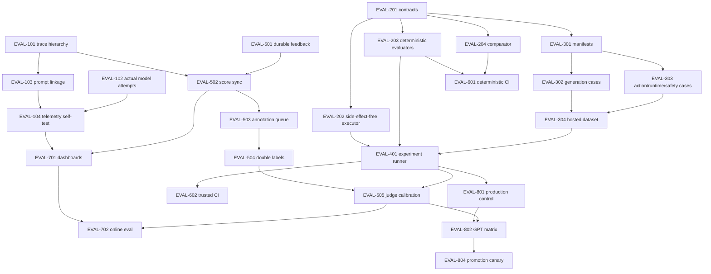

# Evaluation implementation delivery map

> **Status source:** task status lives only in
> [docs/planning/BACKLOG.md](../planning/BACKLOG.md), feature `EVAL-001`.
> This document defines work packages and dependency intent; it deliberately does not
> copy live status.

## Work packages

| Package | Canonical task IDs | Outcome |
|---|---|---|
| Measurement truth | `EVAL-101..104` | Trustworthy roots, actual provider/model, prompt linkage, usage and redaction. |
| Contracts/harness | `EVAL-201..204` | Manifests, side-effect isolation, evaluators and statistical promotion policy. |
| Dataset | `EVAL-301..304` | 120 reviewed/versioned cases in a hosted Langfuse dataset. |
| Experiment execution | `EVAL-401..402` | Bounded hosted runs and immutable reports. |
| Human feedback/calibration | `EVAL-501..505` | Durable review truth, score sync and calibrated judge. |
| CI/release gate | `EVAL-601..602` | Deterministic PR and trusted external experiment lanes. |
| Online monitoring | `EVAL-701..702` | Dashboards, sampling, SLOs and actionable alerts. |
| Model optimization | `EVAL-801..804` | Frozen control, GPT/OpenRouter matrix, promotion and canary. |
| Browser reliability | `BROWSER-101..102` | Replay/dry-run/live evidence kept separate from content scoring. |

## Dependency DAG

## Vertical slices

### Slice A — evidence can be trusted

Complete `EVAL-101..104`. Do not start evaluation dashboards or publish a model
comparison while prompt/provider/usage coverage is below the documented gates.

### Slice B — deterministic offline harness

Complete `EVAL-201..204` and `EVAL-601`. This slice runs without provider secrets and
proves side-effect isolation, metric math and promotion policy.

### Slice C — first real experiment

Complete `EVAL-301..304`, `EVAL-401..402` and `EVAL-801`. Output is a reproducible
production-control baseline, not a promoted model.

### Slice D — humans calibrate automation

Complete `EVAL-501..505`. Missing second-human labels leave autonomous judge gates
blocked while diagnostic scores remain usable.

### Slice E — continuous release control

Complete `EVAL-602`, `EVAL-701..702`, then `EVAL-802..804`. Enable merge/promotion
blocking only after two stable experiment windows and a tested rollback.

## Handoff rule

Implementation agents update only the canonical backlog row while working. This file,
the roadmap proposal and ADR change only when the design/dependencies change.

