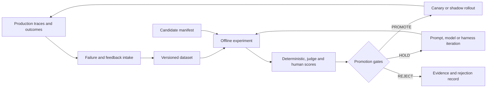

# Agent Evaluation & Observability

> **Document maturity:** `DESIGN READY`; runtime implementation is tracked as `EVAL-001` in [planning](../planning/FEATURES.md).
> **Baseline date:** 2026-08-22
> **Decision owner:** product/operator
> **Technical owners:** Generation, Orchestrator, LLM Infrastructure, Analytics
> **Source-of-truth rule:** code and live provider evidence override prose.

This hub defines how Social Poster Agent (SPA) will answer a question that the current
test suite cannot answer: **which agent configuration is effective enough to operate,
and why?**

The initiative keeps four concerns separate:

1. content quality;
2. agent/task reliability;
3. latency and cost;
4. real posting outcomes.

A single opaque score must not hide a safety, factuality, or runtime failure.

## Status vocabulary

| Marker | Meaning |
|---|---|
| `CURRENT` | Verified in source or in the live Langfuse project on the baseline date. |
| `PROPOSED` | Approved design target, not implemented. |
| `MANUAL` | Requires a human action or judgment; automation is not evidence. |
| `EXTERNAL` | Requires a provider, production traffic, social platform, or another external system. |
| `BLOCKED` | Evidence cannot currently be obtained; never reinterpret as pass. |

## Current evidence

`CURRENT` source inspection and a read-only Langfuse CLI audit found:

- LangGraph generation and orchestrator workflows already exist.
- Langfuse JS SDK packages are at `5.10.1`, the current registry version at the
  baseline date.
- Prompt Management, callback tracing, token/cost estimates and the four-dimension
  post judge are implemented.
- The automated suite has 130 unit, 5 integration, 3 system, 2 acceptance and 7
  backend E2E specs, but external LLM/browser behavior is mocked.
- The live Langfuse project contains 17 prompt families and at least 1,000 recent
  observations, but zero datasets and zero score configurations.
- Only one score was present and it was not a calibrated product-quality score.
- In the most recent 1,000-observation sample, 355 observations were LLM generations
  and 337 were error-level provider attempts. This is **fallback churn**, not a 94.9%
  end-to-end task failure rate.
- Only 14/1,000 observations carried tags/session linkage, no observations reported
  prompt linkage through the observation prompt fields, and 109/355 generation
  observations lacked usable model attribution.
- `Post`, `PostVariant`, `PostMetrics`, `judgeScores`, approve/reject and edited
  approval exist, but no durable human-review reason/rubric record exists.
- `packages/backend/scripts/calibrate-judge.ts` is not currently runnable with the
  Prisma 7 driver-adapter requirement.

The baseline is diagnostic only. Re-run `EVAL-003` before implementation; production
state can drift.

## Documentation map

| Document | Primary question |
|---|---|
| [01 Product goals and success metrics](./01-product-goals-and-success-metrics.md) | What outcome are we optimizing? |
| [02 Quality rubrics and gates](./02-quality-rubrics-and-gates.md) | What does good mean and what can never be averaged away? |
| [03 Evaluation system design](./03-evaluation-system-design.md) | Which components own execution, scoring and evidence? |
| [04 Datasets and annotation](./04-datasets-and-annotation.md) | Which cases form ground truth and how are they labelled? |
| [05 Model benchmarking](./05-model-benchmarking.md) | How do we compare GPT/OpenRouter/production configurations fairly? |
| [06 Langfuse observability](./06-langfuse-observability.md) | What must every trace, observation and score contain? |
| [07 Human feedback and judge calibration](./07-human-feedback-and-judge-calibration.md) | How does operator judgment calibrate the judge? |
| [08 Test strategy and CI gates](./08-test-strategy-and-ci-gates.md) | Which checks run locally, in PRs, nightly and manually? |
| [09 Online monitoring and alerting](./09-online-monitoring-and-alerting.md) | How do we detect runtime and quality drift? |
| [10 Rollout, security and operations](./10-rollout-security-and-operations.md) | How is the system introduced safely and operated? |
| [11 Implementation backlog](./11-implementation-backlog.md) | What is built, in which order, with what evidence? |
| [12 Traceability matrix](./12-traceability-matrix.md) | Which requirement is covered by which metric, task and test? |

Architecture decision: [ADR-009](../adr/ADR-009-ai-change-release-gate.md).
Product proposal: [09 AI Change Release Gate](../roadmap/09-ai-change-release-gate.md).
Canonical status: feature `EVAL-001` in [the planning hub](../planning/FEATURES.md).

## North-star decision

SPA uses a **balanced, constrained optimization**:

> Maximize human-aligned quality and task reliability subject to safety,
> factuality, cost and latency gates.

The system does not select the cheapest model unconditionally and does not maximize
quality without cost limits. See the exact promotion policy in
[02-quality-rubrics-and-gates.md](./02-quality-rubrics-and-gates.md).

## Evaluation loop

## How future agents use this hub

1. Read this file and [ADR-009](../adr/ADR-009-ai-change-release-gate.md).
2. Locate the task in [11-implementation-backlog.md](./11-implementation-backlog.md).
3. Confirm all dependencies are complete; do not skip a human or external gate.
4. Re-verify referenced symbols against source because documentation may lag code.
5. Implement one dependency-ordered vertical slice.
6. Record exact commands, dataset version, candidate digest, Git SHA and evidence.
7. Update task status and the traceability matrix only after evidence exists.

## Authoritative external references

- [Langfuse Experiments via SDK](https://langfuse.com/docs/evaluation/experiments/experiments-via-sdk)
- [Langfuse LLM-as-a-Judge](https://langfuse.com/docs/evaluation/evaluation-methods/llm-as-a-judge)
- [Langfuse Scores](https://langfuse.com/docs/evaluation/scores/overview)
- [Langfuse Experiments in CI/CD](https://langfuse.com/docs/evaluation/experiments/experiments-ci-cd)
- [OpenAI GPT-5.4 mini](https://developers.openai.com/api/docs/models/gpt-5.4-mini)
- [OpenAI GPT-5.4 nano](https://developers.openai.com/api/docs/models/gpt-5.4-nano)
- [OpenRouter free model routing](https://openrouter.ai/docs/guides/routing/model-variants/free)
