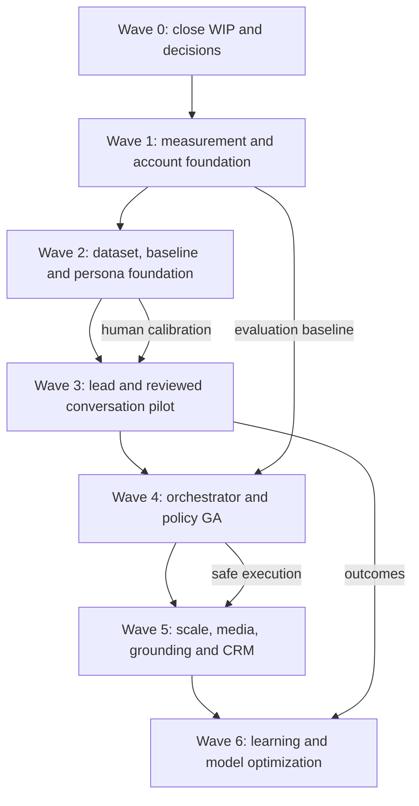

# Dependency-ordered execution roadmap

> **Role:** canonical delivery sequence and work-intake method
> **Live status:** always resolve from [BACKLOG.md](./BACKLOG.md)
> **Product roadmap:** [ROADMAP.md](./ROADMAP.md) (canonical, EN)
> **Feature definitions:** [FEATURES.md](./FEATURES.md)
> **Baseline:** 2026-08-22, HEAD `f95ff84`; re-verify before claiming work.

This document answers two questions:

1. In which dependency order should SPA capabilities be delivered?
2. Which bounded slice may an engineer/agent claim without colliding with another
   worktree?

It does not own task status. Task IDs appear here for sequencing; their current state,
owner and evidence live only in `BACKLOG.md` or the archive.

## Delivery principles

1. Measurement truth before model optimization or autonomy.
2. Finish claimed work before widening WIP.
3. Deterministic/safety gates before semantic judges.
4. Account isolation before persona, policy and multi-account automation.
5. Accepted ADR before a feature whose decision is still `Proposed`.
6. Side-effect-free experiments before shadow, canary or live execution.
7. Direct attribution before assisted association/incrementality claims.
8. Local/mock, provider, staging, manual and production evidence remain distinct.

## Dependency spine



Estimated durations assume one senior engineer or one coordinated agent lane per
workstream. They are planning ranges, not deadlines. External/manual gates can extend
elapsed time without increasing implementation effort.

## Wave overview

| Wave | Roadmap | Estimated build effort | Parallel lanes | Exit evidence |
|---|---|---:|---:|---|
| 0. Close WIP and decisions | M0/M1 stabilization | 3–7 days | 2–3 | Existing dirty slices reconciled; strategic ADRs accepted/rejected; first ready tasks claimed safely. |
| 1. Measurement/account foundation | M0 + M1 | 3–5 weeks | 3 | Truthful trace/model/prompt coverage, deterministic eval CI, account isolation, resilience integration. |
| 2. Dataset/baseline/persona | M0.7 + M1.3/M1.6 | 4–6 weeks | 3 | Hosted dataset, production-control run, durable feedback, persona/planner foundation. |
| 3. Lead/conversation pilot | M2–M3 | 4–7 weeks | 3 | Trackable live funnel, calibrated judge, reviewed Threads/X pilot, public editorial feed contract. |
| 4. Orchestrator/policy GA | M3–M4 | 2–4 weeks build + 30-day gate | 2–3 | No cron dual-path, tested recovery/watchdog, policy/reputation controls, nightly AI gate. |
| 5. Scale/visuals/grounding | M4–M5 | 6–10 weeks | 3 | Four validated networks, one image path, factual grounding, purge/tombstone and CRM boundaries. |
| 6. Learning/optimization | M5–M6, ongoing | 4–8 weeks per cycle | 2 | Human-calibrated model/cost promotion, reversible learning and honest incrementality evidence. |

## Hardening track (H0–H3) — parallel lane

Claimed 2026-08-23 by the current agent worktree (`HARDEN-001`). It is file-disjoint
from the account/persona/eval/policy lanes and may run beside Waves 0–2 as long as
global WIP limits hold. Task status lives in `BACKLOG.md` ("Platform hardening and
unification track").

```text
H0 CI-001, CI-002, REFACTOR-100, DOCS-100        (foundation: safety net + hygiene)
H1 REFACTOR-101 → 102 → 103 → 104 → 105          (DRY core + god-class decomposition)
   REFACTOR-106/107/108 trail H1, file-disjoint
H2 DESIGN-101 → DESIGN-102;  DOCS-101;  DOCS-102 (design primitives + single roadmap)
H3 NETWORK-101 (API-first), TGBOT-101            (features on clean architecture)
```

Sequencing rules:

1. H0 lands first: coverage enforcement is the safety net for every later refactor.
2. H1 order matters: `REFACTOR-101` (network profiles) removes platform-knowledge
   duplication before the god-class splits so moved code lands deduplicated.
3. H3 features start only after `REFACTOR-105`, because new posters/bot code must use
   the unified import convention and network-profile registry from day one.
4. `NETWORK-101` transport decision (2026-08-23): free official API → API
   (Bluesky AT Protocol, Mastodon API); stealth browser only where no free API exists
   (Facebook, LinkedIn). Recorded in an ADR during implementation.

Exit gate:

- backend CI enforces configured coverage thresholds; UI suite runs in CI;
- no service class exceeds ~600 lines without a documented seam justification;
- per-network knowledge has exactly one canonical source;
- one relative-import style repo-wide, lint-enforced;
- docs: single English product roadmap; every VERIFY row carries an explicit
  `evidence: auto|manual` tag.

## Wave 0 — Close current ownership and decisions

### Objectives

- Finish or explicitly return current overlapping account work.
- Resolve product decisions before persona/policy/intelligence implementation.
- Start only file-disjoint foundational tasks.

### Work

| Lane | Tasks | How to execute |
|---|---|---|
| Account/persona owner | `ACCOUNT-101`, `PERSONA-100`, then `PERSONA-101` → `PERSONA-102` | Preserve current controller/shared/orchestrator/session/reply changes; run focused and cross-module gates before archive. |
| Product owner | `PLAN-002` (completed 2026-08-23) | ADR-008 and ADR-010..014 are accepted with explicit v1 boundaries; downstream implementation and promotion evidence remains task-scoped. |
| Eval tracing | `EVAL-101` → `EVAL-102` | One owner because Langfuse/LLM invocation metadata is one trace contract. |
| Eval contracts | `EVAL-201` | New evaluation contracts/digest boundary; avoid production graph changes. |
| Browser harness | `BROWSER-101` | Fixture/replay format only; no live submit and no account/session edits. |
| Documentation | `PLAN-005` | Reproduce legacy findings; do not bulk-copy old checkboxes. |

### Exit gate

- no stale `IN_PROGRESS` task without an owner/worktree;
- `PLAN-002` has explicit recorded decisions;
- first claimed ready tasks have exact file ownership and test commands;
- no new parallel roadmap/backlog is created.

## Wave 1 — Measurement and account foundation

### Workstream A: observability truth

Sequence:

```text
EVAL-101 → EVAL-103 → EVAL-104
EVAL-102 ───────────────┘
```

Deliver logical roots, propagated attributes, actual provider/model attempt identity,
native prompt linkage, usage/cost coverage and redaction canaries. Do not build quality
dashboards while required coverage is below the documented gate.

### Workstream B: deterministic evaluation harness

Sequence:

```text
EVAL-201 → EVAL-202
         → EVAL-203 → EVAL-601
         → EVAL-204 ───────┘
```

This lane must work without provider secrets: schemas, manifest digest, side-effect
barrier, deterministic evaluators, statistics and PR CI.

### Workstream C: account and resilience

Sequence:

```text
ACCOUNT-101 → ACCOUNT-102 → ACCOUNT-201
REL-101(done) → REL-102
```

`REL-102` begins only after account and eval-trace owners release overlapping
LLM/browser/session/queue files.

### Optional disjoint lane

- `BROWSER-101 → BROWSER-102` after fixture contract review.
- `SYND-101` only if it has a dedicated owner and does not delay P0/P1 foundation.

### Exit gate

- two same-network accounts pass selection/session/browser/limit/WorldState isolation;
- telemetry self-test meets model/prompt/usage coverage and redaction gates;
- deterministic evaluation CI cannot trigger real side effects;
- resilience integration has state-machine and failure/recovery evidence;
- browser replay evidence is labelled separately from live acceptance.

## Wave 2 — Dataset, baseline, feedback and persona foundation

### Workstream A: dataset and experiment baseline

```text
EVAL-301 → EVAL-302 ─┐
         → EVAL-303 ─┴→ EVAL-304 → EVAL-401 → EVAL-402 → EVAL-801
```

Deliver 120 stratified cases, hosted Langfuse dataset, bounded experiment runner,
immutable report and frozen production-control candidate.

### Workstream B: human feedback

```text
ACCOUNT-101 → EVAL-501
EVAL-101 + EVAL-501 → EVAL-502
```

Persist review decisions transactionally and sync scores idempotently without blocking
approve/reject.

### Workstream C: persona/planner

Starts only after ADR-008 acceptance:

```text
PLAN-002 + ACCOUNT-102 + EVAL-201 → PERSONA-101
PERSONA-101 + EVAL-101 → PERSONA-102
PERSONA-102 + POLICY-101 + EVAL-203 → PERSONA-103
```

### Exit gate

- hosted dataset/version/digest and production-control run are reproducible;
- feedback survives Langfuse outage and reconciles;
- every generated post can reference immutable persona revision/voice mode;
- paired persona eval distinguishes intended voices without unsupported first-person
  claims;
- planner does not assign contradictory/duplicate thesis across accounts.

## Wave 3 — Lead funnel and reviewed conversation pilot

### Direct attribution lane

- `ATTR-103` contract evidence is archived DONE (2026-08-23); no further action.
- Build `ATTR-104` dashboard UI (local evidence exists; live-data gate remains).
- Execute `ATTR-101` only against deployed zodiac-back and a real post/click/funnel.
- Keep UTM fallback evidence separate from canonical short-link evidence.

Backend foundations already archived:

- `ATTR-102` trackable CTA runtime (`8061a4e`);
- conversion summary code (`f95ff84`, verification remains `ATTR-103`).

### Judge and human calibration lane

```text
EVAL-304 + EVAL-501 → EVAL-503 → EVAL-504 → EVAL-505
```

This lane includes manual open coding and two-human labels. Missing human evidence is a
blocker, not an automation pass.

### Conversation lane

```text
PERSONA-101 → ENGAGE-101
POLICY-101 + EVAL-203 → ENGAGE-103
ENGAGE-101 + EVAL-505 → ENGAGE-102
```

Threads remains approval-required; X outbound remains suggest-only unless an accepted
policy decision explicitly changes it.

### Cross-project editorial lane

`BRIDGE-101` establishes the read-only allowlisted Soulwise feed. It can run in
parallel only with an explicit owner in both repositories and a versioned contract.

### Exit gate

- a real trackable post produces a visible non-zero funnel event;
- direct UTM fallback works while zodiac is unavailable;
- judge trust verdict is based on held-out human labels;
- at least ten real questions pass reviewed reply/safety flow without incident;
- no user-level Soulwise field can cross the editorial contract.

## Wave 4 — Orchestrator and policy GA

### Build order

1. `ORCH-101` maps remaining `.forge` work to canonical tasks.
2. `REL-102` completes runtime recovery integrations.
3. `POLICY-101` compiles evidence-backed authorization.
4. `ORCH-102` removes the cron/orchestrator dual path and performs staging soak.
5. `POLICY-102` adds reputation states and scoped recovery.
6. `EVAL-602`, `EVAL-701`, `EVAL-702` enable trusted CI, dashboards and sampled online
   evaluation.
7. `ORCH-103` validates posting-window recommendations after real metric volume exists.

### Exit gate

- watchdog kill/restart and recovery are demonstrated;
- production does not register duplicate cron paths;
- seeded policy/reputation incidents produce expected scoped effects;
- sentiment-only signal cannot pause an account;
- nightly drift detects a seeded prompt/model/config change;
- 30-day uptime target is observed, not inferred from local tests.

## Wave 5 — Scale, media, grounding and relationships

Parallel workstreams after Wave 4 gate:

| Workstream | Tasks | External/manual evidence |
|---|---|---|
| Network validation | `NETWORK-101` | One platform per iteration; >=2-week soak. |
| Image path | `MEDIA-101` | Provider quota/cost plus real upload/post verification. |
| Grounding/memory | `GROUND-101`, `BRIDGE-102` | Held-out retrieval/factuality, expiry/tombstone/purge. |
| Creator relationships | `INTEL-101` → `CRM-101` | Privacy review, no profiling/auto-outreach, human collaboration decisions. |
| Multi-instance | `DIST-101` | Distributed lock/cache/leader evidence. |

### Exit gate

- at least four networks have separately labelled live evidence;
- one network publishes a verified image path;
- factual failures are blocked on held-out cases;
- stale/retracted evidence cannot be retrieved;
- CRM stores no private/sensitive enrichment and has no automated outreach path.

## Wave 6 — Learning and model/cost optimization

### Model/cost promotion

```text
EVAL-801 + EVAL-505 → EVAL-802 / EVAL-803 → EVAL-804
EVAL-104 + EVAL-801 → COST-101 → COST-102
```

### Persona/conversation learning

- `PERSONA-201` evaluates approved-edit learning and execution-mode promotion.
- `EVAL-805` compares prompt/few-shot/RAG baseline with fine-tuning.
- `INTEL-101`, `ATTR-201`, `CRM-101` produce demand, assisted and collaboration
  evidence without claiming causality from association.

### Exit gate

- candidate promotion passes human-aligned quality, reliability, cost and latency gates;
- rollback restores previous manifest/prompt/policy configuration;
- judge/model cannot self-promote;
- fine-tuning has an evidence-backed GO/NO-GO;
- low sample returns `NO_CONCLUSION`, not a fabricated winner.

## How to choose the next task

Use this algorithm:

1. Open `BACKLOG.md` and exclude `BLOCKED`, `VERIFY` and already owned tasks.
2. Select the earliest wave containing a `READY` task whose dependencies are archived
   or have passed required gates.
3. Check file-family ownership below.
4. Prefer a vertical slice that produces one independently testable outcome.
5. Claim it in `BACKLOG.md` before editing.
6. Set `VERIFY` while running evidence; move to archive only after required evidence.

## File-family ownership

| Family | Typical tasks | Do not overlap with |
|---|---|---|
| Accounts/settings/fleet | `ACCOUNT-*`, `PERSONA-100` | persona model, resilience session integration |
| Langfuse/LLM/generation tracing | `EVAL-101..104` | resilience LLM integration, persona trace propagation |
| Evaluation contracts/harness | `EVAL-201..204`, `EVAL-301..` | safe to parallel unless shared schemas are touched |
| Browser/session/replay | `BROWSER-*` | account isolation, resilience browser integration |
| Link attribution/posting | `ATTR-*` | posting/thread changes in another worktree |
| Orchestrator/flow control | `ORCH-*`, `POLICY-*` | account WorldState and resilience orchestration |
| Documentation governance | `PLAN-*` | safe in parallel unless a spec owner is editing the same document |
| Codebase hardening/refactor | `CI-1xx`, `REFACTOR-1xx`, `DESIGN-1xx`, `DOCS-1xx` | coordinate with EVAL tracing (`llm.port.ts` consumers), account WorldState collector, and any worktree editing generation/posting files; DESIGN is UI-only |
| Operator control bot | `TGBOT-1xx`, `CONTROL-001` | telegram adapter, flow-control endpoints; do not run beside posting-path slices |

## Evidence required at handoff

Every handoff reports:

- task/feature ID and owner;
- source SHA and dirty-worktree boundary;
- files/contracts changed;
- exact tests and terminal results;
- external/manual evidence or explicit blockers;
- compatibility/migration/rollback behavior;
- next newly unblocked task IDs.
