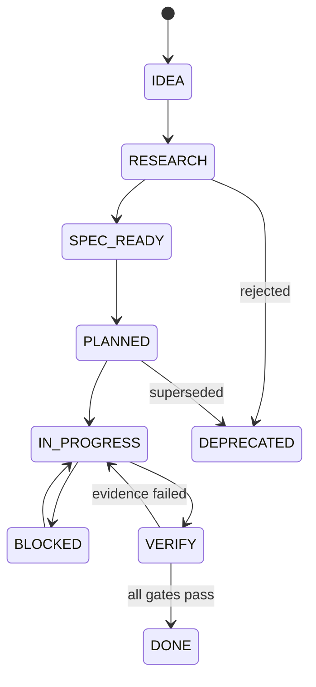

# Canonical planning system

> **Status:** `ACTIVE`
> **Effective:** 2026-08-22
> **Single source of truth for status:** [FEATURES.md](./FEATURES.md) and
> [BACKLOG.md](./BACKLOG.md).

This directory resolves the previous planning duplication. Product direction,
specifications, audits and workstream notes may live in different folders, but they no
longer own feature/task status.

Before creating another planning-like file, check the
[document map and overlap register](./DOCUMENT_MAP.md).

## One document, one responsibility

| Location | Responsibility | May own current status? |
|---|---|---|
| [`ROADMAP.md`](./ROADMAP.md) | Product goals, milestone order and gates (canonical EN). Root `ROADMAP_V2.md` = archived RU original. | No |
| `docs/roadmap/*.md` | Feature research and implementation-ready specifications. | No |
| `docs/evaluation/*.md` | Evaluation domain requirements and technical design. | No |
| `docs/features/*.md` | Legacy feature dossiers and implementation evidence. | No |
| `docs/reviews/*`, `docs/refactor/*`, `docs/audit/*` | Findings and historical source material. | No |
| `.forge/*` | Workstream-local execution notes. | No global feature status |
| `docs/planning/FEATURES.md` | One row per product/architecture feature. | **Yes — feature status** |
| `docs/planning/BACKLOG.md` | All non-terminal implementation tasks. | **Yes — task status** |
| `docs/planning/archive/*.md` | Terminal `DONE/CANCELLED` tasks and evidence. | **Yes — historical status** |
| `docs/planning/EXECUTION_ROADMAP.md` | Dependency waves, gates and work-intake method. | No — resolves status from backlog |

If another document contains `Status`, treat it as document maturity unless it links to
the canonical feature row.

## Conflict resolution

When documents disagree:

1. accepted ADR owns an architectural decision;
2. domain specification owns detailed behavior/contracts;
3. roadmap owns product sequencing and milestone gates;
4. execution roadmap owns dependency waves and claiming method;
5. review/audit owns the finding captured at its snapshot;
6. `FEATURES.md`/`BACKLOG.md` still exclusively own current status.

For `EVAL-001`, ADR-009 is the decision, `docs/evaluation/` is the detailed domain
specification, and roadmap proposal 09 is the milestone/product summary.

## Feature status

| Status | Meaning | Required next transition |
|---|---|---|
| `IDEA` | Unvalidated idea. | Research or reject. |
| `RESEARCH` | Problem/options are being investigated. | Produce reviewed product decision. |
| `SPEC_READY` | Product/technical design is decision-complete. | Create dependency-ordered tasks. |
| `PLANNED` | Tasks/dependencies exist, none started. | Claim a `READY` task. |
| `IN_PROGRESS` | At least one owned task is actively changing the system. | Move task to `VERIFY` or expose blocker. |
| `BLOCKED` | Feature cannot progress due to a named dependency/external condition. | Resolve blocker; never treat as done. |
| `VERIFY` | Implementation exists but required acceptance evidence is incomplete. | Pass evidence or return to work. |
| `DONE` | All required acceptance evidence exists. | Monitor; create new feature/task for expansion. |
| `DEPRECATED` | Intentionally retired/replaced. | Preserve migration/history reference. |

## Task status

| Status | Meaning |
|---|---|
| `TODO` | Defined but dependency or priority is not ready. |
| `READY` | Dependencies satisfied; safe to claim. |
| `IN_PROGRESS` | One named owner/worktree has claimed it. |
| `BLOCKED` | Named condition prevents progress. |
| `VERIFY` | Code/docs exist; waiting for exact acceptance evidence. |
| `DONE` | Evidence complete; task moved to archive. |
| `CANCELLED` | Explicitly rejected/superseded; task moved to archive with reason. |

`DONE` and `CANCELLED` rows never remain in `BACKLOG.md`. Move them to the current
quarter archive in the same change that closes them.

## Workflow

### Adding a feature

1. Allocate a stable feature ID in `FEATURES.md`.
2. Add the problem/outcome and link one primary specification.
3. Record dependencies and target milestone.
4. When the spec is decision-complete, create task IDs in `BACKLOG.md`.
5. Other docs reference these IDs; they do not create parallel checklists.

### Starting a task

1. Confirm dependencies are terminal/passed.
2. Set `READY → IN_PROGRESS`, owner and `started` date.
3. Record the worktree/branch when parallel work exists.
4. A task has only one owner at a time.
5. Do not set the parent feature `DONE` while another required task is open.

### Completing a task

1. Set `VERIFY` while running required automated/manual/external gates.
2. Record exact commands, SHA, artifact/provider links and remaining limitations.
3. Move the row from `BACKLOG.md` to `archive/YYYY-QN.md` as `DONE` or `CANCELLED`.
4. Recompute the feature status in `FEATURES.md`.
5. Update roadmap milestone prose only if sequencing or gate meaning changed.

## Definition of done

Every completed task records applicable evidence:

- `LOCAL`: exact test/build/lint command and terminal result;
- `INTEGRATION`: real DB/Redis/provider integration boundary;
- `EXTERNAL`: Langfuse, provider, platform or deployment evidence;
- `MANUAL`: human rubric, visual, policy or product acceptance;
- `SHA`: commit or explicit dirty-worktree boundary;
- `ROLLBACK`: how the change is disabled/reverted without destructive Git actions.

Not every task needs all evidence types, but omitted types are stated as not applicable
or still blocked. Mocked/local evidence is never relabelled production evidence.

## ID scheme

Feature IDs use a stable domain prefix, for example `EVAL-001`, `REL-001`,
`PERSONA-001`. Task IDs use the same prefix plus a three-digit work item, for example
`EVAL-301`.

IDs are never reused after archive or cancellation. Renaming a feature keeps its ID.

## Maintenance cadence

- On every implementation handoff: update claimed task status.
- Weekly: verify stale `IN_PROGRESS/BLOCKED/VERIFY` rows.
- Before roadmap review: derive milestone status from feature/task registry.
- Quarterly: start a new archive file and audit orphaned spec/checklist documents.
