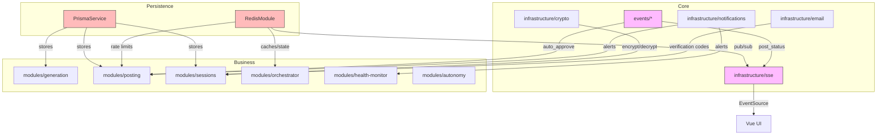

:# Cross-module synthesis — `infrastructure/*` + `events/*` deep review

## 1. Overview

This review cycle covered the remaining infrastructure modules and the cross-cutting event layer:

- `infrastructure/prisma`
- `infrastructure/redis`
- `infrastructure/sse`
- `infrastructure/notifications`
- `infrastructure/crypto`
- `infrastructure/email`
- `events/*` (EventEmitter2 bus, `SseEventListener`, `AutoApproveListener`, HTTP SSE endpoint)

Each module was reviewed through the lenses of correctness, performance, architecture, TypeScript, and security/reliability, and each produced a standalone report with Mermaid diagrams and a prioritized action backlog.

## 2. Cross-cutting themes

### 2.1 `@Global()` modules and missing domain ports

Every infrastructure module except `sse` (which is consumed by `SseModule` and `EventsModule`) is marked `@Global()` and exposes a concrete service rather than a domain port:

| Module | Service | Port exists? | Notes |
|--------|---------|--------------|-------|
| `infrastructure/prisma` | `PrismaService` | No `IPrismaPort` | Direct `PrismaClient` subclass, injected by ~30 modules |
| `infrastructure/redis` | `SHARED_REDIS*` tokens | No `IRedisPort` | Low-level `IORedis` exposure |
| `infrastructure/crypto` | `EncryptionService` | No `ICryptoPort` | Direct injection across many modules |
| `infrastructure/notifications` | `DiscordNotificationService` | No `INotificationPort` | Single concrete transport |
| `infrastructure/email` | `EmailReaderService` | No `IEmailReaderPort` | Only consumer is `SessionsService` |

**Impact**: This contradicts the hexagonal pattern used for `ILlmPort`, `IBrowserPort`, `IContentPort`, and `IPromptPort`. It makes testing, swapping, and reasoning about dependencies harder, and it hides the module graph from `app.module.ts`.

**Recommended pattern**: Define `IPrismaPort`/`IPostRepository`, `ICryptoPort`, `INotificationPort`, `IEmailReaderPort`, and `IRedisCache`/`IRedisKv` in `domain/ports`. Bind implementations in their infrastructure modules. Remove `@Global()` and import modules explicitly where needed.

### 2.2 Environment validation gaps

`env.validation.ts` is the source of truth for env vars, but several modules read env vars via `ConfigService` or `process.env` without validation:

- `infrastructure/redis`: `RATE_LIMIT_PREFIX`, `CHECKPOINT_*`, `SSE_CHANNEL`, `HOOK_*` variables are missing. (Note: `ORCHESTRATOR_*` and `POSTING_WINDOW_*` vars ARE present in `env.validation.ts`.)
- `infrastructure/notifications`: `DISCORD_WEBHOOK_URL` and `DISCORD_ALERTS_ENABLED` are missing.
- `infrastructure/email`: `EMAIL_*` vars are present, but `EmailReaderService` reads `process.env` directly instead of `ConfigService`.
- `infrastructure/sse`: `SSE_CHANNEL` is not declared.
- `infrastructure/prisma`: no `PRISMA_CONNECTION_LIMIT` / `PRISMA_POOL_TIMEOUT` / `PRISMA_TRANSACTION_TIMEOUT` variables.

**Impact**: Typos and misconfiguration are silently masked by code defaults. This is the most common class of operational bug in the reviewed modules.

### 2.3 Connection lifecycle and resource management

Several modules create connections but do not fully manage them:

- `PrismaService`: no retry on initial `$connect()`, no explicit `transactionOptions`/`errorFormat`.
- `RedisModule`: no `error`/`close`/`reconnecting` listeners, no `OnModuleDestroy` cleanup, no `connectionName`.
- `QueueFactory`: creates its own `IORedis` pool, bypassing `RedisModule` and duplicating logic.
- `EmailReaderService`: creates a new `ImapFlow` connection for every poll iteration.

**Impact**: Startup flapping, graceful shutdown hangs, connection leaks, and hard-to-debug connection storms.

### 2.4 SSE / events duplication and loose types

The post lifecycle is reported to the UI via two overlapping paths:

1. `posting.service.ts` directly calls `SseService.publish`.
2. `posts.service.ts` emits `PostEvents`, and `SseEventListener` republishes them as SSE.

The result is duplicate `post_status` events for the same transition. Additionally, `SseEventListener` handlers are synchronous but `SseService.publish` returns a Promise, so `try/catch` only catches synchronous errors.

Across modules, event payloads and SSE payloads are typed as permissive inline objects, not a shared schema. There is no runtime validation.

### 2.5 Security and secrets handling

- `infrastructure/crypto`: `EncryptionService` is good, but the persistent Camoufox profile directory stores cookies in plaintext (`browser.factory.ts` warns about this). `Session.storageState` is typed as `Json` but stores an encrypted string.
- `infrastructure/notifications`: `DISCORD_WEBHOOK_URL` may contain credentials and is not explicitly marked as a secret in logs.
- `infrastructure/email`: `EMAIL_PASSWORD` is an app password stored in `process.env`.
- `infrastructure/redis`: `QueueFactory` logs `this.redisUrl` including full URL; `REDIS_URL` may contain auth.
- `infrastructure/sse`: no rate limiting; connection map has no max size.

### 2.6 Performance hotspots

- `Prisma`: `PostsService.findBySourceAndNetwork` filters JSON in application code; no index on `sourceRef`.
- `Prisma`: `GenerationService` `$transaction` uses default 5s timeout.
- `Redis`: `OrchestratorService.resetCheckpoint` uses `KEYS` instead of `SCAN`.
- `Redis`: sequential `get` calls in `FlowControlService`, `RateLimitService`, `RedisCheckpointSaver`.
- `Email`: new IMAP connection per poll, full message source downloaded.
- `SSE`: `broadcast` is a single event-loop loop over all clients.

## 3. Module interaction map

## 4. Consolidated prioritized action backlog

| Rank | Action | Module(s) | Effort | Rationale |
|------|--------|-----------|--------|-----------|
| 1 | Add `PRISMA_CONNECTION_LIMIT`, `PRISMA_POOL_TIMEOUT`, `PRISMA_TRANSACTION_TIMEOUT` env vars and pass them to `PrismaClient` | `infrastructure/prisma`, `infrastructure/config` | S | Prevents connection pool exhaustion and transaction timeouts in production. |
| 2 | Add explicit `timeout` override to `GenerationService` `$transaction` calls | `modules/generation`, `infrastructure/prisma` | XS | Stops multi-post thread assembly from timing out mid-write. |
| 3 | Add `PrismaClientExceptionFilter` mapping `P2002/P2025/P2024` to HTTP exceptions | `infrastructure/filters` | S | Prevents raw Prisma errors from becoming 500s and leaking internals. |
| 4 | Add `RedisModule` lifecycle: `error`/`close` listeners, `OnModuleDestroy` cleanup, `connectionName` | `infrastructure/redis` | S | Prevents process crashes and shutdown hangs from Redis connection issues. |
| 5 | Refactor `QueueFactory` to reuse `RedisModule` connections for `client`/`subscriber` slots | `infrastructure/queue`, `infrastructure/redis` | M | Reduces Redis connection count and centralizes config. |
| 6 | Choose single source of truth for `post_status` SSE events and fix `SseEventListener` async handling | `events/listeners`, `modules/posting` | S | Eliminates duplicate UI events and unhandled promise rejections. |
| 7 | Add all Redis-related env vars to `env.validation.ts` and validate `REDIS_URL` as URI | `infrastructure/config` | S | Prevents silent misconfiguration of Redis settings. |
| 8 | Add `sourcePath` column / expression index on `Post.sourceRef->>'path'` | `prisma/schema`, `modules/posts` | S | Removes in-memory JSON filtering that will not scale. |
| 9 | Add `DATABASE_URL` URI validation in `env.validation.ts` | `infrastructure/config` | XS | Catches malformed connection strings at boot. |
| 10 | Add `DISCORD_WEBHOOK_URL` and `DISCORD_ALERTS_ENABLED` validation | `infrastructure/config` | XS | Catches alerting misconfiguration. |
| 11 | Move `AutoApproveListener` to `modules/autonomy` | `modules/autonomy`, `events` | S | Corrects module boundary. |
| 12 | Define `IPrismaPort`/`ICryptoPort`/`INotificationPort`/`IEmailReaderPort` and bind implementations | `domain/ports`, `infrastructure/*` | L | Aligns data, encryption, notification, and email layers with hexagonal architecture. |
| 13 | Fix `infrastructure/email` to reuse a single IMAP connection during polling | `infrastructure/email` | S | Avoids 24+ IMAP connections per login attempt. |
| 14 | Add SSE connection limits and rate limiting | `infrastructure/sse`, `modules/events` | S | Prevents connection exhaustion / DoS. |
| 15 | Add slow-query / Redis telemetry middleware | `infrastructure/prisma`, `infrastructure/redis` | M | Enables performance monitoring and debugging. |

## 5. Quick wins (XS/S) that can be applied now

- Validate `DATABASE_URL` and `REDIS_URL` as URIs in `env.validation.ts`.
- Validate `DISCORD_WEBHOOK_URL` and `DISCORD_ALERTS_ENABLED`.
- Add `transactionOptions` defaults to `PrismaService` and explicit timeout to `generation.service.ts`.
- Make `SseEventListener` handlers `async` and `await`/`catch` `publish`.
- Emit `PostEvents.REJECTED` from `posts.service.ts.reject`.
- Truncate Discord embed field values to 1024 chars.
- Remove `as string` cast in `AutoApproveListener`.
- Add `connectionName` to `IORedis` instances.

## 6. Strategic refactors (M/L) for the next planning cycle

- **Repository/Unit-of-Work ports for Prisma** — `IPostRepository`, `ISessionRepository`, `IAccountRepository`, and `IUnitOfWork` to decouple business logic from Prisma.
- **Generic notification port** — `INotificationPort` with Discord, email, Slack, and PagerDuty adapters.
- **Shared `SSEvent` schema** in `packages/shared` with runtime validation and typed UI composables.
- **Redis connection consolidation** — make `QueueFactory` use `SHARED_REDIS` and `SHARED_REDIS_SUBSCRIBER` for non-blocking slots.
- **Key rotation for `EncryptionService`** — add key ID or `SESSION_ENCRYPTION_KEY_OLD` fallback.

## 7. Health summary per module

| Module | Health (1-10) | Top risk |
|--------|---------------|----------|
| `infrastructure/prisma` | 5 | No repository port, untuned connection pool, default tx timeout |
| `infrastructure/redis` | 6 | No lifecycle, `QueueFactory` duplication, unvalidated env vars |
| `infrastructure/sse` | 4 | Duplicate events, async handling bugs, no rate limiting |
| `infrastructure/notifications` | 6 | No retry, no port, missing env validation |
| `infrastructure/crypto` | 6 | No port, no key rotation, plaintext profile dir caveat |
| `infrastructure/email` | 5 | Inefficient polling, no UID tracking, direct `process.env` reads |
| `events/*` | 5 | Wrong module boundaries, duplicate SSE paths, missing `REJECTED` event |

## 8. Recommended order of implementation

1. **Stability** — Prisma pool/timeout, Redis lifecycle, Prisma exception filter.
2. **Observability** — query/Redis telemetry, error logging, Discord env validation.
3. **SSE cleanup** — deduplicate `post_status`, fix async handlers, add connection limits.
4. **Architecture** — define and migrate to ports for Prisma/crypto/email/notifications.
5. **Performance** — Prisma indexing, Redis batching, IMAP reuse, SSE batching.
6. **Security** — key rotation, secret redaction, production profile directory hardening.
