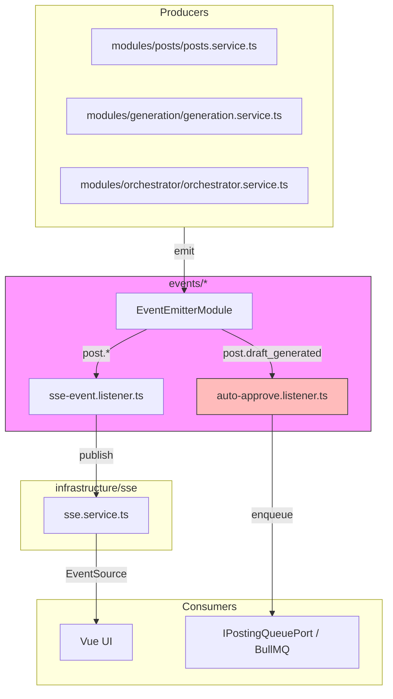

# Module: `events/*`

## 1. What this module does

`events/*` is the **internal EventEmitter2-based event bus** and the **HTTP SSE endpoint** for the SPA backend. It decouples post lifecycle side effects (auto-approve, SSE fan-out) from the services that trigger them.

There are two related folders:

- `packages/backend/src/events/` — EventEmitter2 setup, domain event enums, and listeners (`SseEventListener`, `AutoApproveListener`).
- `packages/backend/src/modules/events/` — HTTP controller and module for the SSE endpoint.

Key responsibilities:

- Define domain event enums (`PostEvents`, `SessionEvents`, `GenerationEvents`, `OrchestratorEvents`).
- Provide `EventEmitter2` via `EventsEdaModule`.
- Bridge `PostEvents` to SSE via `SseEventListener`.
- Auto-approve drafts via `AutoApproveListener` when `AUTO_APPROVE_ENABLED=true`.
- Expose `GET /events/sse` as the HTTP endpoint for the UI.

## 2. Key files & public API

| File | Role | Public API |
|------|------|------------|
| `packages/backend/src/events/enums/post-events.enum.ts` | Domain event constants | `PostEvents`, `SessionEvents`, `GenerationEvents`, `OrchestratorEvents` |
| `packages/backend/src/events/events.module.ts` | EDA module registration | `EventsEdaModule` — imports `EventEmitterModule`, `SseModule`, `PrismaModule`, `PostsModule`, `QueueInfraModule` |
| `packages/backend/src/events/listeners/sse-event.listener.ts` | Event bus → SSE bridge | `SseEventListener` — `@OnEvent` handlers for post lifecycle events |
| `packages/backend/src/events/listeners/auto-approve.listener.ts` | Autonomous posting gate | `AutoApproveListener` — `@OnEvent(PostEvents.DRAFT_GENERATED)` handles auto-approve |
| `packages/backend/src/modules/events/events.controller.ts` | HTTP endpoint | `EventsController` — `GET /events/sse` |
| `packages/backend/src/modules/events/events.module.ts` | HTTP module | `EventsModule` — imports `SseModule`, registers `EventsController` |

## 3. Architecture & data flow

### 3.1 `EventEmitterModule` configuration

`EventsEdaModule` imports `EventEmitterModule.forRoot` with:

- `wildcard: true` — allows listeners like `post.*`.
- `delimiter: '.'` — matches `post.draft_generated` style.
- `ignoreErrors: true` — events are fire-and-forget.

### 3.2 Event producers

`PostsService` emits domain events after status changes (`posts.service.ts:98, 131, 184`):

- `DRAFT_GENERATED` after `PostsService.create`.
- `APPROVED` after approve.
- `POSTING_STARTED` after `updateStatus` to `POSTING`.
- `POSTED` after `updateStatus` to `POSTED`.
- `FAILED` after `updateStatus` to `FAILED`.
- `REJECTED` is defined in `PostEvents` but not emitted (see B1).

`GenerationService` calls `postsService.emitDraftGenerated(post.id, network)` after transaction commits to avoid pre-commit reads (`generation.service.ts:847-849, 916`).

`OrchestratorService` emits `OrchestratorEvents.CYCLE_END` after each cycle.

### 3.3 Listeners

`SseEventListener` listens to `PostEvents` and `OrchestratorEvents.CYCLE_END` and republishes to `SseService`. It does not await `publish` (synchronous handler) but wraps in `try/catch`.

`AutoApproveListener` listens to `PostEvents.DRAFT_GENERATED`. It:

1. Checks if `AUTO_APPROVE_ENABLED` and not `SPA_DRY_RUN`.
2. Loads the post and `llmMetadata.qualityScore`.
3. Lazily resolves `AutoApproveService` from `ModuleRef`.
4. Calls `autoApprove.evaluate(...)`.
5. If `AUTO_APPROVE` decision, enqueues via `IPostingQueuePort`.

### 3.4 HTTP SSE endpoint

`EventsController` (`modules/events/events.controller.ts`) provides `GET /events/sse`. It sets SSE headers, registers the client via `SseService.addClient`, starts a 30s heartbeat, and cleans up on `req.on('close')`.

## 4. Dependencies

**Downstream (called by this module):**

- `@nestjs/event-emitter` `EventEmitterModule` and `OnEvent`.
- `@nestjs/common` `Module`, `Controller`, `Get`, `Req`, `Res`, `Injectable`, `Logger`, `Inject`.
- `infrastructure/sse/sse.service.ts` `SseService`.
- `infrastructure/prisma/prisma.service.ts` `PrismaService`.
- `modules/posts/posts.service.ts` `PostsService`.
- `domain/ports/posting-queue.port.ts` `IPostingQueuePort`.
- `modules/autonomy/auto-approve.service.ts` `AutoApproveService` (lazy loaded).

**Upstream (callers/emitters):**

| Emitter | Events emitted |
|---------|----------------|
| `modules/posts/posts.service.ts` | `PostEvents.DRAFT_GENERATED`, `APPROVED`, `POSTING_STARTED`, `POSTED`, `FAILED` |
| `modules/generation/generation.service.ts` | `PostEvents.DRAFT_GENERATED` (after tx commits) |
| `modules/orchestrator/orchestrator.service.ts` | `OrchestratorEvents.CYCLE_END` |
| `modules/events/events.controller.ts` | UI connects to SSE endpoint |

## 5. Environment variables

| Variable | Default | Purpose | Where used |
|----------|---------|---------|------------|
| `AUTO_APPROVE_ENABLED` | `'false'` | Enable autonomous auto-approve | `auto-approve.listener.ts:49` |
| `AUTO_APPROVE_MIN_SCORE` | `7` | Minimum quality score to auto-approve | `auto-approve.service.ts` (consumed) |
| `SPA_DRY_RUN` | `'false'` | Disables auto-approve in dry-run mode | `auto-approve.listener.ts:48` |
| `SSE_CHANNEL` | `'spa:sse'` | Redis channel for SSE | `sse.service.ts` |
| `AUTH_ENABLED` | `'false'` | JWT guard for SSE endpoint | `jwt-auth.guard.ts` |

## 6. Findings

### 6.1 Bugs / correctness

#### B1 — `PostEvents.REJECTED` is defined but never emitted

`post-events.enum.ts:13` defines `REJECTED = 'post.rejected'`, but `posts.service.ts.reject` does not emit it. The UI and SSE listeners therefore never receive a rejected event. This is a gap in the lifecycle event coverage.

**Fix**: Emit `PostEvents.REJECTED` in `posts.service.ts.reject`.

#### B2 — `SseEventListener` does not await `publish`

`sse-event.listener.ts` handlers are synchronous (`void`) and call `this.sseService.publish(...)` without `await`. The `try/catch` only catches synchronous exceptions, not Redis promise rejections. If `publish` rejects, it becomes an unhandled promise rejection.

**Fix**: Make handlers `async` and `await` `publish`, or use `this.sseService.publish(...).catch(...)`.

#### B3 — `SseEventListener` duplicates `post_status` events

`posting.service.ts` calls `SseService.publish` directly with `post_status` for `POSTING`, `POSTED`, `FAILED` and other lifecycle transitions at multiple points (e.g. lines 130, 400, 423, 453, 469, 493, 510, 531, 714). The `SseEventListener` also converts `PostEvents` into `post_status`. The UI receives duplicate events for the same transition.

**Fix**: Choose one source of truth. Either remove direct `SseService.publish` calls in `posting.service.ts` and rely on `SseEventListener`, or remove the listener and let `posting.service.ts` own UI events.

#### B4 — `AutoApproveListener` uses `ModuleRef` lazy load to avoid test paramtypes changes

`auto-approve.listener.ts:82-83` dynamically imports `AutoApproveService` and resolves it via `ModuleRef`. This is a workaround to avoid updating the test paramtypes restoration blocks. It works but is fragile and makes dependencies implicit.

**Fix**: Import `AutoApproveService` directly or refactor `AutoApproveService` to a domain port `IAutoApproveService`. Update the test paramtypes restoration block.

#### B5 — `AutoApproveListener` does not handle `REJECTED` decision

If `autoApprove.evaluate` returns `REJECT` or `MANUAL_REVIEW`, the listener only logs. It does not emit a `REJECTED` event or update the post status. The post stays `DRAFT` (correct for manual review), but there is no event for the UI.

**Fix**: Emit `PostEvents.REJECTED` or a `needs_review` SSE event when the decision is not `AUTO_APPROVE`.

#### B6 — `EventsController` cleanup only listens to `req.on('close')`

`events.controller.ts:39` clears the heartbeat and removes the client only when `req` closes. If `SseService.onModuleDestroy` ends the response, `req.on('close')` may not fire, leaving a heartbeat interval and a stale client entry.

**Fix**: Also listen to `res.on('close')` and `res.on('error')`.

#### B7 — `EventsController` is not in `JwtAuthGuard.PUBLIC_SUFFIXES`

If `AUTH_ENABLED=true`, `/events/sse` requires a valid JWT. This is intentional but not documented. The UI uses `withCredentials: true`, so it should work. If someone forgot to add a public suffix, it could be a bug, but it's likely intentional.

**Fix**: Add a comment in `jwt-auth.guard.ts` documenting that `/events/sse` is protected.

### 6.2 Performance

#### P1 — `SseEventListener` synchronously emits, but `publish` is async

EventEmitter2 with `ignoreErrors: true` will not catch async errors. The listener is fire-and-forget but does not wait for Redis, so if Redis is slow, the promise is not tracked.

**Fix**: Either await `publish` (if async handler) or make `publish` a non-blocking void.

#### P2 — `AutoApproveListener` runs extra DB query after event

`handleDraftGenerated` does `prisma.post.findUnique` after the event is emitted. The post was just created in a transaction; the event is emitted after the transaction commits. This is fine, but the extra query could be avoided by including the score in the event payload.

**Fix**: Include `qualityScore` in `PostEvents.DRAFT_GENERATED` payload if known at creation time.

### 6.3 Architecture / anti-patterns

#### A1 — `EventsEdaModule` has tight dependencies

`events.module.ts` imports `SseModule`, `PrismaModule`, `PostsModule`, `QueueInfraModule`. This creates a broad module. The `AutoApproveListener` should be in `AutonomyModule` rather than the events module, because the event bus is just a transport.

**Fix**: Move `AutoApproveListener` to `modules/autonomy` and keep `EventsEdaModule` focused on event bus wiring and the `SseEventListener`.

#### A2 — `SseEventListener` owns SSE payload shapes

The listener should be a pure bridge, but it hardcodes the `post_status` payload and status strings. This duplicates the payload shape in `posting.service.ts`.

**Fix**: Define a shared `SSEvent` schema in `packages/shared` and use it in both `SseEventListener` and `posting.service.ts`.

#### A3 — `PostEvents` enum is in `events/enums/post-events.enum.ts` but includes non-post events

`SessionEvents`, `GenerationEvents`, and `OrchestratorEvents` are in the same file. This is minor but could be split into separate files per domain.

**Fix**: Split into `post-events.enum.ts`, `session-events.enum.ts`, `generation-events.enum.ts`, `orchestrator-events.enum.ts`.

#### A4 — `EventsModule` vs `EventsEdaModule` naming is confusing

`modules/events/events.module.ts` is the HTTP module for SSE. `events/events.module.ts` is `EventsEdaModule`. The names are similar and easy to confuse.

**Fix**: Rename `modules/events` to `modules/sse` or `modules/events-http`.

### 6.4 TypeScript / type safety

#### T1 — `SseEventListener` payload is untyped

`SseEventListener` methods accept `payload: { postId: string; network: string; ... }` with no shared type. If an event is emitted with a different shape, the compiler won't catch it.

**Fix**: Define event payload types in `packages/shared` and use them for both `emit` and `OnEvent` handlers.

#### T2 — `AutoApproveListener` casts `post.network as string`

`auto-approve.listener.ts:93` and `:107` cast `post.network` to string. The `post` is typed from Prisma, so `network` is already `SocialNetwork` (enum). The cast is unnecessary.

**Fix**: Remove cast and use `post.network` directly.

### 6.5 Security / reliability

#### S1 — `EventEmitterModule` uses `ignoreErrors: true`

This means a listener that throws will not crash the app, but the error may be silently lost. It also means `SseEventListener` `catch` logs may not be necessary because EventEmitter2 suppresses them anyway.

**Fix**: Keep `ignoreErrors: true` for resilience, but add a global error handler or monitoring to track listener failures.

#### S2 — `AutoApproveListener` enqueues auto-approved posts automatically

When `AUTO_APPROVE_ENABLED=true`, a generated post can be approved and enqueued without human review. This is by design but is a high-risk feature. The `llmMetadata.qualityScore` gate is important, but the score is not validated or logged. If the score is missing, `autoApprove.evaluate` should be fail-closed (which it claims to be).

**Fix**: Ensure `AutoApproveService` is fail-closed and logs the decision prominently. Consider requiring two independent quality checks.

#### S3 — `EventsController` SSE endpoint is not rate-limited

Any client with a valid JWT can open unlimited SSE connections. This is a potential DoS vector if the JWT is leaked or if `AUTH_ENABLED=false`.

**Fix**: Add per-IP/per-user connection limits and a max client count in `SseService`.

## 7. New feature / improvement ideas

1. **Emit `PostEvents.REJECTED`** from `posts.service.ts.reject`.
2. **Make `SseEventListener` handlers async** and await `publish` or use `.catch`.
3. **Remove duplicate `post_status` events** by choosing one source (event bus or direct publish).
4. **Move `AutoApproveListener` to `modules/autonomy`** and keep `EventsEdaModule` focused on the bus.
5. **Define shared event payload types and `SSEvent` schema** in `packages/shared`.
6. **Add global event listener error logging** to track suppressed failures.
7. **Rename `modules/events` to `modules/sse`** to avoid confusion with `events/`.
8. **Split event enums** into separate files per domain.
9. **Add `EventsController` connection limits** and rate limiting.
10. **Add `needs_review` event** for auto-approve `MANUAL_REVIEW` decisions.

## 8. Cross-references

| File / module | Why it matters |
|---------------|----------------|
| `packages/backend/src/events/enums/post-events.enum.ts` | Domain event constants |
| `packages/backend/src/events/events.module.ts` | EDA module registration |
| `packages/backend/src/events/listeners/sse-event.listener.ts` | Event bus → SSE bridge |
| `packages/backend/src/events/listeners/auto-approve.listener.ts` | Auto-approve listener |
| `packages/backend/src/modules/events/events.controller.ts` | HTTP SSE endpoint |
| `packages/backend/src/modules/events/events.module.ts` | HTTP SSE module |
| `packages/backend/src/modules/posts/posts.service.ts` | Emits PostEvents |
| `packages/backend/src/modules/generation/generation.service.ts` | Emits `DRAFT_GENERATED` after tx commits |
| `packages/backend/src/modules/orchestrator/orchestrator.service.ts` | Emits `CYCLE_END` |
| `packages/backend/src/modules/autonomy/auto-approve.service.ts` | Evaluated by AutoApproveListener |
| `packages/backend/src/infrastructure/sse/sse.service.ts` | SSE fan-out service |
| `packages/backend/src/infrastructure/queue/queue.factory.ts` | `IPostingQueuePort` implementation |
| `packages/backend/src/infrastructure/config/env.validation.ts` | Env validation for `AUTO_APPROVE_*` |

## 9. Overall assessment

| Dimension | Health (1-5) | Notes |
|-----------|--------------|-------|
| Correctness | 3 | Missing `REJECTED` emission, duplicate `post_status`, async `publish` not awaited, `AutoApproveListener` ModuleRef hack. |
| Performance | 4 | Low overhead; minor extra DB query in auto-approve. |
| Architecture | 2 | Module boundaries are unclear (auto-approve listener in events module), duplicate payload shapes, confusing naming. |
| Type safety | 3 | Event payloads are loosely typed. |
| Security / reliability | 3 | `ignoreErrors: true` hides failures; SSE endpoint not rate-limited; auto-approve is high-risk. |

**Top 5 risks:**

1. **Duplicate `post_status` events** — UI receives double events for the same state change.
2. **`SseEventListener` async handling** — unhandled promise rejections from `publish`.
3. **Missing `REJECTED` event** — UI does not know when a post is rejected.
4. **`AutoApproveListener` in `events` module** — wrong module boundary, implicit dependencies.
5. **SSE endpoint not rate-limited** — DoS/connection exhaustion risk.

## 10. Recommended next actions (prioritized)

| Rank | Action | Effort | Module(s) |
|------|--------|--------|-----------|
| 1 | Choose single source of truth for `post_status` SSE events (remove direct `SseService.publish` from `posting.service.ts` or remove listener) | S | `modules/posting`, `events/listeners` |
| 2 | Make `SseEventListener` handlers async and `await` `publish` | XS | `events/listeners` |
| 3 | Emit `PostEvents.REJECTED` in `posts.service.ts.reject` | XS | `modules/posts` |
| 4 | Move `AutoApproveListener` to `modules/autonomy` | S | `modules/autonomy`, `events` |
| 5 | Define shared event payload types in `packages/shared` | S | `packages/shared`, `events`, `modules/posts`, `modules/posting` |
| 6 | Rename `modules/events` to `modules/sse` or `modules/events-http` | S | `modules/events`, `app.module.ts` |
| 7 | Add SSE connection limits and rate limiting | S | `infrastructure/sse`, `modules/events` |
| 8 | Add global event listener error handler | XS | `events/events.module.ts` |
