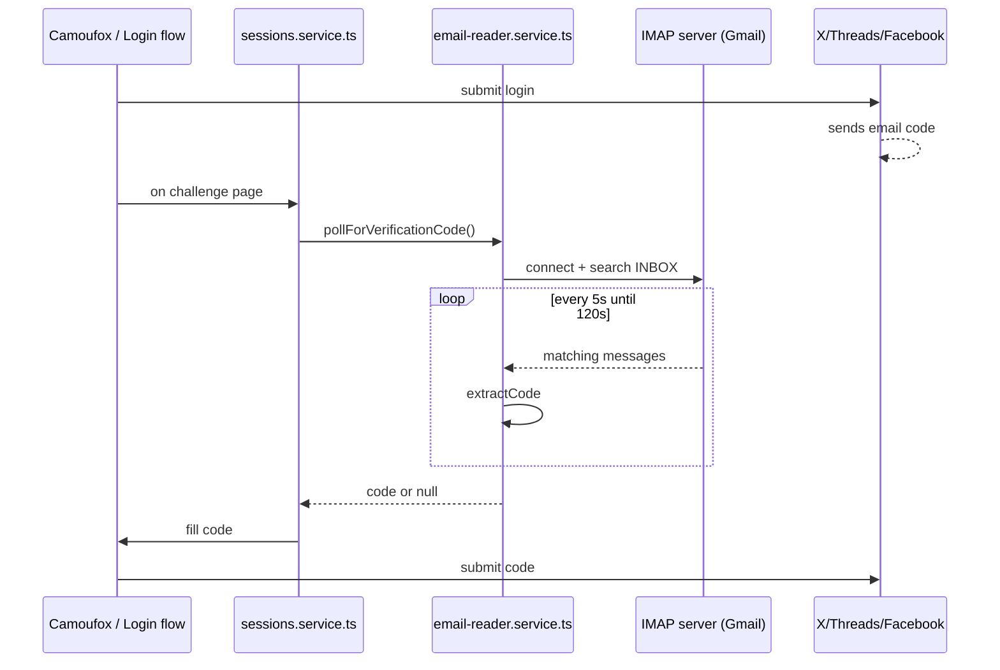

# Module: `infrastructure/email`

## 1. What this module does

`infrastructure/email` provides an IMAP-based email reader for automatically retrieving 2FA/verification codes during the auto-login flow. It is used by `SessionsService` when X or another network sends a one-time code to a configured email account during a login challenge.

Key responsibilities:

- Connect to an IMAP server (Gmail by default) using `imapflow`.
- Search the `INBOX` for recent unread emails from a configurable sender filter (default `x.com`).
- Extract a 4-8 digit verification code from the subject or body.
- Support one-off `fetchVerificationCode()` and repeated `pollForVerificationCode()` calls.
- Gracefully disable when `EMAIL_USER` or `EMAIL_PASSWORD` is not set.

The module does not send email. It only reads emails and is narrowly scoped to verification-code retrieval.

## 2. Key files & public API

| File | Role | Public API |
|------|------|------------|
| `packages/backend/src/infrastructure/email/email-reader.service.ts` | IMAP client and code extraction | `EmailReaderService` — `fetchVerificationCode(sinceMs?)`, `pollForVerificationCode(timeoutMs?, intervalMs?)` |
| `packages/backend/src/infrastructure/email/email.module.ts` | Global NestJS module | `@Global()` module providing/exporting `EmailReaderService` |

## 3. Architecture & data flow

### 3.1 Lifecycle and configuration

- `EmailModule` is `@Global()` (`email.module.ts:4`), so `EmailReaderService` is available everywhere.
- `EmailReaderService` constructor reads `process.env` directly (not `ConfigService`) (`email-reader.service.ts:33-37`):
  - `EMAIL_IMAP_HOST` (default `imap.gmail.com`)
  - `EMAIL_IMAP_PORT` (default `993`)
  - `EMAIL_USER` (default `''`)
  - `EMAIL_PASSWORD` (default `''`)
  - `EMAIL_FROM_FILTER` (default `x.com`)
- `enabled` is true only when both `user` and `password` are non-empty.

### 3.2 Typical call patterns

- `sessions.service.ts` calls `emailReaderService.pollForVerificationCode()` (or `fetchVerificationCode`) when it detects a 2FA/challenge page during auto-login.
- `fetchVerificationCode`:
  1. Creates a new `ImapFlow` client.
  2. Connects and locks the `INBOX`.
  3. Searches for emails from `fromFilter` since `Date.now() - sinceMs` (default 5 minutes).
  4. Fetches the latest matching message by sequence number.
  5. Concatenates subject and body, then extracts a code.
  6. Logs out and returns the code or `null`.
- `pollForVerificationCode` repeats `fetchVerificationCode` every 5s for up to 120s.

### 3.3 Code extraction

`extractCode` uses three regex patterns in order:

1. `/(?:code(?:\s+is)?|verification|confirm(?:ation)?)[\s:]*?(\d{4,8})/i` — keyword-prefixed code.
2. `/\b(\d{6})\b/` — standalone 6-digit number.
3. `/\b(\d{4,8})\b/` — any 4-8 digit number.

The first match wins and is returned.

## 4. Dependencies

**Downstream (called by this module):**

- `imapflow` — IMAP client library.
- `process.env` — direct env access.
- `@nestjs/common` — `Injectable`, `Logger`, `Module`, `Global`.

**Upstream (callers of this module):**

| Consumer | Usage |
|----------|-------|
| `modules/sessions/sessions.service.ts` | Poll for verification code during auto-login challenge |

## 5. Environment variables

| Variable | Default | Purpose | Where validated |
|----------|---------|---------|-----------------|
| `EMAIL_IMAP_HOST` | `imap.gmail.com` | IMAP server hostname | `env.validation.ts:21` |
| `EMAIL_IMAP_PORT` | `993` | IMAP server port | `env.validation.ts:22` |
| `EMAIL_USER` | `''` | IMAP username | `env.validation.ts:23` |
| `EMAIL_PASSWORD` | `''` | IMAP password / app password | `env.validation.ts:24` |
| `EMAIL_FROM_FILTER` | `x.com` | Sender filter for IMAP search | `env.validation.ts:25` |

## 6. Findings

### 6.1 Bugs / correctness

#### B1 — `EmailReaderService` reads `process.env` directly instead of using `ConfigService`

`email-reader.service.ts:33-37` reads `process.env` directly. This bypasses `env.validation.ts` defaults and makes the service harder to test with mocked config. It is also inconsistent with the rest of the codebase.

**Fix**: Inject `ConfigService` and use `configService.get<string>('EMAIL_USER', '')`.

#### B2 — `EMAIL_FROM_FILTER` is used as `from:` search but not validated

IMAP `FROM` search accepts a substring. If an operator sets `EMAIL_FROM_FILTER=noreply@x.com` (a full address), the search may fail depending on the IMAP server. If it is set to a domain `x.com`, it usually works. The service does not validate or document this.

**Fix**: Document that `EMAIL_FROM_FILTER` should be a domain substring (e.g., `x.com`) and add a regex helper for common formats. Alternatively, use `header` search with `FROM` contains.

#### B3 — `pollForVerificationCode` can fetch the same stale code repeatedly

`pollForVerificationCode` calls `fetchVerificationCode()` each interval, which searches the same `since` window and fetches the latest message. If a code was already used in a previous poll, it may be returned again if no new email arrives. The service does not track which UIDs/sequence numbers have been consumed.

**Fix**: Track the last processed UID or sequence number and skip older messages. Or, after a successful extraction, mark the email as `Seen`/`Deleted`.

#### B4 — `fetchVerificationCode` fetches only the latest message, not the most recent by time

It uses `messages[messages.length - 1]` as the latest message. IMAP sequence numbers are ordered by arrival, so this is usually the most recent. However, if the mailbox is reordered or if sequence numbers are not contiguous, this may not be the most recent by `Date`. It also does not sort by `Date`.

**Fix**: Use `fetch` with `uid` and sort by `envelope.date` descending, or use a reverse search.

#### B5 — No handling of `SEEN` flag or deletion

The service leaves the email as unread. It may return the same code in a future call if the email is still the most recent.

**Fix**: After successfully extracting a code, mark the message as `\Seen` or `\Deleted` to avoid reuse.

#### B6 — `extractCode` is too permissive and may return false positives

A 6-digit number could be a phone number, date, or order number. The keyword pattern helps, but the fallback `\b(\d{4,8})\b` may return an arbitrary number. For example, a marketing email with a 6-digit "2,000,000" could be returned as `200000` (if punctuation is stripped).

**Fix**: Add more specific patterns for known providers (X: `Your confirmation code is XXXXXX`) and require a minimum context.

#### B7 — `extractCode` does not strip HTML/encoded text before regex matching

`msg.source` is the raw message source (including headers, HTML, base64 encoded parts, etc.). The code is currently matched against the raw source. HTML entities or base64-encoded text may hide the code.

**Fix**: Use `imapflow` `bodyParts` or a text-extraction library to get a clean text/plain or decoded body before regex matching.

#### B8 — `pollForVerificationCode` uses a busy-wait `setTimeout` loop

It does not use an IMAP idle listener. Each poll opens a new connection, logs in, searches, and logs out. This is inefficient and may trigger Gmail connection limits.

**Fix**: Use `client.idle()` or maintain a persistent connection while polling. Or use shorter intervals with a single connection.

#### B9 — `fetchVerificationCode` returns `null` on any error, swallowing diagnostics

IMAP errors, authentication failures, and extraction failures all return `null` and log a warning. Callers cannot distinguish between "no code" and "IMAP broken".

**Fix**: Return a `Result` type or throw an error for IMAP failures, and let `pollForVerificationCode` decide whether to retry or abort.

### 6.2 Performance

#### P1 — New IMAP connection per poll

Every `fetchVerificationCode` call creates a new `ImapFlow` client, connects, searches, and logs out. `pollForVerificationCode` does this every 5 seconds. Over 120 seconds, that's 24 full connections. This is heavy for the IMAP server and may be rate-limited.

**Fix**: Open one connection for the duration of `pollForVerificationCode` and reuse it.

#### P2 — `fetchOne` retrieves the full `source` of the message

`client.fetchOne(seq, { envelope: true, source: true })` downloads the entire raw message, including attachments and HTML. This is unnecessary for code extraction.

**Fix**: Fetch only `bodyParts` for `text/plain` or `text/html` and decode as needed.

#### P3 — No caching of the IMAP client

If multiple login attempts happen in quick succession, each creates a new connection. There is no connection pool or connection reuse.

**Fix**: Keep a single `ImapFlow` client per process, or reuse the client for the duration of a polling session.

### 6.3 Architecture / anti-patterns

#### A1 — `EmailModule` is `@Global()`

`email.module.ts:4` is global. It exposes `EmailReaderService` everywhere, even though only `SessionsService` uses it.

**Fix**: Remove `@Global()` and import `EmailModule` in `SessionsModule`.

#### A2 — No `IEmailReaderPort` or domain port

The service is concrete. A domain port `IEmailReaderPort` with `fetchVerificationCode()` and `pollForVerificationCode()` would allow testing with a mock.

**Fix**: Add `IEmailReaderPort` to `domain/ports` and bind `EmailReaderService`.

#### A3 — `EmailReaderService` is responsible for both IMAP and regex extraction

The extraction logic is mixed with IMAP connection logic. The `extractCode` regex is reasonable for a single provider but may not scale to multiple providers.

**Fix**: Split into `ImapClient` and `VerificationCodeExtractor` with provider-specific extractors.

### 6.4 TypeScript / type safety

#### T1 — `msg.source` is cast to `Buffer` or `String`

`email-reader.service.ts:90-92` handles `msg.source instanceof Buffer` and `String(msg.source ?? '')`. The `imapflow` types may have a more specific type; the casting is loose.

**Fix**: Use `bodyParts` with proper typing and decoding.

#### T2 — `extractCode` returns `string | null` but callers may not handle `null` well

`sessions.service.ts` likely handles `null` by falling back to manual intervention or failing. This is fine but should be documented.

### 6.5 Security / reliability

#### S1 — `EMAIL_PASSWORD` is an app-specific password stored in env

This is standard for Gmail app passwords, but the password is exposed via `process.env`. If logs leak, it could be used to read the email account. The `RedactInterceptor` may or may not redact this; it is not in `env.validation.ts` as a secret.

**Fix**: Mark `EMAIL_PASSWORD` as a secret in `RedactInterceptor` and logging config. Do not log it.

#### S2 — IMAP `secure` is based only on port 993

`secure: this.port === 993` (line 153). If someone uses port 143 with TLS, `secure` is false and the connection is plaintext. If port 465 is used, `imapflow` may not support it.

**Fix**: Add `EMAIL_IMAP_SECURE` flag and/or validate that secure is true for any non-localhost server.

#### S3 — No TLS certificate verification option

The IMAP client uses default TLS settings. There is no option to pin certificates or disable verification for testing. Default is acceptable.

**Fix**: Not critical; document default behavior.

#### S4 — `fromFilter` uses a domain substring that may be spoofed

If an attacker sends an email with `From` containing `x.com`, the IMAP search may return it. This is a phishing risk, but the code extraction still requires the correct code. The real threat is if the code can be guessed or reused.

**Fix**: Use a full `From` address and verify DKIM/SPF where possible (beyond scope of this module).

## 7. New feature / improvement ideas

1. **Use `ConfigService` instead of `process.env`** for consistency and testability.
2. **Add `IEmailReaderPort` and remove `@Global()`** to align with hexagonal architecture.
3. **Persistent connection during polling** to avoid 24 connections per login attempt.
4. **Track last seen UID** and skip older messages to avoid returning the same code twice.
5. **Decode email bodies properly** before regex extraction (handle HTML, base64, quoted-printable).
6. **Provider-specific code extractors** (X, Threads, Facebook) with stricter patterns.
7. **Mark emails as read** after successful extraction to prevent reuse.
8. **Result type for errors** so callers can distinguish "no code" from "IMAP failure".
9. **Add `EMAIL_IMAP_SECURE` env var** to enforce TLS.
10. **Connection pooling / reuse** for multiple login attempts.

## 8. Cross-references

| File / module | Why it matters |
|---------------|----------------|
| `packages/backend/src/infrastructure/email/email-reader.service.ts` | Core IMAP reader and code extraction |
| `packages/backend/src/infrastructure/email/email.module.ts` | Global module wiring |
| `packages/backend/src/modules/sessions/sessions.service.ts` | Consumer of email verification codes |
| `packages/backend/src/infrastructure/config/env.validation.ts:21-25` | Env validation for IMAP credentials |
| `packages/backend/src/infrastructure/logging/logging.module.ts` | Logging/redaction of secrets |
| `packages/backend/src/modules/sessions/sessions.module.ts` | Should import `EmailModule` if `@Global()` removed |

## 9. Overall assessment

| Dimension | Health (1-5) | Notes |
|-----------|--------------|-------|
| Correctness | 3 | Works for basic Gmail/X verification, but many edge cases (HTML, reused code, stale email, false positives) are not handled. |
| Performance | 2 | Creates a new IMAP connection for each poll; inefficient for repeated polling. |
| Architecture | 2 | No port, global module, mixed IMAP/extraction concerns. |
| Type safety | 3 | Loose handling of `msg.source` and env access. |
| Security / reliability | 3 | App password in env is standard, but `fromFilter` spoofing and no TLS enforcement are concerns. |

**Top 5 risks:**

1. **New IMAP connection per poll** — heavy, rate-limit-prone, slow.
2. **No UID tracking** — same stale code may be returned repeatedly.
3. **Raw source regex extraction** — HTML/base64/encoded text may hide codes.
4. **Direct `process.env` reads** — inconsistent with codebase and harder to test.
5. **No `IEmailReaderPort` / `@Global()`** — architectural inconsistency.

## 10. Recommended next actions (prioritized)

| Rank | Action | Effort | Module(s) |
|------|--------|--------|-----------|
| 1 | Use `ConfigService` instead of `process.env` | XS | `infrastructure/email` |
| 2 | Keep a single IMAP connection during `pollForVerificationCode` | S | `infrastructure/email` |
| 3 | Track last processed UID and skip older messages | S | `infrastructure/email` |
| 4 | Decode `text/plain` or `text/html` body parts before extraction | S | `infrastructure/email` |
| 5 | Add stricter provider-specific code extraction patterns | S | `infrastructure/email` |
| 6 | Mark emails as read after extraction | XS | `infrastructure/email` |
| 7 | Add `IEmailReaderPort` and remove `@Global()` | S | `domain/ports`, `infrastructure/email`, `modules/sessions` |
| 8 | Add `EMAIL_IMAP_SECURE` env var and enforce TLS | XS | `infrastructure/email`, `infrastructure/config` |
