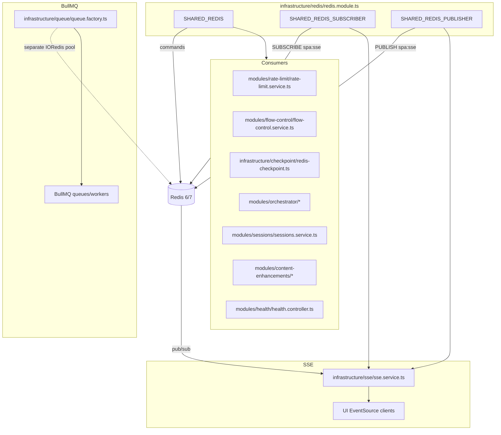

# Module: `infrastructure/redis`

## 1. What this module does

`infrastructure/redis` is a thin, shared Redis connection module for the backend. It centralizes `ioredis` connection creation so that the many Redis-consuming services do not each open their own TCP connections.

It provides three global DI tokens:

- `SHARED_REDIS` — general-purpose command connection (rate limits, checkpoints, flow control, orchestrator state, caches, verification codes, etc.)
- `SHARED_REDIS_SUBSCRIBER` — pub/sub subscriber connection (SSE events)
- `SHARED_REDIS_PUBLISHER` — pub/sub publisher connection (SSE events)

Redis is used throughout the backend for:

- **Pub/Sub SSE** (`SseService`) — workers publish to a Redis channel, `SseService` subscribes and fans out to UI clients.
- **Rate limiting** (`RateLimitService`) — per-network sliding-window counters for posts and engagement actions.
- **Flow control** (`FlowControlService`) — runtime pause/resume flags.
- **LangGraph checkpointing** (`RedisCheckpointSaver`) — crash-resume and HITL for the generation graph and orchestrator loop.
- **Orchestrator state** (`OrchestratorService`, `OrchestratorHistoryService`, `HardRulesService`, `DecisionEngineService`, `StateCollectorService`, `PostingWindowService`, `WatchdogCron`) — heartbeats, action history, cooldowns, action-rate tracking, heatmap cache.
- **Session verification codes** (`SessionsService`) — temporary 2FA/challenge codes shared between the browser login flow and the operator API.
- **Content enhancement caches** (`HookPerformanceBank`, `ContentPillarTracker`) — hook performance stats, 7-day pillar rotation counts.
- **Health checks** (`HealthController`) — Redis connectivity probe.
- **BullMQ queues** (`QueueFactory`) — Redis-backed queues and workers. **Note:** BullMQ does **not** consume the shared `SHARED_REDIS` tokens; it creates its own `IORedis` instances in `queue.factory.ts`.

## 2. Key files & public API

| File | Role | Public API |
|------|------|------------|
| `infrastructure/redis/redis.module.ts` | Global Redis connection module | `RedisModule` (global), `SHARED_REDIS`, `SHARED_REDIS_SUBSCRIBER`, `SHARED_REDIS_PUBLISHER` tokens |

That is the only file in `packages/backend/src/infrastructure/redis/`. The module is `@Global()` and exports all three tokens.

## 3. Architecture & data flow

### 3.1 Shared Redis connections



### 3.2 Connection factory

`RedisModule` registers three providers with identical `useFactory` bodies (`redis.module.ts:40-76`):

```ts
{
  provide: SHARED_REDIS,
  inject: [ConfigService],
  useFactory: (config: ConfigService) => {
    const url = config.get<string>('REDIS_URL', 'redis://localhost:6381');
    return new IORedis(url, {
      maxRetriesPerRequest: null,
      lazyConnect: true,
      retryStrategy: (times: number) => Math.min(times * 500, 5000),
    });
  },
}
```

- `REDIS_URL` is read from `ConfigService` with a default of `redis://localhost:6381` (`redis.module.ts:45`, `redis.module.ts:57`, `redis.module.ts:69`).
- `maxRetriesPerRequest: null` disables per-request retries (the setting BullMQ requires; it is also applied to the general-purpose connection even though not all consumers are BullMQ).
- `lazyConnect: true` avoids blocking module initialization while Redis is unavailable; the first command triggers the TCP connection.
- `retryStrategy` gives a linear 500 ms backoff capped at 5 s.

The module is `@Global()` (`redis.module.ts:38`), so any module in the app can inject `SHARED_REDIS` without importing `RedisModule` explicitly. `RedisModule` itself is imported once in `AppModule` (`app.module.ts:82`).

### 3.2 Shared connection consumers

Services inject `SHARED_REDIS` and issue Redis commands directly:

- `RateLimitService` uses `get`/`incr`/`expire` for sliding-window counters (`rate-limit.service.ts:143-221`).
- `FlowControlService` uses `get`/`set`/`del` for pause flags (`flow-control.service.ts:45-122`).
- `RedisCheckpointSaver` uses `get`/`set`/`scan`/`lrange`/`rpush`/`expire` for checkpoint tuples and pending writes (`redis-checkpoint.ts:74-220`).
- `OrchestratorService` writes a heartbeat via `set` and deletes checkpoints via `keys` (`orchestrator.service.ts:167-178`, `:238-244`).
- `OrchestratorHistoryService` uses `lpush`/`lrange`/`ltrim` (`orchestrator-history.service.ts:28-49`).
- `DecisionEngineService` uses `zremrangebyscore`/`zcount`/`zadd`/`expire` for an action-rate sorted set (`decision-engine.service.ts:199-221`).
- `HardRulesService` uses `pttl`/`set` for a recover cooldown (`hard-rules.service.ts:130-148`).
- `StateCollectorService` uses `SHARED_REDIS` and `RateLimitService`/`QueueFactory` to build `WorldState` (`state-collector.service.ts:30-72`, `:201-220`).
- `PostingWindowService` uses `get`/`setex` for a 1-hour heatmap cache (`posting-window.service.ts:99-119`).
- `WatchdogCron` reads the orchestrator heartbeat (`watchdog.cron.ts:55-69`).
- `SessionsService` stores and polls 2FA verification codes (`sessions.service.ts:1486-1519`).
- `HealthController` pings `SHARED_REDIS` with `withTimeout` (`health.controller.ts:38-44`).
- `HookPerformanceBank` uses a `multi`/`pipeline` to write stats per network (`hook-performance-bank.ts:225-253`).
- `ContentPillarTracker` uses `get`/`incr`/`expire` for rolling 7-day counts (`content-pillar.tracker.ts:128-183`).

### 3.3 Pub/Sub (SSE)

`SseService` receives separate `SHARED_REDIS_SUBSCRIBER` and `SHARED_REDIS_PUBLISHER` injections (`sse.service.ts:28-29`).

- `SseModule.onModuleInit` calls `sseService.init()`, which `subscribe`s to `SSE_CHANNEL` (default `spa:sse`) and attaches a `message` listener (`sse.service.ts:34-43`).
- Workers/services call `sseService.publish(event)` to `publish` JSON events to the same channel (`sse.service.ts:106-153`).
- Using two connections is correct: once a Redis connection enters subscriber mode, it can only issue `SUBSCRIBE`/`UNSUBSCRIBE`.

### 3.4 BullMQ connection split

`QueueFactory` does **not** use `SHARED_REDIS`. It constructs its own `IORedis` instances in `getConnectionOpts()` (`queue.factory.ts:118-156`):

- `sharedClient` and `sharedSubscriber` are created once and reused for all `Queue`/`Worker` `client`/`subscriber` slots.
- A fresh `IORedis` is created for every `bclient` (blocking client) because blocking commands cannot be multiplexed.
- `QueueFactory` closes its own connections in `onModuleDestroy` (`queue.factory.ts:92-109`).

This means the backend has at least two independent connection pools: the three from `RedisModule` plus the BullMQ pool. The comment in `queue.factory.ts:41-45` acknowledges the connection count concern but does not leverage the shared module.

## 4. Dependencies

**Downstream (called by this module):**

- `ioredis` (v5.x) — `IORedis` client and `Redis`/`RedisOptions` types.
- `@nestjs/config` `ConfigService` — reads `REDIS_URL`.
- `@nestjs/common` — `Module`, `Global`, provider/factory decorators.

**Upstream (callers of this module):**

| Consumer | Token used | Usage |
|----------|------------|-------|
| `infrastructure/sse/sse.service.ts` | `SHARED_REDIS_SUBSCRIBER`, `SHARED_REDIS_PUBLISHER` | SSE pub/sub |
| `infrastructure/checkpoint/redis-checkpoint.ts` | `SHARED_REDIS` | LangGraph checkpoint persistence |
| `modules/rate-limit/rate-limit.service.ts` | `SHARED_REDIS` | Sliding-window rate limits |
| `modules/flow-control/flow-control.service.ts` | `SHARED_REDIS` | Pause/resume flags |
| `modules/orchestrator/orchestrator.service.ts` | `SHARED_REDIS` | Heartbeat, checkpoint reset |
| `modules/orchestrator/orchestrator-history.service.ts` | `SHARED_REDIS` | Cycle history list |
| `modules/orchestrator/hard-rules.service.ts` | `SHARED_REDIS` | Recover cooldown |
| `modules/orchestrator/decision-engine.service.ts` | `SHARED_REDIS` | Action-rate sorted set |
| `modules/orchestrator/posting-window.service.ts` | `SHARED_REDIS` | Heatmap cache |
| `modules/orchestrator/state-collector.service.ts` | `SHARED_REDIS` | World state assembly |
| `modules/orchestrator/watchdog.cron.ts` | `SHARED_REDIS` | Heartbeat monitoring |
| `modules/sessions/sessions.service.ts` | `SHARED_REDIS` | 2FA verification codes |
| `modules/health/health.controller.ts` | `SHARED_REDIS` | Health ping |
| `modules/content-enhancements/hook-performance-bank.ts` | `SHARED_REDIS` | Hook performance stats cache |
| `modules/content-enhancements/content-pillar.tracker.ts` | `SHARED_REDIS` | Pillar rotation counts |

`infrastructure/queue/queue.factory.ts` uses Redis but does **not** consume these tokens.

## 5. Environment variables

### Direct connection configuration

| Variable | Default | Where used | Purpose |
|----------|---------|------------|---------|
| `REDIS_URL` | `redis://localhost:6381` | `redis.module.ts:45,57,69`; `queue.factory.ts:53` | Redis server URL |

### Key/prefix/TTL configuration used with `SHARED_REDIS`

| Variable | Default | Where used | Purpose |
|----------|---------|------------|---------|
| `SSE_CHANNEL` | `spa:sse` (code default) | `sse.service.ts:31` | Pub/sub channel for SSE |
| `RATE_LIMIT_PREFIX` | `spa:ratelimit` | `rate-limit.service.ts:46` | Rate limit key prefix |
| `CHECKPOINT_TTL_SECONDS` | `604800` (7 days) | `redis-checkpoint.ts:48` | Checkpoint/writes TTL |
| `CHECKPOINT_PREFIX` | `spa:checkpoint` | `redis-checkpoint.ts:49` | Checkpoint key prefix |
| `ORCHESTRATOR_HEARTBEAT_KEY` | `spa:orchestrator:heartbeat` | `orchestrator.service.ts:67`; `watchdog.cron.ts:35` | Heartbeat key |
| `ORCHESTRATOR_HEARTBEAT_TTL_MS` | `600000` | `orchestrator.service.ts:68`; `watchdog.cron.ts:36` | Heartbeat TTL |
| `ORCHESTRATOR_HISTORY_KEY` | `spa:orchestrator:history` | `orchestrator-history.service.ts:25` | Cycle history list key |
| `ORCHESTRATOR_MAX_ACTIONS_PER_HOUR` | `60` | `decision-engine.service.ts:47` | Action-rate guardrail |
| `POSTING_WINDOW_MIN_SAMPLES` | `10` | `posting-window.service.ts:43` | Heatmap cold-start threshold |
| `POSTING_WINDOW_TOP_HOURS` | `3` | `posting-window.service.ts:44` | Hours recommended per network |
| `POSTING_WINDOW_DECAY_DAYS` | `30` | `posting-window.service.ts:45` | Heatmap decay half-life |
| `POSTING_WINDOW_FALLBACK_HOURS` | `9,12,18,21` | `posting-window.service.ts:46` | Fallback posting hours |
| `POSTING_WINDOW_BYPASS` | `false` | `posting-window.service.ts:48` | Bypass posting window logic |
| `BAN_DETECTION_WINDOW_HOURS` | `2` | `state-collector.service.ts:359` | Ban detection window |
| `TOPIC_POOL_MIN` | `30` | `state-collector.service.ts:35` | Topic pool threshold |
| `FORM_LOGIN_COOLDOWN_MS` | `0` | `sessions.service.ts:119` | Cooldown between form logins |
| `SESSION_DEFERRED_LOGIN` | `false` | `sessions.service.ts:120` | Defer login to cron |
| `HOOK_BANK_AGGREGATE_SCHEDULE` | `0 7 * * *` | `hook-performance-bank.ts:127` | Hook bank aggregation cron |

`BULLMQ_*` variables are documented in `docs/reviews/queue.md` and `queue.factory.ts` because BullMQ bypasses `RedisModule`.

## 6. Findings

### 6.1 Bugs / correctness

**B1. `RedisModule` does not manage connection lifecycle or errors.**
`redis.module.ts:40-79` creates three `IORedis` instances but never attaches `error`/`close`/`reconnecting` listeners, never implements `OnModuleDestroy`, and never calls `quit()`/`disconnect()`. `ioredis` extends `EventEmitter`; an unhandled `error` event (e.g., connection refused) can throw and crash the process. NestJS graceful shutdown (`app.close()`) may also hang because the TCP keep-alives are still open.

**B2. `QueueFactory` duplicates the Redis connection logic and bypasses `RedisModule`.**
`queue.factory.ts:53` reads `REDIS_URL` independently, and `queue.factory.ts:118-156` creates its own `IORedis` connections. This undermines the "single shared connection" goal of `RedisModule` and makes the connection count hard to reason about. The `connection: { url: this.redisUrl }` field in `queue.factory.ts:135` is also redundant when `createClient` is provided.

**B3. `OrchestratorService.resetCheckpoint` uses `KEYS` instead of `SCAN`.**
`orchestrator.service.ts:170` calls `this.redis.keys('${CHECKPOINT_KEY_PREFIX}*')`. `KEYS` is O(N) and blocks the Redis server. `RedisCheckpointSaver` already uses `SCAN` correctly (`redis-checkpoint.ts:74-82`); the orchestrator should delegate to it or use `SCAN`.

**B4. `RateLimitService` interaction limits silently ignore `0`.**
`rate-limit.service.ts:76-79` and `:96-97` use `Number(this.configService.get<string>(...)) || def`. If an operator sets `RATE_LIMIT_INTERACTION_LIKE_MAX_PER_DAY=0` to disable likes, the `||` treats `0` as falsy and falls back to `60`/`300`.

**B5. `env.validation.ts` only validates `REDIS_URL`; many Redis-related env vars are missing.**
`env.validation.ts:99` defines `REDIS_URL: Joi.string().default('redis://localhost:6381')`. It does not include `SSE_CHANNEL`, `RATE_LIMIT_PREFIX`, `CHECKPOINT_TTL_SECONDS`, `CHECKPOINT_PREFIX`, `ORCHESTRATOR_HEARTBEAT_KEY`, `ORCHESTRATOR_HISTORY_KEY`, `POSTING_WINDOW_*`, `BAN_DETECTION_WINDOW_HOURS`, `HOOK_BANK_AGGREGATE_SCHEDULE`, `FORM_LOGIN_COOLDOWN_MS`, etc. Typos or missing values silently fall back to code defaults, which can be hard to debug.

**B6. `RedisCheckpointSaver.listKeysForThread` extracts IDs by naive `split(':')`.**
`redis-checkpoint.ts:237-240` takes `parts[parts.length - 1]` as the checkpoint ID. The default `CHECKPOINT_PREFIX` (`spa:checkpoint`) and `thread_id` (`${runId}:${topic}`) make this work, but if a prefix or ID contains a colon, the extracted ID is wrong.

**B7. `SseService.publish` and `FlowControlService` do not swallow Redis pub/sub errors.**
`sse.service.ts:151-152` awaits `this.publisher.publish(...)` without `try/catch`. `flow-control.service.ts:66-107` awaits `sseService.publish(...)` after state changes. If the publisher connection is down, `publish` rejects, and `pause`/`resume`/`pauseAll`/`resumeAll` throw instead of completing and just notifying later. This couples flow-control reliability to SSE delivery.

**B8. `RedisCheckpointSaver` JSON parsing is unguarded.**
`redis-checkpoint.ts:97`, `:108`, `:163` cast `JSON.parse(...)` to expected types without validation. If a checkpoint value is corrupted, the parse or downstream code can throw. A `try/catch` + fallback or Zod schema would be safer.

### 6.2 Performance

**P1. `QueueFactory` does not reuse `RedisModule` connections.**
See B2. The comment in `queue.factory.ts:41-45` is about reducing connection count, but the shared module that was built for that purpose is not used. BullMQ requires `maxRetriesPerRequest: null` and unique `bclient`s, but the `client`/`subscriber` slots can still be satisfied by `SHARED_REDIS`/`SHARED_REDIS_SUBSCRIBER`/`SHARED_REDIS_PUBLISHER`.

**P2. Multi-key reads are not batched in `FlowControlService` or `RateLimitService`.**
`flow-control.service.ts:116-120` reads five flow keys sequentially inside a loop. `rate-limit.service.ts:157-186` reads daily, weekly, and interval keys sequentially. Both could use `mget` or `pipeline` to reduce Redis round trips.

**P3. `RedisCheckpointSaver.list` and `listKeysForThread` fetch values one by one after `SCAN`.**
`redis-checkpoint.ts:159-165` and `:226-241` call `this.redis.get(key)` for each key. After `SCAN` returns a batch, an `MGET` would halve the round-trip count.

**P4. `StateCollectorService` still makes many small Redis calls per orchestrator cycle.**
`state-collector.service.ts:201-220` calls `getStatus` per network in parallel, but each `getStatus` (`rate-limit.service.ts:253-257`) does three `get`s. The `collectRateLimits` call could batch all `get`s for all networks in one pipeline.

**P5. `RedisCheckpointSaver.put` stores the same tuple twice.**
`redis-checkpoint.ts:197-199` writes `spa:checkpoint:{threadId}:{checkpointId}` and `spa:checkpoint:{threadId}` (latest pointer) with the same `JSON.stringify(tuple)` payload. This doubles the per-checkpoint memory usage.

### 6.3 Architecture / anti-patterns

**A1. `RedisModule` is too thin.**
It only exports three `IORedis` instances. There is no centralized `createRedisConnection` factory, no connection-name, no `enableAutoPipelining`, no `connectTimeout`, no `commandTimeout`, and no lifecycle/shutdown logic. The value over `new IORedis` is just the `REDIS_URL` default and three `Symbol` tokens.

**A2. `RedisModule` is global but is still imported in some child modules.**
`flow-control.module.ts:11` and `orchestrator.module.ts:64` import `RedisModule` even though it is `@Global()`. Other modules (`rate-limit.module.ts`, `checkpoint.module.ts`, `health.module.ts`, `content-enhancements.module.ts`, `sessions.module.ts`) correctly rely on the global scope. The redundant imports are harmless but noisy.

**A3. No Redis abstraction/port exists.**
Services couple directly to the `SHARED_REDIS` token and `ioredis` types. For a low-level infrastructure adapter this is acceptable, but a small `RedisCache`/`RedisKv` port would let features test against an in-memory mock without `createMockRedis` in every spec.

**A4. `RedisModule` only supports standalone Redis.**
There is no support for Redis Cluster, Sentinel, TLS (`rediss://`), Unix sockets, or connection-name. The `REDIS_URL` string is passed straight to `new IORedis(url)`, so `ioredis` handles many of these natively, but the module does not document or validate which forms are supported.

**A5. `RedisModule` and `QueueFactory` create connections without `error` listeners.**
See B1. A central `RedisModule` should attach `on('error')` and `on('reconnecting')` listeners and surface them through `Logger` so operations can see connection health.

### 6.4 TypeScript / type safety

**T1. Consumers repeat the same `ioredis` instance type.**
`orchestrator.service.ts:57`, `state-collector.service.ts:30`, `hard-rules.service.ts:21`, `decision-engine.service.ts:40`, `posting-window.service.ts:41`, `watchdog.cron.ts:31`, and `orchestrator-history.service.ts:23` all use the verbose `InstanceType<typeof import('ioredis').default>` annotation. `RedisModule` should export a single `type IORedis = InstanceType<typeof import('ioredis').default>` alias.

**T2. `RedisCheckpointSaver` uses `as` casts for parsed JSON.**
`redis-checkpoint.ts:97`, `:108`, `:135`, `:163` cast parsed JSON to `CheckpointTuple`/`{ taskId: string; writes: PendingWrite[] }`. No runtime validation means corrupted Redis values can violate the type contract at runtime.

**T3. `env.validation.ts` only validates `REDIS_URL` as a string.**
`env.validation.ts:99` uses `Joi.string()`. It does not validate the URL scheme, host, port, or auth credentials. `REDIS_URL` with a typo like `redi://localhost:6381` would pass validation and fail later at runtime.

**T4. `RateLimitService` parses interaction limits with `Number(...) || def`.**
`rate-limit.service.ts:76-79` and `:96-97` treat `0` as falsy. The `parseIntEnv` helper in `queue.factory.ts:77-84` is a better pattern for preserving legitimate zero values.

### 6.5 Security / reliability

**S1. `REDIS_URL` may contain credentials and is logged by `QueueFactory`.**
`queue.factory.ts:87-88` logs `this.redisUrl` including the full URL. If `REDIS_URL` contains a password (`redis://:pass@host:port`), the password appears in logs. `RedisModule` itself does not log the URL, but the queue factory bypasses it.

**S2. `RedisModule` does not validate or enforce TLS usage.**
`REDIS_URL` can be `redis://` or `rediss://`, but the module does not warn when plaintext is used. `docker-compose.prod.yml:66` even defaults to `redis://redis:6379` inside the Docker network, which is acceptable for an internal network but not documented.

**S3. `RedisCheckpointSaver` stores full LangGraph state in Redis with `EX` TTL.**
`redis-checkpoint.ts:197` persists the serialized tuple. The tuple contains `checkpoint` and `metadata` which may include post content, topic data, and other state. If Redis persistence (AOF/RDB) is not encrypted, this data is at rest on the Redis server. `infra/docker-compose.yml:37` enables AOF, which is good for durability but increases the at-rest exposure.

**S4. No `connectionName` is set on `IORedis` instances.**
`redis.module.ts` does not pass `connectionName` or `name`. In production `CLIENT LIST`, the three shared connections plus the BullMQ connections are indistinguishable from each other, making debugging and `CLIENT KILL` operations harder.

**S5. `SseService` pub/sub channel is not authenticated or namespaced by environment.**
`SSE_CHANNEL` defaults to `spa:sse` (`sse.service.ts:31`). In a multi-tenant or shared Redis setup, different environments can read each other's events. Prefixing the channel with an environment name (e.g., `prod:spa:sse`) would reduce cross-talk risk.

## 7. New feature / improvement ideas

1. **Add lifecycle and error handling to `RedisModule`.** Implement `OnModuleDestroy` to `quit()` the three shared connections, and attach `on('error')`/`on('reconnecting')` listeners that log through NestJS `Logger` instead of crashing the process.
2. **Make `QueueFactory` reuse `RedisModule` connections.** Use `SHARED_REDIS` for the `client` slot and `SHARED_REDIS_SUBSCRIBER` for the `subscriber` slot, creating only unique `bclient` instances in `QueueFactory`. Remove the duplicate `IORedis` creation in `queue.factory.ts:118-156`.
3. **Centralize `IORedis` options.** Move `maxRetriesPerRequest`, `lazyConnect`, `retryStrategy`, `connectionName`, `enableAutoPipelining`, etc. into a single `createRedisConnection(options)` helper inside `infrastructure/redis` so `RedisModule` and `QueueFactory` share a consistent configuration.
4. **Validate all Redis-related env vars.** Add `SSE_CHANNEL`, `RATE_LIMIT_PREFIX`, `CHECKPOINT_TTL_SECONDS`, `CHECKPOINT_PREFIX`, `ORCHESTRATOR_*`, `POSTING_WINDOW_*`, `BAN_DETECTION_WINDOW_HOURS`, `FORM_LOGIN_COOLDOWN_MS`, `HOOK_BANK_AGGREGATE_SCHEDULE`, and `BULLMQ_*` to `env.validation.ts`.
5. **Batch multi-key reads.** Replace sequential `get` loops in `FlowControlService.getStatus`, `RateLimitService.checkRateLimit`/`getStatus`, and `RedisCheckpointSaver.list` with `mget` or `pipeline`.
6. **Replace `KEYS` with `SCAN` in `OrchestratorService.resetCheckpoint`.** Or delegate deletion to `RedisCheckpointSaver`, which already has a `SCAN` helper.
7. **Fix `RateLimitService` `0` handling.** Use `Number.isFinite` for interaction limits so `0` is respected.
8. **Add a `RedisCache` port/helper.** Abstract `get/setex` with JSON serialization/validation, TTL, and optional key prefixing. `PostingWindowService`, `HookPerformanceBank`, `ContentPillarTracker`, and future caches could use it instead of repeating `get`/`setex`/`JSON.parse`/`JSON.stringify`.
9. **Support Redis Sentinel/Cluster/TLS.** Allow `REDIS_URL` to be optional and add `REDIS_CLUSTER_NODES`, `REDIS_SENTINELS`, or `REDIS_TLS_*` options. At minimum, validate `rediss://` and document TLS usage.
10. **Namespace `SSE_CHANNEL` by environment.** Append `NODE_ENV` or an `APP_ENV` prefix to `SSE_CHANNEL` so dev/staging/prod events do not overlap on a shared Redis instance.
11. **Add connection observability.** Expose Redis connection count, command queue depth, and reconnection metrics (or at least log them) so operators can detect a stale Redis connection.

## 8. Cross-references

- `infrastructure/redis/redis.module.ts` — the shared connection providers
- `infrastructure/sse/sse.service.ts` and `sse.module.ts` — pub/sub over `SHARED_REDIS_SUBSCRIBER`/`SHARED_REDIS_PUBLISHER`
- `infrastructure/queue/queue.factory.ts` — BullMQ connections that bypass `RedisModule`
- `infrastructure/checkpoint/redis-checkpoint.ts` and `checkpoint.module.ts` — LangGraph checkpoint persistence
- `modules/rate-limit/rate-limit.service.ts` and `rate-limit.module.ts` — rate limit counters
- `modules/flow-control/flow-control.service.ts` and `flow-control.module.ts` — pause/resume flags
- `modules/orchestrator/orchestrator.service.ts`, `orchestrator-history.service.ts`, `hard-rules.service.ts`, `decision-engine.service.ts`, `posting-window.service.ts`, `state-collector.service.ts`, `watchdog.cron.ts` — orchestrator Redis usage
- `modules/sessions/sessions.service.ts` — 2FA verification code store
- `modules/health/health.controller.ts` — Redis health check
- `modules/content-enhancements/hook-performance-bank.ts` and `content-pillar.tracker.ts` — analytics/rotation caches
- `app.module.ts` — global `RedisModule` import
- `infrastructure/config/env.validation.ts` — env validation (only `REDIS_URL`)
- `.env.example`, `infra/docker-compose.yml`, `docker/docker-compose.prod.yml` — Redis URL and persistence settings
- `tests/unit/infrastructure/sse.service.spec.ts` and `redis-checkpoint.spec.ts` — unit tests for SSE and checkpoint consumers
- `tests/integration/{top-down,bottom-up,sandwich}.integration.spec.ts` and `tests/e2e/*.e2e.spec.ts` — mock `SHARED_REDIS` tokens directly

## 9. Overall assessment

**Health score: 6 / 10**

`infrastructure/redis` is a small, centralized module that succeeds at its core goal: it gives the rest of the backend a single set of Redis connections rather than a connection per service. The split into `SHARED_REDIS` / `SHARED_REDIS_SUBSCRIBER` / `SHARED_REDIS_PUBLISHER` is correct for SSE pub/sub, and `lazyConnect` keeps module startup from blocking when Redis is unavailable.

The biggest weaknesses are lifecycle and duplication:

- `RedisModule` does not close connections or listen for `error` events, which can cause graceful shutdown hangs and process crashes on connection loss.
- `QueueFactory` creates its own parallel `IORedis` pool, duplicating the same connection logic and increasing the total connection count.
- Several `SHARED_REDIS` consumers use sequential `get` calls, `KEYS`, or unvalidated `JSON.parse` where `mget`/`SCAN`/Zod would be safer and faster.
- `env.validation.ts` only validates `REDIS_URL`; many Redis-related env vars are not declared, so typos or missing values silently fall back to code defaults.

The module is functional today, but it is closer to a thin `IORedis` wrapper than a fully managed Redis infrastructure layer.

**Top recommended next actions:**

1. Add `on('error')` listeners and `OnModuleDestroy` cleanup to `RedisModule` so Redis failures are logged and shutdown is clean.
2. Refactor `QueueFactory` to use `SHARED_REDIS`/`SHARED_REDIS_SUBSCRIBER` for non-blocking client slots and only create new `bclient` instances.
3. Add all Redis-related env vars to `env.validation.ts` and validate `REDIS_URL` as a URI.
4. Replace `OrchestratorService.resetCheckpoint` `KEYS` with `SCAN` and batch sequential reads in `FlowControlService`, `RateLimitService`, and `RedisCheckpointSaver.list`.
5. Fix `RateLimitService` interaction limit parsing so `0` is honored, and add shared `RedisCache` helper to reduce repeated `get`/`setex`/`JSON.stringify` patterns.
