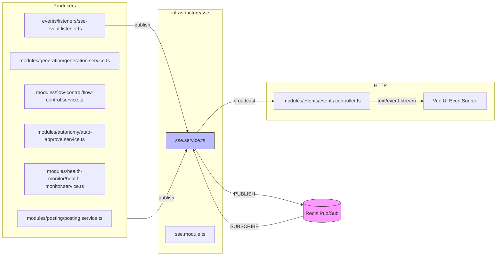

# Module: `infrastructure/sse`

## 1. What this module does

`infrastructure/sse` provides a real-time, one-way event fan-out layer for the Social Poster Agent backend. Its job is to push notifications about post status, generation progress, flow-control changes, health alerts, and other agent lifecycle events to the Vue dashboard.

The architecture is decoupled via Redis Pub/Sub:

- **Producers** (BullMQ workers, `SseService.publish` callers, or the `EventEmitter2` event bus) do not talk to the UI directly. They publish a JSON payload to a single Redis channel.
- **`SseService`** subscribes to that same Redis channel and broadcasts each message to every connected HTTP `EventSource` client.
- **UI** opens `GET /api/v1/events/sse` with `text/event-stream`, using `EventSource` with `withCredentials: true` so the httpOnly JWT cookie is sent.

This means the backend can run multiple instances, or have workers and API separated, and still fan out to the correct UI tab via a shared Redis channel.

## 2. Key files & public API

| File | Role | Public API |
|------|------|------------|
| `infrastructure/sse/sse.service.ts` | Core SSE fan-out | `SseService` — `addClient(res)`, `removeClient(id)`, `publish(event)`, `getConnectedCount()`, `init()`, `onModuleDestroy()`; private `broadcast(message)` |
| `infrastructure/sse/sse.module.ts` | NestJS module | `SseModule` — providers `SseService`, exports `SseService`; `onModuleInit()` calls `sseService.init()` |
| `modules/events/events.controller.ts` | HTTP endpoint | `EventsController` — `GET /events/sse` returns `text/event-stream` and heartbeats |
| `modules/events/events.module.ts` | HTTP module | `EventsModule` imports `SseModule` and registers `EventsController` |
| `events/listeners/sse-event.listener.ts` | EDA bridge | `SseEventListener` — listens to `PostEvents` and `OrchestratorEvents.CYCLE_END` and republishes as SSE |
| `events/events.module.ts` | Event bus module | `EventsEdaModule` registers `EventEmitter2`, `SseEventListener`, `AutoApproveListener` |
| `events/enums/post-events.enum.ts` | Domain events | `PostEvents`, `GenerationEvents`, `OrchestratorEvents`, `SessionEvents` |
| `infrastructure/redis/redis.module.ts` | Shared Redis | `RedisModule` — provides `SHARED_REDIS`, `SHARED_REDIS_SUBSCRIBER`, `SHARED_REDIS_PUBLISHER` for SSE and other infra |

## 3. Architecture & data flow

### 3.1 `SseService` lifecycle

- `SseModule.onModuleInit()` (`sse.module.ts:11`) calls `sseService.init()`.
- `init()` (`sse.service.ts:34`) subscribes `SHARED_REDIS_SUBSCRIBER` to the `SSE_CHANNEL` (`spa:sse` by default, overridable via `SSE_CHANNEL`) and attaches a `message` listener.
- The `message` listener (`sse.service.ts:38`) forwards every Redis payload to `broadcast(message)`.
- `addClient(res)` (`sse.service.ts:49`) creates a `sse-<timestamp>-<random>` id, stores the Express `Response` in an in-memory `Map`, and sends an initial `connected` event.
- `publish(event)` (`sse.service.ts:106`) serializes the event to JSON and calls `this.publisher.publish(channel, json)`.
- `broadcast(message)` (`sse.service.ts:71`) iterates the `clients` map, writes `data: <json>\n\n`, checks `writableEnded`, and handles backpressure by waiting for `drain` with a 5s timeout.
- `onModuleDestroy()` (`sse.service.ts:159`) ends all client responses, clears the map, and unsubscribes from Redis.

### 3.2 `EventsController` HTTP endpoint

- `GET /events/sse` (`events.controller.ts:21`) sets `Content-Type: text/event-stream`, `Cache-Control: no-cache`, `Connection: keep-alive`, `X-Accel-Buffering: no`, flushes headers, and calls `addClient`.
- It starts a `setInterval` heartbeat every 30s that writes `: heartbeat\n\n`.
- Cleanup is on `req.on('close')` (`events.controller.ts:39`), which clears the interval and calls `removeClient`.

### 3.3 Redis backplane

- `RedisModule` (`redis.module.ts`) is a `@Global()` module providing three `IORedis` instances.
- `SHARED_REDIS_SUBSCRIBER` and `SHARED_REDIS_PUBLISHER` are separate because a Redis connection in subscriber mode can only issue `SUBSCRIBE`/`UNSUBSCRIBE`.
- All SSE producers and the fan-out service share the same channel, so events can cross process/instance boundaries.

### 3.4 Event producers

There are two publishing paths:

1. **Direct `SseService.publish` calls** in:
   - `modules/posting/posting.service.ts` — `post_status`
   - `modules/generation/generation.service.ts` — `generation_started`, `generation_progress`, `generation_completed`, `generation_failed`, `generation_paused`, `generation_resumed`
   - `modules/replies/replies-monitor.service.ts` — `replies_monitor`, `reply_posted`
   - `modules/engagement/browsing-session.service.ts` — `browsing_session_started/completed/failed`
   - `modules/engagement/engagement.service.ts` — `interaction_started/completed/failed`
   - `modules/engagement/human-behavior-engine.ts` — `interaction_*`
   - `modules/autonomy/auto-approve.service.ts` — `auto_approve`, `health_alert`
   - `modules/autonomy/autonomous-runner.service.ts` — `autonomous_cycle`
   - `modules/health-monitor/health-monitor.service.ts` — `post_status`, `reconciliation_requeue`, `health_alert`
   - `modules/analytics/metrics-scraper.service.ts` — `health_alert`
   - `modules/flow-control/flow-control.service.ts` — `flow_control`

2. **EventEmitter2 bridge** (`events/listeners/sse-event.listener.ts`):
   - `PostEvents.DRAFT_GENERATED` → `post_status` `DRAFT`
   - `PostEvents.APPROVED` → `post_status` `APPROVED`
   - `PostEvents.POSTING_STARTED` → `post_status` `POSTING`
   - `PostEvents.POSTED` → `post_status` `POSTED` (with `url`)
   - `PostEvents.FAILED` → `post_status` `FAILED` (with `error`)
   - `OrchestratorEvents.CYCLE_END` → `orchestrator_cycle_end`

### 3.5 UI consumption

- `packages/ui/src/composables/useSSE.ts` opens an `EventSource` with `withCredentials: true`, uses exponential backoff (1s → 2s → 4s → 8s → 16s → 30s cap), and parses JSON payloads.
- `packages/ui/src/App.vue` dispatches every event to `postsStore.handleSseEvent` and `monitoringStore.handleSseEvent`, and shows toasts for `POSTED`, `FAILED`, `health_alert`, `reply_posted`, `replies_monitor`.
- `packages/ui/src/views/Generate.vue` listens for `generation_*` events to update its progress bar.
- `packages/ui/src/stores/posts.ts` and `monitoring.ts` use loose `{ type: string; ... }` types, not a shared schema.

## 4. Dependencies

**Downstream (called by this module):**
- `ioredis` `IORedis` for Pub/Sub
- `@nestjs/common` (`Injectable`, `Logger`, `OnModuleInit`, `OnModuleDestroy`, `Module`)
- `@nestjs/config` `ConfigService`
- `express` `Response` type
- `infrastructure/redis/redis.module.ts` `SHARED_REDIS_SUBSCRIBER` / `SHARED_REDIS_PUBLISHER`
- `events/enums/post-events.enum.ts` `PostEvents` / `OrchestratorEvents` (in `SseEventListener`)

**Upstream (callers of this module):**
- `modules/events/events.controller.ts` — `addClient`, `removeClient`
- `events/listeners/sse-event.listener.ts` — `publish` for EDA events
- `modules/posting/posting.service.ts` — direct `post_status` events
- `modules/generation/generation.service.ts` and `generation.graph.ts` — generation progress events
- `modules/replies/replies-monitor.service.ts` — reply events
- `modules/engagement/browsing-session.service.ts`, `engagement.service.ts`, `human-behavior-engine.ts` — engagement events
- `modules/autonomy/auto-approve.service.ts`, `autonomous-runner.service.ts` — autonomy events
- `modules/health-monitor/health-monitor.service.ts` — health/reconciliation events
- `modules/analytics/metrics-scraper.service.ts` — metrics events
- `modules/flow-control/flow-control.service.ts` — pause/resume events
- `modules/posts/posts.service.ts` — emits `PostEvents` consumed by the listener
- `modules/orchestrator/orchestrator.service.ts` — emits `OrchestratorEvents.CYCLE_END`
- `packages/ui/src/composables/useSSE.ts`, `App.vue`, `views/Generate.vue` — consumers

## 5. Environment variables

| Variable | Default | Purpose | Where used |
|----------|---------|---------|------------|
| `SSE_CHANNEL` | `spa:sse` in code, `spa:events` in `.env.example` | Redis Pub/Sub channel for SSE events | `sse.service.ts:31` |
| `REDIS_URL` | `redis://localhost:6381` | Redis connection URL | `redis.module.ts:45,57,69` |
| `AUTH_ENABLED` | `false` | Whether JWT guard is active | `jwt-auth.guard.ts:54` |
| `JWT_SECRET` | `''` | JWT signing secret | `jwt-auth.guard.ts:55` |
| `SPA_API_PREFIX` | `api/v1` | Global API prefix → endpoint `/api/v1/events/sse` | `packages/backend/src/main.ts:88` |
| `VITE_API_URL` | `/api/v1` (UI) | UI base URL for the SSE endpoint | `ui/composables/useSSE.ts` |
| `BULLMQ_QUEUE_PREFIX` | `spa` | BullMQ queue prefix (worker jobs produce SSE events) | `queue.factory.ts:62` |

## 6. Findings

### 6.1 Bugs / correctness

**B1. `post_status` events are duplicated for POSTING, POSTED, and FAILED transitions.**
`posting.service.ts` calls `postsService.updateStatus(...)` (which emits `PostEvents.POSTING_STARTED`, `POSTED`, or `FAILED` in `posts.service.ts:129-136`), and then immediately calls `SseService.publish` with `type: 'post_status'` and the same status (`posting.service.ts:129-135`, `posting.service.ts:509-516`, `posting.service.ts:530-537`). The `SseEventListener` also converts those domain events into `post_status` events (`sse-event.listener.ts:23-107`). The UI therefore receives two `post_status` events for the same state change, and for thread continuations it gets the child events twice as well.

**B2. `SseEventListener` handlers do not await `publish`, so `try/catch` does not catch async rejections.**
`SseService.publish` returns `Promise<void>` (`sse.service.ts:106`). `SseEventListener` calls `this.sseService.publish(...)` without `await` and wraps it in `try/catch` (`sse-event.listener.ts:26-37`). The `catch` only catches synchronous exceptions; an async Redis rejection becomes an unhandled promise rejection. The unit test for this (`tests/unit/events/sse-event.listener.spec.ts`) passes only because the mock `publish` throws synchronously, masking the real behavior.

**B3. `SseService.publish` does not swallow its own Redis errors.**
`publish` awaits `this.publisher.publish(...)` and lets any rejection propagate (`sse.service.ts:151-152`). If Redis is unreachable or the channel is invalid, the `await` in `posting.service.ts`, `flow-control.service.ts`, `auto-approve.service.ts`, etc. throws. In `posting.service.ts` this can cause `postById` to throw, which causes the BullMQ worker to fail the job and retry.

**B4. Backpressure timeout in `broadcast` is not cleared on `drain`, so healthy clients can be removed.**
When `res.write(...)` returns `false`, `broadcast` registers a `drain` listener and a 5s timeout that removes the client (`sse.service.ts:80-94`). If the socket drains before 5s, the `drain` event fires but the timeout is not cleared. The timeout still fires and calls `removeClient`/`res.end()` on a now-healthy client.

**B5. `EventsController` heartbeat interval is not reliably cleaned up on shutdown or response end.**
`EventsController` only listens to `req.on('close')` (`events.controller.ts:39`). If `SseService.onModuleDestroy` calls `res.end()` during a graceful shutdown, `req.on('close')` may not fire, and the 30s `heartbeat` interval continues to call `res.write` on a closed response, producing `ERR_STREAM_WRITE_AFTER_END`.

**B6. `SseService.onModuleDestroy` does not await Redis unsubscribe.**
`this.redis?.unsubscribe(this.channel).catch(() => {})` is a floating promise (`sse.service.ts:172`). The `OnModuleDestroy` hook is synchronous, so the process may exit before the unsubscribe completes.

**B7. `SSE_CHANNEL` default differs between code and `.env.example`.**
`ConfigService.get('SSE_CHANNEL', 'spa:sse')` defaults to `spa:sse` (`sse.service.ts:31`), but `.env.example:264` sets `SSE_CHANNEL=spa:events`. If the variable is unset, code and env documentation disagree. More importantly, if one instance is started with the env and another without, they publish/subscribe on different channels.

**B8. `SSE_CHANNEL` is not declared in `env.validation.ts`.**
`env.validation.ts` validates all other major env vars. `SSE_CHANNEL` is read via `ConfigService` without any schema validation. A misspelled name, empty string, or a malicious value would be used directly as a Redis channel.

**B9. `broadcast` only checks `res.writableEnded`, not `res.destroyed` or `res.writable`.**
`broadcast` removes stale clients only if `writableEnded` is true (`sse.service.ts:75`). If the response is `destroyed` but `writableEnded` is not yet true, `res.write` can throw. The `catch` block handles it, but the cleanup is reactive rather than preventive.

**B10. `EventsController` uses `req.on('close')` instead of `res.on('close')`.**
On some client disconnects `req` emits `close`, but the more reliable signal is `res.on('close')`/`res.on('error')`. Relying only on `req` can leave stale client entries and uncleared heartbeat intervals.

**B11. `SseService` sends all events as generic `message` events.**
`broadcast` only writes `data: <json>\n\n` (`sse.service.ts:80`). It never uses an `event:` field line or `id:` line. This means the UI cannot use `addEventListener('post_status', ...)` and cannot implement `Last-Event-ID` replay.

### 6.2 Performance

**P1. `publish` is awaited by many callers, adding a Redis round-trip to business operations.**
`posting.service.ts`, `flow-control.service.ts`, `auto-approve.service.ts`, and others `await` `SseService.publish`. If the Redis publisher is remote or under load, these operations block. Notification events should be fire-and-forget from the caller's perspective.

**P2. `broadcast` is a single event-loop pass over all clients.**
For a large number of concurrent UI tabs, the `for` loop in `broadcast` can block the event loop. In practice the dashboard has only a handful of clients, but the service has no backpressure-aware batching or `setImmediate` yielding.

**P3. No server-side buffering or replay.**
There is no `Last-Event-ID` support, no Redis stream history, and no in-memory ring buffer. A client that reconnects after a network blip misses every event that was sent during the disconnect.

**P4. `SseService` stores clients in an in-memory Map with no limits.**
`clients` is a `Map<string, Response>` with no maximum size. If `AUTH_ENABLED=false` or a guard is bypassed, an attacker could open thousands of `EventSource` connections and exhaust memory.

### 6.3 Architecture / anti-patterns

**A1. Two overlapping event paths for the same post lifecycle events.**
Direct `SseService.publish` in `posting.service.ts` and the `SseEventListener` bridge both emit `post_status`. The listener comments say it is "additive" (`sse-event.listener.ts:8-10`), but in practice it produces duplicate traffic. A single source of truth should be chosen.

**A2. `SseService` is not abstracted behind a domain port.**
The codebase is otherwise hexagonal: domain modules inject `ILlmPort`, `IBrowserPort`, `IContentPort`, etc. `SseService` is a concrete infrastructure class imported directly by many domain modules. An `ISsePublisher` / `ISsePort` in `domain/ports` would align the architecture.

**A3. `SseService` mixes publishing and client connection management.**
`publish` (Redis PUB) and `addClient`/`broadcast` (HTTP fan-out) are different responsibilities. Splitting into `SsePublisher` and `SseClientManager` would make unit testing and future scaling easier.

**A4. There is no shared `SSEvent` schema.**
`publish` accepts an inline, permissive object (`sse.service.ts:106-150`). The UI stores `data: unknown` and casts it. This makes it easy to add a field on the backend and forget to handle it on the frontend, or vice versa. `packages/shared` should define a Zod schema or discriminated union for SSE events.

**A5. `SseEventListener` is in `events/listeners` but owns SSE payload shapes.**
The listener should be a pure event-bus-to-SSE bridge, but it hardcodes the `post_status` payload shape and status strings. A shared `SSEvent` schema would remove this duplication.

### 6.4 TypeScript / type safety

**T1. `SseService.publish` parameter is `any`-like.**
The parameter is a huge inline object with `type: string` and many optional fields (`sse.service.ts:106-150`). It should be a narrow union type: `SSEvent = { type: 'post_status'; postId: string; status: PostStatus; ... } | { type: 'generation_progress'; ... } | ...`.

**T2. `SseEventListener` handlers are typed as `void` but call an async function.**
`handleDraftGenerated`, `handleApproved`, etc. return `void` but call `this.sseService.publish(...)`. They should be `async` and `await` the publish, or `publish` should return `void` and handle its own errors.

**T3. `useSSE` and UI stores use `unknown` + casts.**
`useSSE` returns `data: Ref<unknown>` and `App.vue` casts it to `{ type: string; ... }`. `postsStore` and `monitoringStore` also use hand-rolled interfaces. A shared Zod schema would give runtime validation and typed parsing.

**T4. `SseService.onModuleDestroy` is `void` but does async work.**
`onModuleDestroy()` returns `void` (`sse.service.ts:159`). The `OnModuleDestroy` interface allows `Promise<void>`, so the method should return `this.redis.unsubscribe(...)` so Nest can await cleanup during graceful shutdown.

### 6.5 Security / reliability

**S1. SSE endpoint is not rate-limited or capped per user/IP.**
`EventsController` accepts any connection and `SseService` stores every `Response` in a map. With `AUTH_ENABLED=false` (default) there is no user identity, so an attacker can exhaust connections. Even with auth enabled, there is no per-user cap, so one admin account could open unlimited tabs.

**S2. Error messages from `posting.service` may leak internal details to the UI.**
`posting.service.ts` publishes `error: (err as Error).message` directly (`posting.service.ts:400`, `posting.service.ts:530`). If the exception contains selector names, stack traces, or internal account state, it is sent to the UI toast.

**S3. `SseService.broadcast` sends every event to every connected client.**
There is no per-user, per-network, or per-post filter. If the dashboard is ever scoped to multiple operators, all users would receive all events. Today the app is single-tenant, but this is a latent multi-tenancy risk.

**S4. `EventsController` is not explicitly listed in `JwtAuthGuard.PUBLIC_SUFFIXES`.**
`jwt-auth.guard.ts:35` only lists `/auth/login` and `/health`. If `AUTH_ENABLED=true`, `/events/sse` requires a valid JWT cookie. The UI `useSSE` correctly sets `withCredentials: true`, so this is intentional rather than a bug — but it should be documented in `jwt-auth.guard.ts` comments.

**S5. `JSON.stringify` in `publish` can throw on circular or non-serializable payloads.**
`publish` does not wrap `JSON.stringify` in a `try/catch` (`sse.service.ts:152`). If a caller accidentally passes a `BigInt`, a function, or a circular object, it throws. The `publish` parameter type is too permissive to catch this at compile time.

## 7. New feature / improvement ideas

1. **Remove duplicate `post_status` events.** Either delete the direct `SseService.publish` calls in `posting.service.ts` and rely on `SseEventListener` as the single source of truth, or remove the listener and let `posting.service.ts` own the UI events.
2. **Make `SseService.publish` non-throwing.** Catch Redis errors internally, log them, and return `void`. Callers should not have business logic disrupted by a notification failure.
3. **Fix `SseEventListener` async handling.** Make the handlers `async` and `await` `publish`, or use `.catch()` on the returned promise, and add a real async test that rejects the promise.
4. **Fix `broadcast` backpressure cleanup.** Clear the 5s timeout inside the `drain` handler so healthy clients are not disconnected after a temporary buffer-full condition.
5. **Improve `EventsController` cleanup.** Listen to `res.on('close')` and `res.on('error')` in addition to `req.on('close')`, and clear the heartbeat on `SseService.onModuleDestroy`.
6. **Introduce a shared `SSEvent` schema in `packages/shared`.** Use Zod or a TypeScript discriminated union. Type `SseService.publish`, UI `useSSE`, and all stores with it.
7. **Add `Last-Event-ID` and event replay.** Buffer the last N events (in Redis, a stream, or an in-memory ring) and send `id:` lines so reconnecting clients can catch up.
8. **Add `event:` type line to SSE messages.** This lets the frontend use `EventSource.addEventListener('post_status', ...)` instead of a single `onmessage` handler.
9. **Add per-IP/per-user connection limits.** Protect `EventsController` from DoS and accidental tab-spam by limiting concurrent SSE connections.
10. **Validate `SSE_CHANNEL` in `env.validation.ts` and align the default.** Either make `spa:sse` the documented default or update the code default to match `.env.example`.
11. **Split `SseService` into `SsePublisher` and `SseClientManager`.** Separate the Redis Pub/Sub producer from the HTTP fan-out consumer for better testability and hexagonal alignment.
12. **Add an `ISsePort` domain port.** Bind `ISsePort` to `SseService` in `SseModule` so domain modules depend on the port, not the concrete class.
13. **Sanitize `error` fields before publishing.** Strip stack traces, internal selectors, and tokens from SSE payloads so the UI only sees user-safe messages.
14. **Add SSE metrics.** Track `connectedClients`, `eventsPerSecond`, `publishLatency`, and `backpressureEvents` for monitoring.

## 8. Cross-references

- `packages/backend/src/infrastructure/sse/sse.service.ts`
- `packages/backend/src/infrastructure/sse/sse.module.ts`
- `packages/backend/src/modules/events/events.controller.ts`
- `packages/backend/src/modules/events/events.module.ts`
- `packages/backend/src/events/listeners/sse-event.listener.ts`
- `packages/backend/src/events/events.module.ts`
- `packages/backend/src/events/enums/post-events.enum.ts`
- `packages/backend/src/infrastructure/redis/redis.module.ts`
- `packages/backend/src/modules/posting/posting.service.ts`
- `packages/backend/src/modules/posts/posts.service.ts`
- `packages/backend/src/modules/generation/generation.service.ts`
- `packages/backend/src/modules/generation/generation.graph.ts`
- `packages/backend/src/modules/queue/queue.module.ts`
- `packages/backend/src/modules/queue/queue.factory.ts`
- `packages/backend/src/modules/engagement/browsing-session.service.ts`
- `packages/backend/src/modules/engagement/engagement.service.ts`
- `packages/backend/src/modules/engagement/human-behavior-engine.ts`
- `packages/backend/src/modules/replies/replies-monitor.service.ts`
- `packages/backend/src/modules/autonomy/auto-approve.service.ts`
- `packages/backend/src/modules/autonomy/autonomous-runner.service.ts`
- `packages/backend/src/modules/health-monitor/health-monitor.service.ts`
- `packages/backend/src/modules/analytics/metrics-scraper.service.ts`
- `packages/backend/src/modules/flow-control/flow-control.service.ts`
- `packages/backend/src/modules/orchestrator/orchestrator.service.ts`
- `packages/backend/src/modules/auth/jwt-auth.guard.ts`
- `packages/backend/src/main.ts`
- `packages/backend/src/infrastructure/config/env.validation.ts`
- `packages/backend/src/infrastructure/queue/queue.factory.ts`
- `packages/ui/src/composables/useSSE.ts`
- `packages/ui/src/App.vue`
- `packages/ui/src/views/Generate.vue`
- `packages/ui/src/stores/posts.ts`
- `packages/ui/src/stores/monitoring.ts`
- `packages/backend/tests/unit/infrastructure/sse.service.spec.ts`
- `packages/backend/tests/unit/events/sse-event.listener.spec.ts`
- `packages/backend/tests/e2e/sse-flow.e2e.spec.ts`

## 9. Overall assessment

**Health score: 6 / 10**

The SSE infrastructure is functional and the Redis Pub/Sub backplane is the right choice for a multi-instance fan-out. The UI `useSSE` composable is well done (exponential backoff, jitter, credentials, cleanup), and the shared `RedisModule` keeps connection counts sane.

However, the module has several correctness and architectural issues: **duplicate `post_status` events** for the same lifecycle transitions, **async error-handling holes** in `SseEventListener` and `generation.graph.ts`, a **backpressure cleanup bug**, **unbounded client growth**, **no shared event schema**, and **missing `SSE_CHANNEL` validation**. The `SseService.publish` method can also throw and disrupt business operations like posting and flow control, because many callers `await` a side-effect notification.

**Top recommended next actions:**

1. Stop the duplicate `post_status` traffic by making `posting.service.ts` use `postsService` domain events exclusively (or removing the listener).
2. Make `SseService.publish` catch and log Redis errors internally so callers can fire-and-forget without risk.
3. Fix `SseEventListener` and `generation.graph.ts` to properly handle the `publish` promise (`await` or `.catch`).
4. Clear the backpressure timeout on `drain` and fix `EventsController` cleanup to use `res.on('close')` and `onModuleDestroy`.
5. Add a shared `SSEvent` schema in `packages/shared` and type both the backend publisher and the frontend composable.
6. Validate `SSE_CHANNEL` in `env.validation.ts` and align the code default with `.env.example`.
7. Add connection caps and consider `Last-Event-ID` replay for better reliability.
