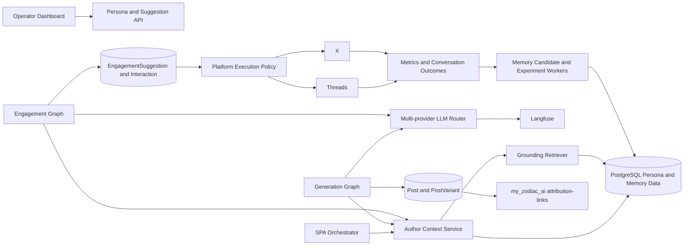
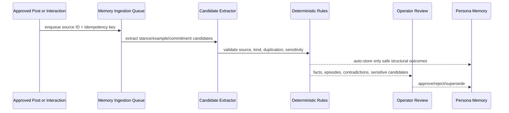
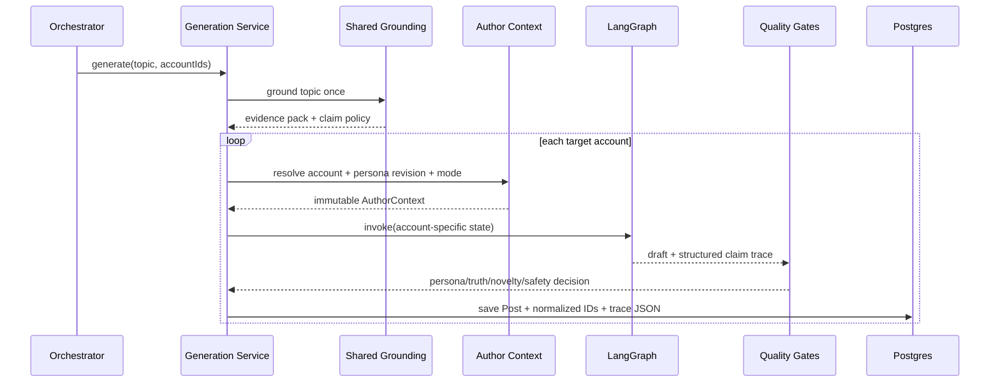
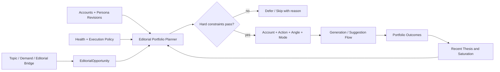
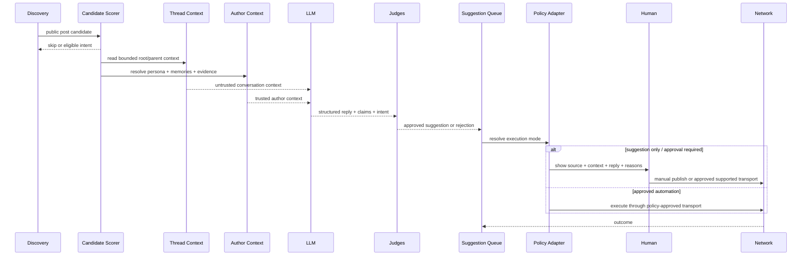

# 08 — Editorial Personas, Conversational Engagement & Memory

> **Document maturity:** DESIGN READY — not implementation status.
> **Canonical feature status:** `PERSONA-001`, `ENGAGE-001`, `GROUND-001` in [the feature register](../planning/FEATURES.md).
> **Roadmap:** `ROADMAP_V2.md` v2.2; spans Z2, Z3, Z5 and phases M1–M6.
> **Initial launch:** 2 English-language accounts on Threads and X; a third persona is optional after the first two pass quality gates.
> **Primary interaction model:** Threads is reply-first; X is suggestion-first until policy and transport requirements permit more automation.
> **Related proposals:** `(01)` multi-account, `(02)` per-account settings, `(04)` per-account prompts, `(05)` token-cost optimization.
> **Architecture decision:** `docs/adr/ADR-008-editorial-persona-memory-and-engagement.md`.

---

## 1. Executive decision

SPA will introduce a versioned **Editorial Persona** layer shared by original-post generation,
outbound conversation suggestions, inbound replies, analytics, and the learning loop.

An editorial persona is a disclosed synthetic authorial voice. It may have stable opinions,
language patterns, humor, and an editorial history, but it must not claim to be a real person or
invent bodily experience, relationships, employment, purchases, illness, pregnancy, or other
real-world biography.

The system separates:

1. **Identity** — stable worldview, temperament, expertise, boundaries, disclosure.
2. **Network adapter** — how the same identity behaves on Threads versus X.
3. **Voice mode** — a bounded, rotatable mode such as `pattern_breakdown` or
   `gentle_reflection`.
4. **Content style** — an ephemeral format such as a short observation, myth-buster, or question.
5. **Verified knowledge** — shared factual grounding with provenance.
6. **Persona memory** — stances, approved examples, and published editorial history.
7. **Interaction memory** — minimal history of prior public conversations.
8. **Experiment assignment** — immutable treatment metadata used for evaluation.

Core identity is fixed per account during a rollout. Voice modes and content styles may rotate;
the persona itself must not randomly change between posts.

---

## 2. Product context

### 2.1 Soulwise domain

Content supports the Soulwise AI product and its three connected areas:

- astrology: natal charts, transits, synastry, compatibility, symbolic interpretation;
- women’s cycles: self-observation, energy, mood, body literacy, cycle-aware reflection;
- relationships and couples: communication, recurring patterns, needs, boundaries, repair.

These are sensitive topics. Astrology must remain an interpretive lens, cycle content must not
become diagnosis or treatment, and relationship content must not make deterministic decisions
for users.

### 2.2 Initial personas

| Persona key                     | Public role                                 | Audience job                                                         | Default tone                         | Primary modes                                                              |
| ------------------------------- | ------------------------------------------- | -------------------------------------------------------------------- | ------------------------------------ | -------------------------------------------------------------------------- |
| `cosmic_analyst`                | Evidence-aware astrology analyst            | “Help me understand the pattern without vague mysticism.”            | precise, calibrated, dry humor       | `pattern_breakdown`, `myth_buster`, `contrarian_take`, `small_observation` |
| `rhythm_companion`              | Cycle and relationship reflection companion | “Help me feel seen and ask a better question without diagnosing me.” | warm, grounded, emotionally literate | `gentle_reflection`, `body_check_in`, `relationship_prompt`, `tiny_lesson` |
| `couples_observer` _(optional)_ | Two-perspective relationship observer       | “Show both sides of the interaction without declaring a villain.”    | witty, conversational, balanced      | `two_perspectives`, `repair_prompt`, `couples_observation`, `dry_meme`     |

All personas cover all three Soulwise pillars. Their lens and language differ; assigning completely
different topics to each account would confound persona experiments with topic effects.

### 2.3 Example distinction

Source claim:

> “My partner became distant because Mercury is retrograde.”

`cosmic_analyst`:

> I’d be careful with the causal jump. A transit can be a useful lens for timing, but it doesn’t explain why someone stopped communicating.

`rhythm_companion`:

> The astrology might give you language for the moment. The relationship still needs a direct question: do you need space, reassurance, or repair?

The responses share a safety boundary and factual policy but are visibly different in reasoning,
rhythm, and emotional posture.

### 2.4 Disclosure

Each account must disclose that it is a virtual or AI-assisted editorial persona. Recommended
profile language:

> Virtual editorial persona · AI-assisted · Soulwise perspectives on astrology, cycles and relationships.

The disclosure is profile-level and does not need to be repeated in every reply. If asked directly,
the persona must answer honestly and must not deny its relationship to Soulwise.

---

## 3. Goals, non-goals, and success criteria

### 3.1 Goals

- Make two accounts recognizably different without changing factual or safety rules.
- Use relevant public conversations as the primary Threads discovery surface.
- Preserve continuity across posts and replies without inventing personal history.
- Ground factual and high-risk claims in approved evidence.
- Learn from operator edits and observed outcomes without self-training on raw model output.
- Produce an auditable trace from account and persona revision to context, prompts, model,
  evidence, decision, published text, and outcome.
- Integrate with `ROADMAP_V2` lead attribution: replies build discovery and profile visits;
  original posts and profile surfaces carry the measurable funnel.

### 3.2 Non-goals

- Pretending that a persona is a real independent person.
- Fabricated first-person biography or bodily experience.
- Medical diagnosis, fertility prediction, treatment, or contraceptive advice.
- Deterministic relationship compatibility or instructions to stay/leave.
- Mass unsolicited automated replies, keyword-triggered reply spam, or automation intended to
  evade platform enforcement.
- Training directly on all generated drafts or using engagement as the only reward.
- A separate vector-database service for the first release.
- Per-account fine-tuned models in the first release.

### 3.3 Product success criteria

| Dimension            | Initial gate                                                                                                                               |
| -------------------- | ------------------------------------------------------------------------------------------------------------------------------------------ |
| Persona distinctness | A blinded evaluator identifies the correct persona materially above chance on a held-out set; exact threshold is calibrated before launch. |
| Persona fidelity     | Human and calibrated judge agree that approved content matches the assigned immutable persona revision.                                    |
| Truthfulness         | No unsupported factual or first-person experiential claim reaches automatic execution.                                                     |
| Conversation quality | Replies add specific value; generic praise and zero-value agreement are rejected.                                                          |
| Operator effort      | Approval rate and edit distance improve over the calibration period.                                                                       |
| Continuity           | No unexplained contradiction with the persona’s active stance ledger.                                                                      |
| Safety               | High-risk cycle, fertility, abuse/coercion, crisis, and mental-health cases are skipped or escalated.                                      |
| Learning integrity   | Only validated memory candidates become retrievable memory.                                                                                |

Raw engagement is not sufficient to pass the feature gate. Audience size, post age, topic,
network, and exposure must be accounted for.

---

## 4. Current-state evidence and gaps

### 4.1 Existing foundations

- `SocialAccount` already owns posts, interactions, sessions, and browsing sessions in
  `packages/backend/prisma/schema.prisma`.
- `GenerationService` can select explicit `accountIds` and persists `accountId` on `Post`.
- The generation graph already has shared `brandVoice`, network personas, content-style rotation,
  critique/refine, LLM judge, SimHash deduplication, Langfuse labels, and Redis checkpoints.
- Engagement already has `IEngagementDecisionPort`, batching, budgets, safety filtering,
  comment judging, `Interaction` persistence, and per-account execution inputs.
- `PostMetrics`, `PostVariant`, Langfuse traces, Sentry, and analytics provide reusable outcome
  and observability infrastructure.

### 4.2 Gaps this feature closes

| Gap                                                           | Current evidence                                                                  | Required change                                                                  |
| ------------------------------------------------------------- | --------------------------------------------------------------------------------- | -------------------------------------------------------------------------------- |
| Account has no persona                                        | `SocialAccount` has no persona relation.                                          | Versioned persona aggregate and account assignment.                              |
| Generation state is account-blind                             | `GenerationState` carries `brandVoice`, not account/persona revision.             | Resolve one immutable `AuthorContext` per account invocation.                    |
| Persona is network-global                                     | `NETWORK_PERSONA` is keyed only by network.                                       | Persona identity first; network adapter second.                                  |
| Multiple same-network accounts can share one generated result | One graph result is persisted for every selected account in the network map.      | Generation unit becomes account + persona revision.                              |
| Comment context is too small                                  | `PostContext` has text, author, source, network and budgets only.                 | Add thread, persona, memory, evidence, risk and policy context.                  |
| Comment-first can force low-value replies                     | `preferCommentWhenConfigured()` converts non-comment actions when budget remains. | Value gate precedes action selection; `skip` can never be overridden by a quota. |
| Prompt implies concealed human identity                       | Engagement prompt says the actor is “just a person” and hides brand affiliation.  | Disclosed editorial-persona prompt contract.                                     |
| Prompt examples fabricate lived experience                    | Existing post/comment examples contain invented first-person events.              | First-person evidence gate and safe examples.                                    |
| Checkpoints are not long-term memory                          | Generation checkpoints expire and are deleted on successful runs.                 | Durable memory owned by Persona module in PostgreSQL.                            |
| A/B winner is not a persona experiment                        | Current winner uses raw engagement by topic/network.                              | Normalized experiment assignments and separate persona/mode analysis.            |

Source code, not older review documents, is authoritative when implementation begins.

---

## 5. Domain model and ubiquitous language

| Term                  | Meaning                                                                                             |
| --------------------- | --------------------------------------------------------------------------------------------------- |
| Editorial Persona     | Stable synthetic author identity used by one or more related social accounts.                       |
| Persona Revision      | Immutable, checksummed snapshot of identity, voice, modes and boundaries.                           |
| Persona Assignment    | Time-bounded link between a social account and a persona revision.                                  |
| Network Adapter       | Platform-specific expression rules that cannot change core identity or truth policy.                |
| Voice Mode            | Bounded variation inside a persona; selectable per content opportunity.                             |
| Author Context        | Resolved immutable context supplied to one generation or engagement decision.                       |
| Knowledge Evidence    | Verified external/product evidence eligible to support factual claims.                              |
| Persona Memory        | Validated stance, editorial episode, example, preference, or commitment.                            |
| Interaction Memory    | Minimal summary of a prior public conversation and its outcome.                                     |
| Memory Candidate      | Untrusted proposed memory awaiting deterministic or human validation.                               |
| Generation Trace      | Reproducibility record linking output to persona, context, prompts, evidence and experiment.        |
| Engagement Suggestion | Draft reply/quote that has not yet been authorized for execution.                                   |
| Execution Policy      | Platform/account/action rule: disabled, suggestion-only, approval-required, or approved automation. |

### 5.1 Invariants

1. Every generated post, reply suggestion, and executed interaction references exactly one
   `personaRevisionId`.
2. Persona revisions are immutable. Editing creates a new revision.
3. One account has at most one active persona assignment at a time.
4. A network adapter cannot loosen global truth, medical, relationship, privacy, or platform
   policy.
5. Generated content is never promoted directly to verified memory.
6. A factual claim requires eligible evidence; a lived-experience claim requires an approved
   persona episode; an opinion must be phrased as opinion.
7. If required context or a high-risk safety check fails, the interaction fails closed to
   `skip`/`human_review`.
8. A comment quota may cap activity but may never create activity.
9. X unsolicited outbound replies remain `suggest_only` unless official policy approval and an
   approved transport are recorded.
10. Public source content is untrusted prompt input and is always sanitized and bounded.

---

## 6. System context



### 6.1 Ownership boundaries

| Component          | Owner                          | Responsibility                                                                           |
| ------------------ | ------------------------------ | ---------------------------------------------------------------------------------------- |
| `PersonaModule`    | Z2                             | Profiles, revisions, assignments, author context, memory candidates, persona evaluation. |
| `AccountsModule`   | Z3                             | Account lifecycle and active persona-assignment lookup port.                             |
| `GenerationModule` | Z2                             | Uses resolved author context; does not own persona persistence.                          |
| `EngagementModule` | Z3 initially, Z2 prompt policy | Candidate discovery, thread context, suggestion generation, execution.                   |
| `AnalyticsModule`  | Z5                             | Persona/mode outcomes, normalized metrics and experiment analysis.                       |
| `PromptRegistry`   | Infrastructure                 | Global/versioned prompt templates; receives persona context as variables.                |
| `Orchestrator`     | Z1                             | Chooses account/action and calls ports; does not build prompts or query persona tables.  |

The new module follows existing hexagonal boundaries. Generation and engagement depend on Symbol
ports, not Prisma models or a LangGraph-specific store.

---

## 7. Component architecture

### 7.1 New domain ports

```ts
export const IAuthorContextPort = Symbol("IAuthorContextPort");
export const IPersonaMemoryPort = Symbol("IPersonaMemoryPort");
export const IKnowledgeRetrievalPort = Symbol("IKnowledgeRetrievalPort");
export const IEngagementPolicyPort = Symbol("IEngagementPolicyPort");
export const IEngagementSuggestionPort = Symbol("IEngagementSuggestionPort");
```

Conceptual contracts:

```ts
interface ResolveAuthorContextParams {
  readonly accountId: string;
  readonly network: SocialNetwork;
  readonly opportunity: ContentOpportunity;
  readonly requestedVoiceMode?: string;
  readonly experimentAssignmentId?: string;
}

interface IAuthorContextPort {
  resolve(params: ResolveAuthorContextParams): Promise<AuthorContextResult>;
}

interface IPersonaMemoryPort {
  retrieve(params: RetrievePersonaMemoryParams): Promise<RetrievedMemory[]>;
  propose(params: ProposeMemoryCandidateParams): Promise<MemoryCandidateRef>;
  approve(candidateId: string, reviewerId: string): Promise<PersonaMemoryRef>;
  reject(
    candidateId: string,
    reviewerId: string,
    reason: string,
  ): Promise<void>;
}

interface IEngagementPolicyPort {
  evaluate(params: EngagementPolicyParams): Promise<EngagementPolicyDecision>;
}
```

Every public method with three or more inputs uses a parameter object.

### 7.2 New services

| Service                          | Responsibility                                                                                  |
| -------------------------------- | ----------------------------------------------------------------------------------------------- |
| `PersonaProfileService`          | CRUD for logical personas and immutable revisions.                                              |
| `PersonaAssignmentService`       | Enforce one active assignment per account and retain history.                                   |
| `AuthorContextService`           | Compose persona revision, network adapter, voice mode, memories, examples, evidence and policy. |
| `PersonaMemoryService`           | Candidate lifecycle, validation, contradiction checks, retrieval metadata.                      |
| `PersonaRetriever`               | Lexical/vector retrieval, fusion, diversity and context-budget selection.                       |
| `KnowledgeGroundingService`      | Retrieve evidence and classify claim eligibility.                                               |
| `PersonaConsistencyEvaluator`    | Offline/online persona fidelity and distinctness evaluation.                                    |
| `EngagementCandidateScorer`      | Deterministic relevance/value/risk gate before the LLM decides an action.                       |
| `ThreadContextService`           | Read root/parent/recent public replies and build a bounded context.                             |
| `EngagementSuggestionService`    | Persist suggestions, approvals, edits, rejection reasons and execution outcome.                 |
| `PlatformExecutionPolicyService` | Resolve execution mode per network/account/action and policy version.                           |
| `MemoryIngestionProcessor`       | Asynchronous idempotent candidate extraction after approved outcomes.                           |

### 7.3 Existing services changed

- `GenerationService`: resolve target account before graph invocation; run creative graph once per
  account/persona revision; reuse topic grounding across accounts.
- `generation.graph.ts`: replace global `NETWORK_PERSONA` injection with `AuthorContext`; add persona
  fidelity, claim, first-person, and continuity outputs.
- `EngagementDecisionService`: consume enriched context; never force comment-first after a skip;
  produce structured suggestions.
- `HumanBehaviorEngine`: split candidate scoring, suggestion creation, execution and interaction
  recording before enabling the feature (closes R4).
- `PromptRegistry`: keep templates global; persona data is compiled into variables. Per-account
  Langfuse labels are reserved for deliberate experiments, not normal operation.
- `AnalyticsService`: add persona/mode/intent dimensions and exposure-normalized outcomes.
- `Orchestrator`: choose an account and action, then pass IDs through ports and trace metadata.

### 7.4 Domain events

Publish events only after the owning database transaction succeeds:

- `PERSONA_REVISION_CREATED`
- `PERSONA_ASSIGNMENT_CHANGED`
- `ENGAGEMENT_SUGGESTION_CREATED`
- `ENGAGEMENT_SUGGESTION_REVIEWED`
- `ENGAGEMENT_SUGGESTION_EXECUTED`
- `PERSONA_MEMORY_CANDIDATE_CREATED`
- `PERSONA_MEMORY_APPROVED`
- `PERSONA_MEMORY_REJECTED`

Payloads carry stable IDs, `correlationId`, timestamp, policy/persona version and outcome, not raw
memory or social text. Async listeners log and absorb failures; idempotent workers reload canonical
records by ID.

---

## 8. Data design

### 8.1 Proposed Prisma model

The exact migration is written during implementation. This schema documents ownership and
cardinality, not final generated Prisma syntax.

```prisma
model EditorialPersona {
  id          String   @id @default(uuid())
  key         String   @unique
  displayName String
  status      String   @default("DRAFT") // DRAFT | ACTIVE | ARCHIVED
  revisions   PersonaRevision[]
  assignments AccountPersonaAssignment[]
  memories    PersonaMemory[]
  createdAt   DateTime @default(now())
  updatedAt   DateTime @updatedAt
}

model PersonaRevision {
  id                  String   @id @default(uuid())
  personaId           String
  persona             EditorialPersona @relation(fields: [personaId], references: [id], onDelete: Cascade)
  version             Int
  profile             Json     // validated by shared PersonaProfileSchema
  checksum            String
  safetyPolicyVersion String
  createdBy           String?
  createdAt           DateTime @default(now())

  assignments AccountPersonaAssignment[]
  posts       Post[]
  interactions Interaction[]
  suggestions EngagementSuggestion[]

  @@unique([personaId, version])
  @@unique([personaId, checksum])
  @@index([personaId, createdAt])
}

model AccountPersonaAssignment {
  id                String   @id @default(uuid())
  accountId         String
  account           SocialAccount @relation(fields: [accountId], references: [id], onDelete: Cascade)
  personaId         String
  persona           EditorialPersona @relation(fields: [personaId], references: [id], onDelete: Restrict)
  personaRevisionId String
  personaRevision   PersonaRevision @relation(fields: [personaRevisionId], references: [id], onDelete: Restrict)
  defaultVoiceMode  String
  active            Boolean  @default(true)
  startsAt          DateTime @default(now())
  endsAt            DateTime?

  @@index([accountId, active])
  @@index([personaId, startsAt])
}

model PersonaMemory {
  id             String   @id @default(uuid())
  personaId      String
  persona        EditorialPersona @relation(fields: [personaId], references: [id], onDelete: Cascade)
  kind           String   // STANCE | EPISODE | STYLE_EXAMPLE | COMMITMENT | PREFERENCE
  text           String
  sourceType     String   // OPERATOR | APPROVED_POST | APPROVED_INTERACTION | IMPORT
  sourceRef      Json?
  status         String   @default("CANDIDATE") // CANDIDATE | VERIFIED | REJECTED | SUPERSEDED
  confidence     Float?
  importance     Float    @default(0.5)
  occurredAt     DateTime?
  validFrom      DateTime?
  validTo        DateTime?
  expiresAt      DateTime?
  contentHash    String
  embeddingModel String?
  embedding      Unsupported("vector")?
  lastUsedAt     DateTime?
  usageCount     Int      @default(0)
  createdAt      DateTime @default(now())
  updatedAt      DateTime @updatedAt

  @@unique([personaId, kind, contentHash])
  @@index([personaId, status, kind])
  @@index([expiresAt])
}

model KnowledgeEvidence {
  id             String   @id @default(uuid())
  domain         String   // ASTROLOGY | CYCLE_EDUCATION | RELATIONSHIPS | PRODUCT
  riskClass      String
  title          String
  text           String
  sourceUrl      String?
  sourceType     String
  reviewStatus   String   // VERIFIED | NEEDS_REVIEW | REJECTED | STALE
  reviewedAt     DateTime?
  validFrom      DateTime?
  validTo        DateTime?
  contentHash    String   @unique
  embeddingModel String?
  embedding      Unsupported("vector")?
  createdAt      DateTime @default(now())
  updatedAt      DateTime @updatedAt

  @@index([domain, reviewStatus])
  @@index([validTo])
}

model EngagementSuggestion {
  id                     String   @id @default(uuid())
  accountId              String
  personaRevisionId      String
  network                SocialNetwork
  targetUrl              String
  targetAuthorHandleHash String?
  sourceSnapshotHash     String
  threadContextRef       Json?
  voiceMode              String
  intent                 String
  content                String
  claimTrace             Json?
  memoryTrace            Json?
  judgeScores            Json?
  policyMode             String
  status                 String   // PROPOSED | APPROVED | EDITED | REJECTED | EXECUTED | FAILED | EXPIRED
  reviewedBy             String?
  reviewedAt             DateTime?
  executedInteractionId  String?
  expiresAt              DateTime
  createdAt              DateTime @default(now())

  @@index([accountId, status, createdAt])
  @@index([personaRevisionId, createdAt])
  @@index([network, status])
}
```

### 8.2 Existing model additions

Load-bearing dimensions must be normalized and indexed, not buried only in JSON:

- `Post.personaRevisionId String?`
- `Post.voiceMode String?`
- `Post.experimentAssignmentId String?`
- `Interaction.personaRevisionId String?`
- `Interaction.suggestionId String?`
- `Interaction.intent String?`
- `Interaction.policyMode String?`

Variable traces such as retrieved memory IDs, evidence IDs, scores, retriever version and prompt
labels remain JSON snapshots for reproducibility.

### 8.3 Persona profile schema

`PersonaRevision.profile` is validated by a shared Zod schema and includes:

```ts
interface PersonaProfile {
  readonly identity: {
    readonly role: string;
    readonly worldview: readonly string[];
    readonly temperament: readonly string[];
    readonly expertise: readonly string[];
    readonly audienceJob: string;
    readonly disclosure: string;
  };
  readonly voice: {
    readonly warmth: number;
    readonly assertiveness: number;
    readonly humor: "none" | "dry" | "warm" | "playful";
    readonly sentenceRhythm: string;
    readonly vocabulary: readonly string[];
    readonly bannedPatterns: readonly string[];
  };
  readonly modes: readonly PersonaVoiceMode[];
  readonly contentPillars: readonly PersonaContentPillar[];
  readonly networkAdapters: Partial<
    Record<SocialNetwork, PersonaNetworkAdapter>
  >;
  readonly firstPersonPolicy: FirstPersonPolicy;
  readonly claimPolicy: PersonaClaimPolicy;
}
```

Abstract labels such as “warm” are insufficient by themselves. Every profile needs observable
language rules, examples and counterexamples.

---

## 9. Memory and RAG architecture

### 9.1 Memory classes

| Class               | Scope                          | Write authority                                 | Retrieval use                                     |
| ------------------- | ------------------------------ | ----------------------------------------------- | ------------------------------------------------- |
| Procedural policy   | Global                         | Code/config/approved prompt                     | Always-in-context safety and output contract.     |
| Verified knowledge  | Shared                         | Reviewed import pipeline                        | Support factual claims.                           |
| Persona stance      | Persona                        | Operator or approved candidate                  | Maintain worldview and contradictions.            |
| Persona episode     | Persona                        | Operator only for lived-experience eligibility  | Authorize limited first-person narrative.         |
| Style example       | Persona + network              | Approved/edited output                          | Dynamic few-shot style control.                   |
| Commitment          | Persona                        | Extracted from published output, then validated | Prevent contradiction and repetition.             |
| Interaction summary | Account + public author/thread | Outcome processor with retention limits         | Continue a public conversation without repeating. |
| Performance memory  | Persona + mode + network       | Analytics pipeline                              | Recommend modes; never treated as factual truth.  |
| Working context     | Invocation                     | AuthorContextService                            | Discard after run except trace IDs.               |

### 9.2 Storage strategy

For 2–3 initial accounts, PostgreSQL remains the system of record.

- **M1–M3:** structured relational queries, recency, metadata filters and approved examples.
- **M4:** enable `pgvector` and Postgres full-text search for hybrid retrieval after the corpus and
  evaluation set exist.
- Do not introduce Pinecone, Chroma, or a new managed memory service for the first release.
- Do not use Redis checkpoints as long-term memory.
- Embedding model/version is stored per row; changing it requires a resumable re-embedding job.

The application accesses storage through `IPersonaMemoryPort` and
`IKnowledgeRetrievalPort`. LangGraph receives an already resolved `AuthorContext`; graph nodes do
not query Prisma directly.

### 9.3 Retrieval pipeline

```text
query = topic/post + planned intent + network + persona mode
  → mandatory metadata filters
      persona/status/kind/validity/risk/language
  → lexical candidates
  → vector candidates (M4+; optional before then)
  → reciprocal-rank fusion
  → diversity + contradiction + reuse-cooldown filters
  → bounded context pack
```

Initial context budget:

- one immutable persona revision summary;
- one network adapter and one selected voice mode;
- at most 3–5 persona memories;
- at most 2 approved style examples;
- at most 3–8 evidence excerpts depending on risk and output size;
- recent-post/reply exclusion summary, not full history.

These numbers are starting limits and must be tuned using retrieval/eval metrics.

### 9.4 Memory write pipeline



Safe structural outcomes include published-text history, operator edit pairs, outcome metadata and
non-sensitive repetition fingerprints. Facts, lived experiences, relationship claims and medical
or cycle memories require explicit review.

### 9.5 Contradiction handling

- Never silently overwrite a stance or commitment.
- Mark the older memory `SUPERSEDED` only with a reason and successor ID.
- Temporal changes are allowed: a persona may explicitly change its mind.
- Retrieval returns the active stance and, when relevant, a short evolution note.
- Contradiction rate is an observable metric.

### 9.6 No self-poisoning

- Drafts and rejected suggestions are not memory.
- Published output may create a memory **candidate**, not verified truth.
- Engagement performance changes mode recommendations, never facts or biography.
- LLM-produced summaries retain raw source IDs for audit and replay.
- Consolidation is bounded and reversible; raw validated episodes remain first-class evidence.

---

## 10. Truth and first-person contracts

Every generated assertion is classified as one of:

| Claim type                | Requirement                                                                | Failure action                   |
| ------------------------- | -------------------------------------------------------------------------- | -------------------------------- |
| `FACT`                    | One or more eligible `KnowledgeEvidence` IDs.                              | Rewrite without claim or reject. |
| `LIVED_EXPERIENCE`        | Approved persona episode explicitly permits the statement.                 | Reject; never invent.            |
| `OPINION`                 | Calibrated subjective language and no disguised medical/factual certainty. | Rewrite.                         |
| `SYMBOLIC_INTERPRETATION` | Explicitly framed as interpretation, reflection, or possibility.           | Rewrite deterministic language.  |
| `PRODUCT_FACT`            | Current Soulwise product evidence/version.                                 | Rewrite or reject stale claim.   |

High-risk rules:

- No pregnancy, fertility, contraception, diagnosis, treatment, or medication claims.
- No inference of another user’s cycle phase, diagnosis, attachment style, abuse status, or mental
  state from a post.
- No deterministic “your sign means…” or “this transit caused…” language.
- No compatibility verdict that replaces direct communication or safety assessment.
- Abuse/coercion/crisis content is not handled with humor or astrology; skip or escalate.
- No private Soulwise cycle logs, couple data, chats, birth data, or profile data in social memory,
  prompts, logs, traces, or training datasets.

---

## 11. Original-post generation flow



Topic grounding is shared across accounts to control cost. Creative hooks, examples, voice mode,
draft, critique and persona evaluation are account-specific.

Required graph/state additions:

- `accountId`
- `personaRevisionId`
- `voiceMode`
- `authorContext`
- `groundingContext`
- `claimTrace`
- `personaScores`
- `memoryTrace`
- `experimentAssignmentId`

The full profile is formatted on demand; raw database rows are not accumulated in graph state.

### 11.1 Cross-Account Editorial Portfolio Planner

The planner sits above individual personas and prevents two accounts from becoming duplicate
distribution endpoints for the same thesis.

Inputs:

- `Topic` candidates from existing sources;
- validated `AudienceQuestionCluster` candidates from proposal `(10)`;
- public/curated Soulwise editorial items from proposal `(14)`;
- recent posts, replies, thesis hashes and saturation state;
- persona revision/mode/pillar fit;
- funnel intent (`AWARENESS`, `CONSIDERATION`, `CONVERSION`, `RETENTION`);
- account/network health and execution policy;
- scheduled campaigns and content obligations.

Outputs:

```ts
interface EditorialAssignment {
  readonly opportunityId: string;
  readonly accountId: string;
  readonly personaRevisionId: string;
  readonly action: "OWN_POST" | "REPLY" | "QUOTE" | "DEFER" | "SKIP";
  readonly thesis: string;
  readonly angle: string;
  readonly voiceMode: string;
  readonly funnelIntent: string;
  readonly scoreComponents: Readonly<Record<string, number>>;
  readonly hardConstraintResults: readonly ConstraintResult[];
  readonly validUntil: string;
}
```

Hard constraints are evaluated before scoring:

- no substantially similar thesis assigned to multiple accounts inside the configured cooldown;
- no contradiction with active persona stance/commitment;
- persona and network must be eligible for the domain/action/risk;
- account and platform execution policy must permit the action;
- pillar and funnel-stage minimum/maximum bounds must remain feasible;
- high-risk content requires grounding/review capacity;
- an existing scheduled obligation may reserve account capacity;
- `SKIP` remains valid when no account/action adds value.

Soft score components:

- persona fit;
- audience demand;
- source freshness/validity;
- novelty and saturation;
- portfolio pillar deficit;
- funnel-stage deficit;
- conversation opportunity;
- expected cost and review capacity;
- experiment eligibility.

For two or three accounts, use an explicit deterministic constraint/weighted scorer. Do not add an
integer-programming solver or LLM-only planner. The LLM may propose an angle; deterministic code
validates assignment constraints and records every component.



Proposed persistence:

```prisma
model EditorialOpportunity {
  id             String   @id @default(uuid())
  sourceType     String
  sourceRef      Json
  domain         String
  canonicalTopic String
  thesisHash     String
  riskTier       String
  funnelIntent   String
  validFrom      DateTime?
  validUntil     DateTime?
  status         String
  createdAt      DateTime @default(now())

  assignments EditorialAssignmentRecord[]

  @@index([status, validUntil])
  @@index([domain, createdAt])
  @@index([thesisHash])
}

model EditorialAssignmentRecord {
  id                     String   @id @default(uuid())
  opportunityId          String
  accountId              String
  personaRevisionId      String
  action                 String
  thesis                 String
  thesisHash             String
  angle                  String
  voiceMode              String
  funnelIntent           String
  scoreComponents        Json
  constraintResults      Json
  status                 String
  experimentAssignmentId String?
  validUntil             DateTime
  createdAt              DateTime @default(now())

  opportunity EditorialOpportunity @relation(fields: [opportunityId], references: [id], onDelete: Cascade)

  @@index([accountId, status, createdAt])
  @@index([personaRevisionId, createdAt])
  @@index([thesisHash, createdAt])
}
```

Planner metrics:

- cross-account duplicate-thesis rate;
- pillar/funnel-stage coverage error;
- opportunity skip/defer rate and reasons;
- per-persona saturation;
- planned versus executed assignment compliance;
- portfolio contradiction rate;
- demand/editorial-source conversion to published action.

Planner configuration and scoring changes pass proposal `(09)`. The planner does not learn weights
directly from raw engagement; experiments and human review remain the promotion boundary.

---

## 12. Outbound conversational engagement flow

### 12.1 Candidate gate before the LLM

`EngagementCandidateScorer` produces a structured result:

```ts
interface CandidateScore {
  readonly topicFit: number;
  readonly personaFit: number;
  readonly conversationInvitation: number;
  readonly novelValuePotential: number;
  readonly relationshipContinuity: number;
  readonly duplicationRisk: number;
  readonly safetyRisk: number;
  readonly policyEligible: boolean;
  readonly decision:
    | "SKIP"
    | "READ"
    | "LIKE_ELIGIBLE"
    | "SUGGEST_REPLY"
    | "SUGGEST_QUOTE";
  readonly reasons: readonly string[];
}
```

A quota is evaluated only after a positive candidate decision. `SKIP` is terminal and cannot be
converted into a comment merely because a budget remains.

### 12.2 Suggestion flow



### 12.3 Reply intents

- `ADD_NUANCE`
- `ASK_SPECIFIC_QUESTION`
- `GENTLE_CORRECTION`
- `REFRAME_WITHOUT_DIAGNOSIS`
- `TWO_PERSPECTIVES`
- `VALIDATE_AND_BOUND`
- `SHARE_VERIFIED_CONTEXT`
- `SKIP_NO_VALUE`

Generic praise, empty agreement, hidden promotion, links, hashtags, diagnoses, fabricated
experience and repeated templates are forbidden.

### 12.4 Interaction memory

Store only what is needed for continuity:

- hashed or encrypted author identifier where practical;
- network, target URL/hash, timestamps and public conversation IDs;
- neutral summary of what was discussed;
- persona stance used;
- whether the author replied or positively interacted;
- next-action cooldown;
- source IDs for audit.

Do not store inferred sensitive traits. Raw target text is bounded, encrypted where appropriate,
and deleted on a configurable retention schedule. Provide an operator purge endpoint.

---

## 13. Platform execution policy

| Network/action               | Initial mode                                          | Reason                                                                                                   | Promotion requirement                                                 |
| ---------------------------- | ----------------------------------------------------- | -------------------------------------------------------------------------------------------------------- | --------------------------------------------------------------------- |
| Threads own post             | `HUMAN_APPROVED` → existing supported mode after soak | Existing posting path; persona change raises content risk.                                               | Persona and truth gates pass calibration.                             |
| Threads outbound reply       | `HUMAN_APPROVAL_REQUIRED`                             | Reply-first product hypothesis is valid; automation/API capability still needs live policy verification. | Official transport verified, policy review, staged soak, kill switch. |
| X own post                   | Existing roadmap transport, feature-flagged           | Existing product path, but browser policy risk remains separately documented.                            | Existing release/runbook gates.                                       |
| X outbound reply to stranger | `SUGGEST_ONLY`                                        | X prohibits unsolicited automated replies and keyword-triggered mass replies.                            | No promotion without explicit policy approval and approved transport. |
| X reply to mention/opt-in    | `SUGGEST_ONLY` initially                              | AI reply bots require explicit X approval.                                                               | Written approval + API/policy ADR + soak.                             |
| Quote/repost                 | `HUMAN_APPROVAL_REQUIRED`                             | Higher reputational and context-collapse risk.                                                           | Separate metrics and policy gate.                                     |

Execution policy is data/config with a version recorded on every suggestion and interaction.
Changing a mode requires an ADR or an approved roadmap change, not a prompt edit.

Official references:

- Meta: replies account for almost half of views on Threads and conversation-driving posts are
  more likely to be recommended: <https://about.fb.com/news/2024/10/find-your-community-with-new-threads-educational-insights/>
- X: unsolicited automated replies, keyword-triggered automated replies, non-API automation and
  unapproved AI reply bots are restricted: <https://help.x.com/en/rules-and-policies/x-automation>

---

## 14. Prompt architecture

### 14.1 Precedence

Highest priority first:

1. Global platform, truth, medical, relationship, privacy and disclosure policy.
2. Verified evidence and explicit claim eligibility.
3. Immutable persona revision.
4. Network adapter.
5. Selected voice mode and content style.
6. Retrieved validated memories and approved examples.
7. Current topic or untrusted public conversation.

Lower layers cannot override higher layers.

### 14.2 Langfuse strategy

- Keep a small global set of prompt names.
- Add variables such as `personaProfile`, `voiceMode`, `networkAdapter`, `memoryContext`,
  `groundingContext`, `firstPersonPolicy`, and `interactionHistory`.
- Use Langfuse labels for deliberate prompt experiments, not one label per account.
- Record prompt label, fallback state, persona revision checksum and policy version in traces.
- Add datasets for persona distinctness, medical/cycle safety, relationship safety, first-person
  truth, reply relevance and conversation value.

### 14.3 Structured outputs

Generation and engagement outputs use Zod-validated structures wherever supported:

```ts
interface ReplyDraft {
  readonly text: string;
  readonly intent: ReplyIntent;
  readonly claims: readonly DraftClaim[];
  readonly evidenceIds: readonly string[];
  readonly memoryIds: readonly string[];
  readonly personaRevisionId: string;
  readonly voiceMode: string;
  readonly shouldPublish: boolean;
  readonly blockReasons: readonly string[];
}
```

Parsing failure is a rejected suggestion, never raw-text publication.

---

## 15. Evaluation and experimentation

### 15.1 Offline gates

1. **Persona identification:** blinded human/model evaluator predicts persona from text.
2. **Persona fidelity:** output follows observable voice rules and boundaries.
3. **Cross-persona confusion matrix:** detects “same model, different adjectives.”
4. **Truth/claim coverage:** factual claims map to eligible evidence.
5. **First-person validity:** no unsupported lived experience.
6. **Safety suite:** cycle medical, fertility, abuse/coercion, mental health, deterministic
   astrology and relationship verdict cases.
7. **Retrieval quality:** recall@k and precision@k for held-out memories/evidence.
8. **Regression:** prompt/profile/retriever changes run against the same versioned dataset.

### 15.2 Online metrics

| Category           | Metrics                                                                                             |
| ------------------ | --------------------------------------------------------------------------------------------------- |
| Suggestion quality | approval rate, rejection reason, edit distance, time to review                                      |
| Conversation       | author reply rate, meaningful-reply rate, repeat interaction, comment likes/replies where available |
| Discovery          | profile visits, follower change, own-post reach before/after reply strategy                         |
| Persona            | fidelity score, contradiction rate, distinctness drift                                              |
| Safety             | policy blocks, high-risk escalations, unsupported-claim rate, deleted/hidden/reported content       |
| Retrieval          | hit rate, empty result rate, latency, stale evidence rate, wrong-memory correction rate             |
| Cost               | tokens and USD per approved post/reply; cache hit rate                                              |

Do not use a raw sum of likes/comments/shares as the persona winner. Normalize by exposure, post
age, account, network, topic and time window where the data exists.

### 15.3 Experiment unit

- Persona identity stays fixed per account during a rollout.
- Test voice modes, prompt labels, example selection and candidate thresholds within an account.
- Persona-level comparison across only two accounts is directional because their audiences differ.
- Use shared topic pools and matched time/topic blocks to reduce confounding.
- A third account is introduced only after the first two are operationally stable; it is not an
  automatic statistical control.

### 15.4 Experiment data

Add a normalized `Experiment` and `ExperimentAssignment` model in the Z5 implementation slice.
Do not overload `PostVariant.label` for persona identity. Every post/suggestion records assignment
ID, persona revision, voice mode, prompt label and policy version.

---

## 16. Fine-tuning decision gate

Fine-tuning is not part of the initial implementation.

Evaluate it only when:

- versioned persona + dynamic few-shot + memory/RAG have a measured baseline;
- a held-out dataset contains a substantial number of operator-approved/edit pairs per persona;
- persona fidelity or prompt cost remains below an agreed target;
- the selected provider/model supports a stable deployment and fallback plan;
- factual and safety performance is proven not to regress.

If approved, prefer one shared style renderer conditioned by persona/mode over one model per
account. Knowledge and current memory remain in RAG. Training data includes approved final outputs
and explicit preference pairs; it excludes raw drafts, private Soulwise data and engagement-only
optimisation.

The exact dataset threshold and provider choice remain a research task because Exa MCP was not
authorized during this design pass.

---

## 17. API surface

All mutations are admin-only and audited.

### Personas

- `GET /personas`
- `POST /personas`
- `GET /personas/:id`
- `POST /personas/:id/revisions`
- `GET /personas/:id/revisions`
- `POST /personas/:id/preview` — preview post and reply against a supplied safe fixture
- `PUT /accounts/:accountId/persona-assignment`
- `GET /accounts/:accountId/persona-assignment`

### Memory

- `GET /personas/:id/memories?kind=&status=&cursor=`
- `POST /personas/:id/memory-candidates`
- `POST /persona-memory-candidates/:id/approve`
- `POST /persona-memory-candidates/:id/reject`
- `POST /persona-memories/:id/supersede`
- `DELETE /interaction-memory/author/:network/:authorRef` — privacy/ops purge

### Suggestions

- `GET /engagement/suggestions?accountId=&network=&status=&cursor=`
- `GET /engagement/suggestions/:id`
- `POST /engagement/suggestions/:id/approve`
- `POST /engagement/suggestions/:id/reject`
- `POST /engagement/suggestions/:id/edit-and-approve`
- `POST /engagement/suggestions/:id/expire`

Approval is idempotent. A suggestion has a version/ETag; approving stale or already executed text
returns a conflict rather than posting twice.

### Analytics

- `GET /analytics/personas`
- `GET /analytics/personas/:id/modes`
- `GET /analytics/conversations`
- `GET /analytics/memory-quality`

---

## 18. Operator UI

### Voice & Persona

- persona list and status;
- account assignment with effective revision;
- immutable revision history and diff;
- profile editor validated against shared schema;
- side-by-side preview of the same opportunity for both personas;
- approved and forbidden example management;
- explicit disclosure and first-person policy.

### Memory Review

- candidate inbox grouped by risk/kind/source;
- approve, reject, supersede, set validity and importance;
- contradiction view with source links;
- retrieval preview showing why a memory was selected;
- purge and retention operations.

### Conversation Suggestions

- source post and bounded parent context;
- account/persona/mode and suggested intent;
- evidence and memory trace;
- all judge/policy reasons;
- approve, edit, reject and expire;
- executed outcome and conversation follow-up.

### Analytics

- persona distinctness and fidelity;
- suggestion approval/edit/rejection;
- conversation outcomes;
- safety/policy blocks;
- retrieval quality and cost;
- own-post versus reply-assisted discovery.

---

## 19. Reliability and degradation

| Failure                         | Own post                                                                       | Outbound suggestion                                            | Automated execution              |
| ------------------------------- | ------------------------------------------------------------------------------ | -------------------------------------------------------------- | -------------------------------- |
| Persona lookup unavailable      | Fail closed; no anonymous/global persona fallback for active persona accounts. | Fail closed to skip.                                           | No execution.                    |
| Memory retrieval unavailable    | Degrade to immutable persona + approved static examples; record degradation.   | Suggestion allowed only for low-risk context and human review. | No high-risk auto execution.     |
| Knowledge retrieval unavailable | Opinion-only rewrite or human review.                                          | Skip factual/high-risk reply.                                  | No execution.                    |
| Embedding provider unavailable  | Lexical/metadata retrieval fallback.                                           | Same fallback; record retriever mode.                          | Policy unchanged.                |
| Langfuse unavailable            | Existing inline fallback with the same structured persona variables.           | Suggestion may continue if all local gates pass.               | Policy unchanged.                |
| Judge unavailable               | Human review for low risk; reject high risk.                                   | Human review or skip.                                          | Fail closed.                     |
| Platform unavailable            | Queue/expire with reason.                                                      | Keep suggestion until expiry.                                  | Circuit breaker; no retry storm. |
| Metrics unavailable             | Content remains valid; learning paused.                                        | Do not interpret missing data as zero performance.             | No policy promotion.             |

Required controls:

- feature flags per module, account, network and action;
- global and per-account kill switches;
- idempotency keys for suggestion, approval, execution and memory ingestion;
- bounded retries with backoff and dead-letter handling;
- no duplicate reply to the same target interaction;
- graceful shutdown and drain of memory/suggestion workers;
- rollback by restoring a prior persona assignment, never mutating a revision.

### 19.1 Feature flags and configuration

Proposed defaults are fail-closed:

```text
EDITORIAL_PERSONAS_ENABLED=false
PERSONA_MEMORY_ENABLED=false
PERSONA_VECTOR_RETRIEVAL_ENABLED=false
ENGAGEMENT_SUGGESTIONS_ENABLED=false
THREADS_OUTBOUND_REPLY_MODE=human_approval_required
X_OUTBOUND_REPLY_MODE=suggest_only
PERSONA_MEMORY_RAW_RETENTION_DAYS=30
PERSONA_MEMORY_RETRIEVAL_LIMIT=5
PERSONA_EVIDENCE_RETRIEVAL_LIMIT=8
```

All values are validated centrally. Execution modes use an allowlisted schema, not free-form
strings. Account overrides may tighten a global policy but cannot loosen it. Direct `process.env`
reads remain limited to the documented module-load/static contexts; runtime services use
`ConfigService` or a typed settings port.

### 19.2 Deployment, recovery, and runbooks

Deployment order:

1. additive database migration and indexes;
2. backend code with every new flag disabled;
3. two DRAFT persona seeds and offline preview/eval;
4. operator UI and suggestion queue without network execution;
5. one-account canary, then the second account;
6. Threads approval-required pilot; X remains suggestion-only;
7. memory/RAG migration and re-index workers in M4;
8. only evidence-backed execution-mode promotion.

Persona/revision/memory/suggestion tables are included in normal PostgreSQL backup and restore.
Embeddings are rebuildable from canonical text plus `embeddingModel`; restoration is not complete
until lexical retrieval works, while vector retrieval may recover asynchronously. Migration and
re-index jobs expose resumable cursors and terminal reports.

Required runbooks before pilot:

- persona lookup/revision rollback;
- suggestion duplicate or wrong-account incident;
- safety/policy false negative;
- memory poisoning/contradiction cleanup;
- purge/re-index recovery;
- Threads/X execution-mode emergency downgrade;
- global `pause_engagement` and per-account kill switch.

---

## 20. Security, privacy, and abuse prevention

- Treat all external post/profile/thread text as untrusted input and bound its size.
- Prompt-injection instructions inside social posts are data, never system instructions.
- Admin authorization on persona, memory, policy and suggestion APIs.
- Do not log raw social content, handles, private messages, birth data, cycle data or couple data
  to Sentry/Langfuse.
- Hash or encrypt target-author identifiers where continuity does not require clear text.
- Configurable retention for raw public snapshots; keep only minimal summaries long-term.
- Support purge by author/account/persona and document deletion propagation to embeddings.
- Never ingest Soulwise private user data into social memory or model-training datasets.
- Safety policy and disclosure fields are locked from persona/network overrides.
- Detect repetitive targeting, excessive focus on one author, generic templates and coordinated
  duplicate behavior across accounts.
- Store policy decision, version and reasons for every executed interaction.

Threats included in the test plan:

- social-post prompt injection;
- malicious links and encoded text;
- medical misinformation bait;
- coercion/abuse content;
- attempts to elicit private account data;
- persona disclosure challenge;
- duplicate/replay approval;
- memory poisoning and contradiction injection;
- cross-account memory leakage.

---

## 21. Scalability and cost

The initial scale is two accounts, so correctness and auditability take precedence over a
distributed memory platform.

- Cache immutable author context by `personaRevision.checksum + network + voiceMode`.
- Do not cache the full interaction context across targets.
- Batch candidate classification, but generate/judge only candidates that pass deterministic
  gates.
- Run embeddings and memory extraction asynchronously.
- Cap retrieval candidates and final context size.
- Share topic grounding across account-specific generation runs.
- Keep browser/integration lanes serial per account; API-backed read and metrics paths may batch.
- Add per-account and per-role LLM cost budgets under proposal `(05)`.
- Re-embed changed or stale rows incrementally with a resumable cursor.

No sharding, external vector service, multi-region memory replication or multi-tenant isolation is
required for the initial feature.

---

## 22. Observability

### 22.1 Trace metadata

Add to Langfuse/Sentry-safe metadata:

- `accountId`
- `personaKey`
- `personaRevisionId` and checksum
- `voiceMode`
- `network`
- `opportunityType`
- prompt names/labels/fallback flags
- retriever version/mode and counts (not raw memory text)
- evidence count and claim coverage
- policy version/mode
- suggestion/experiment IDs
- degradation flags

### 22.2 Metrics

- `author_context_resolve_duration_ms`
- `persona_memory_retrieval_duration_ms`
- `persona_memory_hit_rate`
- `persona_retrieval_empty_rate`
- `persona_fidelity_score`
- `persona_distinctness_confusion`
- `persona_contradiction_rate`
- `unsupported_claim_rate`
- `first_person_block_count`
- `engagement_candidate_accept_rate`
- `engagement_skip_rate`
- `suggestion_approval_rate`
- `suggestion_edit_distance`
- `suggestion_expiry_rate`
- `author_reply_rate`
- `platform_policy_block_count`
- `memory_candidate_approval_rate`
- `memory_ingestion_lag_seconds`
- `llm_cost_per_approved_output`

Alert on safety regressions, policy-block spikes, execution duplicates, persona lookup failures,
retrieval degradation, queue lag and repeated judge failure. Dashboards must distinguish missing
metrics from zero outcomes.

---

## 23. Test and evaluation strategy

### 23.1 Unit

- persona schema and immutable revision checksum;
- one-active-assignment invariant;
- effective profile/network/mode resolution;
- candidate score and terminal skip behavior;
- first-person and claim classification;
- memory lifecycle, expiry, dedup and supersession;
- policy matrix;
- context-budget selection and lexical fallback;
- idempotent suggestion approval/execution;
- no generic fallback reply.

### 23.2 Integration

- Prisma migration and indexed queries;
- account → persona → generation trace;
- account → persona → engagement suggestion;
- memory candidate worker and review lifecycle;
- pgvector/full-text retrieval when M4 is enabled;
- Langfuse prompt fallback with persona variables;
- analytics joins by persona revision and experiment assignment;
- privacy purge removes retrievable rows/embeddings.

### 23.3 Contract

- shared Zod profile and API schemas;
- platform execution policy manifest;
- suggestion optimistic-concurrency/idempotency behavior;
- `my_zodiac_ai` product facts and attribution client remain separate boundaries.

### 23.4 Eval datasets

- 30+ held-out prompts per persona across all three content pillars;
- paired same-topic persona outputs;
- ambiguous and adversarial public posts;
- medical/cycle/fertility safety cases;
- relationship conflict, coercion and crisis cases;
- factual versus opinion versus symbolic interpretation cases;
- repeated-author and repeated-topic continuity cases;
- prompt-injection fixtures;
- insufficient-context cases whose correct answer is skip.

Final sample sizes and pass thresholds are calibrated before implementation promotion; a local
fixture set is not evidence of live platform acceptance.

### 23.5 Story-to-test traceability

| Story                                         | Acceptance evidence                                                |
| --------------------------------------------- | ------------------------------------------------------------------ |
| EP-01 Assign stable persona to account        | Unit invariant + API integration + assignment UI test              |
| EP-02 Generate distinct own posts             | Paired eval + graph integration + persisted revision trace         |
| EP-03 Suggest a relevant Threads reply        | Candidate, context, prompt, judge and suggestion integration tests |
| EP-04 Suggest an X reply without auto-posting | Policy-matrix test + UI approval workflow                          |
| EP-05 Continue a prior public conversation    | Interaction-memory retrieval test + privacy retention test         |
| EP-06 Reject fabricated personal experience   | First-person eval corpus + hard gate test                          |
| EP-07 Ground a sensitive factual claim        | Evidence trace + high-risk failure-path test                       |
| EP-08 Learn from an operator edit             | Candidate creation + approval + later retrieval evidence           |
| EP-09 Roll back a persona change              | Immutable revision + reassignment integration test                 |
| EP-10 Purge public-author memory              | API authorization + DB/vector deletion verification                |

---

## 24. Rollout aligned to ROADMAP_V2

### M1–M2 — Persona foundation

Dependencies: M1.1 multi-account, M1.2 account settings, proposal `(04)`.

- Add persona/revision/assignment schema and shared validation.
- Seed `cosmic_analyst` and `rhythm_companion` as DRAFT revisions.
- Add effective AuthorContext resolution and preview API.
- Run generation once per account/persona revision.
- Persist normalized persona/mode/experiment dimensions.
- Replace fabricated first-person prompt instructions and examples.
- Keep memory v1 to operator-authored profile, approved examples and recent output history.
- Add EditorialOpportunity/Assignment and deterministic cross-account thesis/portfolio constraints.

**Gate:** two same-network accounts generate distinguishable, traceable content with isolated
personas; no unsupported first-person claims in the held-out eval set.

### M2–M3 — Conversational pilot

Dependencies: R4 port refactor, policy adapter, persona foundation.

- Split `HumanBehaviorEngine` responsibilities behind ports.
- Add deterministic candidate scorer and thread context.
- Add engagement suggestion persistence and operator UI.
- Threads: approval-required reply-first pilot.
- X: suggestion-only pilot.
- Add comment persona/truth/safety judges and kill switches.
- Capture approval/edit/rejection/outcome metrics.

**Gate:** policy modes cannot be bypassed; skip is terminal; two personas remain distinguishable in
replies; high-risk fixtures fail closed; no automatic unsolicited X reply path exists.

### M4–M5 — Grounding and durable memory

Dependencies: M4.3 fact checking and an approved knowledge corpus.

- Add reviewed `KnowledgeEvidence` ingestion.
- Add memory candidate workflow and operator review.
- Add Postgres FTS + pgvector hybrid retrieval behind ports.
- Add contradiction, validity, expiry, retention and purge flows.
- Add retrieval and claim-trace observability.

**Gate:** held-out retrieval/evidence metrics pass calibrated thresholds; stale or contradictory
evidence is not injected; purge removes content from lexical and vector retrieval.

### M5–M6 — Learning loop and autonomy decision

- Add normalized persona/mode experiments.
- Feed approved edits and outcomes into example/mode recommendations.
- Calibrate persona and safety judges against operator decisions.
- Decide whether any Threads reply execution may progress beyond approval-required.
- Keep X suggestion-only unless explicit external approval exists.
- Run fine-tuning go/no-go assessment; do not fine-tune by default.

**Gate:** learning is reproducible, versioned and reversible; performance optimisation does not
degrade truth/safety/persona metrics; any execution-mode promotion has separate approval evidence.

---

## 25. Dependency-ordered implementation backlog

The `EP-*` rows are local design work-package anchors, not canonical task/status IDs. When the
feature is accepted, map them into stable IDs in `docs/planning/BACKLOG.md`; never maintain status in
both places.

| ID     | Phase | Task                                                         | Depends on          |
| ------ | ----- | ------------------------------------------------------------ | ------------------- |
| EP-001 | M1    | Shared PersonaProfile Zod schema and domain types            | M1.2                |
| EP-002 | M1    | Persona/revision/assignment migration and repository ports   | EP-001, M1.1        |
| EP-003 | M1    | Seed two draft persona profiles and safe examples            | EP-002              |
| EP-004 | M1    | AuthorContextService + cache + preview endpoint              | EP-002, EP-003      |
| EP-005 | M1    | Account-specific generation invocation and trace persistence | EP-004, proposal 04 |
| EP-006 | M1    | First-person, persona fidelity and continuity gates          | EP-005              |
| EP-007 | M2    | Engagement ports refactor (R4)                               | M1.1                |
| EP-008 | M2    | Candidate scorer + thread context + terminal skip            | EP-007              |
| EP-009 | M2    | Suggestion model/API/UI and idempotent review                | EP-008, EP-004      |
| EP-010 | M2    | Platform policy adapter and suggestion-only X mode           | EP-009              |
| EP-011 | M2    | Threads approval-required pilot and soak instrumentation     | EP-009, EP-010      |
| EP-012 | M4    | KnowledgeEvidence ingestion and review state                 | M4.3                |
| EP-013 | M4    | PersonaMemory candidate/review lifecycle                     | EP-006, EP-009      |
| EP-014 | M4    | FTS/vector retrieval and bounded context assembly            | EP-012, EP-013      |
| EP-015 | M4    | Privacy retention, purge and re-embedding operations         | EP-014              |
| EP-016 | M5    | Persona/mode experiment schema and normalized analytics      | EP-011, EP-014      |
| EP-017 | M5    | Learning recommendations from approved outcomes              | EP-016              |
| EP-018 | M5    | Judge calibration datasets and UI                            | EP-016              |
| EP-019 | M6    | Fine-tuning and execution-autonomy go/no-go ADRs             | EP-017, EP-018      |
| EP-020 | M1    | EditorialOpportunity/Assignment schema and source adapters   | EP-002              |
| EP-021 | M1    | Thesis normalization/hash, saturation and hard constraints   | EP-020              |
| EP-022 | M1    | Deterministic portfolio scorer and explainable assignment    | EP-021              |
| EP-023 | M2    | Portfolio review/override UI and outcome instrumentation     | EP-022, EP-009      |

This table is a design backlog, not authorization to begin implementation. Concrete tasks move to
`docs/planning/BACKLOG.md` only when the feature is accepted for work; do not create
another status checklist in this specification.

---

## 26. Risks and mitigations

| Risk                                           | Impact                              | Mitigation                                                                      |
| ---------------------------------------------- | ----------------------------------- | ------------------------------------------------------------------------------- |
| Personas collapse into the same generic voice  | Experiment becomes meaningless      | Observable profile rules, paired evals, confusion matrix, approved examples.    |
| Fabricated human experience                    | Trust and safety failure            | First-person policy, episode evidence, hard gate, safe examples.                |
| Medical or relationship harm                   | High reputational/user risk         | Risk classifier, reviewed evidence, fail-closed escalation, no diagnosis.       |
| Memory poisoning/self-reinforcement            | Long-term drift                     | Candidate state, human review, raw source trace, reversible supersession.       |
| Cross-account memory leakage                   | Persona contamination/privacy issue | Persona/account filters as mandatory query predicates and isolation tests.      |
| Reply volume becomes spam                      | Platform/reputation risk            | Value gate before quota, terminal skip, per-author cooldown, policy adapter.    |
| X policy violation                             | Account suspension                  | Suggest-only mode, no unsolicited auto-execution, explicit approval gate.       |
| Threads policy/API uncertainty                 | Incorrect automation boundary       | Approval-required pilot and live official-policy verification before promotion. |
| Retrieval latency/cost                         | Slow engagement loop                | Structured v1, bounded candidates, cache immutable context, async embeddings.   |
| Engagement-only optimization creates clickbait | Brand degradation                   | Multi-objective guardrails; safety/truth/persona metrics cannot be traded away. |
| Too much architecture for two accounts         | Delivery delay                      | Phase storage/retrieval; no external vector service or fine-tuning initially.   |

---

## 27. Open decisions with recommended defaults

| Decision                     | Recommended default                                                    | Decision point                        |
| ---------------------------- | ---------------------------------------------------------------------- | ------------------------------------- |
| Public account names/handles | Choose after persona copy review; do not resemble a known real person. | Before EP-003 activation              |
| Third persona                | Do not launch initially.                                               | After M2 pilot gate                   |
| Threads automatic execution  | No; approval required.                                                 | M5 autonomy go/no-go                  |
| X automatic outbound replies | No; suggestion only.                                                   | Only after explicit external approval |
| Vector store                 | PostgreSQL/pgvector, introduced in M4.                                 | EP-014 ADR check                      |
| Memory retention             | Configurable by kind; minimal raw snapshot retention.                  | EP-013/EP-015                         |
| Fine-tuning                  | Hold.                                                                  | EP-019                                |
| Persona per network          | Shared identity with network adapters, not separate identities.        | Accepted in ADR-008                   |
| Per-account Langfuse prompts | Global prompts + persona variables; labels only for experiments.       | Accepted in ADR-008                   |

---

## 28. Research status

Verified during product grooming:

- Meta’s official Threads guidance supports a reply-first discovery hypothesis.
- X’s official automation rules require a strict suggestion/approval boundary for the proposed
  outbound-reply use case.
- Current LangGraph documentation distinguishes short-term checkpointer state from long-term Store
  memory; SPA retains its hexagonal port boundary rather than coupling domain code to Store.

Blocked external work:

- Exa MCP returned an OAuth authorization error during the design pass.
- Before EP-010/EP-011, re-run primary-source research for current Threads API reply capabilities,
  Meta automation policy, X AI-reply approval process, and current fine-tuning/provider options.
- Record confirmed policy URLs, access scopes, dates and screenshots in the implementation evidence
  package; do not promote execution modes from secondary guidance.

---

## 29. Definition of design-ready

This proposal is design-ready when:

- [x] Product personas and disclosure are defined.
- [x] Truth, medical, relationship and first-person boundaries are explicit.
- [x] Platform execution modes are fail-closed.
- [x] Domain ownership, ports and component boundaries are defined.
- [x] Data model and memory lifecycle are defined.
- [x] Generation and conversational flows are defined.
- [x] API/UI, observability, privacy, reliability and test strategy are defined.
- [x] ROADMAP_V2 phase mapping and dependency backlog are defined.
- [ ] Owner approves public persona names and final copy.
- [ ] External policy/API research is refreshed after Exa OAuth is restored.
- [ ] Implementation thresholds are calibrated on an approved eval dataset.
- [ ] Stable task IDs are added to `docs/planning/BACKLOG.md`.
