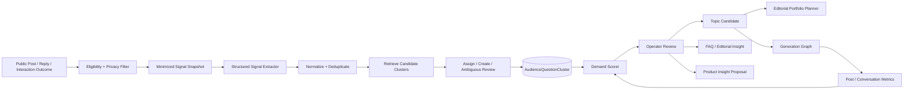

# 10 — Conversation Intelligence & Demand Radar

> **Document maturity:** DESIGN READY claim pending decision verification.
> **Canonical feature status:** `INTEL-001` in [the feature register](../planning/FEATURES.md).
> **Roadmap:** Z2/Z5; M2–M3 pilot, M4–M5 learning/product-insight bridge.
> **Decision:** `docs/adr/ADR-010-conversation-intelligence-demand-radar.md`.
> **Depends on:** proposal `(08)` suggestion/outcome trace, R4 engagement refactor, proposal `(09)` AI release gate.
> **Scope:** English public Threads/X conversations only for the initial release.

---

## 1. Problem

Proposal `(07)` social listening discovers trends and competitor posts. That is supply-side
discovery: “what is being published?” It does not answer demand-side questions:

- What does the audience repeatedly ask?
- Which misconception prevents understanding or conversion?
- Which cycle/relationship concern is common but unanswered?
- What language does the audience naturally use?
- Which questions produce real conversations rather than passive likes?
- Which recurring questions should become a post, FAQ, product explanation or research item?

Current `Topic` records have topic, keywords, facts, category, source type and status, but no
audience-question cluster, evidence trail, frequency, author diversity, safety risk, answer state or
product-insight workflow.

The new system converts reviewed public conversations into structured demand without profiling
individuals or importing private Soulwise data.

---

## 2. Decision summary

Introduce a **Demand Radar** pipeline:

```text
eligible public conversation events
→ minimization/redaction
→ question/objection/misconception extraction
→ semantic normalization and deduplication
→ incremental cluster assignment
→ cluster label + risk/domain review
→ demand score
→ reviewed outputs:
     ContentTopic candidate
     FAQ/editorial insight
     Soulwise product insight
     no-action/archive
```

The durable unit is `AudienceQuestionCluster`, not a scraped post. A cluster aggregates a recurring
need across distinct public conversations while retaining bounded source evidence for audit.

The initial implementation uses Postgres metadata/full-text/vector capabilities already planned in
proposal `(08)`. It does not add a Python BERTopic service or a new vector database.

---

## 3. Product model

### 3.1 Signal types

- `QUESTION` — explicit request for explanation/advice.
- `OBJECTION` — reason someone distrusts or rejects a claim/product/category.
- `MISCONCEPTION` — recurring incorrect or overly deterministic belief.
- `PAIN_POINT` — problem statement without a direct question.
- `LANGUAGE_PATTERN` — recurring audience phrasing worth preserving for copy research.
- `CONTENT_GAP` — repeated topic with no approved answer in the current portfolio.
- `PRODUCT_CONFUSION` — misunderstanding of Soulwise capability or boundary.
- `SAFETY_CONCERN` — medical, fertility, coercion, crisis or other high-risk subject.

### 3.2 Soulwise domains

- `ASTROLOGY`
- `CYCLES`
- `RELATIONSHIPS`
- `COUPLES`
- `PRODUCT`
- `CROSS_DOMAIN`
- `OUT_OF_SCOPE`

### 3.3 Output states

```text
NEW
→ REVIEWED
→ VALIDATED
→ CONTENT_PLANNED / FAQ_PROPOSED / PRODUCT_INSIGHT_PROPOSED
→ ANSWERED
→ MONITORING
→ ARCHIVED
```

High-risk clusters cannot move from NEW to an actionable output without human review.

---

## 4. Goals and non-goals

### Goals

- Build content from observed audience demand rather than generic prompt ideation.
- Produce auditable topic/FAQ/product-insight candidates with source diversity.
- Measure whether demand-derived content outperforms generic/trending content.
- Feed the Cross-Account Portfolio Planner without causing duplicate posts.
- Discover safe public language patterns for personas and landing-page copy.
- Give product owners aggregated, reviewed insight without exposing individuals.

### Non-goals

- Scraping private groups, DMs, protected accounts or private Soulwise data.
- Diagnosing an author or inferring cycle phase, fertility, abuse status or mental health.
- Building psychographic profiles.
- Treating one viral post as audience demand.
- Auto-writing directly into the Soulwise product backlog or FAQ.
- Automatically replying because a cluster is high frequency.
- Replacing qualitative human research with embeddings.
- Using sentiment as a truth or priority score.

---

## 5. Eligible sources and trust boundary

### Initial eligible sources

- source posts already evaluated by the engagement candidate pipeline;
- bounded parent/root conversation context;
- public replies to SPA’s own posts;
- executed/approved engagement suggestions and their public outcomes;
- manually imported public examples with source URL and reviewer.

### Excluded

- DMs and private messages;
- raw Soulwise chat, birth, couple or cycle data;
- deleted/protected source content after detection;
- accounts opted out or purged;
- unsupported languages in the English pilot;
- public text containing unnecessary sensitive personal details until redacted.

Every source is untrusted LLM input. Prompt injection, links and encoded instructions are treated as
data and cannot trigger tools/actions.

---

## 6. Architecture



### 6.1 New components

| Component                    | Responsibility                                                         |
| ---------------------------- | ---------------------------------------------------------------------- |
| `ConversationSignalIngestor` | Receive eligible source/outcome IDs after persistence.                 |
| `ConversationPrivacyFilter`  | Minimize, redact, classify sensitivity and honor purge/opt-out.        |
| `AudienceSignalExtractor`    | Produce typed question/objection/misconception records.                |
| `AudienceSignalNormalizer`   | Normalize semantics without erasing meaningful audience language.      |
| `AudienceClusterService`     | Retrieve candidate clusters, assign/create, manage ambiguity.          |
| `DemandScoringService`       | Compute transparent component scores and eligibility.                  |
| `DemandReviewService`        | Human validation and output routing.                                   |
| `TopicCandidateAdapter`      | Convert validated clusters to `Topic` candidates with provenance.      |
| `ProductInsightExporter`     | Send reviewed insight proposals to the Editorial Data Bridge boundary. |

### 6.2 Ports

```ts
export const IConversationSignalPort = Symbol("IConversationSignalPort");
export const IDemandClusterPort = Symbol("IDemandClusterPort");
export const IDemandInsightPort = Symbol("IDemandInsightPort");
```

Engagement emits stable IDs after commit. Demand Radar reloads canonical data through ports; it does
not receive large raw payloads on events.

---

## 7. Data model

```prisma
model AudienceSignal {
  id                 String   @id @default(uuid())
  sourceType         String   // PUBLIC_POST | PUBLIC_REPLY | INTERACTION_OUTCOME | MANUAL
  sourceRef          Json
  network            SocialNetwork
  accountId          String?
  personaRevisionId  String?
  signalType         String
  domain             String
  normalizedQuestion String
  languagePattern    String?
  extractedClaims    Json?
  riskTier           String
  privacyStatus      String   // ELIGIBLE | REDACTED | BLOCKED | PURGED
  sourceAuthorHash   String?
  sourceSnapshotHash String
  occurredAt         DateTime
  expiresAt          DateTime?
  embeddingModel     String?
  embedding          Unsupported("vector")?
  createdAt          DateTime @default(now())

  memberships AudienceClusterMembership[]

  @@unique([network, sourceSnapshotHash, signalType])
  @@index([domain, signalType, occurredAt])
  @@index([privacyStatus, expiresAt])
}

model AudienceQuestionCluster {
  id                    String   @id @default(uuid())
  clusterKey            String   @unique
  label                 String
  canonicalQuestion     String
  domain                String
  signalTypes           Json
  riskTier              String
  status                String
  sourceCount           Int      @default(0)
  distinctAuthorCount   Int      @default(0)
  firstSeenAt           DateTime
  lastSeenAt            DateTime
  demandScore           Float    @default(0)
  scoreComponents       Json
  answerState           Json?
  linkedTopicId         String?
  linkedProductInsightId String?
  embeddingModel        String?
  centroid              Unsupported("vector")?
  reviewedBy            String?
  reviewedAt            DateTime?
  createdAt             DateTime @default(now())
  updatedAt             DateTime @updatedAt

  memberships AudienceClusterMembership[]

  @@index([status, demandScore])
  @@index([domain, lastSeenAt])
}

model AudienceClusterMembership {
  clusterId  String
  signalId   String
  similarity Float?
  method     String   // EXACT | LEXICAL | VECTOR | REVIEWED
  createdAt  DateTime @default(now())

  cluster AudienceQuestionCluster @relation(fields: [clusterId], references: [id], onDelete: Cascade)
  signal  AudienceSignal @relation(fields: [signalId], references: [id], onDelete: Cascade)

  @@id([clusterId, signalId])
  @@index([signalId])
}

model ProductInsightProposal {
  id             String   @id @default(uuid())
  clusterId      String
  insightType    String   // FAQ | COPY | PRODUCT_GAP | SAFETY_RESEARCH
  summary        String
  evidence       Json
  privacyReview  String
  status         String   // DRAFT | APPROVED_FOR_EXPORT | EXPORTED | REJECTED
  destinationRef String?
  createdAt      DateTime @default(now())
  updatedAt      DateTime @updatedAt

  @@index([status, createdAt])
  @@index([clusterId])
}
```

The exact migration may keep embeddings in a companion table if Prisma/vector constraints require
it. Load-bearing status/domain/risk/count fields remain normalized.

---

## 8. Extraction contract

```ts
interface ExtractedAudienceSignal {
  readonly signalType: AudienceSignalType;
  readonly domain: SoulwiseEditorialDomain;
  readonly normalizedQuestion: string;
  readonly languagePattern?: string;
  readonly claims: readonly ExtractedPublicClaim[];
  readonly riskTier: RiskTier;
  readonly containsSensitivePersonalData: boolean;
  readonly shouldStore: boolean;
  readonly blockReasons: readonly string[];
}
```

Rules:

- preserve short verbatim audience phrases only when privacy-eligible and necessary;
- normalized question cannot add diagnosis or intent not present in the source;
- one source may yield multiple typed signals, each independently gated;
- model output is Zod-validated; parse failure produces no stored signal;
- extraction does not decide product priority.

---

## 9. Clustering strategy

### M2 pilot

1. mandatory filter by language/domain/risk compatibility;
2. exact normalized hash lookup;
3. Postgres full-text candidate retrieval;
4. optional vector candidates when proposal `(08)` retrieval is available;
5. assign only above a calibrated threshold;
6. ambiguous matches enter review rather than forced assignment;
7. create a new provisional cluster otherwise.

At initial volume, deterministic nearest-cluster assignment is simpler and more auditable than a
separate batch topic-modelling service.

### M4 maturation

- periodic offline reclustering may suggest merges/splits;
- never rewrite historical membership without an audit record;
- cluster merge/split is human-approved for high-risk domains;
- store algorithm/config/version and before/after membership diff;
- evaluate cluster purity and stability on a held-out labelled set.

### Cluster anti-patterns

- embedding similarity without domain/risk filters;
- one viral author dominating a cluster;
- treating semantically related questions as the same user need;
- merging factual questions with crisis/support requests;
- allowing LLM-generated labels to become product facts.

---

## 10. Demand score

The score is transparent and decomposable:

```text
demand =
  frequency
  × recency_decay
  × author_diversity
  × conversation_depth
  × unanswered_weight
  × product_relevance
  × confidence
  × safety_eligibility
```

Each component is persisted. Starting weights are configuration, not model truth.

Rules:

- frequency is capped so one burst cannot dominate indefinitely;
- author diversity uses privacy-safe distinct hashes;
- likes alone do not define demand;
- high risk can raise review priority while forcing content eligibility to zero;
- a cluster with insufficient distinct sources remains `NEW` regardless of score;
- operators may pin/override with reason and expiry;
- weights are experiment-controlled and covered by proposal `(09)`.

---

## 11. Output routing

### Topic candidate

Validated clusters map to an enriched topic source:

```ts
interface DemandTopicCandidate {
  readonly sourceType: "audience_demand";
  readonly clusterId: string;
  readonly topic: string;
  readonly questions: readonly string[];
  readonly keywords: readonly string[];
  readonly domain: string;
  readonly riskTier: string;
  readonly evidenceRefs: readonly string[];
  readonly demandScore: number;
  readonly validUntil: string;
}
```

`TopicCandidateAdapter` creates a candidate; the Portfolio Planner decides account/action/angle.

### FAQ/editorial insight

- proposed answer scope;
- misconception to address;
- accepted/rejected language;
- evidence needed;
- product surface that may answer it;
- review owner.

### Product insight

- exported only after human approval;
- aggregated evidence only;
- no clear handles or raw sensitive text;
- destination receives proposal/status, never an automatic backlog mutation.

---

## 12. API and operator UI

### API

- `GET /demand/signals?domain=&type=&risk=&cursor=`
- `GET /demand/clusters?status=&domain=&minScore=&cursor=`
- `GET /demand/clusters/:id`
- `POST /demand/clusters/:id/review`
- `POST /demand/clusters/:id/merge`
- `POST /demand/clusters/:id/split`
- `POST /demand/clusters/:id/create-topic`
- `POST /demand/clusters/:id/propose-faq`
- `POST /demand/clusters/:id/propose-product-insight`
- `POST /demand/clusters/:id/archive`
- `DELETE /demand/source-author/:network/:authorRef`

### UI

- demand radar by domain/type/time;
- cluster source diversity and trend;
- representative redacted phrasing;
- risk and privacy status;
- “already answered?” portfolio links;
- merge/split review;
- topic/FAQ/product routing;
- outcome comparison for demand-derived versus generic topics;
- purge and retention controls.

All mutations are admin-only and audited.

---

## 13. Privacy and safety

- Minimize before embedding or LLM extraction.
- Do not rely on hashing as anonymization; author hashes remain linkable personal data.
- Retain bounded source snapshots only for audit/appeal and delete on schedule.
- Never export source-author identity to Soulwise product insights.
- Prevent small-cohort reporting; exact minimum is defined by privacy review and threat model.
- Differential privacy is assessed only for externally released aggregate statistics; it is not
  added as decorative noise to internal low-volume data.
- Honor source deletion/opt-out and propagate deletion to embeddings and cluster counts.
- High-risk medical/relationship/crisis text is isolated from normal content mining.
- A crisis signal creates operator review, not a marketing opportunity.
- Logs/traces store IDs/taxonomy/scores, not raw sensitive source text.

References:

- local data governance guidance:
  `/Users/valentinyakovlev/.config/devin/knowledge-bases/knowledge-space/docs/data-engineering/data-governance-catalog.md`
- local privacy architecture guidance:
  `/Users/valentinyakovlev/.config/devin/knowledge-bases/hld-handbook/content/hld/part-7-security-at-scale/08-privacy-preserving-systems.md`

---

## 14. Reliability and degradation

| Failure                      | Behavior                                              |
| ---------------------------- | ----------------------------------------------------- |
| Privacy filter unavailable   | Do not persist or embed source.                       |
| Extractor unavailable        | Queue bounded retry; no generic signal fallback.      |
| Embeddings unavailable       | Exact/full-text path only; mark method.               |
| Cluster assignment uncertain | `AMBIGUOUS_REVIEW`; do not force.                     |
| Demand scoring unavailable   | Preserve cluster; no automatic routing.               |
| Product bridge unavailable   | Keep approved proposal queued; no cross-project loss. |
| Source deleted/protected     | Mark source ineligible and recompute cluster counts.  |
| Metrics unavailable          | Do not interpret as zero performance.                 |

Workers use idempotency keys based on source snapshot + extractor version. Queue retention is
bounded, poison messages enter DLQ, and replay records the new algorithm version.

---

## 15. Observability

- `demand_signal_ingested_total{type,domain,risk,status}`
- `demand_signal_privacy_blocked_total{reason}`
- `demand_extraction_invalid_total`
- `demand_cluster_created_total{domain}`
- `demand_cluster_assignment_total{method}`
- `demand_cluster_ambiguous_total`
- `demand_cluster_merge_split_total{operation}`
- `demand_cluster_distinct_authors`
- `demand_cluster_to_topic_rate`
- `demand_cluster_to_product_insight_rate`
- `demand_topic_performance_delta`
- `demand_pipeline_lag_seconds`
- `demand_purge_duration_seconds`

Trace metadata includes source type/hash, taxonomy, model/config versions and cluster ID, not raw
personal content.

---

## 16. Evaluation

### Offline

- extraction exact-match/F1 by signal type/domain/risk;
- sensitive-data false-negative review;
- cluster precision/purity on labelled pairs;
- merge/split error direction;
- demand-score component sanity;
- source-diversity and one-author-dominance tests;
- prompt injection/adversarial public input;
- correct no-store/no-action cases.

### Online

- reviewed cluster acceptance rate;
- topic conversion rate;
- demand-derived content engagement versus matched generic/trending content;
- conversation and profile/lead outcomes;
- product-insight acceptance/use rate;
- privacy/safety correction rate.

All extractors, labelers, scoring configuration and routing changes pass proposal `(09)`.

---

## 17. Rollout and backlog

The `DR-*` rows are local design work-package anchors, not canonical task/status IDs. Promotion to
implementation must map them into `docs/planning/BACKLOG.md` without duplicating status.

| ID     | Phase | Task                                                  | Depends on                  |
| ------ | ----- | ----------------------------------------------------- | --------------------------- |
| DR-001 | M2    | Define signal/domain/risk taxonomy and privacy policy | proposal 08                 |
| DR-002 | M2    | AudienceSignal schema and ingestion port              | DR-001, R4                  |
| DR-003 | M2    | Privacy/minimization filter and purge contract        | DR-001                      |
| DR-004 | M2    | Structured extractor + proposal 09 dataset            | DR-002, DR-003, proposal 09 |
| DR-005 | M2    | Cluster schema and exact/full-text assignment         | DR-002                      |
| DR-006 | M2    | Transparent demand score                              | DR-005                      |
| DR-007 | M2    | Cluster review API/UI                                 | DR-005, DR-006              |
| DR-008 | M2    | TopicCandidateAdapter and Portfolio Planner input     | DR-007, proposal 08 planner |
| DR-009 | M3    | Demand-derived content/outcome instrumentation        | DR-008                      |
| DR-010 | M4    | Vector candidate retrieval and eval                   | DR-005, proposal 08 memory  |
| DR-011 | M4    | Merge/split/reclustering review                       | DR-010                      |
| DR-012 | M4    | FAQ/ProductInsight proposal workflow                  | DR-007, proposal 14         |
| DR-013 | M5    | Outcome-informed scoring experiment                   | DR-009, sufficient data     |

### Gate M2–M3

- only eligible minimized public data is stored;
- held-out extractor/cluster eval passes calibrated thresholds;
- ambiguous/high-risk cases require review;
- cluster → Topic retains source provenance;
- no product backlog/FAQ is mutated automatically.

### Gate M4–M5

- vector retrieval improves held-out cluster quality without privacy leakage;
- purge removes lexical/vector/source membership;
- demand-derived outcomes are compared on matched cohorts, not raw averages.

---

## 18. Risks

| Risk                                     | Mitigation                                                            |
| ---------------------------------------- | --------------------------------------------------------------------- |
| Monitoring becomes surveillance          | Public-only scope, minimization, retention, purge, no psychographics. |
| One viral post distorts demand           | Source diversity and capped frequency.                                |
| Cluster label hallucinates intent        | Source-backed review and no automatic product action.                 |
| Sensitive pain becomes marketing content | Risk isolation and human safety review.                               |
| Topic duplication across personas        | Portfolio Planner owns assignment and saturation.                     |
| Embedding drift changes clusters         | Versioned embeddings/config and proposal 09 gate.                     |
| Low volume produces false trends         | Minimum diversity/state remains NEW; no forced score.                 |
| Product team gets noisy insights         | Reviewed proposal workflow with owner/status/evidence.                |

---

## 19. Research and verification status

Internal evidence reviewed:

- current `Topic`, `Interaction`, `ContentSource` and adapter architecture;
- proposal `(07)` social-listening boundary;
- proposal `(08)` interaction-memory and safety design;
- privacy/data-governance knowledge-base guidance.

External evidence still required before implementation:

- current Threads/X permitted read surfaces and retention terms;
- deletion/opt-out requirements for retained public content;
- current clustering implementation benchmarks at expected corpus size;
- domain-expert review of signal/risk taxonomy.

Exa MCP was unavailable due OAuth and knowledge-base MCP transport closed during this pass. These
gaps are `VERIFY_EXTERNAL`, not completed research.
