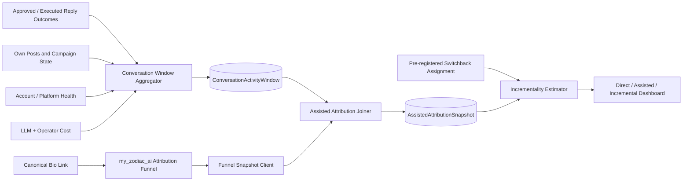

# 11 — Reply-to-Revenue Assisted Attribution

> **Document maturity:** DESIGN READY claim pending decision verification.
> **Canonical feature status:** `ATTR-002` in [the feature register](../planning/FEATURES.md).
> **Roadmap:** Z4/Z5; M2–M3 instrumentation, M5 incrementality.
> **Decision:** `docs/adr/ADR-011-reply-to-revenue-assisted-attribution.md`.
> **Depends on:** ROADMAP_V2 Z4 direct attribution, proposal `(08)` approved conversation outcomes.
> **Principle:** report direct attribution separately from assisted association and causal lift.

---

## 1. Problem

Z4 measures direct clicks from trackable links attached to own posts. A reply-first strategy often
has no link in the reply:

```text
public reply
→ profile visit
→ account bio link
→ quiz
→ signup/payment
```

The direct click belongs to the bio link, not to a specific reply. Without an assisted layer, SPA
cannot answer whether conversation work creates profile traffic, leads or revenue. It can only count
replies and direct bio conversions independently.

Conversely, assigning every bio conversion to recent replies would overstate impact. Temporal
proximity is association, not causation.

---

## 2. Decision summary

Build three explicitly separated measurement layers:

1. **Direct attribution** — existing per-link click/session/conversion stitching in
   `my_zodiac_ai/back`.
2. **Assisted association** — aggregate bio-link funnel outcomes joined to account/persona reply
   activity windows.
3. **Incrementality experiment** — planned account-time switchback/holdout analysis when volume is
   sufficient.

No attempt is made to identify which social user saw a reply and then clicked. The join key is
account/persona/time cohort, not a person fingerprint.

The output vocabulary is strict:

- `DIRECT` — observed click/conversion through a specific link;
- `ASSISTED_ASSOCIATION` — outcome occurred in an eligible activity window;
- `INCREMENTAL_ESTIMATE` — effect estimated from a pre-registered experiment/model;
- never label an association “caused by replies”.

---

## 3. Existing reusable infrastructure

`my_zodiac_ai/back` already provides:

- internal trackable-link creation;
- `platform`, `campaign`, `content`, `customFields` dimensions;
- redirect click persistence with `quizSessionId`;
- funnel/session stitching;
- conversion/revenue writeback;
- per-link funnel report with date filters;
- test examples using `content='bio_link'` and creator custom fields.

SPA already has:

- account/persona/network interaction records;
- approved/executed suggestion outcomes from proposal `(08)`;
- PostMetrics and funnel-dashboard work in ROADMAP_V2;
- posting/engagement cost and Langfuse trace metadata.

The new feature extends reporting and cohort metadata. It does not create another redirector or
duplicate click/conversion tables in SPA.

---

## 4. Goals and non-goals

### Goals

- Measure bio-link conversions and revenue per social account/persona.
- Relate aggregate conversation activity to funnel changes without deanonymization.
- Compare reply strategies using pre-registered, auditable windows.
- Report uncertainty and distinguish directional association from causal estimate.
- Calculate cost per assisted/incremental lead and revenue per approved reply.
- Feed strategy decisions without rewarding spam volume.

### Non-goals

- Cross-device identity matching from social user to quiz user.
- Scraping visitor identity, profile visitors or private analytics.
- Fingerprinting, probabilistic identity graphs or hidden tracking.
- Claiming causal lift from a before/after chart.
- Giving every conversion fractional credit across arbitrary touchpoints.
- Replacing the canonical Z4 direct funnel.
- Optimizing only for reply count or last-click revenue.

---

## 5. Measurement model

### 5.1 Persistent bio links

Create one canonical bio link per account/persona assignment:

```text
platform = threads | x
medium = social
campaign = social_agent_bio
content = bio_link
customFields = {
  account_id,
  persona_key,
  persona_revision_id,
  placement: "profile_bio",
  schema_version
}
```

Do not rotate the slug per reply. The purpose is stable account-level funnel measurement. A persona
revision change may create a new link/assignment window while preserving historical links.

### 5.2 Conversation activity windows

Aggregate executed, eligible interactions into account-time windows:

- network;
- account/persona revision;
- window start/end and timezone;
- approved replies, executed replies, quotes and own posts;
- target-author diversity;
- high-value conversation outcomes;
- total LLM/operator cost;
- policy/safety blocks;
- own-post/link campaigns active during the same window;
- platform/account health state.

Windows are immutable after their late-arrival grace period; corrections create a new computation
version.

### 5.3 Assisted association

For each window, query the canonical bio-link funnel for the same acquisition interval and compute:

- bio clicks;
- quiz starts/completions when available;
- signups;
- conversions;
- revenue;
- per-100 approved/executed reply rates;
- cost per observed funnel outcome.

This is reported as association and adjusted/described with major confounders. It is useful for
operations but not a causal claim.

### 5.4 Incrementality

When traffic supports it, use a pre-registered switchback or matched-time design:

- treatment unit: account × time block;
- treatment: approved reply strategy/threshold, not individual users;
- keep own-post cadence, bio link and major campaigns stable where possible;
- balance by day-of-week/time and account;
- declare exclusions and late-arrival window before running;
- compare funnel rate/revenue, not only raw counts;
- report interval/uncertainty and power limitations;
- retain intent-to-treat assignment even if execution count differs.

If only two accounts and low conversion volume exist, results remain directional. The system must
say “insufficient evidence” rather than manufacture a winner.

---

## 6. Architecture



### 6.1 Components

| Component                         | Responsibility                                                  |
| --------------------------------- | --------------------------------------------------------------- |
| `BioLinkAssignmentService`        | Create/reuse canonical Z4 link per account/persona assignment.  |
| `ConversationWindowService`       | Aggregate immutable activity/confounder/cost windows.           |
| `FunnelSnapshotClient`            | Fetch canonical per-link funnel intervals through `ILinkPort`.  |
| `AssistedAttributionService`      | Join windows and label association without causal overclaim.    |
| `IncrementalityExperimentService` | Store assignment/protocol and compute approved estimates.       |
| `AttributionQualityService`       | Completeness, lag, contamination and sample sufficiency checks. |
| `ReplyRevenueAnalyticsService`    | Query/report direct, assisted and incremental layers.           |

### 6.2 Ports

```ts
export const IConversationOutcomePort = Symbol("IConversationOutcomePort");
export const IAssistedAttributionPort = Symbol("IAssistedAttributionPort");
export const IIncrementalityEstimatorPort = Symbol(
  "IIncrementalityEstimatorPort",
);
```

The canonical click and conversion data remain behind existing `ILinkPort`; SPA never reaches into
Soulwise MongoDB.

---

## 7. Data model

```prisma
model BioLinkAssignment {
  id                 String   @id @default(uuid())
  accountId          String
  personaRevisionId  String?
  network            SocialNetwork
  attributionLinkId  String
  attributionSlug    String
  campaign           String
  content            String   @default("bio_link")
  active             Boolean  @default(true)
  startsAt           DateTime @default(now())
  endsAt             DateTime?
  createdAt          DateTime @default(now())

  @@index([accountId, active])
  @@index([personaRevisionId, startsAt])
  @@unique([accountId, attributionLinkId])
}

model ConversationActivityWindow {
  id                    String   @id @default(uuid())
  accountId             String
  personaRevisionId     String?
  network               SocialNetwork
  windowStart           DateTime
  windowEnd             DateTime
  timezone              String
  assignmentId          String?
  approvedReplies       Int      @default(0)
  executedReplies       Int      @default(0)
  quotes                Int      @default(0)
  ownPosts              Int      @default(0)
  distinctTargetAuthors Int      @default(0)
  meaningfulOutcomes    Int      @default(0)
  policyBlocks          Int      @default(0)
  safetyBlocks          Int      @default(0)
  costUsd               Float    @default(0)
  confounders           Json
  computationVersion    String
  finalizedAt           DateTime?
  createdAt             DateTime @default(now())

  @@unique([accountId, network, windowStart, windowEnd, computationVersion])
  @@index([personaRevisionId, windowStart])
  @@index([assignmentId])
}

model AssistedAttributionSnapshot {
  id                    String   @id @default(uuid())
  activityWindowId      String
  bioLinkAssignmentId   String
  acquisitionFrom       DateTime
  acquisitionTo         DateTime
  attributionMode       String   // ASSISTED_ASSOCIATION | INCREMENTAL_ESTIMATE
  clicks                Int
  signups               Int?
  conversions           Int
  revenue               Float
  rateMetrics           Json
  quality               Json
  estimate              Json?
  sourceReportRef       Json
  computationVersion    String
  createdAt             DateTime @default(now())

  @@index([activityWindowId])
  @@index([bioLinkAssignmentId, acquisitionFrom])
  @@index([attributionMode, createdAt])
}

model ConversationExperimentAssignment {
  id              String   @id @default(uuid())
  experimentKey   String
  accountId       String
  network         SocialNetwork
  blockStart      DateTime
  blockEnd        DateTime
  arm             String
  assignmentHash  String
  protocolVersion String
  status          String
  exclusions      Json?
  createdAt       DateTime @default(now())

  @@unique([experimentKey, accountId, blockStart])
  @@index([experimentKey, arm])
}
```

Revenue amounts should use the project’s established money representation in the implementation
rather than unreviewed floating-point storage; the conceptual schema uses `Float` only as a
placeholder.

---

## 8. Computation and confounders

Every snapshot records or controls for:

- account/persona/network;
- follower/audience baseline when reliably available;
- day-of-week and local time;
- own-post volume and link-bearing campaigns;
- major product/paid campaign launches;
- account-health/platform incidents;
- number and diversity of reply targets;
- conversation intent/domain/risk;
- delayed conversions and incomplete acquisition windows;
- missing metric/source status.

Do not turn unavailable data into zero.

### Directional metrics

```text
bio_clicks_per_100_executed_replies
signups_per_100_executed_replies
conversions_per_100_executed_replies
revenue_per_100_executed_replies
cost_per_associated_signup
cost_per_associated_conversion
```

These describe operational efficiency, not causality.

### Incremental estimate

At sufficient volume:

```text
incremental_lift =
  change(treatment windows)
  - change(matched control windows)
```

The estimator may begin as stratified switchback difference-in-means/difference-in-differences.
More complex Bayesian or synthetic-control models require an evidence-backed ADR and enough data.

---

## 9. API and dashboard

### API

- `GET /analytics/reply-revenue/summary?accountId=&from=&to=`
- `GET /analytics/reply-revenue/windows?accountId=&cursor=`
- `GET /analytics/reply-revenue/direct`
- `GET /analytics/reply-revenue/assisted`
- `GET /analytics/reply-revenue/incrementality`
- `GET /analytics/reply-revenue/data-quality`
- `POST /analytics/reply-revenue/experiments`
- `POST /analytics/reply-revenue/experiments/:id/start`
- `POST /analytics/reply-revenue/experiments/:id/stop`
- `GET /analytics/reply-revenue/experiments/:id/report`

### Dashboard

Separate panels:

1. direct link attribution;
2. bio-link funnel by account/persona;
3. conversation activity and cost;
4. assisted association with explicit label;
5. incrementality experiment with interval/sample/quality;
6. missing/late/contaminated data;
7. experiment protocol and exclusions.

The UI must never collapse all layers into a single “replies revenue” number.

---

## 10. Privacy and security

- No social-user identity joins to quiz sessions.
- No fingerprinting or enrichment of visitors.
- Use account/persona/time cohorts only.
- Source funnel data stays in `my_zodiac_ai`; SPA stores aggregate report snapshots and references.
- Do not store IP, device fingerprint, quizSessionId or individual click rows in SPA.
- Bio-link custom fields contain internal account/persona IDs, not health or demographic data.
- Enforce minimum reporting cohorts before displaying segmented results.
- Apply retention and purpose limitation to activity windows/experiment assignments.
- Admin-only experiment changes and override audit.
- Reject query dimensions that could expose a single conversion/user.

The local privacy research cautions that hashing is not anonymization and that aggregate analytics
requires an explicit threat model. Differential privacy or private attribution protocols are
assessed only if data is externally released or cross-party computation demands it; they are not
required for internal, coarse, access-controlled aggregates at initial scale.

---

## 11. Reliability and data quality

| Failure                      | Behavior                                                                             |
| ---------------------------- | ------------------------------------------------------------------------------------ |
| Bio link missing             | Block assisted measurement activation for that account; direct posting may continue. |
| Zodiac funnel unavailable    | Retry bounded fetch; mark snapshot `SOURCE_UNAVAILABLE`, never zero.                 |
| Late conversion              | Recompute open window with new version; retain previous snapshot.                    |
| Activity aggregation delayed | Mark incomplete; exclude from final estimate.                                        |
| Account health incident      | Mark/exclude according to pre-registered protocol.                                   |
| Experiment non-compliance    | Preserve intent-to-treat; report execution compliance separately.                    |
| Insufficient sample          | `INSUFFICIENT_EVIDENCE`; no winner.                                                  |
| Duplicate snapshot           | Idempotency key prevents duplicate version.                                          |

Quality checks:

- link/window coverage;
- source freshness;
- late-arrival completeness;
- treatment balance;
- pre-period comparability;
- missingness by arm;
- overlapping campaign contamination;
- plausible rate/revenue bounds;
- reproducible computation hash.

---

## 12. Observability

- `bio_link_assignment_total{network,status}`
- `conversation_windows_total{network,status}`
- `reply_revenue_funnel_fetch_total{outcome}`
- `reply_revenue_snapshot_lag_seconds`
- `reply_revenue_missing_source_total`
- `reply_revenue_associated_{clicks,signups,conversions,revenue}`
- `reply_revenue_experiment_blocks_total{arm,status}`
- `reply_revenue_experiment_compliance_rate`
- `reply_revenue_data_quality_failure_total{reason}`
- `reply_revenue_insufficient_evidence_total`
- `reply_revenue_estimate{metric,arm}`

No raw individual funnel data appears in logs/traces.

---

## 13. Evaluation and experiment discipline

- Pre-register hypothesis, primary metric, treatment, block size, assignment, exclusions, late
  window and stopping rule.
- Do not peek and stop early.
- Use one primary metric; supporting and safety metrics remain contextual/guardrail.
- Report confidence/credible interval and meaningful effect size, not significance alone.
- Check balance and missingness before outcome comparison.
- Preserve losing/inconclusive experiments and learnings.
- Do not automatically exploit a “winner” while the audience/account is changing rapidly.
- Run proposal `(09)` on calculation/config changes and seeded known-result fixtures.

Initial hypothesis:

> Because Threads replies account for a meaningful discovery surface, an approved high-value
> reply strategy will increase account-level bio-link funnel outcomes relative to matched low-reply
> windows without increasing safety/policy blocks.

This remains a hypothesis until the incrementality gate passes.

---

## 14. Rollout and backlog

The `RA-*` rows are local design work-package anchors, not canonical task/status IDs. Promotion to
implementation must map them into `docs/planning/BACKLOG.md` without duplicating status.

| ID     | Phase | Task                                                             | Depends on                             |
| ------ | ----- | ---------------------------------------------------------------- | -------------------------------------- |
| RA-001 | M2    | Define direct/assisted/incremental terminology and data contract | Z4                                     |
| RA-002 | M2    | Canonical BioLinkAssignment per account/persona                  | RA-001, ZodiacLinkClient               |
| RA-003 | M2    | Conversation activity window schema/aggregator                   | proposal 08 outcomes                   |
| RA-004 | M2    | FunnelSnapshotClient date-window contract                        | RA-002, ILinkPort                      |
| RA-005 | M2    | Assisted association join and data-quality checks                | RA-003, RA-004                         |
| RA-006 | M2    | Direct/assisted dashboard separation                             | RA-005                                 |
| RA-007 | M3    | Cost attribution and matched directional reports                 | RA-005                                 |
| RA-008 | M3    | Experiment protocol/assignment service                           | RA-003, proposal 09                    |
| RA-009 | M3    | Switchback report with insufficient-evidence guard               | RA-008, sufficient traffic             |
| RA-010 | M5    | Calibrated incrementality estimator                              | RA-009, multiple completed experiments |
| RA-011 | M5    | Strategy feedback with human go/no-go                            | RA-010                                 |

### Gate M2–M3

- every active account/persona has a stable canonical bio link;
- direct and assisted layers are displayed separately;
- no individual social/funnel identity join exists;
- missing funnel data is unknown, never zero;
- snapshot recomputation is reproducible and versioned.

### Gate M3–M5

- experiment protocol is pre-registered and assignment immutable;
- balance/missingness/compliance checks pass;
- report returns an interval or `INSUFFICIENT_EVIDENCE`, never a forced winner;
- no strategy is automatically promoted from assisted association alone.

---

## 15. Risks

| Risk                                      | Mitigation                                                      |
| ----------------------------------------- | --------------------------------------------------------------- |
| Association presented as causation        | Separate data types, APIs, labels and dashboards.               |
| Low conversion volume                     | Directional reporting and explicit insufficient-evidence state. |
| Own posts/campaigns confound reply effect | Record and balance/exclude pre-registered confounders.          |
| Audience growth trends bias before/after  | Switchback/matched blocks and pre-period checks.                |
| Privacy-invasive identity stitching       | Account-time cohorts only; no social-user join.                 |
| Bio link changed manually                 | Assignment health check and alert.                              |
| Delayed conversions                       | Open/closed acquisition windows and versioned recompute.        |
| Spam wins short-term clicks               | Safety/policy/persona guardrails cannot be traded for revenue.  |
| Experiment interferes with account health | Account-health guardrail and kill switch.                       |

---

## 16. Research and verification status

Internal evidence reviewed:

- ROADMAP_V2 Z4 contract;
- `my_zodiac_ai/back` attribution-link DTO/service/funnel report and tests;
- existing `content='bio_link'` and `customFields` support;
- SPA interaction, PostMetrics and cost traces;
- local web/marketing analytics and privacy-preserving-system guidance.

Primary conceptual references:

- internal marketing analytics article:
  `/Users/valentinyakovlev/.config/devin/knowledge-bases/knowledge-space/docs/bi-analytics/web-marketing-analytics.md`
- private attribution reference identified by the local privacy guide:
  <https://eprint.iacr.org/2023/437>

Implementation-time verification:

- exact `ILinkPort`/funnel report availability and date semantics;
- bio link configuration on live accounts;
- conversion lag distribution and sample/power estimate;
- legal/privacy review of reporting cohorts;
- pre-registration and estimator review by analytics owner.

Exa MCP remained unavailable due OAuth. The design deliberately avoids unsupported claims about
platform profile-view APIs or deterministic user-level attribution.
