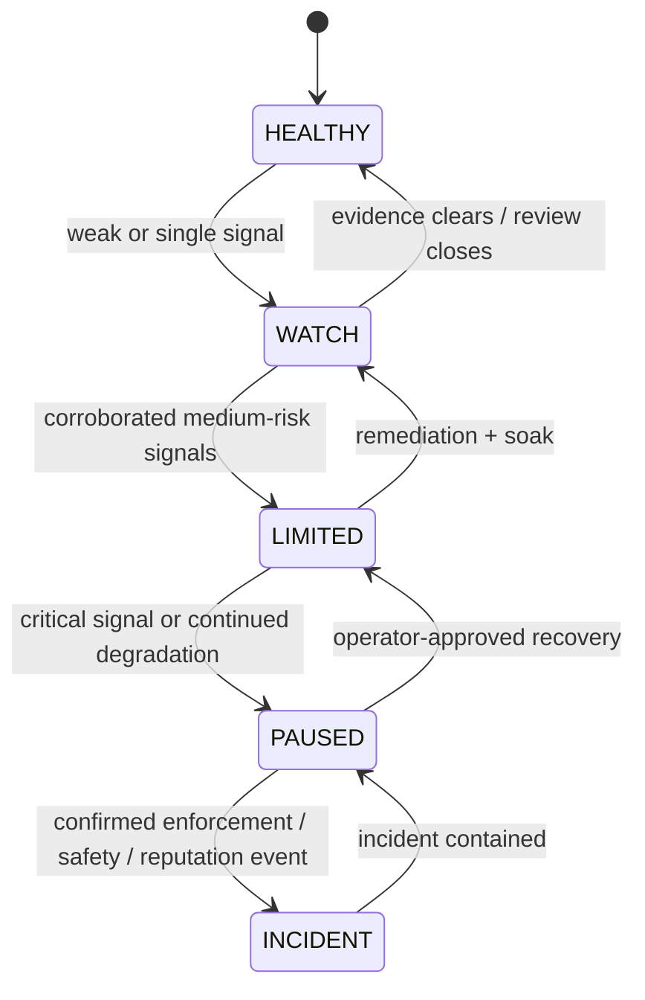
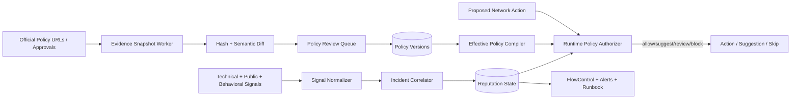

# 12 — Platform Policy & Reputation Control Plane

> **Document maturity:** DESIGN READY claim pending decision verification.
> **Canonical feature status:** `POLICY-001` in [the feature register](../planning/FEATURES.md).
> **Roadmap:** Z1/Z3/Z6; M0–M1 policy foundation, M3 reputation auto-pause, continuous verification.
> **Decision:** `docs/adr/ADR-012-platform-policy-reputation-control-plane.md`.
> **Scope:** every network/action/transport, not only persona replies.
> **Safety rule:** automatic policy changes may only reduce capability; promotion is human-approved.

---

## 1. Problem

SPA has technical health, feature flags, rate limits, hard rules, guardrails and flow-control kill
switches. It does not have a durable answer to:

- Which official policy currently authorizes or restricts each action?
- When was that evidence last verified?
- Which transport and approval mode is permitted for this account/action?
- What happens automatically when the source changes or becomes stale?
- Is the account healthy technically but entering a reputation incident?
- Which semantic/public signals justify slowing or pausing a topic/account?

Platform rules and product behavior change outside Git. A hard-coded environment flag or prompt
cannot serve as policy evidence. Infrastructure uptime also cannot detect a semantic backlash,
misinformation incident or repeated low-quality interaction pattern.

---

## 2. Decision summary

Build one control plane with two cooperating subsystems:

1. **Platform Policy Registry** — versioned evidence and effective execution policy per
   network/action/transport/account class.
2. **Reputation Monitor** — multi-signal semantic/behavioral incident detection with deterministic
   state transitions and human review.

```text
official evidence snapshot
→ verified policy version
→ compiled effective policy
→ runtime authorization decision

public/technical/account signals
→ reputation signal normalization
→ multi-signal incident rule
→ HEALTHY / WATCH / LIMITED / PAUSED / INCIDENT
→ deterministic capability downgrade + operator review
```

The control plane is outside prompt logic. LLMs may classify evidence or public content, but they do
not grant capabilities or promote execution modes.

---

## 3. Research findings

### X

Current official X automation rules state that:

- non-API website scripting may result in suspension;
- unsolicited automated replies/mentions and keyword-triggered mass replies are not permitted;
- AI-powered automated reply bots require prior written and explicit approval;
- duplicative/substantially similar multi-account behavior is restricted.

Source: <https://help.x.com/en/rules-and-policies/x-automation>

### Threads

Meta’s public creator guidance supports conversation/replies as a discovery surface, but growth
guidance is not an automation authorization. API action capability, app review, permissions and
automation policy must be verified separately before promotion.

Source: <https://about.fb.com/news/2024/10/find-your-community-with-new-threads-educational-insights/>

### Safety architecture

The local LLM safety reference treats safety as layered system architecture: instruction hierarchy,
provenance, tool allowlists, output classifiers, PII redaction, URL allowlists, audit logs and
red-team CI. Input sanitization or a single sentiment classifier is insufficient.

Reference:
`/Users/valentinyakovlev/.config/devin/knowledge-bases/hld-handbook/content/hld/part-9-ai-ml-system-design/08-llm-safety-guardrails.md`

---

## 4. Goals and non-goals

### Goals

- Make execution authority explicit, versioned, evidence-backed and auditable.
- Detect stale/changed policy evidence and automatically downgrade capability.
- Detect emerging reputation/safety incidents before they become account-wide failures.
- Coordinate account, topic and action pauses with the existing FlowControl/Orchestrator layers.
- Provide operator evidence, reasoning, acknowledgement and recovery workflow.
- Prevent sentiment alone from triggering irreversible actions.
- Test policy compilation and incident rules through proposal `(09)`.

### Non-goals

- Legal advice or a guarantee of platform compliance.
- Automatic policy promotion from scraped text.
- Evasion, stealth optimization or “safe ban thresholds”.
- Replacing official policy review with an LLM summary.
- Automatically arguing with negative users.
- Treating criticism as abuse or a reputation incident.
- Building a generic enterprise governance platform.
- Scraping private enforcement dashboards without authorization.

---

## 5. Platform Policy Registry

### 5.1 Policy dimensions

- network;
- action (`POST`, `REPLY`, `MENTION`, `QUOTE`, `REPOST`, `LIKE`, `FOLLOW`, `DM`, `READ`);
- transport (`OFFICIAL_API`, `BROWSER`, `MANUAL_EXTERNAL`);
- account type/capability;
- target relationship (`OWN_POST`, `MENTIONED_US`, `OPTED_IN`, `STRANGER`, `UNKNOWN`);
- execution mode (`DISABLED`, `SUGGEST_ONLY`, `HUMAN_APPROVAL_REQUIRED`,
  `APPROVED_AUTOMATION`);
- required permissions/approvals;
- rate/volume constraints where official and applicable;
- evidence source/version/hash;
- verified/effective/expiry dates;
- reviewer and decision record.

### 5.2 Evidence lifecycle

```text
DRAFT
→ REVIEW_REQUIRED
→ VERIFIED
→ ACTIVE
→ STALE / SOURCE_CHANGED / REVOKED
→ SUPERSEDED
```

Rules:

- source fetch/checksum change creates review; it does not auto-interpret authorization;
- expiry/staleness automatically downgrades effective mode to the configured safe floor;
- runtime uses only ACTIVE compiled policy;
- a more restrictive global/network rule always wins over account override;
- policy promotion requires human approval and linked primary evidence;
- historical interactions retain the exact policy-version ID used.

### 5.3 Policy compilation

```text
global safety minimum
∩ network/action policy
∩ transport capability
∩ account capability/approval
∩ target-relationship eligibility
∩ current reputation state
∩ flow-control/health state
= effective execution decision
```

Intersection means “most restrictive wins”. Missing required evidence resolves to disabled or
suggest-only, never approved automation.

---

## 6. Reputation Monitor

### 6.1 Signal families

#### Technical/enforcement

- authentication challenge or suspension signal;
- repeated rate-limit/enforcement response;
- visibility/search anomaly where reliably measurable;
- platform warning;
- deletion/failed verification spike;
- session/account health degradation.

#### Public semantic

- credible misinformation correction;
- repeated complaints about fabricated experience or hidden affiliation;
- medical/relationship safety concern;
- coordinated duplicate-content warning;
- escalating hostile/abusive conversation;
- unusual negative-reply volume relative to account baseline.

#### Behavioral/self-generated

- generic/duplicate reply spike;
- excessive targeting of one author;
- policy-block spike;
- persona contradiction spike;
- safety judge failures;
- abnormal post/reply volume or action mix;
- sudden edit/rejection increase.

### 6.2 State machine



State effects are explicit:

| State      | Effect                                                                |
| ---------- | --------------------------------------------------------------------- |
| `HEALTHY`  | Normal compiled policy.                                               |
| `WATCH`    | Increased review/monitoring; no autonomous promotion.                 |
| `LIMITED`  | Suggestion-only for risky actions, lower budgets, topic restrictions. |
| `PAUSED`   | Stop configured posting/engagement scope; preserve reads/diagnostics. |
| `INCIDENT` | Crisis mode, evidence preservation, runbook and owner escalation.     |

### 6.3 Multi-signal rule

Sentiment is advisory. Automatic transition beyond WATCH requires:

- one critical trusted signal; or
- two or more independent signal families above calibrated thresholds; or
- deterministic forbidden event (e.g. policy mode violation, duplicate execution).

LLM classification output alone cannot pause/ban an account permanently. It may create a reviewed
incident candidate.

---

## 7. Architecture



### 7.1 Components

| Component                   | Responsibility                                            |
| --------------------------- | --------------------------------------------------------- |
| `PolicyEvidenceFetcher`     | Bounded fetch of approved official URLs and content hash. |
| `PolicyReviewService`       | Human review, interpretation and version approval.        |
| `PlatformPolicyRegistry`    | Durable policy/evidence/approval lifecycle.               |
| `EffectivePolicyCompiler`   | Most-restrictive deterministic compilation.               |
| `RuntimeActionAuthorizer`   | Decision for one account/network/action/target context.   |
| `ReputationSignalIngestor`  | Normalize source events with trust/severity.              |
| `ReputationIncidentService` | Correlate signals and apply state-machine rules.          |
| `ReputationRecoveryService` | Remediation, soak, review and staged restoration.         |
| `PolicyDriftMonitor`        | Scheduled expiry/checksum/source-change detection.        |

### 7.2 Ports

```ts
export const IPlatformPolicyPort = Symbol("IPlatformPolicyPort");
export const IReputationStatePort = Symbol("IReputationStatePort");
export const IRuntimeActionAuthorizer = Symbol("IRuntimeActionAuthorizer");
```

Posters/engagers receive an authorization decision; they do not interpret policy rows.

---

## 8. Data model

```prisma
model PlatformPolicyEvidence {
  id           String   @id @default(uuid())
  network      SocialNetwork
  sourceUrl    String
  sourceType   String   // OFFICIAL_POLICY | APPROVAL | API_DOC | CONTRACT
  contentHash  String
  snapshotRef  String?
  fetchedAt    DateTime
  verifiedAt   DateTime?
  expiresAt    DateTime?
  status       String
  reviewer     String?
  reviewNotes  String?
  createdAt    DateTime @default(now())

  versions PlatformActionPolicy[]

  @@index([network, status, expiresAt])
  @@unique([sourceUrl, contentHash])
}

model PlatformActionPolicy {
  id                    String   @id @default(uuid())
  policyKey             String
  version               Int
  network               SocialNetwork
  action                String
  transport             String
  targetRelationship    String
  executionMode         String
  requirements          Json
  limits                Json?
  evidenceId            String
  evidence              PlatformPolicyEvidence @relation(fields: [evidenceId], references: [id], onDelete: Restrict)
  status                String
  effectiveAt           DateTime?
  expiresAt             DateTime?
  approvedBy            String?
  approvedAt            DateTime?
  supersedesId          String?
  createdAt             DateTime @default(now())

  @@unique([policyKey, version])
  @@index([network, action, status])
  @@index([expiresAt])
}

model CompiledExecutionPolicy {
  id             String   @id @default(uuid())
  accountId      String?
  network        SocialNetwork
  action         String
  contextClass   String
  executionMode  String
  sourcePolicyIds Json
  reputationState String
  policyHash     String
  validUntil     DateTime
  createdAt      DateTime @default(now())

  @@index([accountId, network, action])
  @@unique([accountId, network, action, contextClass, policyHash])
}

model ReputationSignal {
  id             String   @id @default(uuid())
  accountId      String
  network        SocialNetwork
  signalType     String
  signalFamily   String
  severity       String
  trustLevel     String
  sourceRef      Json
  evidenceHash   String
  classification Json?
  occurredAt     DateTime
  expiresAt      DateTime?
  createdAt      DateTime @default(now())

  @@unique([accountId, network, signalType, evidenceHash])
  @@index([accountId, network, occurredAt])
  @@index([signalFamily, severity])
}

model ReputationIncident {
  id              String   @id @default(uuid())
  accountId       String
  network         SocialNetwork
  topicScope      String?
  status          String
  stateBefore     String
  stateAfter      String
  severity        String
  signalIds       Json
  decisionRules   Json
  automaticActions Json
  operatorActions Json?
  owner           String?
  acknowledgedAt  DateTime?
  resolvedAt      DateTime?
  recoveryPlan    Json?
  createdAt       DateTime @default(now())
  updatedAt       DateTime @updatedAt

  @@index([accountId, network, status])
  @@index([severity, createdAt])
}
```

---

## 9. Runtime authorization contract

```ts
interface AuthorizePlatformActionParams {
  readonly accountId: string;
  readonly network: SocialNetwork;
  readonly action: PlatformAction;
  readonly transport: PlatformTransport;
  readonly targetRelationship: TargetRelationship;
  readonly contentRiskTier: RiskTier;
  readonly requestedMode: ExecutionMode;
}

interface PlatformAuthorizationDecision {
  readonly allowedMode: ExecutionMode;
  readonly policyVersionIds: readonly string[];
  readonly policyHash: string;
  readonly reputationState: ReputationState;
  readonly requirements: readonly string[];
  readonly blockReasons: readonly string[];
  readonly validUntil: string;
}
```

The executor verifies the decision immediately before side effect. A stale/mismatched policy hash
requires reauthorization.

---

## 10. Policy drift workflow

```text
scheduled fetch
→ HTTP/status/content hash
→ unchanged: refresh check timestamp only
→ changed/unavailable/redirected:
     mark evidence SOURCE_CHANGED or STALE
     compile restrictive fallback
     alert operator
     create semantic diff summary (advisory)
     require primary-source human review
```

Never automatically accept a broader permission inferred from new wording. If a source disappears,
effective automation expires to the configured safe mode.

External fetches use URL/domain allowlists, timeouts, content-size limits and SSRF protection.

---

## 11. Reputation response playbooks

### Misinformation correction

- pause affected topic/persona auto-posting;
- preserve source and published content trace;
- verify claim/evidence;
- decide correction/delete/clarification manually;
- add confirmed case to proposal `(09)` dataset;
- update evidence/persona memory only through review.

### Safety incident

- pause affected account/action;
- prevent astrology/humor response mode;
- route to operator and documented safety resources where applicable;
- redact sensitive content from logs;
- retain minimal incident evidence per policy.

### Platform enforcement

- stop side-effecting actions on affected account/network;
- do not attempt evasion or automatic account replacement;
- preserve policy/session/error evidence;
- follow existing banned/session runbooks;
- restore only through approved recovery state transitions.

### Negative conversation spike

- enter WATCH first;
- sample and classify distinct causes;
- do not mass-delete or argue automatically;
- limit topic/action only when corroborated;
- resolve with documented operator decision.

---

## 12. API and UI

### Policy

- `GET /platform-policy/evidence`
- `POST /platform-policy/evidence/verify`
- `GET /platform-policy/versions`
- `POST /platform-policy/versions`
- `POST /platform-policy/versions/:id/approve`
- `POST /platform-policy/versions/:id/revoke`
- `GET /platform-policy/effective?accountId=&network=&action=`
- `POST /platform-policy/recompile`

### Reputation

- `GET /reputation/accounts`
- `GET /reputation/accounts/:id`
- `GET /reputation/incidents`
- `GET /reputation/incidents/:id`
- `POST /reputation/incidents/:id/acknowledge`
- `POST /reputation/incidents/:id/transition`
- `POST /reputation/incidents/:id/resolve`
- `POST /reputation/accounts/:id/pause`
- `POST /reputation/accounts/:id/recover`

UI displays primary-source links/snapshots, policy diff, effective matrix, expiry, reviewer, signals,
state timeline, automatic effects, runbook and recovery checklist.

---

## 13. Reliability and security

- Policy registry unavailable: executors use unexpired compiled cache; otherwise fail closed.
- Reputation classifier unavailable: deterministic signals continue; no semantic auto-transition.
- Evidence fetch unavailable: mark stale after grace; never mark verified.
- Duplicate signals are idempotent by evidence hash.
- Signal TTL/decay prevents permanent WATCH from stale weak evidence.
- Critical incident records are immutable/audited; notes append rather than overwrite evidence.
- Manual transitions require role, reason and expected current state.
- FlowControl integration is idempotent and most-restrictive.
- External policy fetching is sandboxed/allowlisted and stores no cookies/secrets.
- Raw public content is bounded/redacted; Langfuse/Sentry receive IDs/taxonomy only.
- Compile/runtime decisions are covered by proposal `(09)` and fail on missing mandatory policy.

---

## 14. Observability

- `platform_policy_evidence_fetch_total{network,outcome}`
- `platform_policy_source_changed_total{network}`
- `platform_policy_stale_total{network,action}`
- `platform_policy_compile_total{mode,outcome}`
- `platform_policy_runtime_block_total{network,action,reason}`
- `platform_policy_promotion_total{network,action}`
- `reputation_signal_total{family,severity,trust}`
- `reputation_state_transition_total{from,to,reason}`
- `reputation_incident_total{severity,status}`
- `reputation_time_to_ack_seconds`
- `reputation_time_to_contain_seconds`
- `reputation_false_positive_rate`
- `reputation_autopause_total{scope}`
- `reputation_recovery_total{outcome}`

Alert on source changes/staleness, policy bypass attempts, PAUSED/INCIDENT, repeated critical
signals, stuck recovery and compiler/runtime hash mismatch.

---

## 15. Testing

### Unit

- most-restrictive policy intersection;
- missing/stale/revoked evidence;
- no auto-promotion;
- policy hash/expiry and runtime reauthorization;
- signal dedup/decay;
- multi-signal transition rules;
- sentiment-only remains WATCH/advisory;
- manual transition optimistic concurrency;
- flow-control effects.

### Integration

- approved URL fetch/hash/diff workflow;
- policy review/version/compile lifecycle;
- executor checks exact policy version/hash;
- reputation signals from account health, interactions and safety outcomes;
- automatic LIMITED/PAUSED action and recovery;
- incident evidence retention/redaction;
- admin API authorization/audit.

### Acceptance

- a changed X policy source downgrades mode and alerts without auto-interpreting permission;
- stale policy cannot authorize execution;
- one negative sentiment result does not pause an account;
- critical deterministic policy violation pauses the configured scope;
- operator can trace every runtime decision to primary evidence and reputation state;
- recovery cannot jump from INCIDENT directly to HEALTHY.

---

## 16. Rollout and backlog

The `PC-*` rows are local design work-package anchors, not canonical task/status IDs. Promotion to
implementation must map them into `docs/planning/BACKLOG.md` without duplicating status.

| ID     | Phase | Task                                                    | Depends on                       |
| ------ | ----- | ------------------------------------------------------- | -------------------------------- |
| PC-001 | M0    | Define action/transport/target/mode taxonomy            | —                                |
| PC-002 | M0    | Policy evidence/version schema and admin lifecycle      | PC-001                           |
| PC-003 | M0    | Seed current verified X/Threads evidence                | PC-002, external review          |
| PC-004 | M0    | Most-restrictive policy compiler and runtime port       | PC-002                           |
| PC-005 | M0    | Policy expiry/stale fail-closed rules                   | PC-004                           |
| PC-006 | M0    | Allowlisted evidence fetch/hash/diff monitor            | PC-002                           |
| PC-007 | M1    | Integrate authorizer with posters/engagers/orchestrator | PC-004, proposal 08              |
| PC-008 | M1    | Policy dashboard/review/audit                           | PC-002, PC-006                   |
| PC-009 | M3    | Reputation signal taxonomy and schema                   | stable interaction/health events |
| PC-010 | M3    | Deterministic correlator/state machine                  | PC-009                           |
| PC-011 | M3    | Semantic incident classifier behind review              | PC-009, proposal 09              |
| PC-012 | M3    | FlowControl auto-limit/pause integration                | PC-010                           |
| PC-013 | M3    | Incident/recovery dashboard and runbooks                | PC-010, PC-012                   |
| PC-014 | M5    | Calibrate false positives and recovery thresholds       | incident history                 |

### Gate M0–M1

- every enabled side-effect action has ACTIVE primary evidence and compiled policy;
- stale/missing evidence downgrades capability;
- no code/prompt/account override can loosen global/network policy;
- runtime action persists exact policy decision/version/hash.

### Gate M3

- seeded multi-signal incidents produce expected state/effects;
- sentiment-only and classifier outage cannot irreversibly pause an account;
- flow-control pause/recovery is idempotent and auditable;
- operator runbooks and emergency downgrade are verified.

---

## 17. Risks

| Risk                                       | Mitigation                                                      |
| ------------------------------------------ | --------------------------------------------------------------- |
| Policy wording misinterpreted              | Human primary-source review; LLM summary advisory only.         |
| Source changes harmlessly and causes pause | Configured grace/WATCH, scoped downgrade, quick review.         |
| System misses new policy URL               | Explicit evidence inventory and manual review cadence.          |
| Sentiment classifier overreacts            | Multi-signal rules and human transition.                        |
| Criticism suppressed as “reputation”       | Separate criticism from abuse/safety; evidence review.          |
| Auto-pause harms growth                    | Scoped state/action/topic, reversible recovery and audit.       |
| Control plane unavailable                  | Unexpired restrictive compiled cache; otherwise fail closed.    |
| Browser strategy treated as compliant      | Registry records policy risk; it does not legitimize transport. |
| Sensitive incident text leaks to logs      | Redacted IDs/taxonomy only.                                     |

---

## 18. Research and verification status

Primary sources reviewed:

- X automation rules: <https://help.x.com/en/rules-and-policies/x-automation>
- Meta Threads creator insights: <https://about.fb.com/news/2024/10/find-your-community-with-new-threads-educational-insights/>
- NIST Generative AI Profile: <https://nvlpubs.nist.gov/nistpubs/ai/NIST.AI.600-1.pdf>
- OWASP LLM Top 10: <https://genai.owasp.org/llm-top-10/>

Implementation-time verification:

- current Threads API capabilities/permissions/automation terms;
- exact X approval workflow and current policy effective date;
- other enabled networks/actions and official evidence;
- legal/product owner review of compiled default modes;
- live incident signal availability and false-positive calibration.

Exa MCP remained unavailable due OAuth. No execution-mode promotion may rely solely on this design
snapshot.
