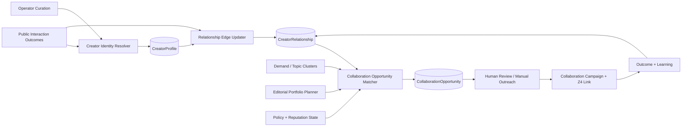

# 13 — Creator Relationship & Collaboration CRM

> **Document maturity:** implementation in progress; local `CRM-101` foundation is verified and
> promotion gates remain open.
> **Canonical feature status:** `CRM-001` in [the feature register](../planning/FEATURES.md).
> **Roadmap:** Z5; M4–M5 after the conversational pilot has stable outcomes.
> **Decision:** `docs/adr/ADR-013-creator-relationship-crm.md`.
> **Depends on:** proposal `(08)` interaction memory, `(10)` demand clusters, `(12)` policy/reputation.
> **Boundary:** public professional relationships only; no vulnerability or psychographic profiling.

---

## 1. Problem

Reply-first growth is not only a volume problem. Repeated, useful exchanges with a small set of
relevant creators can produce community trust, collaborations, referrals and durable discovery.

SPA currently stores interactions, but it does not answer:

- Who has responded repeatedly and positively?
- Which creators share the same subject areas without being direct duplicates?
- Where is there a natural collaboration opportunity?
- When did we last interact, and are we over-targeting one person?
- Which persona/account should maintain the relationship?
- What is the next useful human action — reply, share, invite, wait, or skip?

Without a relationship layer, engagement memory remains a log and can drift into repetitive
commenting. The CRM turns public interaction history into a human-controlled collaboration workflow.

---

## 2. Decision summary

Create a lightweight, public-data **Creator Relationship Graph** with:

- one canonical creator identity per network handle;
- topic/domain affinity and explicit evidence;
- interaction edges to SPA accounts/personas;
- a conservative relationship stage;
- collaboration-opportunity proposals;
- per-creator cooldown/frequency safeguards;
- manual notes and decisions;
- no automated DMs/outreach or sensitive-person inference.

The system recommends a next relationship action but never executes outreach automatically.

```text
public interaction outcomes
→ canonical creator identity
→ relationship/account-persona edge
→ reciprocity + relevance + continuity evidence
→ opportunity proposal
→ human review
→ manual collaboration workflow
```

---

## 3. Goals and non-goals

### Goals

- Build long-term public relationships instead of maximizing comment count.
- Prevent excessive/repetitive targeting of one creator.
- Show conversation history and shared topics before suggesting an action.
- Identify credible co-created content, newsletter/podcast/interview or mutual-promotion
  opportunities.
- Attribute collaboration links/campaigns through existing Z4 infrastructure.
- Keep personas consistent: one primary account/persona owns a relationship unless reassigned.
- Measure reciprocity and collaboration outcomes without ranking human worth.

### Non-goals

- Sales CRM for individual Soulwise users.
- Automated cold DMs, pitches or follow/unfollow campaigns.
- Buying/scraping email addresses or private contact data.
- Inferring health, fertility, relationship distress, wealth, ethnicity, sexuality or mental state.
- “Influence scores” based only on follower count.
- Automatically declaring someone a partner/competitor.
- Mirroring full social profiles or content archives.
- Multi-platform identity resolution without explicit evidence/human confirmation.

---

## 4. Relationship model

### 4.1 Stages

```text
DISCOVERED
→ OBSERVED
→ ENGAGED
→ RECIPROCAL
→ COLLABORATION_CANDIDATE
→ ACTIVE_COLLABORATOR
→ DORMANT
→ DO_NOT_ENGAGE
```

Stage advancement is evidence-backed and usually human-approved. A like alone cannot create
`RECIPROCAL`; follower count cannot create `COLLABORATION_CANDIDATE`.

### 4.2 Evidence types

- replied to SPA interaction;
- repeated substantive exchange;
- shared/quoted SPA content;
- followed account where reliably observed;
- participated in the same public discussion;
- manually identified shared editorial interest;
- accepted/declined collaboration proposal;
- collaboration delivered and measured;
- operator note with source/reason.

### 4.3 Next actions

- `READ_RECENT_WORK`
- `REPLY_IF_VALUE`
- `SHARE_WITH_COMMENTARY`
- `PROPOSE_COLLABORATION`
- `FOLLOW_UP_MANUALLY`
- `WAIT_COOLDOWN`
- `DO_NOT_ENGAGE`

Every recommendation explains evidence, contraindications and cooldown.

---

## 5. Architecture



### 5.1 Components

| Component                         | Responsibility                                                  |
| --------------------------------- | --------------------------------------------------------------- |
| `CreatorIdentityService`          | Canonical network identity and manual cross-network links.      |
| `CreatorRelationshipService`      | Evidence, stages, owner persona/account, cooldown.              |
| `CreatorAffinityService`          | Shared public topics/domains with source trace.                 |
| `CollaborationOpportunityService` | Propose collaboration type/fit/risks.                           |
| `RelationshipNextActionService`   | Explainable recommendation; no execution.                       |
| `CollaborationCampaignService`    | Manual workflow, deliverables and Z4 attribution refs.          |
| `CreatorPrivacyService`           | Retention, purge, opt-out/do-not-engage and field minimization. |

### 5.2 Ports

```ts
export const ICreatorRelationshipPort = Symbol("ICreatorRelationshipPort");
export const ICollaborationOpportunityPort = Symbol(
  "ICollaborationOpportunityPort",
);
```

Engagement and Portfolio Planner may read relationship summaries but cannot mutate stage directly.

---

## 6. Data model

```prisma
model CreatorProfile {
  id                   String   @id @default(uuid())
  network              SocialNetwork
  handleCanonical      String
  handleHash           String
  displayName          String?
  profileUrl           String
  disclosure           String?
  publicTopics         Json
  accountType          String?
  status               String   // ACTIVE | DORMANT | DO_NOT_ENGAGE | PURGED
  sourceRefs           Json
  lastVerifiedAt       DateTime?
  rawProfileExpiresAt  DateTime?
  createdAt            DateTime @default(now())
  updatedAt            DateTime @updatedAt

  relationships CreatorRelationship[]

  @@unique([network, handleCanonical])
  @@index([network, status])
  @@index([handleHash])
}

model CreatorRelationship {
  id                   String   @id @default(uuid())
  creatorId            String
  accountId            String
  personaRevisionId    String?
  stage                String
  stageEvidence        Json
  sharedDomains        Json
  interactionCount     Int      @default(0)
  substantiveReplyCount Int     @default(0)
  reciprocalCount      Int      @default(0)
  lastInteractionAt    DateTime?
  cooldownUntil        DateTime?
  ownerNote            String?
  manualPriority       String?
  status               String
  createdAt            DateTime @default(now())
  updatedAt            DateTime @updatedAt

  creator CreatorProfile @relation(fields: [creatorId], references: [id], onDelete: Cascade)
  opportunities CollaborationOpportunity[]

  @@unique([creatorId, accountId])
  @@index([accountId, stage, status])
  @@index([personaRevisionId, lastInteractionAt])
}

model CreatorInteractionEvidence {
  id              String   @id @default(uuid())
  relationshipId  String
  interactionId   String?
  evidenceType    String
  sourceRef       Json
  evidenceHash    String
  weight          Float?
  occurredAt      DateTime
  expiresAt       DateTime?
  createdAt       DateTime @default(now())

  @@unique([relationshipId, evidenceType, evidenceHash])
  @@index([relationshipId, occurredAt])
}

model CollaborationOpportunity {
  id                String   @id @default(uuid())
  relationshipId    String
  opportunityType   String   // CO_POST | INTERVIEW | NEWSLETTER_SWAP | LIVE | RESEARCH | OTHER
  topic             String
  rationale         Json
  risks             Json
  proposedAccountId String
  proposedPersonaId String?
  status            String   // PROPOSED | REVIEWED | OUTREACH_PLANNED | ACCEPTED | DECLINED | COMPLETED | ARCHIVED
  reviewedBy        String?
  outreachRef       Json?
  campaignRef       Json?
  validUntil        DateTime?
  createdAt         DateTime @default(now())
  updatedAt         DateTime @updatedAt

  relationship CreatorRelationship @relation(fields: [relationshipId], references: [id], onDelete: Cascade)

  @@index([status, validUntil])
  @@index([proposedAccountId, createdAt])
}
```

Clear handles are operationally necessary for a public relationship workflow and remain personal
data. They are access-controlled, retained minimally and purgeable; hashing provides lookup/dedup,
not anonymity.

---

## 7. Identity and cross-network linking

- Canonical identity is network-scoped by default.
- Cross-network links require explicit public evidence and human confirmation.
- Similar display name/avatar/topic is insufficient.
- Never enrich with private data brokers.
- Record link evidence/version and support unlinking.
- A creator may request opt-out/do-not-engage; enforce across linked identities.

---

## 8. Relationship scoring

Do not expose a single opaque “creator score”. Internally store explainable components:

- topic relevance;
- reciprocal interaction evidence;
- interaction quality;
- relationship continuity;
- audience/content complementarity;
- persona fit;
- collaboration readiness;
- cooldown/over-targeting risk;
- policy/reputation risk;
- data freshness/confidence.

Follower count and raw reach are optional context, never dominant. A high-value niche creator may be
more relevant than a large generic account.

Stage transitions use explicit rules and human review. Model classification may suggest shared
topics/opportunity, but cannot set `ACTIVE_COLLABORATOR` or remove `DO_NOT_ENGAGE`.

---

## 9. Collaboration workflow

```text
opportunity proposed
→ operator reviews creator history, rationale and risk
→ operator chooses manual contact channel
→ outreach planned externally or recorded manually
→ accepted/declined/no-response
→ deliverables and campaign link created
→ collaboration completed
→ direct/assisted outcomes measured
→ human learning note
```

The system never drafts manipulative personalization from inferred vulnerabilities. Suggested
outreach uses public professional context and requires human editing/sending.

Potential collaboration formats:

- paired Threads discussion;
- expert Q&A/interview;
- newsletter/podcast swap;
- co-authored evidence-backed myth-buster;
- public live conversation;
- shared compatibility/cycle education resource;
- research or survey summary with clear methodology.

---

## 10. Integration

### Proposal `(08)`

- relationship summary enters AuthorContext only when relevant;
- per-creator cooldown and prior stance prevent repetitive comments;
- persona owner controls voice continuity.

### Proposal `(10)`

- shared demand clusters identify collaboration topics;
- creator contributions never automatically validate cluster truth.

### Proposal `(11)`

- collaboration campaign gets dedicated Z4 link/campaign;
- direct/assisted outcomes stay separate.

### Proposal `(12)`

- DO_NOT_ENGAGE, policy and reputation state override recommendations;
- reputation incidents can suspend collaboration proposals.

### Portfolio Planner

- collaboration may reserve account/topic capacity;
- planner avoids duplicate own posts around the collaboration.

---

## 11. API and UI

### API

- `GET /creators?network=&stage=&domain=&cursor=`
- `GET /creators/:id`
- `POST /creators/manual`
- `POST /creators/:id/verify`
- `POST /creators/:id/link-identity`
- `POST /creators/:id/unlink-identity`
- `POST /creators/:id/do-not-engage`
- `DELETE /creators/:id`
- `GET /creator-relationships?accountId=&stage=&cursor=`
- `POST /creator-relationships/:id/transition`
- `POST /creator-relationships/:id/note`
- `GET /collaboration-opportunities`
- `POST /collaboration-opportunities/:id/review`
- `POST /collaboration-opportunities/:id/record-outreach`
- `POST /collaboration-opportunities/:id/record-outcome`

### UI

- creator list with stage/domain/freshness;
- evidence-backed relationship timeline;
- account/persona owner;
- cooldown/over-targeting warning;
- shared demand/topics;
- opportunity rationale and risks;
- manual outreach/deliverable/campaign tracking;
- do-not-engage, purge and identity-link controls;
- collaboration outcome analytics.

---

## 12. Privacy, safety, and abuse prevention

- Public professional data only and purpose limitation.
- No sensitive-trait inference or health/relationship profiling.
- No private contact enrichment or scraped email/phone.
- No automated DMs/outreach/follow campaigns.
- Rate/cooldown safeguards prevent harassment-like repeated targeting.
- Human review for stage transitions and opportunities.
- Clear handle and operator notes are admin-only and excluded from Langfuse/Sentry.
- Retention by field/evidence type; expired source evidence reduces confidence.
- Purge removes identity, relationships, embeddings and recommendations.
- DO_NOT_ENGAGE is enforced before candidate scoring and survives normal archival.
- Collaboration involving medical/cycle claims requires the same evidence/safety gates as content.

---

## 13. Reliability and degradation

| Failure                       | Behavior                                                                                                 |
| ----------------------------- | -------------------------------------------------------------------------------------------------------- |
| Identity resolution ambiguous | Keep network identities separate; human review.                                                          |
| Relationship evidence missing | No stage promotion or next action.                                                                       |
| Affinity model unavailable    | Public tags/manual topics only.                                                                          |
| Policy/reputation unavailable | No outreach recommendation.                                                                              |
| Metrics unavailable           | Preserve relationship; no performance conclusion.                                                        |
| Creator source deleted        | Expire evidence, reduce confidence, preserve minimal audit as policy allows.                             |
| Duplicate interaction events  | Idempotent evidence hash.                                                                                |
| CRM unavailable               | Engagement can operate without relationship recommendation, still honoring cooldown cache/DO_NOT_ENGAGE. |

Stage changes use optimistic concurrency. Reprocessing evidence is versioned and cannot silently
rewrite manual decisions.

---

## 14. Observability and success metrics

- `creator_profiles_total{network,status}`
- `creator_relationships_total{stage,account}`
- `creator_evidence_ingested_total{type}`
- `creator_identity_ambiguous_total`
- `creator_cooldown_block_total`
- `creator_over_targeting_block_total`
- `creator_stage_transition_total{from,to}`
- `collaboration_opportunity_total{type,status}`
- `collaboration_acceptance_rate`
- `collaboration_completion_rate`
- `creator_repeat_substantive_reply_rate`
- `creator_relationship_to_collaboration_time`
- `collaboration_direct_leads/revenue`
- `collaboration_assisted_leads/revenue`
- `creator_purge_total`

Success is repeat substantive relationships and completed collaborations, not the number of creator
records or automated touches.

---

## 15. Evaluation

- identity resolution precision and ambiguous-case rate;
- relationship-stage agreement with human labels;
- next-action relevance/contraindication recall;
- over-targeting/cooldown enforcement;
- shared-topic precision;
- opportunity acceptance and completion;
- privacy/sensitive-inference red-team;
- no-action correctness;
- collaboration outcome reporting quality.

Model/rule/profile changes run proposal `(09)`. Human relationship decisions are not treated as
ground truth for a universal creator ranking.

---

## 16. Rollout and backlog

The `CR-*` rows are local design work-package anchors, not canonical task/status IDs. Promotion to
implementation must map them into `docs/planning/BACKLOG.md` without duplicating status.

| ID     | Phase | Task                                              | Depends on          |
| ------ | ----- | ------------------------------------------------- | ------------------- |
| CR-001 | M4    | Define public-data/identity/stage/evidence policy | proposals 08/12     |
| CR-002 | M4    | CreatorProfile/Relationship/Evidence schema       | CR-001              |
| CR-003 | M4    | Canonical network identity and manual linking     | CR-002              |
| CR-004 | M4    | Outcome → relationship evidence ingestion         | CR-002, proposal 08 |
| CR-005 | M4    | Cooldown/over-targeting/do-not-engage gates       | CR-002              |
| CR-006 | M4    | Relationship timeline/list/detail UI              | CR-003, CR-004      |
| CR-007 | M4    | Explainable affinity/next-action proposal         | CR-004, proposal 09 |
| CR-008 | M4    | CollaborationOpportunity workflow                 | CR-006, CR-007      |
| CR-009 | M5    | Z4 collaboration campaign attribution             | CR-008, proposal 11 |
| CR-010 | M5    | Collaboration analytics and learning review       | CR-009              |

### Gate M4–M5

- no private enrichment or sensitive-trait fields exist;
- cooldown/DO_NOT_ENGAGE precedes engagement recommendation;
- stage/opportunity changes are evidence-backed and human-reviewed;
- no automated outreach path exists;
- purge propagates through relationships, evidence and recommendations.

---

## 17. Risks

| Risk                                   | Mitigation                                                 |
| -------------------------------------- | ---------------------------------------------------------- |
| CRM becomes surveillance               | Minimal public professional data, purpose/retention/purge. |
| Automated relationship spam            | No automated outreach; cooldown and human send.            |
| Follower-count bias                    | Explainable multi-component evidence; reach is secondary.  |
| Wrong cross-network identity link      | Human confirmation and unlink/audit.                       |
| Persona conflict over creator          | One owner assignment and explicit reassignment.            |
| Relationship stage inflation           | Evidence rules and review.                                 |
| Sensitive inference from content       | Forbidden schema/taxonomy/red-team.                        |
| Creator requests no contact            | Durable DO_NOT_ENGAGE and purge workflow.                  |
| Collaboration measured as reply volume | Completion/direct/assisted outcomes, not touch count.      |

---

## 18. Research and verification status

Internal evidence reviewed:

- existing `Interaction` and proposal `(08)` interaction-memory design;
- Demand Radar and Assisted Attribution boundaries;
- privacy/data-governance references;
- ROADMAP_V2 collaboration/lead goals.

Implementation-time external research:

- current platform terms for retention/use of public profile data;
- approved creator/collaboration workflows for Threads/X;
- privacy/legal review of do-not-engage and deletion handling;
- interviews with the operator on actual collaboration workflow.

Exa MCP remained unavailable due OAuth. This proposal intentionally avoids claims about current
third-party creator-CRM products or automated outreach conversion rates.
