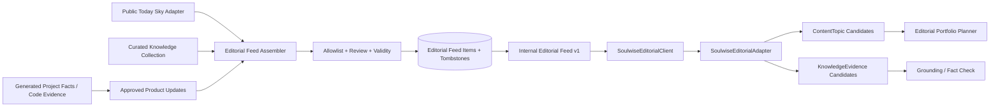
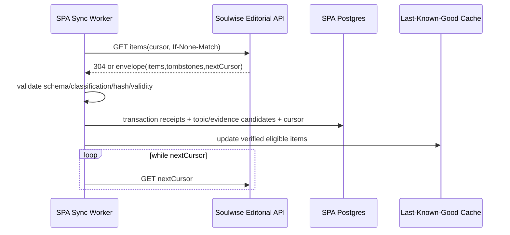

# 14 — Soulwise Editorial Data Bridge

> **Document maturity:** DESIGN READY claim pending decision verification.
> **Canonical feature status:** `BRIDGE-001` in [the feature register](../planning/FEATURES.md).
> **Roadmap:** Z2/Z4; M2 contract/public feed, M4 curated knowledge/grounding.
> **Decision:** `docs/adr/ADR-014-soulwise-editorial-data-bridge.md`.
> **Direction:** read-only from `my_zodiac_ai` to SPA.
> **Privacy:** no user-level Soulwise data is eligible.

---

## 1. Problem

SPA can read generic APIs, RSS, database topics and trends, but it does not have a canonical,
versioned feed of Soulwise product truth and non-personalized editorial facts.

Without a dedicated boundary, future implementations may:

- duplicate ephemeris calculations or hard-coded calendars;
- scrape product changelogs/documents with no schema or validity contract;
- accidentally call personalized user endpoints;
- copy private cycle, relationship or chat data into social prompts;
- store service credentials in generic `ContentSource.config` JSON;
- publish stale product capabilities or unsupported claims;
- create direct database/cross-repository coupling.

The bridge gives SPA a small allowlisted editorial surface whose data is explicitly safe for public
content.

---

## 2. Current reusable evidence

### Soulwise

- `GET /v3/astrology/cosmic-weather/public/today-sky` already returns non-personalized Moon sign,
  retrogrades and planet positions computed via Swiss Ephemeris and cached hourly.
- `attribution-links` already demonstrates an internal service-to-service controller protected by
  the existing internal-token pattern.
- `docs/PROJECT_FACTS.md` is generated from code and is the source of current route/feature facts.
- The backend contains astrology, wellness/cycles, relationships and linguistic-audit bounded
  contexts.

### Important exclusion

`GET /v2/cycles/share-card/shareable-snippet` is authenticated and resolves user-specific recap or
check-in data. It is not an editorial source and must never be called by SPA.

### SPA

- `IContentAdapter`/`ContentAdapterRegistry` already provides a pluggable source boundary.
- `ApiAdapter` supports generic JSON mapping but is too permissive for sensitive cross-project data
  and stores headers in source configuration.
- proposal `(08)` defines reviewed `KnowledgeEvidence` and portfolio planning;
- proposal `(09)` defines release/eval gates;
- Z4 already defines `ZodiacLinkClient`, timeout, circuit breaker and internal-token configuration.

---

## 3. Decision summary

Create a dedicated, typed, read-only **Editorial Feed API** in `my_zodiac_ai/back` and a dedicated
`SoulwiseEditorialAdapter` in SPA.

```text
Soulwise source-of-truth modules
→ EditorialFeedAssembler (allowlisted adapters only)
→ review/classification/version/validity
→ /internal/editorial-feed/v1/items (cursor + ETag)
→ SoulwiseEditorialAdapter
→ ContentTopic / KnowledgeEvidence candidates
→ Portfolio Planner / Grounding
```

The bridge exports only three data classes:

1. `PUBLIC_FACT` — non-personalized deterministic/public data such as current sky.
2. `CURATED_KNOWLEDGE` — human-reviewed editorial guidance with sources and validity.
3. `PRODUCT_UPDATE` — approved public product capability/release statement.

`AGGREGATE_INSIGHT` is HOLD for v1. It requires a separate privacy threat model, minimum cohort,
reviewed aggregation and possibly differential-privacy accounting.

The bridge never exports a user, session, birth chart, cycle log, relationship profile, chat,
prediction, inferred condition or personalized reading.

---

## 4. Goals and non-goals

### Goals

- Use one canonical source for current public Soulwise facts.
- Keep social content aligned with product capabilities and validity windows.
- Reuse Soulwise’s Swiss Ephemeris and editorial/domain review.
- Provide provenance, versioning, deletion/tombstones and freshness.
- Cache safely and degrade without inventing data.
- Keep credentials in env/secret management, not content-source JSON.
- Make cross-project contract changes testable and release-gated.

### Non-goals

- Querying personalized Soulwise APIs.
- Exporting raw support/chat/cycle/relationship data.
- Direct SPA access to Soulwise MongoDB or internal module services.
- Sharing a runtime package between repositories as the only contract.
- Bi-directional automatic product-backlog mutation.
- Replacing the attribution-links API.
- Duplicating Swiss Ephemeris in SPA.
- Treating astrological interpretation as scientific causality.

---

## 5. Data classification and allowlist

### Allowed v1

| Class               | Examples                                                                               | Owner/review                                      |
| ------------------- | -------------------------------------------------------------------------------------- | ------------------------------------------------- |
| `PUBLIC_FACT`       | date, Moon sign, public planet positions/retrograde flags                              | Astrology calculation owner; deterministic source |
| `CURATED_KNOWLEDGE` | reviewed definitions, non-medical cycle education, relationship communication guidance | Domain/editorial reviewer                         |
| `PRODUCT_UPDATE`    | public feature release, supported platform/locale/surface claim                        | Product owner + code/docs evidence                |

### Forbidden

- user/account IDs;
- name/email/handle/device/IP;
- birth date/time/location or chart;
- cycle dates, symptoms, predictions, HealthKit data;
- partner/relationship/couple records;
- chat, journal, check-in, recap, future-letter or private memory;
- subscription/payment state;
- individualized forecasts/readings;
- small or unreviewed aggregates;
- raw production logs or support tickets;
- model-generated claim not reviewed as eligible editorial knowledge.

Schema validation rejects unknown classes/fields. The feed assembler uses an explicit allowlist of
source adapters; no generic module query/reflection exists.

---

## 6. Contract

```ts
interface EditorialFeedEnvelopeV1 {
  readonly schemaVersion: "1.0";
  readonly generatedAt: string;
  readonly nextCursor?: string;
  readonly sourceRevision: string;
  readonly items: readonly EditorialFeedItemV1[];
  readonly tombstones: readonly EditorialTombstoneV1[];
}

interface EditorialFeedItemV1 {
  readonly id: string;
  readonly version: number;
  readonly classification:
    | "PUBLIC_FACT"
    | "CURATED_KNOWLEDGE"
    | "PRODUCT_UPDATE";
  readonly domain: "ASTROLOGY" | "CYCLES" | "RELATIONSHIPS" | "PRODUCT";
  readonly language: "en";
  readonly title: string;
  readonly summary: string;
  readonly claims: readonly EditorialClaimV1[];
  readonly keywords: readonly string[];
  readonly sourceRefs: readonly EditorialSourceRefV1[];
  readonly review: {
    readonly status: "VERIFIED";
    readonly policyVersion: string;
    readonly reviewedAt: string;
  };
  readonly validFrom: string;
  readonly validUntil?: string;
  readonly contentHash: string;
  readonly publishedAt?: string;
}

interface EditorialClaimV1 {
  readonly id: string;
  readonly text: string;
  readonly claimType:
    | "DETERMINISTIC_FACT"
    | "CURATED_GUIDANCE"
    | "PRODUCT_FACT";
  readonly evidenceRefs: readonly string[];
  readonly riskTier: "LOW" | "MEDIUM" | "HIGH";
}

interface EditorialTombstoneV1 {
  readonly id: string;
  readonly version: number;
  readonly removedAt: string;
  readonly reason: "SUPERSEDED" | "RETRACTED" | "EXPIRED";
}
```

Unknown schema major version fails closed. Minor additions require forward-compatible validation
rules and consumer contract tests.

---

## 7. API surface

### Soulwise internal API

- `GET /internal/editorial-feed/v1/items?cursor=&limit=&since=&domain=&classification=`
- `GET /internal/editorial-feed/v1/items/:id`
- `GET /internal/editorial-feed/v1/health`
- `GET /internal/editorial-feed/v1/manifest`

Response behavior:

- cursor pagination;
- `ETag`/`If-None-Match`;
- `Last-Modified` where appropriate;
- bounded limit;
- stable ordering `(updatedAt,id)`;
- tombstones for retraction/supersession;
- internal-token authentication;
- request correlation ID;
- rate limits and timeout;
- no dynamic destination or arbitrary query execution.

### Existing public sky endpoint

The adapter may use `GET /v3/astrology/cosmic-weather/public/today-sky` as a bootstrap/public fact
source, but the canonical bridge should wrap it into the versioned editorial envelope with claim IDs,
validity and provenance.

### No write API

Demand Radar product insights remain SPA-side reviewed proposals/export artifacts. A future
write-back API needs a separate ADR, authorization, idempotency and product-owner workflow.

---

## 8. Architecture



### 8.1 Soulwise components

| Component                          | Responsibility                                           |
| ---------------------------------- | -------------------------------------------------------- |
| `EditorialFeedModule`              | Own contract/controller/persistence and source adapters. |
| `PublicSkyEditorialAdapter`        | Convert deterministic public sky data to claims.         |
| `CuratedKnowledgeEditorialAdapter` | Export reviewed editorial knowledge only.                |
| `ProductUpdateEditorialAdapter`    | Export public product facts with code/docs evidence.     |
| `EditorialFeedAssembler`           | Merge, validate, version, hash and paginate items.       |
| `EditorialPrivacyGuard`            | Field/class allowlist and forbidden-source enforcement.  |
| `EditorialReviewService`           | Review/status/validity/tombstone workflow.               |

Cross-bounded-context reads use existing Symbol adapter/public API patterns; no direct service import
or `forwardRef()` is introduced.

### 8.2 SPA components

| Component                      | Responsibility                                         |
| ------------------------------ | ------------------------------------------------------ |
| `ISoulwiseEditorialPort`       | Typed read-only client contract.                       |
| `SoulwiseEditorialClient`      | Auth, timeout, retry, ETag, cursor, schema validation. |
| `SoulwiseEditorialAdapter`     | Dedicated `IContentAdapter` implementation.            |
| `EditorialFeedSyncService`     | Cursor/checkpoint/idempotent local candidate sync.     |
| `EditorialFeedCache`           | Bounded last-known-good items and freshness policy.    |
| `EditorialFeedHealthCollector` | Health/freshness/schema/tombstone metrics.             |

Do not use the generic `ApiAdapter` for this bridge: its config/mapping is intentionally generic,
while this boundary needs secret isolation, strict classification, provenance and tombstones.

---

## 9. Persistence

### Soulwise conceptual collection

```ts
interface EditorialFeedDocument {
  readonly itemId: string;
  readonly version: number;
  readonly classification: EditorialClassification;
  readonly domain: EditorialDomain;
  readonly language: "en";
  readonly content: EditorialFeedItemV1;
  readonly contentHash: string;
  readonly sourceRevision: string;
  readonly reviewStatus: "DRAFT" | "VERIFIED" | "RETRACTED";
  readonly validFrom: Date;
  readonly validUntil?: Date;
  readonly publishedAt?: Date;
  readonly updatedAt: Date;
}
```

### SPA sync state

```prisma
model EditorialFeedSyncState {
  id               String   @id @default(uuid())
  sourceKey        String   @unique
  schemaVersion    String
  cursor           String?
  etag             String?
  sourceRevision   String?
  lastSuccessAt    DateTime?
  lastAttemptAt    DateTime?
  lastErrorCode    String?
  consecutiveFailures Int   @default(0)
  createdAt        DateTime @default(now())
  updatedAt        DateTime @updatedAt
}

model EditorialFeedReceipt {
  id             String   @id @default(uuid())
  sourceItemId   String
  sourceVersion  Int
  contentHash    String
  classification String
  domain         String
  localTopicId   String?
  localEvidenceId String?
  status         String   // RECEIVED | VALIDATED | APPLIED | TOMBSTONED | REJECTED
  sourceRevision String
  receivedAt     DateTime @default(now())
  appliedAt      DateTime?

  @@unique([sourceItemId, sourceVersion])
  @@index([status, receivedAt])
  @@index([contentHash])
}
```

SPA stores normalized candidates/provenance, not a second mutable source of Soulwise truth.

---

## 10. Mapping rules

### To `ContentTopic`

- `path = soulwise-editorial://{itemId}/v{version}`;
- `sourceType = soulwise_editorial`;
- topic/keywords/category/language from verified envelope;
- facts from claim text plus evidence IDs in metadata;
- validity and source hash retained;
- Portfolio Planner decides whether/where/how to publish.

### To `KnowledgeEvidence`

- only VERIFIED eligible claims;
- preserve claim/source/review/policy/version/validity;
- deterministic public sky facts remain separate from interpretive guidance;
- expired/retracted items become ineligible immediately;
- tombstone propagates to lexical/vector retrieval and generated-topic eligibility.

### Product update claims

- generated project facts may support the review, but raw docs/code are not exposed to SPA;
- public wording is a reviewed editorial item;
- feature-flagged or unreleased capability is not eligible;
- removal/deprecation creates tombstone/superseding version.

---

## 11. Sync and consistency



Rules:

- cursor advances only in the same transaction as applied receipts;
- item `(id,version)` is idempotent;
- same version with different hash is a contract incident;
- tombstones win over cached items;
- no partial page acknowledgement;
- retries are bounded with circuit breaker;
- manual resync/replay is available by source revision.

---

## 12. Freshness and degradation

Each class/domain defines:

- expected refresh cadence;
- max acceptable staleness;
- `validUntil` behavior;
- whether last-known-good may be used;
- whether the item is eligible for facts, topics or both.

Examples:

- current-sky item expires quickly and is never used outside validity;
- curated evergreen knowledge may have a longer review interval;
- product update becomes invalid immediately on tombstone/deprecation.

Failure matrix:

| Failure                       | Behavior                                                   |
| ----------------------------- | ---------------------------------------------------------- |
| Soulwise unavailable          | Use unexpired last-known-good only; alert after threshold. |
| Auth failure                  | Fail closed, no retry storm, operator alert.               |
| Unknown schema major          | Reject page and stop cursor.                               |
| Invalid/forbidden field/class | Reject item, contract/security alert.                      |
| Hash mismatch same version    | Stop sync, incident.                                       |
| Item expired                  | Remove from candidate/retrieval eligibility.               |
| Tombstone received            | Invalidate topic/evidence/cache and re-index.              |
| Partial DB failure            | Roll back page/cursor transaction.                         |

Generation does not invent a replacement fact when the feed is unavailable.

---

## 13. Security and privacy

- Reuse existing internal-token pattern; rotate and scope secrets.
- SPA token is loaded from env/secret store, never `ContentSource.config`.
- TLS, allowlisted base URL and redirect/SSRF protection.
- No user-controlled URL/path passthrough.
- Schema rejects unknown fields and every forbidden identifier class.
- Soulwise access logs exclude tokens and content bodies where unnecessary.
- SPA logs/traces store item IDs/hashes/classification/freshness, not sensitive data.
- Read-only database/service principals where infrastructure supports it.
- Rate limits, timeout, circuit breaker and request correlation.
- Threat-model the source adapters: only explicitly registered adapters can export.
- Contract/red-team fixtures attempt to export each forbidden data class.
- Aggregate insights remain disabled until separate privacy review and approved mechanism.

The privacy guide emphasizes data minimization, purpose limitation, classification, retention and
deletion. Hashing does not make user-level health data safe for this feed.

---

## 14. API/operations UI

### SPA

- `GET /content-sources/soulwise-editorial/status`
- `POST /content-sources/soulwise-editorial/sync`
- `POST /content-sources/soulwise-editorial/replay`
- `GET /content-sources/soulwise-editorial/receipts`
- `GET /content-sources/soulwise-editorial/receipts/:id`

### Soulwise admin

- item/revision review;
- source adapter and evidence;
- classification/domain/risk/validity;
- publish/tombstone/supersede;
- feed manifest, sync consumer status and contract alerts.

Operator dashboards show freshness, last cursor/revision, eligible items, rejected/tombstoned
items, schema/hash errors and downstream topic/evidence usage.

---

## 15. Observability

- `editorial_feed_requests_total{outcome}`
- `editorial_feed_sync_duration_seconds`
- `editorial_feed_items_total{classification,domain,status}`
- `editorial_feed_item_age_seconds{classification,domain}`
- `editorial_feed_contract_failure_total{reason}`
- `editorial_feed_forbidden_field_total{field_class}`
- `editorial_feed_hash_conflict_total`
- `editorial_feed_tombstone_total{reason}`
- `editorial_feed_cursor_lag_seconds`
- `editorial_feed_cache_hit_total{freshness}`
- `editorial_feed_topic_created_total{domain}`
- `editorial_feed_evidence_used_total{domain}`
- `editorial_feed_generation_block_total{reason}`

Alert on auth/schema/hash/privacy failure, current-sky staleness, repeated source failure, cursor lag
and tombstone propagation failure.

---

## 16. Testing

### Soulwise unit/integration

- adapter allowlist and forbidden-source rejection;
- deterministic public sky mapping;
- review/version/hash/validity/tombstone lifecycle;
- cursor/ETag/stable ordering;
- internal auth/rate limit;
- no forbidden fields in serialized envelope;
- contract fixtures for every classification.

### SPA unit/integration

- strict schema/version validation;
- auth/timeout/retry/circuit breaker;
- cursor transaction/idempotency;
- same-version hash conflict;
- item/tombstone mapping;
- ContentTopic/KnowledgeEvidence provenance;
- freshness and last-known-good behavior;
- secret absent from DB/logs;
- purge/re-index propagation.

### Cross-project contract

- checked-in JSON fixtures and schema version;
- producer contract test against fixture;
- consumer contract test against same fixture;
- incompatibility test for unknown major;
- release gate requires producer and consumer compatibility before deployment order changes.

### Acceptance

- SPA consumes today-sky through the versioned envelope without user data;
- authenticated share-card snippet cannot be exported by any registered adapter;
- a tombstoned product fact disappears from retrieval/generation eligibility;
- expired sky data blocks time-sensitive generation;
- Soulwise outage uses only eligible unexpired cache;
- token is absent from ContentSource config/logs/traces.

---

## 17. Rollout and backlog

The `EB-*` rows are local design work-package anchors, not canonical task/status IDs. Promotion to
implementation must map them into `docs/planning/BACKLOG.md` without duplicating status.

| ID     | Phase | Task                                                          | Depends on                  |
| ------ | ----- | ------------------------------------------------------------- | --------------------------- |
| EB-001 | M2    | Data classification/forbidden-field contract and threat model | —                           |
| EB-002 | M2    | EditorialFeedEnvelope v1 JSON schema/fixtures                 | EB-001                      |
| EB-003 | M2    | Soulwise EditorialFeedModule skeleton/internal auth           | EB-002                      |
| EB-004 | M2    | PublicSkyEditorialAdapter                                     | EB-003, existing today-sky  |
| EB-005 | M2    | Review/version/hash/validity/tombstone lifecycle              | EB-003                      |
| EB-006 | M2    | Internal cursor/ETag API and producer tests                   | EB-004, EB-005              |
| EB-007 | M2    | SPA typed client/port and dedicated adapter                   | EB-002, EB-006              |
| EB-008 | M2    | Sync receipts/cursor/cache/health                             | EB-007                      |
| EB-009 | M2    | Portfolio Planner topic mapping                               | EB-008, proposal 08 planner |
| EB-010 | M4    | CuratedKnowledgeEditorialAdapter and review UI                | EB-005, domain review       |
| EB-011 | M4    | ProductUpdateEditorialAdapter using public code/docs evidence | EB-005                      |
| EB-012 | M4    | KnowledgeEvidence mapping and tombstone re-index              | EB-010, proposal 08 memory  |
| EB-013 | M4    | Cross-project deployment/runbook/contract gate                | EB-006, EB-008, proposal 09 |
| EB-014 | HOLD  | Privacy-safe aggregate insight assessment                     | separate privacy ADR        |

### Gate M2–M3

- only `PUBLIC_FACT` today-sky items are enabled initially;
- producer/consumer v1 contract tests pass;
- no user-level field/source can serialize;
- cursor/idempotency/tombstone/freshness paths pass;
- SPA uses a dedicated secret-safe adapter.

### Gate M4–M5

- curated knowledge/product updates have reviewer, source, version and validity;
- retraction propagates to topics, evidence and vector/lexical retrieval;
- cross-project deployment/rollback order is rehearsed;
- aggregate insight remains disabled without separate approval.

---

## 18. Risks

| Risk                                             | Mitigation                                                            |
| ------------------------------------------------ | --------------------------------------------------------------------- |
| Private data leaks through a convenient endpoint | Explicit adapter/field allowlist and forbidden-source contract tests. |
| Generic ApiAdapter stores token/config           | Dedicated typed adapter; env secret only.                             |
| Product claims drift                             | Reviewed versions, validity and tombstones.                           |
| Ephemeris duplicated/inconsistent                | Reuse Soulwise Swiss Ephemeris/public adapter.                        |
| Cross-project deploy breaks consumer             | Versioned schema, consumer-driven fixtures and staged rollout.        |
| Cached stale sky creates wrong post              | Short validity and fail closed.                                       |
| Editorial guidance mistaken for medical fact     | Claim types/risk/review and proposal 09 evals.                        |
| Bridge becomes bidirectional coupling            | v1 read-only; write-back needs separate ADR.                          |
| Low-volume aggregate exposes users               | Aggregate class disabled in v1.                                       |

---

## 19. Research and verification status

Internal evidence reviewed:

- Soulwise `CosmicWeatherV3PublicController` today-sky endpoint;
- authenticated `ShareCardController` exclusion;
- Soulwise architecture/public adapter rules and generated API catalog;
- existing internal-token attribution controller pattern;
- SPA `IContentAdapter`, `ApiAdapter`, registry and ROADMAP Z4;
- local data-governance/privacy guidance.

Implementation-time verification:

- current Soulwise deployment/internal-token topology;
- exact public sky contract and caching semantics;
- source module ownership and adapter port definitions;
- product/editorial review owners;
- OpenAPI/JSON-schema compatibility tooling;
- whether any aggregate-insight use case justifies a separate privacy design.

Exa MCP remained unavailable due OAuth. No private-data or aggregate-insight capability is inferred
from external marketing claims.
